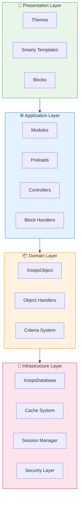
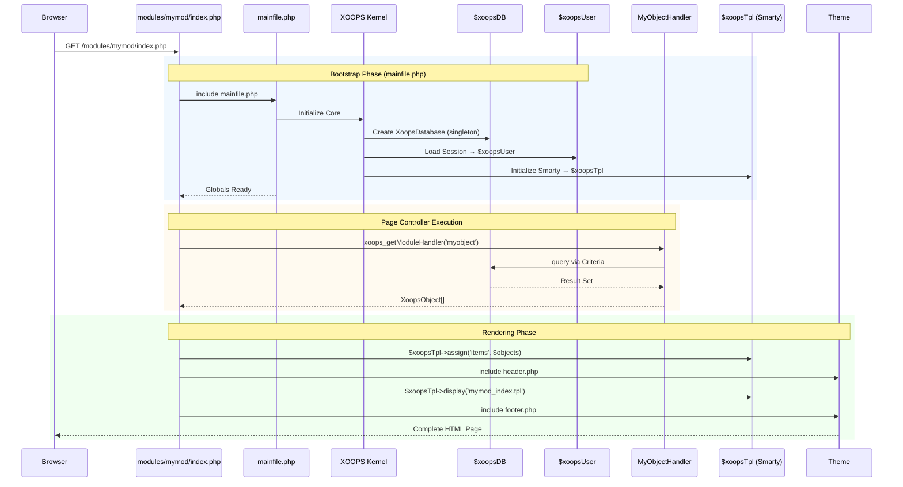

:::napomena[O ovom dokumentu]
Ova stranica opisuje **konceptualnu arhitekturu** XOOPS koja se odnosi na trenutnu (2.5.x) i buduću (4.0.x) verziju. Neki dijagrami prikazuju slojevitu viziju dizajna.

**Za detalje specifične za verziju:**
- **XOOPS 2.5.x danas:** koristi `mainfile.php`, globalne vrijednosti (`$xoopsDB`, `$xoopsUser`), predučitavanja i obrazac rukovatelja
- **XOOPS 4.0 Target:** PSR-15 middleware, DI spremnik, usmjerivač - pogledajte [Roadmap](../../07-XOOPS-4.0/XOOPS-4.0-Roadmap.md)
:::

Ovaj dokument pruža sveobuhvatan pregled arhitekture sustava XOOPS, objašnjavajući kako različite komponente rade zajedno kako bi stvorile fleksibilan i proširiv sustav upravljanja sadržajem.

## Pregled

XOOPS slijedi modularnu arhitekturu koja odvaja probleme u različite slojeve. Sustav je izgrađen oko nekoliko temeljnih načela:

- **Modularnost**: Funkcionalnost je organizirana u nezavisne, instalirajuće modules
- **Proširivost**: Sustav se može proširiti bez modificiranja osnovnog koda
- **Apstrakcija**: Slojevi baze podataka i prezentacije su apstrahirani od poslovne logike
- **Sigurnost**: Ugrađeni sigurnosni mehanizmi štite od uobičajenih ranjivosti

## Slojevi sustava



### 1. Prezentacijski sloj

Prezentacijski sloj upravlja iscrtavanjem korisničkog sučelja pomoću mehanizma predložaka Smarty.

**Ključne komponente:**
- **teme**: Vizualni stil i izgled
- **Smarty predlošci**: Dinamičko prikazivanje sadržaja
- **Blokovi**: widgeti sadržaja za višekratnu upotrebu

### 2. Aplikacijski sloj

Aplikacijski sloj sadrži poslovnu logiku, kontrolere i funkcionalnost modula.

**Ključne komponente:**
- **moduli**: Samostalni funkcionalni paketi
- **Rukovatelji**: Manipulacija podacima classes
- **Preloads**: Slušatelji događaja i kuke

### 3. Sloj domene

Sloj domene sadrži osnovne poslovne objekte i pravila.

**Ključne komponente:**
- **XoopsObject**: Baza class za sve objekte domene
- **Rukovatelji**: CRUD operacije za objekte domene

### 4. Infrastrukturni sloj

Infrastrukturni sloj pruža osnovne usluge kao što su pristup bazi podataka i predmemorija.

## Životni ciklus zahtjeva

Razumijevanje životnog ciklusa zahtjeva ključno je za učinkovit razvoj XOOPS.

### XOOPS 2.5.x Protok kontrolera stranice

Trenutačni XOOPS 2.5.x koristi obrazac **Page Controller** gdje svaka datoteka PHP obrađuje vlastiti zahtjev. Globalni (`$xoopsDB`, `$xoopsUser`, `$xoopsTpl`, itd.) se inicijaliziraju tijekom pokretanja i dostupni su tijekom cijelog izvođenja.



### Ključni globali u 2.5.x

| Globalno | Upišite | Inicijalizirano | Svrha |
|--------|------|-------------|---------|
| `$xoopsDB` | `XoopsDatabase` | Bootstrap | Veza s bazom podataka (singleton) |
| `$xoopsUser` | `XoopsUser\|null` | Opterećenje sesije | Trenutačni prijavljeni korisnik |
| `$xoopsTpl` | `XoopsTpl` | Pokretanje predloška | Smarty mehanizam predloška |
| `$xoopsModule` | `XoopsModule` | Opterećenje modula | Trenutni kontekst modula |
| `$xoopsConfig` | `array` | Učitavanje konfiguracije | Konfiguracija sustava |:::napomena[XOOPS 4.0 Usporedba]
U XOOPS 4.0, obrazac kontrolera stranice zamijenjen je **PSR-15 cjevovodom srednjeg softvera** i slanjem temeljenim na usmjerivaču. Globali su zamijenjeni ubrizgavanjem ovisnosti. Pogledajte [Ugovor o hibridnom načinu rada](../../07-XOOPS-4.0/Specifications/Hybrid-Mode-Contract.md) za jamstva kompatibilnosti tijekom migracije.
:::

### 1. Bootstrap faza

```php
// mainfile.php is the entry point
include_once XOOPS_ROOT_PATH . '/mainfile.php';

// Core initialization
$xoops = Xoops::getInstance();
$xoops->boot();
```

**Koraci:**
1. Konfiguracija opterećenja (`mainfile.php`)
2. Inicijalizirajte autoloader
3. Postavite obradu grešaka
4. Uspostavite vezu s bazom podataka
5. Učitaj korisničku sesiju
6. Inicijalizirajte mehanizam predložaka Smarty

### 2. Faza usmjeravanja

```php
// Request routing to appropriate module
$module = $GLOBALS['xoopsModule'];
$controller = $module->getController();
$controller->dispatch($request);
```

**Koraci:**
1. Raščlanite zahtjev URL
2. Identificirajte ciljni modul
3. Učitajte konfiguraciju modula
4. Provjerite dopuštenja
5. Usmjerite do odgovarajućeg rukovatelja

### 3. Faza izvršenja

```php
// Controller execution
$data = $handler->getObjects($criteria);
$xoopsTpl->assign('items', $data);
```

**Koraci:**
1. Izvršite logiku upravljača
2. Interakcija s podatkovnim slojem
3. Procesna poslovna pravila
4. Pripremite podatke o pregledu

### 4. Faza iscrtavanja

```php
// Template rendering
include XOOPS_ROOT_PATH . '/header.php';
$xoopsTpl->display('db:module_template.tpl');
include XOOPS_ROOT_PATH . '/footer.php';
```

**Koraci:**
1. Primijenite izgled teme
2. predložak modula za prikaz
3. Procesni blokovi
4. Izlazni odgovor

## Osnovne komponente

### XoopsObject

Baza class za sve podatkovne objekte u XOOPS.

```php
<?php
class MyModuleItem extends XoopsObject
{
    public function __construct()
    {
        $this->initVar('id', XOBJ_DTYPE_INT, null, false);
        $this->initVar('title', XOBJ_DTYPE_TXTBOX, '', true, 255);
        $this->initVar('content', XOBJ_DTYPE_TXTAREA, '', false);
        $this->initVar('created', XOBJ_DTYPE_INT, time(), false);
    }
}
```

**Ključne metode:**
- `initVar()` - Definirajte svojstva objekta
- `getVar()` - Dohvaćanje vrijednosti svojstava
- `setVar()` - Postavite vrijednosti svojstava
- `assignVars()` - Skupno dodjeljivanje iz polja

### XoopsPersistableObjectHandler

Rukuje operacijama CRUD za instance XoopsObject.

```php
<?php
class MyModuleItemHandler extends XoopsPersistableObjectHandler
{
    public function __construct(\XoopsDatabase $db)
    {
        parent::__construct($db, 'mymodule_items', 'MyModuleItem', 'id', 'title');
    }

    public function getActiveItems($limit = 10)
    {
        $criteria = new CriteriaCompo();
        $criteria->add(new Criteria('status', 1));
        $criteria->setSort('created');
        $criteria->setOrder('DESC');
        $criteria->setLimit($limit);

        return $this->getObjects($criteria);
    }
}
```

**Ključne metode:**
- `create()` - Stvorite novu instancu objekta
- `get()` - Dohvaćanje objekta prema ID-u
- `insert()` - Spremi objekt u bazu podataka
- `delete()` - Ukloni objekt iz baze podataka
- `getObjects()` - Dohvaćanje više objekata
- `getCount()` - Broji podudarne objekte

### Struktura modula

Svaki XOOPS modul slijedi standardnu strukturu direktorija:

```
modules/mymodule/
├── class/                  # PHP classes
│   ├── MyModuleItem.php
│   └── MyModuleItemHandler.php
├── include/                # Include files
│   ├── common.php
│   └── functions.php
├── templates/              # Smarty templates
│   ├── mymodule_index.tpl
│   └── mymodule_item.tpl
├── admin/                  # Admin area
│   ├── index.php
│   └── menu.php
├── language/               # Translations
│   └── english/
│       ├── main.php
│       └── modinfo.php
├── sql/                    # Database schema
│   └── mysql.sql
├── xoops_version.php       # Module info
├── index.php               # Module entry
└── header.php              # Module header
```

## Spremnik za ubacivanje ovisnosti

Moderni razvoj XOOPS može iskoristiti ubrizgavanje ovisnosti za bolju mogućnost testiranja.

### Implementacija osnovnog spremnika

```php
<?php
class XoopsDependencyContainer
{
    private array $services = [];

    public function register(string $name, callable $factory): void
    {
        $this->services[$name] = $factory;
    }

    public function resolve(string $name): mixed
    {
        if (!isset($this->services[$name])) {
            throw new \InvalidArgumentException("Service not found: $name");
        }

        $factory = $this->services[$name];

        if (is_callable($factory)) {
            return $factory($this);
        }

        return $factory;
    }

    public function has(string $name): bool
    {
        return isset($this->services[$name]);
    }
}
```

### PSR-11 kompatibilan spremnik

```php
<?php
namespace Xmf\Di;

use Psr\Container\ContainerInterface;

class BasicContainer implements ContainerInterface
{
    protected array $definitions = [];

    public function set(string $id, mixed $value): void
    {
        $this->definitions[$id] = $value;
    }

    public function get(string $id): mixed
    {
        if (!$this->has($id)) {
            throw new \InvalidArgumentException("Service not found: $id");
        }

        $entry = $this->definitions[$id];

        if (is_callable($entry)) {
            return $entry($this);
        }

        return $entry;
    }

    public function has(string $id): bool
    {
        return isset($this->definitions[$id]);
    }
}
```

### Primjer upotrebe

```php
<?php
// Service registration
$container = new XoopsDependencyContainer();

$container->register('database', function () {
    return XoopsDatabaseFactory::getDatabaseConnection();
});

$container->register('userHandler', function ($c) {
    return new XoopsUserHandler($c->resolve('database'));
});

// Service resolution
$userHandler = $container->resolve('userHandler');
$user = $userHandler->get($userId);
```

## Extension Points

XOOPS nudi nekoliko mehanizama produljenja:

### 1. Prethodno učitavanje

Predučitavanja omogućuju modules da se spoji na osnovne događaje.

```php
<?php
// modules/mymodule/preloads/core.php
class MymoduleCorePreload extends XoopsPreloadItem
{
    public static function eventCoreHeaderEnd($args)
    {
        // Execute when header processing ends
    }

    public static function eventCoreFooterStart($args)
    {
        // Execute when footer processing starts
    }
}
```

### 2. Dodaci

Dodaci proširuju specifične funkcije unutar modules.

```php
<?php
// modules/mymodule/plugins/notify.php
class MymoduleNotifyPlugin
{
    public function onItemCreate($item)
    {
        // Send notification when item is created
    }
}
```

### 3. Filtri

Filtri mijenjaju podatke dok prolaze kroz sustav.

```php
<?php
// Content filter example
$myts = MyTextSanitizer::getInstance();
$content = $myts->displayTarea($rawContent, 1, 1, 1);
```

## Najbolji primjeri iz prakse

### Organizacija koda

1. **Koristite imenske prostore** za novi kod:
   ```php
   namespace XoopsModules\MyModule;

   class Item extends \XoopsObject
   {
       // Implementation
   }
   ```

2. **Slijedite PSR-4 automatsko učitavanje**:
   
   ```json
   {
       "autoload": {
           "psr-4": {
               "XoopsModules\\MyModule\\": "class/"
           }
       }
   }
   ```

3. **Odvojene brige**:
   - Logika domene u `class/`
   - Prezentacija u `templates/`
   - Kontroleri u korijenu modula

### Izvedba1. **Koristite predmemoriranje** za skupe operacije
2. **Lijeno učitavanje** resursa kada je to moguće
3. **Minimizirajte upite baze podataka** korištenjem grupiranja kriterija
4. **Optimizirajte templates** izbjegavajući složenu logiku

### Sigurnost

1. **Potvrdite sav unos** pomoću `Xmf\Request`
2. **Escape izlaz** u templates
3. **Koristite pripremljene izjave** za upite baze podataka
4. **Provjerite dopuštenja** prije osjetljivih operacija

## Povezana dokumentacija

- [Design-Patterns](Design-Patterns.md) - Dizajn uzorci korišteni u XOOPS
- [Sloj baze podataka](../Database/Database-Layer.md) - Detalji apstrakcije baze podataka
- [Smarty Osnove](../Templates/Smarty-Basics.md) - predložak dokumentacije sustava
- [Najbolje sigurnosne prakse](../Security/Security-Best-Practices.md) - Sigurnosne smjernice

---

#xoops #arhitektura #core #design #system-design
