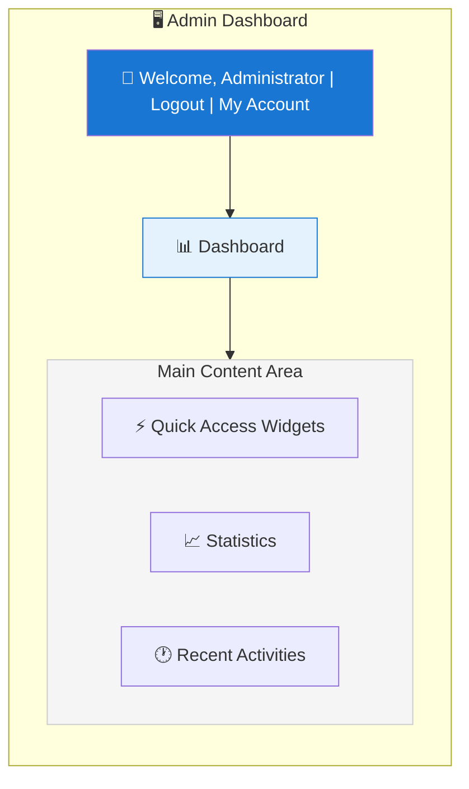
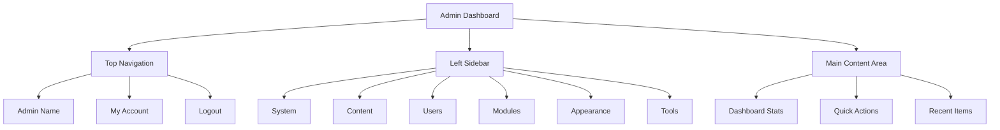

# XOOPS Pregled administratorske ploče

Potpuni vodič za navigaciju i korištenje nadzorne ploče XOOPS administrator.

## Pristup administratorskoj ploči

### Administratorska prijava

Otvorite svoj preglednik i idite na:

```
http://your-domain.com/xoops/admin/
```

Ili ako je XOOPS u korijenu:

```
http://your-domain.com/admin/
```

Unesite svoje vjerodajnice administrator:

```
Username: [Your admin username]
Password: [Your admin password]
```

### Nakon prijave

Vidjet ćete glavnu nadzornu ploču admin:



## Izgled administratorske ploče



## Komponente nadzorne ploče

### Gornja traka

Gornja traka sadrži bitne kontrole:

| Element | Svrha |
|---|---|
| **Administratorski logotip** | Kliknite za povratak na nadzornu ploču |
| **Poruka dobrodošlice** | Prikazuje prijavljeni admin naziv |
| **Moj račun** | Uredite admin profil i lozinku |
| **Pomoć** | Pristup dokumentaciji |
| **Odjava** | Odjava s ploče admin |

### Lijeva navigacijska bočna traka

Glavni izbornik organiziran prema funkciji:

```
├── System
│   ├── Dashboard
│   ├── Preferences
│   ├── Admin Users
│   ├── Groups
│   ├── Permissions
│   ├── Modules
│   └── Tools
├── Content
│   ├── Pages
│   ├── Categories
│   ├── Comments
│   └── Media Manager
├── Users
│   ├── Users
│   ├── User Requests
│   ├── Online Users
│   └── User Groups
├── Modules
│   ├── Modules
│   ├── Module Settings
│   └── Module Updates
├── Appearance
│   ├── Themes
│   ├── Templates
│   ├── Blocks
│   └── Images
└── Tools
    ├── Maintenance
    ├── Email
    ├── Statistics
    ├── Logs
    └── Backups
```

### Glavno područje sadržaja

Prikazuje informacije i kontrole za odabrani odjeljak:

- Obrasci za konfiguraciju
- Tablice podataka s popisima
- Grafikoni i statistika
- Gumbi za brzo djelovanje
- Tekst pomoći i opisi alata

### Widgeti nadzorne ploče

Brzi pristup ključnim informacijama:

- **Informacije o sustavu:** verzija PHP, verzija MySQL, verzija XOOPS
- **Brza statistika:** Broj korisnika, ukupno postova, modules instaliran
- **Nedavna aktivnost:** Najnovije prijave, promjene sadržaja, pogreške
- **Status poslužitelja:** CPU, memorija, korištenje diska
- **Obavijesti:** upozorenja sustava, ažuriranja na čekanju

## Osnovne administrativne funkcije

### Upravljanje sustavom

**Lokacija:** Sustav > [Razne opcije]

#### Postavke

Konfigurirajte osnovne postavke sustava:

```
System > Preferences > [Settings Category]
```

kategorije:
- Opće postavke (naziv stranice, vremenska zona)
- Korisničke postavke (registracija, profili)
- Postavke e-pošte (SMTP konfiguracija)
- Postavke predmemorije (opcije predmemorije)
- URL Postavke (prijateljski URL-ovi)
- Meta oznake (SEO postavke)

Pogledajte Osnovnu konfiguraciju i postavke sustava.

#### Administratorski korisnici

Upravljanje administrator računima:

```
System > Admin Users
```

Funkcije:
- Dodati novi administrators
- Uredite admin profile
- Promjena admin lozinki
- Izbrišite admin račune
- Postavite dopuštenja admin

### Upravljanje sadržajem

**Lokacija:** Sadržaj > [Razne opcije]

#### Stranice/Članci

Upravljanje sadržajem stranice:

```
Content > Pages (or your module)
```

Funkcije:
- Napravite nove stranice
- Uredite postojeći sadržaj
- Brisanje stranica
- Objavi/poništi objavu
- Postavite kategorije
- Upravljanje revizijama

#### Kategorije

Organizirajte sadržaj:

```
Content > Categories
```

Funkcije:
- Stvorite hijerarhiju kategorija
- Uredite kategorije
- Brisanje kategorija
- Dodijelite stranicama

#### Komentari

Komentari moderiranih korisnika:

```
Content > Comments
```

Funkcije:
- Pogledaj sve komentare
- Odobravanje komentara
- Uredite komentare
- Brisanje neželjene pošte
- Blokiraj komentatore

### Upravljanje korisnicima

**Lokacija:** Korisnici > [Razne opcije]

#### Korisnici

Upravljanje korisničkim računima:

```
Users > Users
```

Funkcije:
- Pregledajte sve korisnike
- Stvaranje novih korisnika
- Uređivanje korisničkih profila
- Brisanje računa
- Ponovno postavljanje lozinki
- Promjena statusa korisnika
- Dodijelite grupama

#### Online korisnici

Pratite aktivne korisnike:

```
Users > Online Users
```

emisije:
- Trenutno online korisnici
- Vrijeme zadnje aktivnosti
- IP adresa
- Lokacija korisnika (ako je konfigurirana)

#### Grupe korisnika

Upravljanje korisničkim ulogama i dopuštenjima:

```
Users > Groups
```
Funkcije:
- Stvorite prilagođene grupe
- Postavite dopuštenja grupe
- Dodijelite korisnike grupama
- Brisanje grupa

### Upravljanje modulom

**Lokacija:** moduli > [Razne opcije]

#### moduli

Instalirajte i konfigurirajte modules:

```
Modules > Modules
```

Funkcije:
- Pogledajte instalirani modules
- Omogući/onemogući modules
- Ažuriranje modules
- Konfigurirajte postavke modula
- Instalirajte novi modules
- Pregledajte detalje modula

#### Provjerite ima li ažuriranja

```
Modules > Modules > Check for Updates
```

Prikazi:
- Dostupna ažuriranja modula
- Dnevnik promjena
- Mogućnosti preuzimanja i instaliranja

### Upravljanje izgledom

**Lokacija:** Izgled > [Razne opcije]

#### teme

Upravljanje web mjestom themes:

```
Appearance > Themes
```

Funkcije:
- Pogledajte instalirani themes
- Postavite zadanu temu
- Učitajte novi themes
- Izbrišite themes
- Pregled teme
- Konfiguracija teme

#### Blokovi

Upravljanje blokovima sadržaja:

```
Appearance > Blocks
```

Funkcije:
- Stvorite prilagođene blokove
- Uredite sadržaj bloka
- Rasporedite blokove na stranici
- Postavite vidljivost bloka
- Brisanje blokova
- Konfigurirajte predmemoriju blokova

#### predlošci

Upravljanje templates (napredno):

```
Appearance > Templates
```

Za napredne korisnike i programere.

### Alati sustava

**Lokacija:** Sustav > Alati

#### Način održavanja

Spriječite korisnički pristup tijekom održavanja:

```
System > Maintenance Mode
```

Konfiguriraj:
- Omogući/onemogući održavanje
- Prilagođena poruka o održavanju
- Dopuštene IP adrese (za testiranje)

#### Upravljanje bazom podataka

```
System > Database
```

Funkcije:
- Provjerite dosljednost baze podataka
- Pokretanje ažuriranja baze podataka
- Popravak stolova
- Optimizirajte bazu podataka
- Izvoz strukture baze podataka

#### Dnevnici aktivnosti

```
System > Logs
```

Monitor:
- Aktivnost korisnika
- Upravne radnje
- Događaji u sustavu
- Dnevnici pogrešaka

## Brze radnje

Uobičajeni zadaci dostupni s nadzorne ploče:

```
Quick Links:
├── Create New Page
├── Add New User
├── Create Content Block
├── Upload Image
├── Send Mass Email
├── Update All Modules
└── Clear Cache
```

## Tipkovni prečaci na administrativnoj ploči

Brza navigacija:

| Prečac | Radnja |
|---|---|
| `Ctrl+H` | Idi na pomoć |
| `Ctrl+D` | Idi na nadzornu ploču |
| `Ctrl+Q` | Brzo pretraživanje |
| `Ctrl+L` | Odjava |

## Upravljanje korisničkim računom

### Moj račun

Pristupite svom administrator profilu:

1. Kliknite "Moj račun" u gornjem desnom kutu
2. Uredite informacije o profilu:
   - Adresa e-pošte
   - Pravo ime
   - Informacije o korisniku
   - Avatar

### Promjena lozinke

Promijenite svoju admin lozinku:

1. Idite na **Moj račun**
2. Kliknite "Promijeni lozinku"
3. Unesite trenutnu lozinku
4. Unesite novu lozinku (dvaput)
5. Kliknite "Spremi"

**Sigurnosni savjeti:**
- Koristite jake lozinke (16+ znakova)
- Uključite velika, mala slova, brojeve, simbole
- Promijenite lozinku svakih 90 dana
- Nikada ne dijelite vjerodajnice admin

### Odjava

Odjava s ploče admin:

1. Kliknite "Odjava" u gornjem desnom kutu
2. Bit ćete preusmjereni na stranicu za prijavu

## Statistika administrativne ploče

### Statistika nadzorne ploče

Brzi pregled metrike stranice:

| Metrički | Vrijednost |
|--------|-------|
| Korisnici na mreži | 12 |
| Ukupno korisnika | 256 |
| Ukupno postova | 1 234 |
| Ukupno komentara | 5,678 |
| Ukupni moduli | 8 |

### Status sustava

Informacije o poslužitelju i performansama:

| Komponenta | Verzija/vrijednost |
|-----------|--------------|
| XOOPS Verzija | 2.5.11 |
| PHP Verzija | 8.2.x |
| MySQL Verzija | 8.0.x |
| Učitavanje poslužitelja | 0,45, 0,42 |
| Radno vrijeme | 45 dana |

### Nedavna aktivnost

Vremenska linija nedavnih događaja:

```
12:45 - Admin login
12:30 - New user registered
12:15 - Page published
12:00 - Comment posted
11:45 - Module updated
```

## Sustav obavijesti### Administratorska upozorenja

Primaj obavijesti za:

- Registracije novih korisnika
- Komentari koji čekaju moderiranje
- Neuspjeli pokušaji prijave
- Greške u sustavu
- Dostupna ažuriranja modula
- Problemi s bazom podataka
- Upozorenja o prostoru na disku

Konfigurirajte upozorenja:

**Sustav > Postavke > Postavke e-pošte**

```
Notify Admin on Registration: Yes
Notify Admin on Comments: Yes
Notify Admin on Errors: Yes
Alert Email: admin@your-domain.com
```

## Uobičajeni zadaci administratora

### Napravite novu stranicu

1. Idite na **Sadržaj > Stranice** (ili odgovarajući modul)
2. Kliknite "Dodaj novu stranicu"
3. Ispunite:
   - Naslov
   - Sadržaj
   - Opis
   - Kategorija
   - Metapodaci
4. Kliknite "Objavi"

### Upravljanje korisnicima

1. Idite na **Korisnici > Korisnici**
2. Pregledajte popis korisnika pomoću:
   - Korisničko ime
   - E-mail
   - Datum registracije
   - Zadnja prijava
   - Status

3. Kliknite korisničko ime za:
   - Uredi profil
   - Promjena lozinke
   - Uredite grupe
   - Blokiraj/deblokiraj korisnika

### Konfigurirajte modul

1. Idite na **moduli > moduli**
2. Pronađite modul na popisu
3. Pritisnite naziv modula
4. Kliknite "Postavke" ili "Postavke"
5. Konfigurirajte opcije modula
6. Spremite promjene

### Stvorite novi blok

1. Idite na **Izgled > Blokovi**
2. Kliknite "Dodaj novi blok"
3. Unesite:
   - Naslov bloka
   - Blokiraj sadržaj (dopušten HTML)
   - Pozicija na stranici
   - Vidljivost (sve stranice ili određene)
   - modul (ako je primjenjivo)
4. Kliknite "Pošalji"

## Pomoć za administratorsku ploču

### Ugrađena dokumentacija

Pristup pomoći s ploče admin:

1. Pritisnite gumb "Pomoć" na gornjoj traci
2. Kontekstna pomoć za trenutnu stranicu
3. Veze na dokumentaciju
4. Često postavljana pitanja

### Vanjski resursi

- XOOPS Službena stranica: https://xoops.org/
- Forum zajednice: https://xoops.org/modules/newbb/
- Repozitorij modula: https://xoops.org/modules/repository/
- Greške/problemi: https://github.com/XOOPS/XoopsCore/issues

## Prilagodba Administratorske ploče

### Administratorska tema

Odaberite temu sučelja admin:

**Sustav > Postavke > Opće postavke**

```
Admin Theme: [Select theme]
```

Dostupan themes:
- Zadano (svijetlo)
- Tamni način rada
- Prilagođeno themes

### Prilagodba nadzorne ploče

Odaberite koji će se widgeti pojaviti:

**Nadzorna ploča > Prilagodi**

Odaberite:
- Informacije o sustavu
- Statistika
- Nedavna aktivnost
- Brze veze
- Prilagođeni widgeti

## dozvole administratorske ploče

Različite razine admin imaju različite dozvole:

| Uloga | Mogućnosti |
|---|---|
| **Webmaster** | Potpuni pristup svim funkcijama admin |
| **Administrator** | Ograničene funkcije admin |
| **Moderator** | Samo moderiranje sadržaja |
| **Urednik** | Stvaranje i uređivanje sadržaja |

Upravljanje dopuštenjima:

**Sustav > dozvole**

## Najbolje sigurnosne prakse za administrativnu ploču

1. **Jaka lozinka:** Koristite lozinku od 16+ znakova
2. **Redovne promjene:** Promijenite lozinku svakih 90 dana
3. **Nadzirite pristup:** Redovito provjeravajte zapise "Admin korisnika".
4. **Ograniči pristup:** Preimenuj mapu admin za dodatnu sigurnost
5. **Koristite HTTPS:** Uvijek pristupajte admin putem HTTPS-a
6. **Popis dopuštenih IP adresa:** Ograničite pristup admin na određene IP adrese
7. **Redovna odjava:** Odjavite se kada završite
8. **Sigurnost preglednika:** Redovito čistite preglednik cache

Pogledajte Sigurnosna konfiguracija.

## administratorska ploča za rješavanje problema

### Ne mogu pristupiti administratorskoj ploči

**Rješenje:**
1. Provjerite vjerodajnice za prijavu
2. Obrišite preglednik cache i kolačiće
3. Pokušajte s drugim preglednikom
4. Provjerite je li putanja mape admin ispravna
5. Provjerite dopuštenja za datoteke u mapi admin
6. Provjerite vezu s bazom podataka u mainfile.php

### Prazna stranica administratora**Rješenje:**
```bash
# Check PHP errors
tail -f /var/log/apache2/error.log

# Enable debug mode temporarily
sed -i "s/define('XOOPS_DEBUG', 0)/define('XOOPS_DEBUG', 1)/" /var/www/html/xoops/mainfile.php

# Check file permissions
ls -la /var/www/html/xoops/admin/
```

### Spora administratorska ploča

**Rješenje:**
1. Obrišite cache: **Sustav > Alati > Očisti predmemoriju**
2. Optimizirajte bazu podataka: **Sustav > baza podataka > Optimiziraj**
3. Provjerite resurse poslužitelja: `htop`
4. Pregledajte spore upite u MySQL

### modul se ne pojavljuje

**Rješenje:**
1. Provjerite je li modul instaliran: **moduli > moduli**
2. Provjerite je li modul omogućen
3. Provjerite dodijeljene dozvole
4. Provjerite postoje li datoteke modula
5. Pregledajte zapisnike pogrešaka

## Sljedeći koraci

Nakon što ste se upoznali sa admin panelom:

1. Izradite svoju prvu stranicu
2. Postavite grupe korisnika
3. Instalirajte dodatni modules
4. Konfigurirajte osnovne postavke
5. Implementirajte sigurnost

---

**Oznake:** #admin-panel #administratorska ploča #navigacija #početak rada

**Povezani članci:**
- ../Configuration/Basic-Configuration
- ../Configuration/System-Settings
- Stvaranje-vaše-prve-stranice
- Upravljanje korisnicima
- Instaliranje modula
