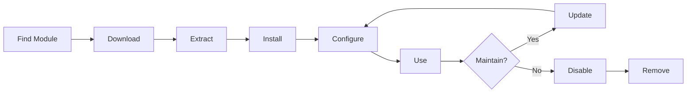

# Instaliranje i upravljanje XOOPS modulima

Naučite kako proširiti funkcionalnost XOOPS instaliranjem i konfiguriranjem modules.

## Razumijevanje XOOPS modula

### Što su moduli?

moduli su proširenja koja dodaju funkcionalnost XOOPS:

| Upišite | Svrha | Primjeri |
|---|---|---|
| **Sadržaj** | Upravljanje određenim vrstama sadržaja | Vijesti, Blog, Ulaznice |
| **Zajednica** | Interakcija s korisnikom | Forum, komentari, recenzije |
| **e-trgovina** | Prodaja proizvoda | Trgovina, košarica, plaćanja |
| **Mediji** | Rukovanje datotekama/slikama | Galerija, preuzimanja, videozapisi |
| **Uslužni program** | Alati i pomoćnici | E-pošta, sigurnosna kopija, analitika |

### Jezgreni nasuprot opcijskih modula

| modul | Upišite | Uključeno | Uklonjivi |
|---|---|---|---|
| **Sustav** | Jezgra | Da | Ne |
| **Korisnik** | Jezgra | Da | Ne |
| **Profil** | Preporučeno | Da | Da |
| **PM (Privatna poruka)** | Preporučeno | Da | Da |
| **WF-kanal** | Izborno | Često | Da |
| **Novosti** | Izborno | Ne | Da |
| **Forum** | Izborno | Ne | Da |

## Životni ciklus modula



## Pronalaženje modula

### XOOPS Repozitorij modula

Službeno skladište modula XOOPS:

**Posjetite:** https://xoops.org/modules/repository/

```
Directory > Modules > [Browse Categories]
```

Pregledaj po kategoriji:
- Upravljanje sadržajem
- Zajednica
- e-trgovina
- Multimedija
- Razvoj
- Administracija stranice

### Ocjenjivanje modula

Prije instalacije provjerite:

| Kriteriji | Što tražiti |
|---|---|
| **Kompatibilnost** | Radi s vašom verzijom XOOPS |
| **Ocjena** | Dobre korisničke recenzije i ocjene |
| **Ažuriranja** | Nedavno održavano |
| **Preuzimanja** | Popularno i široko korišteno |
| **Zahtjevi** | Kompatibilan s vašim poslužiteljem |
| **Licenca** | GPL ili sličan open source |
| **Podrška** | Aktivni programer i zajednica |

### Pročitajte informacije o modulu

Svaki popis modula pokazuje:

```
Module Name: [Name]
Version: [X.X.X]
Requires: XOOPS [Version]
Author: [Name]
Last Update: [Date]
Downloads: [Number]
Rating: [Stars]
Description: [Brief description]
Compatibility: PHP [Version], MySQL [Version]
```

## Instaliranje modula

### Metoda 1: Instalacija administrativne ploče

**1. korak: pristupite odjeljku modula**

1. Prijavite se na ploču admin
2. Idite na **moduli > moduli**
3. Kliknite **"Instaliraj novi modul"** ili **"Pregledaj module"**

**Korak 2: Učitaj modul**

Opcija A - Izravan prijenos:
1. Kliknite **"Odaberi datoteku"**
2. Odaberite .zip datoteku modula s računala
3. Kliknite **"Učitaj"**

Opcija B - URL Prijenos:
1. Zalijepite modul URL
2. Kliknite **"Preuzmi i instaliraj"**

**Korak 3: Pregledajte informacije o modulu**

```
Module Name: [Name shown]
Version: [Version]
Author: [Author info]
Description: [Full description]
Requirements: [PHP/MySQL versions]
```

Pregledajte i kliknite **"Nastavi s instalacijom"**

**Korak 4: Odaberite vrstu instalacije**

```
☐ Fresh Install (New installation)
☐ Update (Upgrade existing)
☐ Delete Then Install (Replace existing)
```

Odaberite odgovarajuću opciju.

**Korak 5: Potvrdite instalaciju**

Pregledajte konačnu potvrdu:
```
Module will be installed to: /modules/modulename/
Database: xoops_db
Proceed? [Yes] [No]
```

Kliknite **"Da"** za potvrdu.

**Korak 6: Instalacija dovršena**

```
Installation successful!

Module: [Module Name]
Version: [Version]
Tables created: [Number]
Files installed: [Number]

[Go to Module Settings]  [Return to Modules]
```

### Metoda 2: Ručna instalacija (napredno)

Za ručnu instalaciju ili rješavanje problema:

**Korak 1: Preuzmi modul**

1. Preuzmite modul .zip iz repozitorija
2. Ekstrakt u `/var/www/html/xoops/modules/modulename/`

```bash
# Extract module
unzip module_name.zip
cp -r module_name /var/www/html/xoops/modules/

# Set permissions
chmod -R 755 /var/www/html/xoops/modules/module_name
```

**Korak 2: Pokrenite instalacijsku skriptu**

```
Visit: http://your-domain.com/xoops/modules/module_name/admin/index.php?op=install
```

Ili putem ploče admin (Sustav > moduli > Ažuriranje baze podataka).

**Korak 3: Provjerite instalaciju**

1. Idite na **moduli > moduli** u admin
2. Potražite svoj modul na popisu
3. Provjerite prikazuje li se kao "Aktivno"

## Konfiguracija modula

### Postavke pristupnog modula

1. Idite na **moduli > moduli**
2. Pronađite svoj modul
3. Kliknite na naziv modula
4. Kliknite **"Postavke"** ili **"Postavke"**### Zajedničke postavke modula

Većina ponuda modules:

```
Module Status: [Enabled/Disabled]
Display in Menu: [Yes/No]
Module Weight: [1-999] (display order)
Visible To Groups: [Checkboxes for user groups]
```

### Opcije specifične za modul

Svaki modul ima jedinstvene postavke. Primjeri:

**modul vijesti:**
```
Items Per Page: 10
Show Author: Yes
Allow Comments: Yes
Moderation Required: Yes
```

**modul foruma:**
```
Topics Per Page: 20
Posts Per Page: 15
Maximum Attachment Size: 5MB
Enable Signatures: Yes
```

**Galerijski modul:**
```
Images Per Page: 12
Thumbnail Size: 150x150
Maximum Upload: 10MB
Watermark: Yes/No
```

Pregledajte dokumentaciju svog modula za određene opcije.

### Spremi konfiguraciju

Nakon podešavanja postavki:

1. Kliknite **"Pošalji"** ili **"Spremi"**
2. Vidjet ćete potvrdu:
   
   ```
   Settings saved successfully!
   ```

## Upravljanje blokovima modula

Mnogi modules stvaraju "blokove" - područja sadržaja nalik na widgete.

### Pregledajte blokove modula

1. Idite na **Izgled > Blokovi**
2. Potražite blokove iz svog modula
3. Većina modules prikazuje "[Naziv modula] - [Opis bloka]"

### Konfigurirajte blokove

1. Kliknite na naziv bloka
2. Podesite:
   - Naslov bloka
   - Vidljivost (sve stranice ili određene)
   - Položaj na stranici (lijevo, sredina, desno)
   - Grupe korisnika koje mogu vidjeti
3. Kliknite **"Pošalji"**

### Prikaži blok na početnoj stranici

1. Idite na **Izgled > Blokovi**
2. Pronađite blok koji želite
3. Kliknite **"Uredi"**
4. Postavite:
   - **Vidljivo za:** Odaberite grupe
   - **Pozicija:** Odaberite stupac (lijevo/sredina/desno)
   - **Stranice:** Početna stranica ili sve stranice
5. Kliknite **"Pošalji"**

## Instaliranje specifičnih primjera modula

### Instaliranje modula vijesti

**Savršeno za:** postove na blogu, najave

1. Preuzmite modul Vijesti iz repozitorija
2. Prenesite putem **moduli > moduli > Instaliraj**
3. Konfigurirajte u **moduli > Vijesti > Postavke**:
   - Priče po stranici: 10
   - Dopusti komentare: Da
   - Odobrenje prije objave: Da
4. Stvorite blokove za najnovije vijesti
5. Počnite objavljivati priče!

### Instaliranje forumskog modula

**Savršeno za:** rasprave u zajednici

1. Preuzmite modul Forum
2. Instalirajte putem ploče admin
3. Napravite kategorije foruma u modulu
4. Konfigurirajte postavke:
   - tema/stranica: 20
   - Postovi/stranica: 15
   - Omogući moderiranje: Da
5. Dodijelite dozvole grupama korisnika
6. Stvorite blokove za najnovije teme

### Instalacija galerijskog modula

**Savršeno za:** izlog slika

1. Preuzmite galerijski modul
2. Instalirajte i konfigurirajte
3. Izradite foto albume
4. Učitajte slike
5. Postavite dopuštenja za pregledavanje/učitavanje
6. Prikažite galeriju na web stranici

## Ažuriranje modula

### Provjerite ima li ažuriranja

```
Admin Panel > Modules > Modules > Check for Updates
```

Ovo pokazuje:
- Dostupna ažuriranja modula
- Trenutna naspram nove verzije
- Dnevnik promjena/napomene o izdanju

### Ažurirajte modul

1. Idite na **moduli > moduli**
2. Pritisnite modul s dostupnim ažuriranjem
3. Pritisnite gumb **"Ažuriraj"**
4. Odaberite **"Ažuriraj" iz vrste instalacije**
5. Slijedite čarobnjaka za instalaciju
6. modul ažuriran!

### Važne napomene o ažuriranju

Prije ažuriranja:

- [ ] Sigurnosna kopija baze podataka
- [ ] Sigurnosne kopije datoteka modula
- [ ] Pregledajte dnevnik promjena
- [ ] Prvo testirajte na probnom poslužitelju
- [ ] Zabilježite sve prilagođene izmjene

Nakon ažuriranja:
- [ ] Provjerite funkcionalnost
- [ ] Provjerite postavke modula
- [ ] Pregledajte upozorenja/pogreške
- [ ] Jasno cache

## dozvole modula

### Dodijelite pristup grupi korisnika

Kontrolirajte koje grupe korisnika mogu pristupiti modules:

**Lokacija:** Sustav > dozvole

Za svaki modul konfigurirajte:

```
Module: [Module Name]

Admin Access: [Select groups]
User Access: [Select groups]
Read Permission: [Groups allowed to view]
Write Permission: [Groups allowed to post]
Delete Permission: [Administrators only]
```

### Uobičajene razine dopuštenja

```
Public Content (News, Pages):
├── Admin Access: Webmaster
├── User Access: All logged-in users
└── Read Permission: Everyone

Community Features (Forum, Comments):
├── Admin Access: Webmaster, Moderators
├── User Access: All logged-in users
└── Write Permission: All logged-in users

Admin Tools:
├── Admin Access: Webmaster only
└── User Access: Disabled
```

## Onemogućavanje i uklanjanje modula

### Onemogući modul (čuvaj datoteke)

Zadrži modul, ali sakrij sa stranice:

1. Idite na **moduli > moduli**
2. Pronađite modul
3. Pritisnite naziv modula
4. Kliknite **"Onemogući"** ili postavite status na Neaktivno
5. modul skriven, ali podaci sačuvaniPonovno omogućite bilo kada:
1. Pritisnite modul
2. Kliknite **"Omogući"**

### Potpuno uklonite modul

Brisanje modula i njegovih podataka:

1. Idite na **moduli > moduli**
2. Pronađite modul
3. Kliknite **"Deinstaliraj"** ili **"Izbriši"**
4. Potvrdite: "Izbrisati modul i sve podatke?"
5. Kliknite **"Da"** za potvrdu

**Upozorenje:** Deinstalacija briše sve podatke modula!

### Ponovna instalacija nakon deinstalacije

Ako deinstalirate modul:
- Datoteke modula izbrisane
- Tablice baze podataka izbrisane
- Svi podaci izgubljeni
- Morate ponovno instalirati za ponovnu upotrebu
- Može vratiti iz sigurnosne kopije

## Instalacija modula za rješavanje problema

### modul se ne pojavljuje nakon instalacije

**Simptom:** modul je naveden, ali nije vidljiv na stranici

**Rješenje:**
```
1. Check module is "Active" (Modules > Modules)
2. Enable module blocks (Appearance > Blocks)
3. Verify user permissions (System > Permissions)
4. Clear cache (System > Tools > Clear Cache)
5. Check .htaccess doesn't block module
```

### Greška instalacije: "Tablica već postoji"

**Simptom:** Greška tijekom instalacije modula

**Rješenje:**
```
1. Module partially installed before
2. Try "Delete then Install" option
3. Or uninstall first, then install fresh
4. Check database for existing tables:
   mysql> SHOW TABLES LIKE 'xoops_module%';
```

### Nedostaju ovisnosti modula

**Simptom:** modul se ne može instalirati - potreban je drugi modul

**Rješenje:**
```
1. Note required modules from error message
2. Install required modules first
3. Then install the module
4. Install in correct order
```

### Prazna stranica prilikom pristupanja modulu

**Simptom:** modul se učitava, ali ne pokazuje ništa

**Rješenje:**
```
1. Enable debug mode in mainfile.php:
   define('XOOPS_DEBUG', 1);

2. Check PHP error log:
   tail -f /var/log/php_errors.log

3. Verify file permissions:
   chmod -R 755 /var/www/html/xoops/modules/modulename

4. Check database connection in module config

5. Disable module and reinstall
```

### Mjesto prekida modula

**Simptom:** Instalacija modula prekida web stranicu

**Rješenje:**
```
1. Disable the problematic module immediately:
   Admin > Modules > [Module] > Disable

2. Clear cache:
   rm -rf /var/www/html/xoops/cache/*
   rm -rf /var/www/html/xoops/templates_c/*

3. Restore from backup if needed

4. Check error logs for root cause

5. Contact module developer
```

## Sigurnosna razmatranja modula

### Instalirajte samo iz pouzdanih izvora

```
✓ Official XOOPS Repository
✓ GitHub official XOOPS modules
✓ Trusted module developers
✗ Unknown websites
✗ Unverified sources
```

### Provjerite dopuštenja modula

Nakon instalacije:

1. Pregledajte kod modula za sumnjivu aktivnost
2. Provjerite tablice baze podataka za anomalije
3. Pratite promjene datoteka
4. Držite modules ažuriranim
5. Uklonite neiskorišteni modules

### Najbolji primjeri dopuštenja

```
Module directory: 755 (readable, not writable by web server)
Module files: 644 (readable only)
Module data: Protected by database
```

## Resursi za razvoj modula

### Naučite razvoj modula

- Službena dokumentacija: https://xoops.org/
- GitHub spremište: https://github.com/XOOPS/
- Forum zajednice: https://xoops.org/modules/newbb/
- Vodič za razvojne programere: dostupan u mapi dokumenata

## Najbolji primjeri iz prakse za module

1. **Instaliraj jedan po jedan:** Prati sukobe
2. **Testirajte nakon instalacije:** Provjerite funkcionalnost
3. **Dokumentirajte prilagođenu konfiguraciju:** Zabilježite svoje postavke
4. **Održavajte ažuriranje:** Instalirajte ažuriranja modula odmah
5. **Ukloni neiskorišteno:** Brisanje modules nije potrebno
6. **Izrada sigurnosne kopije prije:** Uvijek napravite sigurnosnu kopiju prije instaliranja
7. **Pročitajte dokumentaciju:** Provjerite upute modula
8. **Pridružite se zajednici:** Zatražite pomoć ako je potrebna

## Kontrolni popis za instalaciju modula

Za svaku instalaciju modula:

- [ ] Istražite i pročitajte recenzije
- [ ] Provjerite kompatibilnost verzije XOOPS
- [ ] Sigurnosna kopija baze podataka i datoteka
- [ ] Preuzmite najnoviju verziju
- [ ] Instalirajte putem ploče admin
- [ ] Konfigurirajte postavke
- [ ] Stvaranje/pozicioniranje blokova
- [ ] Postavite korisnička dopuštenja
- [ ] Testirajte funkcionalnost
- [ ] Konfiguracija dokumenta
- [ ] Raspored ažuriranja

## Sljedeći koraci

Nakon instaliranja modules:

1. Napravite sadržaj za modules
2. Postavite grupe korisnika
3. Istražite značajke admin
4. Optimizirajte performanse
5. Po potrebi instalirajte dodatni modules

---

**Oznake:** #modules #instalacija #proširenje #upravljanje

**Povezani članci:**
- administratorska ploča - Pregled
- Upravljanje korisnicima
- Stvaranje-vaše-prve-stranice
- ../Configuration/System-Settings
