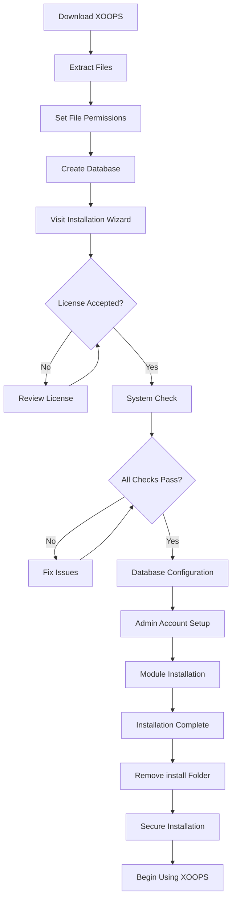

# Kompletan vodič za instalaciju XOOPS

Ovaj vodič pruža opsežan vodič za instalaciju XOOPS ispočetka pomoću čarobnjaka za instalaciju.

## Preduvjeti

Prije početka instalacije provjerite imate li:

- Pristup vašem web poslužitelju putem FTP-a ili SSH-a
- Administratorski pristup vašem poslužitelju baze podataka
- Registrirani naziv domene
- Zahtjevi poslužitelja potvrđeni
- Dostupni alati za sigurnosno kopiranje

## Proces instalacije



## Instalacija korak po korak

### Korak 1: Preuzmite XOOPS

Preuzmite najnoviju verziju s [https://xoops.org/](https://xoops.org/):

```bash
# Using wget
wget https://xoops.org/download/xoops-2.5.8.zip

# Using curl
curl -O https://xoops.org/download/xoops-2.5.8.zip
```

### Korak 2: Izdvojite datoteke

Izdvojite arhivu XOOPS u svoj web korijen:

```bash
# Navigate to web root
cd /var/www/html

# Extract XOOPS
unzip xoops-2.5.8.zip

# Rename folder (optional, but recommended)
mv xoops-2.5.8 xoops
cd xoops
```

### Korak 3: Postavite dozvole za datoteke

Postavite odgovarajuća dopuštenja za XOOPS direktorije:

```bash
# Make directories writable (755 for dirs, 644 for files)
find . -type d -exec chmod 755 {} \;
find . -type f -exec chmod 644 {} \;

# Make specific directories writable by web server
chmod 777 uploads/
chmod 777 templates_c/
chmod 777 var/
chmod 777 cache/

# Secure mainfile.php after installation
chmod 644 mainfile.php
```

### Korak 4: Stvorite bazu podataka

Napravite novu bazu podataka za XOOPS koristeći MySQL:

```sql
-- Create database
CREATE DATABASE xoops_db CHARACTER SET utf8mb4 COLLATE utf8mb4_unicode_ci;

-- Create user
CREATE USER 'xoops_user'@'localhost' IDENTIFIED BY 'secure_password_here';

-- Grant privileges
GRANT ALL PRIVILEGES ON xoops_db.* TO 'xoops_user'@'localhost';
FLUSH PRIVILEGES;
```

Ili pomoću phpMyAdmin-a:

1. Prijavite se na phpMyAdmin
2. Pritisnite karticu "Baze podataka".
3. Unesite naziv baze podataka: `xoops_db`
4. Odaberite sortiranje "utf8mb4_unicode_ci".
5. Kliknite "Izradi"
6. Stvorite korisnika s istim imenom kao baza podataka
7. Dodijelite sve privilegije

### Korak 5: Pokrenite instalacijski čarobnjak

Otvorite svoj preglednik i idite na:

```
http://your-domain.com/xoops/install/
```

#### Faza provjere sustava

Čarobnjak provjerava konfiguraciju vašeg poslužitelja:

- PHP verzija >= 5.6.0
- dostupan MySQL/MariaDB
- Potrebna proširenja PHP (GD, PDO, itd.)
- dozvole imenika
- Povezivost baze podataka

**Ako provjere ne uspiju:**

Za rješenja pogledajte odjeljak #Common-Installation-Issues.

#### Konfiguracija baze podataka

Unesite vjerodajnice svoje baze podataka:

```
Database Host: localhost
Database Name: xoops_db
Database User: xoops_user
Database Password: [your_secure_password]
Table Prefix: xoops_
```

**Važne napomene:**
- Ako se vaš host baze podataka razlikuje od lokalnog hosta (npr. udaljeni poslužitelj), unesite ispravan naziv hosta
- Prefiks tablice pomaže ako se izvodi više instanci XOOPS u jednoj bazi podataka
- Upotrijebite snažnu zaporku s miješanim malim i velikim slovima, brojevima i simbolima

#### Postavljanje administratorskog računa

Kreirajte svoj administrator račun:

```
Admin Username: admin (or choose custom)
Admin Email: admin@your-domain.com
Admin Password: [strong_unique_password]
Confirm Password: [repeat_password]
```

**Najbolji primjeri iz prakse:**
- Koristite jedinstveno korisničko ime, a ne "admin"
- Koristite lozinku s 16+ znakova
- Pohranite vjerodajnice u sigurnom upravitelju lozinki
- Nikada ne dijelite vjerodajnice admin

#### Instalacija modula

Odaberite zadani modules za instalaciju:

- **Sustavski modul** (potrebno) - Jezgrena XOOPS funkcionalnost
- **Korisnički modul** (obavezno) - Upravljanje korisnicima
- **Profilni modul** (preporučeno) - Korisnički profili
- **modul PM (Privatne poruke)** (preporučeno) - Interno slanje poruka
- **WF-Channel Module** (opcionalno) - Upravljanje sadržajem

Odaberite sve preporučene modules za potpunu instalaciju.

### Korak 6: Dovršite instalaciju

Nakon svih koraka, vidjet ćete ekran za potvrdu:

```
Installation Complete!

Your XOOPS installation is ready to use.
Admin Panel: http://your-domain.com/xoops/admin/
User Panel: http://your-domain.com/xoops/
```

### Korak 7: Osigurajte svoju instalaciju

#### Ukloni instalacijsku mapu

```bash
# Remove the install directory (CRITICAL for security)
rm -rf /var/www/html/xoops/install/

# Or rename it
mv /var/www/html/xoops/install/ /var/www/html/xoops/install.bak
```

**UPOZORENJE:** Nikada ne ostavljajte instalacijsku mapu dostupnom u produkciji!

#### Sigurno mainfile.php

```bash
# Make mainfile.php read-only
chmod 644 /var/www/html/xoops/mainfile.php

# Set ownership
chown www-data:www-data /var/www/html/xoops/mainfile.php
```

#### Postavite odgovarajuće dozvole za datoteke

```bash
# Recommended production permissions
find . -type f -name "*.php" -exec chmod 644 {} \;
find . -type d -exec chmod 755 {} \;

# Writable directories for web server
chmod 777 uploads/ var/ cache/ templates_c/
```

#### Omogućite HTTPS/SSL

Konfigurirajte SSL na svom web poslužitelju (nginx ili Apache).

**Za Apache:**
```apache
<VirtualHost *:443>
    ServerName your-domain.com
    DocumentRoot /var/www/html/xoops

    SSLEngine on
    SSLCertificateFile /etc/ssl/certs/your-cert.crt
    SSLCertificateKeyFile /etc/ssl/private/your-key.key

    # Force HTTPS redirect
    <IfModule mod_rewrite.c>
        RewriteEngine On
        RewriteCond %{HTTPS} off
        RewriteRule ^(.*)$ https://%{HTTP_HOST}%{REQUEST_URI} [L,R=301]
    </IfModule>
</VirtualHost>
```

## Konfiguracija nakon instalacije

### 1. Pristupite administratorskoj ploči

Idite do:
```
http://your-domain.com/xoops/admin/
```
Prijavite se svojim vjerodajnicama admin.

### 2. Konfigurirajte osnovne postavke

Konfigurirajte sljedeće:

- Naziv i opis stranice
- Adresa e-pošte administratora
- Vremenska zona i format datuma
- Optimizacija za tražilice

### 3. Testna instalacija

- [ ] Posjetite početnu stranicu
- [ ] Provjerite opterećenje modules
- [ ] Provjerite radi registraciju korisnika
- [ ] Testirajte funkcije ploče admin
- [ ] Potvrdite da SSL/HTTPS radi

### 4. Zakažite sigurnosne kopije

Postavite automatske sigurnosne kopije:

```bash
# Create backup script (backup.sh)
#!/bin/bash
DATE=$(date +%Y%m%d_%H%M%S)
BACKUP_DIR="/backups/xoops"
XOOPS_DIR="/var/www/html/xoops"

# Backup database
mysqldump -u xoops_user -p[password] xoops_db > $BACKUP_DIR/db_$DATE.sql

# Backup files
tar -czf $BACKUP_DIR/files_$DATE.tar.gz $XOOPS_DIR

echo "Backup completed: $DATE"
```

Raspored s cronom:
```bash
# Daily backup at 2 AM
0 2 * * * /usr/local/bin/backup.sh
```

## Uobičajeni problemi s instalacijom

### Problem: Pogreške odbijene dozvole

**Simptom:** "dozvola odbijena" prilikom učitavanja ili stvaranja datoteka

**Rješenje:**
```bash
# Check web server user
ps aux | grep apache  # For Apache
ps aux | grep nginx   # For Nginx

# Fix permissions (replace www-data with your web server user)
chown -R www-data:www-data /var/www/html/xoops
chmod -R 755 /var/www/html/xoops
chmod 777 uploads/ var/ cache/ templates_c/
```

### Problem: povezivanje s bazom podataka nije uspjelo

**Simptom:** "Ne mogu se spojiti na poslužitelj baze podataka"

**Rješenje:**
1. Provjerite vjerodajnice baze podataka u čarobnjaku za instalaciju
2. Provjerite radi li MySQL/MariaDB:
   ```bash
   service mysql status  # or mariadb
   ```
3. Provjerite postoji li baza podataka:
   
   ```sql
   SHOW DATABASES;
   ```
4. Testirajte vezu iz naredbenog retka:
   ```bash
   mysql -h localhost -u xoops_user -p xoops_db
   ```

### Problem: Prazan bijeli ekran

**Simptom:** Posjet XOOPS prikazuje praznu stranicu

**Rješenje:**
1. Provjerite zapisnike pogrešaka PHP:
   ```bash
   tail -f /var/log/apache2/error.log
   ```
2. Omogućite način otklanjanja pogrešaka u mainfile.php:
   ```php
   define('XOOPS_DEBUG', 1);
   ```
3. Provjerite dopuštenja za datoteke na mainfile.php i konfiguracijske datoteke
4. Provjerite je li proširenje PHP-MySQL instalirano

### Problem: Nije moguće pisati u direktorij za prijenose

**Simptom:** Značajka prijenosa ne uspijeva, "Ne mogu pisati na uploads/"

**Rješenje:**
```bash
# Check current permissions
ls -la uploads/

# Fix permissions
chmod 777 uploads/
chown www-data:www-data uploads/

# For specific files
chmod 644 uploads/*
```

### Problem: nedostaju proširenja PHP

**Simptom:** Provjera sustava nije uspjela s ekstenzijama koje nedostaju (GD, MySQL, itd.)

**Rješenje (Ubuntu/Debian):**
```bash
# Install PHP GD library
apt-get install php-gd

# Install PHP MySQL support
apt-get install php-mysql

# Restart web server
systemctl restart apache2  # or nginx
```

**Rješenje (CentOS/RHEL):**
```bash
# Install PHP GD library
yum install php-gd

# Install PHP MySQL support
yum install php-mysql

# Restart web server
systemctl restart httpd
```

### Problem: Spor proces instalacije

**Simptom:** Čarobnjak za instalaciju je istekao ili radi vrlo sporo

**Rješenje:**
1. Povećajte vremensko ograničenje PHP u php.ini:
   
   ```ini
   max_execution_time = 300  # 5 minutes
   ```
2. Povećajte MySQL max_allowed_packet:
   
   ```sql
   SET GLOBAL max_allowed_packet = 256M;
   ```
3. Provjerite resurse poslužitelja:
   ```bash
   free -h  # Check RAM
   df -h    # Check disk space
   ```

### Problem: administratorska ploča nije dostupna

**Simptom:** Ne može se pristupiti ploči admin nakon instalacije

**Rješenje:**
1. Provjerite postoji li korisnik admin u bazi podataka:
   
   ```sql
   SELECT * FROM xoops_users WHERE uid = 1;
   ```
2. Obrišite preglednik cache i kolačiće
3. Provjerite može li se pisati u mapu sesija:
   ```bash
   chmod 777 var/
   ```
4. Provjerite da htaccess pravila ne blokiraju pristup admin

## Popis za provjeru

Nakon instalacije provjerite:

- [x] XOOPS početna stranica se ispravno učitava
- [x] administratorska ploča je dostupna na /xoops/admin/
- [x] SSL/HTTPS radi
- [x] Instalacijska mapa je uklonjena ili nedostupna
- [x] dozvole za datoteke su sigurne (644 za datoteke, 755 za direktorije)
- [x] Sigurnosne kopije baze podataka su zakazane
- [x] moduli se učitavaju bez grešaka
- [x] Sustav registracije korisnika radi
- [x] Funkcija prijenosa datoteka radi
- [x] Obavijesti putem e-pošte ispravno se šalju

## Sljedeći koraci

Nakon dovršetka instalacije:1. Pročitajte vodič za osnovnu konfiguraciju
2. Osigurajte svoju instalaciju
3. Istražite ploču admin
4. Instalirajte dodatni modules
5. Postavite korisničke grupe i dopuštenja

---

**Oznake:** #instalacija #postavljanje #početak rada #otklanjanje problema

**Povezani članci:**
- Zahtjevi poslužitelja
- Nadogradnja-XOOPS
- ../Configuration/Security-Configuration
