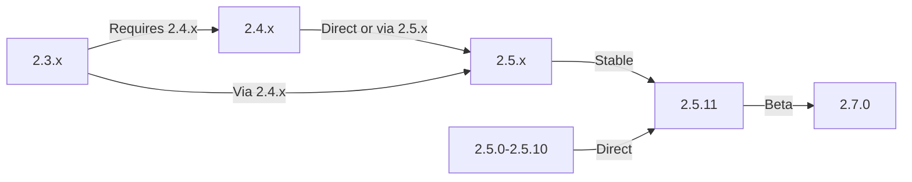

Ovaj vodič pokriva nadogradnju XOOPS sa starijih verzija na najnovije izdanje uz očuvanje vaših podataka i prilagodbi.

> **Informacije o verziji**
> - **Stabilno:** XOOPS 2.5.11
> - **Beta:** XOOPS 2.7.0 (testiranje)
> - **Budućnost:** XOOPS 4.0 (u razvoju - pogledajte plan)

## Kontrolni popis prije nadogradnje

Prije početka nadogradnje provjerite:

- [ ] Trenutna verzija XOOPS dokumentirana
- [ ] Identificirana ciljna verzija XOOPS
- [ ] Potpuna sigurnosna kopija sustava dovršena
- [ ] Sigurnosna kopija baze podataka potvrđena
- [ ] Instalirani modules popis snimljen
- [ ] Dokumentirane prilagođene izmjene
- [ ] Dostupno testno okruženje
- [ ] Provjeren put nadogradnje (neke verzije preskaču međuizdanja)
- [ ] Resursi poslužitelja provjereni (dovoljno prostora na disku, memorije)
- [ ] Način rada održavanja omogućen

## Vodič za nadogradnju

Različiti putovi nadogradnje ovisno o trenutnoj verziji:



**Važno:** Nikada ne preskačite glavne verzije. Ako nadograđujete s 2.3.x, prvo nadogradite na 2.4.x, zatim na 2.5.x.

## Korak 1: Dovršite sigurnosnu kopiju sustava

### Sigurnosna kopija baze podataka

Koristite mysqldump za backup baze podataka:

```bash
# Full database backup
mysqldump -u xoops_user -p xoops_db > /backups/xoops_db_backup_$(date +%Y%m%d_%H%M%S).sql

# Compressed backup
mysqldump -u xoops_user -p xoops_db | gzip > /backups/xoops_db_backup_$(date +%Y%m%d_%H%M%S).sql.gz
```

Ili pomoću phpMyAdmin-a:

1. Odaberite svoju XOOPS bazu podataka
2. Pritisnite karticu "Izvoz".
3. Odaberite format "SQL".
4. Odaberite "Spremi kao datoteku"
5. Kliknite "Idi"

Provjerite datoteku sigurnosne kopije:

```bash
# Check backup size
ls -lh /backups/xoops_db_backup*.sql

# Verify backup integrity (uncompressed)
head -20 /backups/xoops_db_backup_*.sql

# Verify compressed backup
zcat /backups/xoops_db_backup_*.sql.gz | head -20
```

### Sigurnosna kopija sustava datoteka

Sigurnosno kopirajte sve datoteke XOOPS:

```bash
# Compressed file backup
tar -czf /backups/xoops_files_$(date +%Y%m%d_%H%M%S).tar.gz /var/www/html/xoops

# Uncompressed (faster, requires more disk space)
tar -cf /backups/xoops_files_$(date +%Y%m%d_%H%M%S).tar /var/www/html/xoops

# Show backup progress
tar -czf /backups/xoops_files_$(date +%Y%m%d_%H%M%S).tar.gz --verbose /var/www/html/xoops | tail
```

Sigurno pohranite sigurnosne kopije:

```bash
# Secure backup storage
chmod 600 /backups/xoops_*
ls -lah /backups/

# Optional: Copy to remote storage
scp /backups/xoops_* user@backup-server:/secure/backups/
```

### Testirajte vraćanje sigurnosne kopije

**KRITIČNO:** Uvijek provjerite radi li sigurnosna kopija:

```bash
# Verify tar archive contents
tar -tzf /backups/xoops_files_*.tar.gz | head -20

# Extract to test location
mkdir /tmp/restore_test
cd /tmp/restore_test
tar -xzf /backups/xoops_files_*.tar.gz

# Verify key files exist
ls -la xoops/mainfile.php
ls -la xoops/install/
```

## Korak 2: Omogućite način rada održavanja

Spriječite korisnike da pristupe stranici tijekom nadogradnje:

### Opcija 1: XOOPS administratorska ploča

1. Prijavite se na ploču admin
2. Idite na Sustav > Održavanje
3. Omogućite "Način održavanja stranice"
4. Postavite poruku o održavanju
5. Spremiti

### Opcija 2: Način ručnog održavanja

Stvorite datoteku za održavanje u web korijenu:

```html
<!-- /var/www/html/maintenance.html -->
<!DOCTYPE html>
<html>
<head>
    <title>Under Maintenance</title>
    <style>
        body { font-family: Arial; text-align: center; padding: 50px; }
        h1 { color: #333; }
        p { color: #666; margin: 20px 0; }
    </style>
</head>
<body>
    <h1>Site Under Maintenance</h1>
    <p>We're currently upgrading our site.</p>
    <p>Expected time: approximately 30 minutes.</p>
    <p>Thank you for your patience!</p>
</body>
</html>
```

Konfigurirajte Apache za prikaz stranice za održavanje:

```apache
# In .htaccess or vhost config
ErrorDocument 503 /maintenance.html

# Redirect all traffic to maintenance page
<IfModule mod_rewrite.c>
    RewriteEngine On
    RewriteCond %{REMOTE_ADDR} !^192\.168\.1\.100$  # Your IP
    RewriteRule ^(.*)$ - [R=503,L]
</IfModule>
```

## Korak 3: Preuzmite novu verziju

Preuzmite XOOPS sa službene stranice:

```bash
# Download latest version
cd /tmp
wget https://xoops.org/download/xoops-2.5.8.zip

# Verify checksum (if provided)
sha256sum xoops-2.5.8.zip
# Compare with official SHA256 hash

# Extract to temporary location
unzip xoops-2.5.8.zip
cd xoops-2.5.8
```

## Korak 4: Priprema datoteke prije nadogradnje

### Prepoznajte prilagođene izmjene

Provjerite prilagođene osnovne datoteke:

```bash
# Look for modified files (files with newer mtime)
find /var/www/html/xoops -type f -newer /var/www/html/xoops/install.php

# Check for custom themes
ls /var/www/html/xoops/themes/
# Note any custom themes

# Check for custom modules
ls /var/www/html/xoops/modules/
# Note any custom modules created by you
```

### Trenutno stanje dokumenta

Napravite izvješće o nadogradnji:

```bash
cat > /tmp/upgrade_report.txt << EOF
=== XOOPS Upgrade Report ===
Date: $(date)
Current Version: 2.5.6
Target Version: 2.5.8

=== Installed Modules ===
$(ls /var/www/html/xoops/modules/)

=== Custom Modifications ===
[Document any custom theme or module modifications]

=== Themes ===
$(ls /var/www/html/xoops/themes/)

=== Plugin Status ===
[List any custom code modifications]

EOF
```

## Korak 5: Spojite nove datoteke s trenutnom instalacijom

### Strategija: Sačuvajte prilagođene datoteke

Zamijenite osnovne datoteke XOOPS, ali sačuvajte:
- `mainfile.php` (konfiguracija vaše baze podataka)
- Prilagođeni themes u `themes/`
- Prilagođeni modules u `modules/`
- Korisnik uploads u `uploads/`
- Podaci o lokaciji u `var/`

### Ručni postupak spajanja

```bash
# Set variables
XOOPS_OLD="/var/www/html/xoops"
XOOPS_NEW="/tmp/xoops-2.5.8"
BACKUP="/backups/pre-upgrade"

# Create pre-upgrade backup in place
mkdir -p $BACKUP
cp -r $XOOPS_OLD/* $BACKUP/

# Copy new files (but preserve sensitive files)
# Copy everything except protected directories
rsync -av --exclude='mainfile.php' \
    --exclude='modules/custom*' \
    --exclude='themes/custom*' \
    --exclude='uploads' \
    --exclude='var' \
    --exclude='cache' \
    --exclude='templates_c' \
    $XOOPS_NEW/ $XOOPS_OLD/

# Verify critical files preserved
ls -la $XOOPS_OLD/mainfile.php
```

### Korištenje nadogradnje.php (If Available)

Neke XOOPS verzije include skripte automatizirane nadogradnje:

```bash
# Copy new files with installer
cp -r /tmp/xoops-2.5.8/* /var/www/html/xoops/

# Run upgrade wizard
# Visit: http://your-domain.com/xoops/upgrade/
```

### dozvole za datoteke nakon spajanja

Vratite ispravna dopuštenja:

```bash
# Set ownership
chown -R www-data:www-data /var/www/html/xoops

# Set directory permissions
find /var/www/html/xoops -type d -exec chmod 755 {} \;

# Set file permissions
find /var/www/html/xoops -type f -exec chmod 644 {} \;

# Make writable directories
chmod 777 /var/www/html/xoops/cache
chmod 777 /var/www/html/xoops/templates_c
chmod 777 /var/www/html/xoops/uploads
chmod 777 /var/www/html/xoops/var

# Secure mainfile.php
chmod 644 /var/www/html/xoops/mainfile.php
```

## Korak 6: Migracija baze podataka

### Pregledajte promjene baze podataka

Provjerite napomene o izdanju XOOPS za promjene strukture baze podataka:

```bash
# Extract and review SQL migration files
find /tmp/xoops-2.5.8 -name "*.sql" -type f
# Document all .sql files found
```

### Pokreni ažuriranja baze podataka

### Opcija 1: Automatsko ažuriranje (ako je dostupno)

Koristite ploču admin:1. Prijavite se na admin
2. Idite na **Sustav > baza podataka**
3. Kliknite "Provjeri ažuriranja"
4. Pregledajte promjene na čekanju
5. Kliknite "Primijeni ažuriranja"

### Opcija 2: Ručna ažuriranja baze podataka

Izvršite migraciju datoteka SQL:

```bash
# Connect to database
mysql -u xoops_user -p xoops_db

# View pending changes (varies by version)
SELECT * FROM xoops_config WHERE conf_name LIKE '%version%';

# Run migration scripts manually if needed
SOURCE /tmp/xoops-2.5.8/migrate_2.5.6_to_2.5.8.sql;
```

### Provjera baze podataka

Provjerite integritet baze podataka nakon ažuriranja:

```sql
-- Check database consistency
REPAIR TABLE xoops_users;
OPTIMIZE TABLE xoops_users;

-- Verify key tables exist
SHOW TABLES LIKE 'xoops_%';

-- Check row counts (should increase or stay same)
SELECT COUNT(*) FROM xoops_users;
SELECT COUNT(*) FROM xoops_posts;
```

## Korak 7: Provjerite nadogradnju

### Provjera početne stranice

Posjetite svoju početnu stranicu XOOPS:

```
http://your-domain.com/xoops/
```

Očekivano: Stranica se učitava bez pogrešaka, prikazuje ispravno

### Provjera administratorske ploče

Pristup admin:

```
http://your-domain.com/xoops/admin/
```

Provjerite:
- [ ] Učitava se administrativna ploča
- [ ] Navigacija radi
- [ ] Nadzorna ploča ispravno se prikazuje
- [ ] Nema pogrešaka baze podataka u zapisima

### Verifikacija modula

Provjerite instalirani modules:

1. Idite na **moduli > moduli** u admin
2. Provjerite jesu li svi modules još uvijek instalirani
3. Provjerite ima li poruka o pogrešci
4. Omogućite bilo koji modules koji je bio onemogućen

### Provjera datoteke dnevnika

Pregledajte zapisnike sustava radi pogrešaka:

```bash
# Check web server error log
tail -50 /var/log/apache2/error.log

# Check PHP error log
tail -50 /var/log/php_errors.log

# Check XOOPS system log (if available)
# In admin panel: System > Logs
```

### Testirajte osnovne funkcije

- [ ] Prijava/odjava korisnika radi
- [ ] Registracija korisnika radi
- [ ] Funkcije za učitavanje datoteka
- [ ] Slanje obavijesti e-poštom
- [ ] Funkcija pretraživanja radi
- [ ] Funkcije administratora operativne
- [ ] Funkcionalnost modula netaknuta

## Korak 8: Čišćenje nakon nadogradnje

### Uklonite privremene datoteke

```bash
# Remove extraction directory
rm -rf /tmp/xoops-2.5.8

# Clear template cache (safe to delete)
rm -rf /var/www/html/xoops/templates_c/*

# Clear site cache
rm -rf /var/www/html/xoops/cache/*
```

### Ukloni način održavanja

Ponovo omogući normalan pristup web mjestu:

```apache
# Remove maintenance mode redirect from .htaccess
# Or delete maintenance.html file
rm /var/www/html/maintenance.html
```

### Ažurirajte dokumentaciju

Ažurirajte svoje bilješke o nadogradnji:

```bash
# Document successful upgrade
cat >> /tmp/upgrade_report.txt << EOF

=== Upgrade Results ===
Status: SUCCESS
Upgrade Date: $(date)
New Version: 2.5.8
Duration: [time in minutes]

Post-Upgrade Tests:
- [x] Homepage loads
- [x] Admin panel accessible
- [x] Modules functional
- [x] User registration works
- [x] Database optimized

EOF
```

## Rješavanje problema s nadogradnjom

### Problem: Prazan bijeli ekran nakon nadogradnje

**Simptom:** Početna stranica ne prikazuje ništa

**Rješenje:**
```bash
# Check PHP errors
tail -f /var/log/apache2/error.log

# Enable debug mode temporarily
echo "define('XOOPS_DEBUG', 1);" >> /var/www/html/xoops/mainfile.php

# Check file permissions
ls -la /var/www/html/xoops/mainfile.php

# Restore from backup if needed
cp /backups/xoops_files_*.tar.gz /tmp/
cd /tmp && tar -xzf xoops_files_*.tar.gz
```

### Problem: Pogreška veze s bazom podataka

**Simptom:** Poruka "Ne mogu se povezati s bazom podataka".

**Rješenje:**
```bash
# Verify database credentials in mainfile.php
grep -i "database\|host\|user" /var/www/html/xoops/mainfile.php

# Test connection
mysql -h localhost -u xoops_user -p xoops_db -e "SELECT 1"

# Check MySQL status
systemctl status mysql

# Verify database still exists
mysql -u xoops_user -p -e "SHOW DATABASES" | grep xoops
```

### Problem: administratorska ploča nije dostupna

**Simptom:** Ne mogu pristupiti /xoops/admin/

**Rješenje:**
```bash
# Check .htaccess rules
cat /var/www/html/xoops/.htaccess

# Verify admin files exist
ls -la /var/www/html/xoops/admin/

# Check mod_rewrite enabled
apache2ctl -M | grep rewrite

# Restart web server
systemctl restart apache2
```

### Problem: moduli se ne učitavaju

**Simptom:** moduli pokazuju pogreške ili su deaktivirani

**Rješenje:**
```bash
# Verify module files exist
ls /var/www/html/xoops/modules/

# Check module permissions
ls -la /var/www/html/xoops/modules/*/

# Check module configuration in database
mysql -u xoops_user -p xoops_db -e "SELECT * FROM xoops_modules WHERE module_status = 0"

# Reactivate modules in admin panel
# System > Modules > Click module > Update Status
```

### Problem: Pogreške odbijene dozvole

**Simptom:** "dozvola odbijena" prilikom učitavanja ili spremanja

**Rješenje:**
```bash
# Check file ownership
ls -la /var/www/html/xoops/ | head -20

# Fix ownership
chown -R www-data:www-data /var/www/html/xoops

# Fix directory permissions
find /var/www/html/xoops -type d -exec chmod 755 {} \;

# Make cache/uploads writable
chmod 777 /var/www/html/xoops/cache
chmod 777 /var/www/html/xoops/templates_c
chmod 777 /var/www/html/xoops/uploads
chmod 777 /var/www/html/xoops/var
```

### Problem: Sporo učitavanje stranice

**Simptom:** Stranice se učitavaju vrlo sporo nakon nadogradnje

**Rješenje:**
```bash
# Clear all caches
rm -rf /var/www/html/xoops/cache/*
rm -rf /var/www/html/xoops/templates_c/*

# Optimize database
mysql -u xoops_user -p xoops_db << EOF
OPTIMIZE TABLE xoops_users;
OPTIMIZE TABLE xoops_posts;
OPTIMIZE TABLE xoops_config;
ANALYZE TABLE xoops_users;
EOF

# Check PHP error log for warnings
grep -i "deprecated\|warning" /var/log/php_errors.log | tail -20

# Increase PHP memory/execution time temporarily
# Edit php.ini:
memory_limit = 256M
max_execution_time = 300
```

## Postupak vraćanja

Ako nadogradnja kritično ne uspije, vratite iz sigurnosne kopije:

### Vrati bazu podataka

```bash
# Restore from backup
mysql -u xoops_user -p xoops_db < /backups/xoops_db_backup_YYYYMMDD_HHMMSS.sql

# Or from compressed backup
gunzip < /backups/xoops_db_backup_YYYYMMDD_HHMMSS.sql.gz | mysql -u xoops_user -p xoops_db

# Verify restoration
mysql -u xoops_user -p xoops_db -e "SELECT COUNT(*) FROM xoops_users"
```

### Vrati sustav datoteka

```bash
# Stop web server
systemctl stop apache2

# Remove current installation
rm -rf /var/www/html/xoops/*

# Extract backup
cd /var/www/html
tar -xzf /backups/xoops_files_YYYYMMDD_HHMMSS.tar.gz

# Fix permissions
chown -R www-data:www-data xoops/
find xoops -type d -exec chmod 755 {} \;
find xoops -type f -exec chmod 644 {} \;
chmod 777 xoops/cache xoops/templates_c xoops/uploads xoops/var

# Start web server
systemctl start apache2

# Verify restoration
# Visit http://your-domain.com/xoops/
```

## Kontrolni popis za provjeru nadogradnje

Nakon dovršetka nadogradnje provjerite:

- [] ažurirana verzija XOOPS (provjerite admin > Informacije o sustavu)
- [ ] Početna stranica se učitava bez grešaka
- [ ] Svi modules funkcionalni
- [ ] Prijava korisnika radi
- [ ] administratorska ploča dostupna
- [ ] Datoteka uploads rad
- [ ] Funkcionalne obavijesti putem e-pošte
- [ ] Integritet baze podataka potvrđen
- [ ] Dopuštenja datoteke ispravna
- [ ] Način održavanja uklonjen
- [ ] Sigurnosne kopije osigurane i testirane
- [ ] Izvedba prihvatljiva
- [ ] SSL/HTTPS radi
- [ ] Nema poruka o pogrešci u zapisima

## Sljedeći koraci

Nakon uspješne nadogradnje:

1. Ažurirajte bilo koji prilagođeni modules na najnoviju verziju
2. Pregledajte napomene o izdanju za zastarjele značajke
3. Razmotrite optimizaciju izvedbe
4. Ažurirajte sigurnosne postavke
5. Temeljito testirajte sve funkcije
6. Čuvajte sigurnosne kopije datoteka

---

**Oznake:** #nadogradnja #održavanje #sigurnosna kopija #migracija baze podataka**Povezani članci:**
- ../../06-Publisher-Module/User-Guide/Installation
- Zahtjevi poslužitelja
- ../Configuration/Basic-Configuration
- ../Configuration/Security-Configuration
