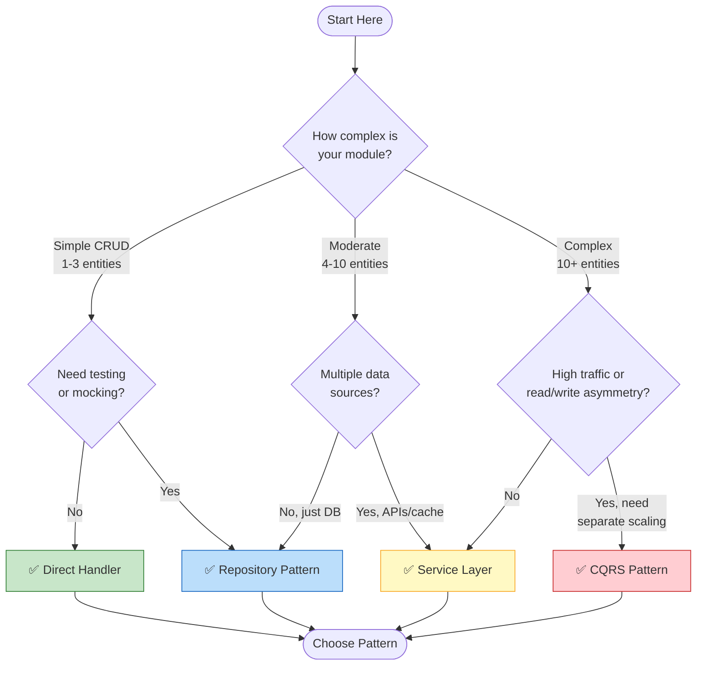
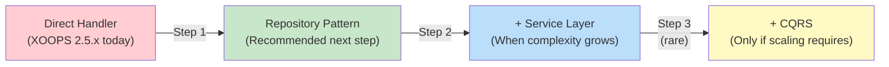

<span class="version-badge version-25x">2.5.x ✅</span> <span class="version-badge version-40x">4.0.x ✅</span>

> **Koji uzorak trebam koristiti?** Ovo stablo odlučivanja pomaže vam pri odabiru između izravnih rukovatelja, uzorka spremišta, sloja usluge i CQRS-a.

---

## Stablo brzog odlučivanja



---

## Usporedba uzoraka

| Kriteriji | Izravni voditelj | Spremište | Sloj usluge | CQRS |
|----------|--------------|------------|--------------|------|
| **Složenost** | ⭐ | ⭐⭐ | ⭐⭐⭐ | ⭐⭐⭐⭐⭐ |
| **Provjerljivost** | ❌ Teško | ✅ Dobro | ✅ Sjajno | ✅ Sjajno |
| **Fleksibilnost** | ❌ Nisko | ✅ Srednje | ✅ Visoko | ✅ Vrlo visoko |
| **XOOPS 2.5.x** | ✅ Izvorni | ✅ Radi | ✅ Radi | ⚠️ Složeno |
| **XOOPS 4.0** | ⚠️ Zastarjelo | ✅ Preporučeno | ✅ Preporučeno | ✅ Za mjerilo |
| **Veličina tima** | 1 razvijač | 1-3 programera | 2-5 programera | 5+ programera |
| **Održavanje** | ❌ Više | ✅ Umjereno | ✅ Niži | ⚠️ Zahtijeva stručnost |

---

## Kada koristiti svaki uzorak

### ✅ Izravni rukovatelj (`XoopsPersistableObjectHandler`)

**Najbolje za:** Jednostavno modules, brze prototipove, učenje XOOPS

```php
// Simple and direct - good for small modules
$handler = xoops_getModuleHandler('article', 'news');
$articles = $handler->getObjects(new Criteria('status', 1));
```

**Odaberite ovo kada:**
- Izrada jednostavnog modula s 1-3 tablice baze podataka
- Izrada brzog prototipa
- Vi ste jedini programer i ne trebaju vam testovi
- modul neće značajno rasti

**Ograničenja:**
- Teško za jedinično testiranje (globalna ovisnost)
- Čvrsto povezivanje sa slojem baze podataka XOOPS
- Poslovna logika ima tendenciju curenja u kontrolere

---

### ✅ Uzorak spremišta

**Najbolje za:** većinu modules, timova koji žele mogućnost testiranja

```php
// Abstraction allows mocking for tests
interface ArticleRepositoryInterface {
    public function findPublished(): array;
    public function save(Article $article): void;
}

class XoopsArticleRepository implements ArticleRepositoryInterface {
    private $handler;

    public function __construct() {
        $this->handler = xoops_getModuleHandler('article', 'news');
    }

    public function findPublished(): array {
        return $this->handler->getObjects(new Criteria('status', 1));
    }
}
```

**Odaberite ovo kada:**
- Želite pisati jedinične testove
- Možete kasnije promijeniti izvore podataka (DB → API)
- Rad s 2+ programera
- Zgrada modules za distribuciju

**Put nadogradnje:** Ovo je preporučeni uzorak za pripremu XOOPS 4.0.

---

### ✅ Sloj usluge

**Najbolje za:** Module sa složenom poslovnom logikom

```php
// Service coordinates multiple repositories and contains business rules
class ArticlePublicationService {
    public function __construct(
        private ArticleRepositoryInterface $articles,
        private NotificationServiceInterface $notifications,
        private CacheInterface $cache
    ) {}

    public function publish(int $articleId): void {
        $article = $this->articles->find($articleId);
        $article->setStatus('published');
        $article->setPublishedAt(new DateTime());

        $this->articles->save($article);
        $this->notifications->notifySubscribers($article);
        $this->cache->invalidate("article:{$articleId}");
    }
}
```

**Odaberite ovo kada:**
- Operacije obuhvaćaju više izvora podataka
- Poslovna pravila su složena
- Trebate upravljanje transakcijama
- Više dijelova aplikacije radi istu stvar

**Put nadogradnje:** Kombinirajte sa spremištem za robusnu arhitekturu.

---

### ⚠️ CQRS (Segregacija odgovornosti za naredbeni upit)

**Najbolje za:** modules visoke skale s asimetrijom čitanja/pisanja

```php
// Commands modify state
class PublishArticleCommand {
    public function __construct(
        public readonly int $articleId,
        public readonly int $publisherId
    ) {}
}

// Queries read state (can use denormalized read models)
class GetPublishedArticlesQuery {
    public function __construct(
        public readonly int $limit = 10
    ) {}
}
```

**Odaberite ovo kada:**
- Čita znatno više od pisanja (100:1 ili više)
- Trebate drugačije skaliranje za čitanje u odnosu na pisanje
- Složeni zahtjevi za izvješćivanje/analitiku
- Izvor događaja koristio bi vašoj domeni

**Upozorenje:** CQRS dodaje značajnu složenost. Većina XOOPS modules to ne treba.

---

## Preporučeni put nadogradnje



### Korak 1: Zamotajte rukovatelje u repozitorije (2-4 sata)

1. Napravite sučelje za svoje potrebe pristupa podacima
2. Implementirajte ga koristeći postojeći rukovatelj
3. Ubacite repozitorij umjesto izravnog pozivanja `xoops_getModuleHandler()`

### Korak 2: Dodajte sloj usluge po potrebi (1-2 dana)

1. Kada se poslovna logika pojavi u kontrolerima, ekstrahirajte u uslugu
2. Usluga koristi repozitorije, a ne izravno rukovatelje
3. Kontrolori postaju tanki (ruta → usluga → odgovor)

### Korak 3: Razmotrite CQRS samo ako (rijetko)1. Imate milijune čitanja dnevno
2. Modeli čitanja i pisanja značajno se razlikuju
3. Trebate izvor događaja za revizijske tragove
4. Imate tim s iskustvom s CQRS-om

---

## Brza referentna kartica

| Pitanje | Odgovor |
|----------|--------|
| **"Samo trebam spremiti/učitati podatke"** | Izravni voditelj |
| **"Želim pisati testove"** | Uzorak spremišta |
| **"Imam složena poslovna pravila"** | Sloj usluge |
| **"Moram zasebno mjeriti čitanja"** | CQRS |
| **"Pripremam se za XOOPS 4.0"** | Repozitorij + sloj usluge |

---

## Povezana dokumentacija

- [Vodič za uzorke spremišta](Patterns/Repository-Pattern.md)
- [Vodič za uzorak sloja usluge](Patterns/Service-Layer-Pattern.md)
- [Vodič za uzorke CQRS](../07-XOOPS-4.0/Implementation-Guides/CQRS-Pattern-Guide.md) *(napredno)*
- [Ugovor o hibridnom načinu](../07-XOOPS-4.0/Specifications/Hybrid-Mode-Contract.md)

---

#patterns #data-access #decision-tree #best-practices #xoops
