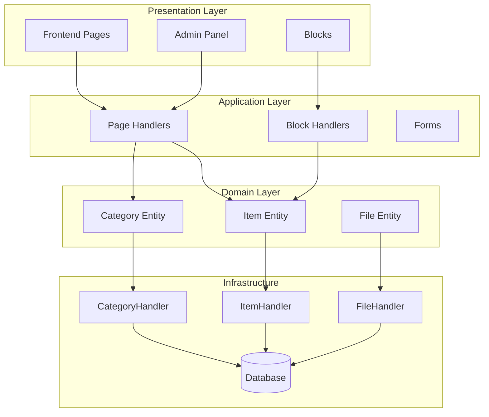
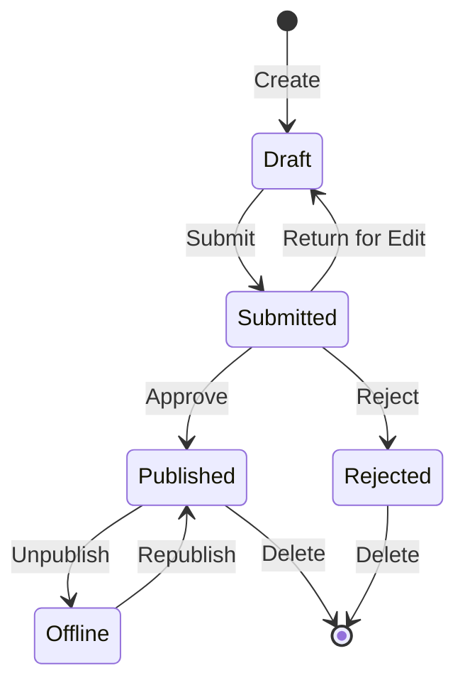

## Pregled

Ovaj dokument pruža tehničku analizu arhitekture modula Publisher, obrazaca i pojedinosti o implementaciji. Koristite ovo kao referencu za razumijevanje strukture XOOPS modula proizvodne kvalitete.

## Pregled arhitekture



## Struktura imenika

```
publisher/
├── admin/
│   ├── index.php           # Admin dashboard
│   ├── item.php            # Article management
│   ├── category.php        # Category management
│   ├── permission.php      # Permissions
│   ├── file.php            # File manager
│   └── menu.php            # Admin menu
├── assets/
│   ├── css/
│   ├── js/
│   └── images/
├── class/
│   ├── Category.php        # Category entity
│   ├── CategoryHandler.php # Category data access
│   ├── Item.php            # Article entity
│   ├── ItemHandler.php     # Article data access
│   ├── File.php            # File attachment
│   ├── FileHandler.php     # File data access
│   ├── Form/               # Form classes
│   ├── Common/             # Utilities
│   └── Helper.php          # Module helper
├── include/
│   ├── common.php          # Initialization
│   ├── functions.php       # Utility functions
│   ├── oninstall.php       # Install hooks
│   ├── onupdate.php        # Update hooks
│   └── search.php          # Search integration
├── language/
├── templates/
├── sql/
└── xoops_version.php
```

## Analiza entiteta

### Stavka (članak) Entitet

```php
class Item extends \XoopsObject
{
    // Fields
    public function initVar(): void
    {
        $this->initVar('itemid', XOBJ_DTYPE_INT, null, false);
        $this->initVar('categoryid', XOBJ_DTYPE_INT, 0, false);
        $this->initVar('title', XOBJ_DTYPE_TXTBOX, '', true);
        $this->initVar('subtitle', XOBJ_DTYPE_TXTBOX, '');
        $this->initVar('summary', XOBJ_DTYPE_TXTAREA, '');
        $this->initVar('body', XOBJ_DTYPE_TXTAREA, '', true);
        $this->initVar('uid', XOBJ_DTYPE_INT, 0);
        $this->initVar('status', XOBJ_DTYPE_INT, 0);
        $this->initVar('datesub', XOBJ_DTYPE_INT, time());
        // ... more fields
    }

    // Business methods
    public function isPublished(): bool
    {
        return $this->getVar('status') == _PUBLISHER_STATUS_PUBLISHED;
    }

    public function canEdit(int $userId): bool
    {
        return $this->getVar('uid') == $userId
            || $this->isAdmin($userId);
    }
}
```

### Uzorak rukovatelja

```php
class ItemHandler extends \XoopsPersistableObjectHandler
{
    public function __construct(\XoopsDatabase $db)
    {
        parent::__construct(
            $db,
            'publisher_items',
            Item::class,
            'itemid',
            'title'
        );
    }

    public function getPublishedItems(int $limit = 10): array
    {
        $criteria = new \CriteriaCompo();
        $criteria->add(new \Criteria('status', _PUBLISHER_STATUS_PUBLISHED));
        $criteria->setSort('datesub');
        $criteria->setOrder('DESC');
        $criteria->setLimit($limit);

        return $this->getObjects($criteria);
    }
}
```

## Sustav dopuštenja

### Vrste dopuštenja

| Dopuštenje | Opis |
|------------|-------------|
| `publisher_view` | Pregledajte kategoriju/članke |
| `publisher_submit` | Pošalji nove članke |
| `publisher_approve` | Automatsko odobravanje podnesaka |
| `publisher_moderate` | Pregledajte članke na čekanju |
| `publisher_global` | Globalne dozvole modula |

### Provjera dopuštenja

```php
class PermissionHandler
{
    public function isGranted(string $permission, int $categoryId): bool
    {
        $userId = $GLOBALS['xoopsUser']?->uid() ?? 0;
        $groups = $this->getUserGroups($userId);

        return $this->grouppermHandler->checkRight(
            $permission,
            $categoryId,
            $groups,
            $this->helper->getModule()->mid()
        );
    }
}
```

## Stanja tijeka rada



## Struktura predloška

### predlošci sučelja

| predložak | Svrha |
|----------|---------|
| `publisher_index.tpl` | Početna stranica modula |
| `publisher_item.tpl` | Pojedinačni članak |
| `publisher_category.tpl` | Popis kategorija |
| `publisher_submit.tpl` | Obrazac za prijavu |
| `publisher_search.tpl` | Rezultati pretraživanja |

### predlošci blokova

| predložak | Svrha |
|----------|---------|
| `publisher_block_latest.tpl` | Nedavni članci |
| `publisher_block_spotlight.tpl` | Istaknuti članak |
| `publisher_block_category.tpl` | Izbornik kategorije |

## Korišteni ključni obrasci

1. **Uzorak rukovatelja** - Enkapsulacija pristupa podacima
2. **Objekt vrijednosti** - Konstante statusa
3. **Metoda predloška** - Generiranje obrazaca
4. **Strategija** - Različiti načini prikaza
5. **Promatrač** - Obavijesti o događajima

## Lekcije za razvoj modula

1. Koristite XoopsPersistableObjectHandler za CRUD
2. Implementirajte granularna dopuštenja
3. Odvojite prezentaciju od logike
4. Koristite kriterije za upite
5. Podržava više statusa sadržaja
6. Integrirajte sa sustavom obavijesti XOOPS

## Povezana dokumentacija

- Izrada članaka - Upravljanje člancima
- Upravljanje kategorijama - Sustav kategorija
- Postavljanje dopuštenja - Konfiguracija dopuštenja
- Vodič za razvojne programere/Hooks-and-Events - Točke proširenja
