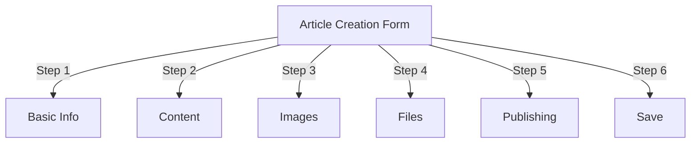
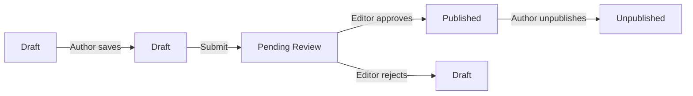
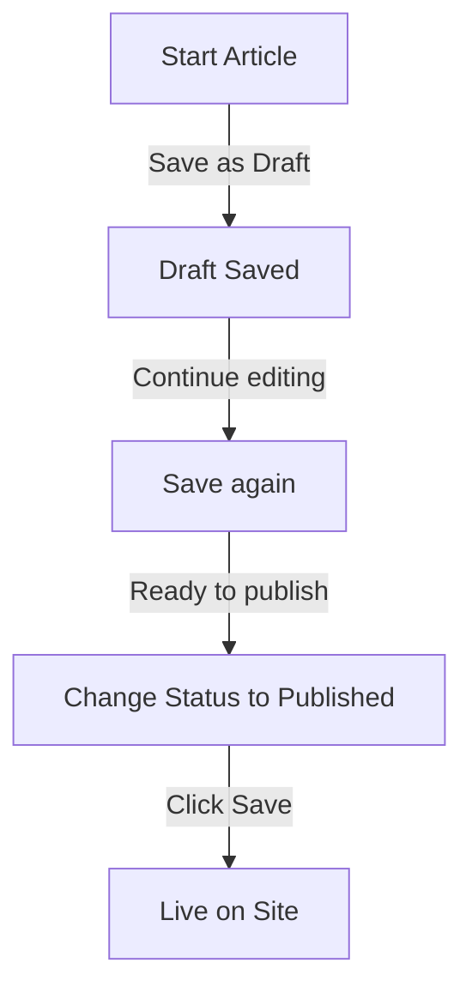

# Stvaranje članaka u Publisheru

> Vodič korak po korak za stvaranje, uređivanje, oblikovanje i objavljivanje članaka u modulu Publisher.

---

## Pristupite upravljanju člancima

### Navigacija administrativne ploče

```
Admin Panel
└── Modules
    └── Publisher
        └── Articles
            ├── Create New
            ├── Edit
            ├── Delete
            └── Publish
```

### Najbrži put

1. Prijavite se kao **Administrator**
2. Kliknite **moduli** na admin traci
3. Pronađite **Izdavač**
4. Kliknite vezu **Administrator**
5. Kliknite **Članci** u lijevom izborniku
6. Pritisnite gumb **Dodaj članak**

---

## Obrazac za izradu članka

### Osnovne informacije

Prilikom izrade novog članka ispunite sljedeće odjeljke:



---

## Korak 1: Osnovne informacije

### Obavezna polja

#### Naslov članka

```
Field: Title
Type: Text input (required)
Max length: 255 characters
Example: "Top 5 Tips for Better Photography"
```

**Smjernice:**
- Opisno i konkretno
- Uključite ključne riječi za SEO
- Izbjegavajte SVE VELIKA SLOVA
- Držite ispod 60 znakova za najbolji prikaz

#### Odaberite kategoriju

```
Field: Category
Type: Dropdown (required)
Options: List of created categories
Example: Photography > Tutorials
```

**Savjeti:**
- Dostupne nadređene i potkategorije
- Odaberite najrelevantniju kategoriju
- Samo jedna kategorija po članku
- Može se promijeniti kasnije

#### Podnaslov članka (nije obavezno)

```
Field: Subtitle
Type: Text input (optional)
Max length: 255 characters
Example: "Learn photography fundamentals in 5 easy steps"
```

**Koristite za:**
- Naslov sažetka
- Teaser tekst
- Prošireni naslov

### Opis članka

#### Kratki opis

```
Field: Short Description
Type: Textarea (optional)
Max length: 500 characters
```

**Svrha:**
- Tekst za pregled članka
- Prikazuje se u popisu kategorija
- Koristi se u rezultatima pretraživanja
- Meta opis za SEO

**Primjer:**
```
"Discover essential photography techniques that will transform your photos
from ordinary to extraordinary. This comprehensive guide covers composition,
lighting, and exposure settings."
```

#### Cijeli sadržaj

```
Field: Article Body
Type: WYSIWYG Editor (required)
Max length: Unlimited
Format: HTML
```

Područje glavnog sadržaja članka s obogaćenim uređivanjem teksta.

---

## Korak 2: Oblikovanje sadržaja

### Korištenje WYSIWYG uređivača

#### Oblikovanje teksta

```
Bold:           Ctrl+B or click [B] button
Italic:         Ctrl+I or click [I] button
Underline:      Ctrl+U or click [U] button
Strikethrough:  Alt+Shift+D or click [S] button
Subscript:      Ctrl+, (comma)
Superscript:    Ctrl+. (period)
```

#### Struktura naslova

Stvorite odgovarajuću hijerarhiju dokumenata:

```html
<h1>Article Title</h1>      <!-- Use once at top -->
<h2>Main Section</h2>        <!-- For major sections -->
<h3>Subsection</h3>          <!-- For subtopics -->
<h4>Sub-subsection</h4>      <!-- For details -->
```

**U uređivaču:**
- Kliknite padajući izbornik **Format**
- Odaberite razinu naslova (H1-H6)
- Upišite svoj naslov

#### Popisi

**Neuređeni popis (Bullets):**

```markdown
• Point one
• Point two
• Point three
```

Koraci u uređivaču:
1. Pritisnite gumb [≡] Bullet list
2. Upišite svaku točku
3. Pritisnite Enter za sljedeću stavku
4. Dvaput pritisnite Backspace za završetak popisa

**Uređeni popis (numerirani):**

```markdown
1. First step
2. Second step
3. Third step
```

Koraci u uređivaču:
1. Pritisnite gumb [1.] Numerirani popis
2. Upišite svaku stavku
3. Pritisnite Enter za sljedeće
4. Dvaput pritisnite Backspace za kraj

**Ugniježđene liste:**

```markdown
1. Main point
   a. Sub-point
   b. Sub-point
2. Next point
```

koraci:
1. Napravite prvi popis
2. Pritisnite Tab za uvlačenje
3. Stvorite ugniježđene stavke
4. Pritisnite Shift+Tab za uvlačenje

#### Veze

**Dodaj hipervezu:**

1. Odaberite tekst za povezivanje
2. Kliknite gumb **[🔗] Link**
3. Unesite URL: `https://example.com`
4. Izborno: Dodajte naslov/cilj
5. Kliknite **Umetni vezu**

**Ukloni vezu:**

1. Kliknite unutar povezanog teksta
2. Kliknite gumb **[🔗] Ukloni vezu**

#### Kod i citati

**Citat:**

```
"This is an important quote from an expert"
- Attribution
```

koraci:
1. Upišite tekst citata
2. Pritisnite gumb **[❝] Blockquote**
3. Tekst je uvučen i stiliziran

**Blok koda:**

```python
def hello_world():
    print("Hello, World!")
```

koraci:
1. Kliknite **Format → Kod**
2. Zalijepite kod
3. Odaberite language (neobavezno)
4. Prikaz koda s istaknutom sintaksom

---

## Korak 3: Dodavanje slika

### Istaknuta slika (glavna slika)

```
Field: Featured Image / Main Image
Type: Image upload
Format: JPG, PNG, GIF, WebP
Max size: 5 MB
Recommended: 600x400 px
```

**Za prijenos:**

1. Kliknite gumb **Učitaj sliku**
2. Odaberite sliku s računala
3. Izrežite/promijenite veličinu ako je potrebno
4. Kliknite **Upotrijebi ovu sliku**

**Položaj slike:**
- Prikazuje se na vrhu članka
- Koristi se u popisima kategorija
- Prikazano u arhivi
- Koristi se za društveno dijeljenje

### Umetnute slike

Umetnite slike u tekst članka:1. Postavite pokazivač u uređivaču na mjesto gdje slika treba ići
2. Kliknite gumb **[🖼️] Slika** na alatnoj traci
3. Odaberite opciju prijenosa:
   - Učitajte novu sliku
   - Odaberite iz galerije
   - Unesite sliku URL
4. Konfigurirajte:
   
   ```
   Image Size:
   - Width: 300-600 px
   - Height: Auto (maintains ratio)
   - Alignment: Left/Center/Right
   ```
5. Kliknite **Umetni sliku**

**Prelomi tekst oko slike:**

U editoru nakon umetanja:

```html
<!-- Image floats left, text wraps around -->

```

### Galerija slika

Napravite galeriju s više slika:

1. Kliknite gumb **Galerija** (ako je dostupan)
2. Učitajte više slika:
   - Jedan klik: Dodaj jedan
   - Povucite i ispustite: dodajte više
3. Rasporedite redoslijed povlačenjem
4. Postavite naslove za svaku sliku
5. Kliknite **Stvori galeriju**

---

## Korak 4: Prilaganje datoteka

### Dodajte privitke datoteka

```
Field: File Attachments
Type: File upload (multiple allowed)
Supported: PDF, DOC, XLS, ZIP, etc.
Max per file: 10 MB
Max per article: 5 files
```

**Za prilaganje:**

1. Pritisnite gumb **Dodaj datoteku**
2. Odaberite datoteku s računala
3. Izborno: Dodajte opis datoteke
4. Kliknite **Priloži datoteku**
5. Ponovite za više datoteka

**Primjeri datoteka:**
- PDF vodiči
- Excel proračunske tablice
- Word dokumenti
- ZIP arhive
- Izvorni kod

### Upravljanje priloženim datotekama

**Uredi datoteku:**

1. Pritisnite naziv datoteke
2. Uredite opis
3. Kliknite **Spremi**

**Izbriši datoteku:**

1. Pronađite datoteku na popisu
2. Pritisnite ikonu **[×] Delete**
3. Potvrdite brisanje

---

## Korak 5: Objavljivanje i status

### Status članka

```
Field: Status
Type: Dropdown
Options:
  - Draft: Not published, only author sees
  - Pending: Waiting for approval
  - Published: Live on site
  - Archived: Old content
  - Unpublished: Was published, now hidden
```

**Tijek rada statusa:**



### Opcije objavljivanja

#### Objavi odmah

```
Status: Published
Start Date: Today (auto-filled)
End Date: (leave blank for no expiration)
```

#### Raspored za kasnije

```
Status: Scheduled
Start Date: Future date/time
Example: February 15, 2024 at 9:00 AM
```

Članak će se automatski objaviti u određeno vrijeme.

#### Postavi istek

```
Enable Expiration: Yes
Expiration Date: Future date
Action: Archive/Hide/Delete
Example: April 1, 2024 (article auto-archives)
```

### Mogućnosti vidljivosti

```yaml
Show Article:
  - Display on front page: Yes/No
  - Show in category: Yes/No
  - Include in search: Yes/No
  - Include in recent articles: Yes/No

Featured Article:
  - Mark as featured: Yes/No
  - Featured section position: (number)
```

---

## Korak 6: SEO i metapodaci

### SEO postavke

```
Field: SEO Settings (Expand section)
```

#### Meta Opis

```
Field: Meta Description
Type: Text (160 characters recommended)
Used by: Search engines, social media

Example:
"Learn photography fundamentals in 5 easy steps.
Discover composition, lighting, and exposure techniques."
```

#### Meta ključne riječi

```
Field: Meta Keywords
Type: Comma-separated list
Max: 5-10 keywords

Example: Photography, Tutorial, Composition, Lighting, Exposure
```

#### URL Puž

```
Field: URL Slug (auto-generated from title)
Type: Text
Format: lowercase, hyphens, no spaces

Auto: "top-5-tips-for-better-photography"
Edit: Change before publishing
```

#### Oznake otvorenog grafikona

Automatski generirano iz informacija o članku:
- Naslov
- Opis
- Istaknuta slika
- Članak URL
- Datum objave

Koriste ga Facebook, LinkedIn, WhatsApp itd.

---

## Korak 7: Komentari i interakcija

### Postavke komentara

```yaml
Allow Comments:
  - Enable: Yes/No
  - Default: Inherit from preferences
  - Override: Specific to this article

Moderate Comments:
  - Require approval: Yes/No
  - Default: Inherit from preferences
```

### Postavke ocjenjivanja

```yaml
Allow Ratings:
  - Enable: Yes/No
  - Scale: 5 stars (default)
  - Show average: Yes/No
  - Show count: Yes/No
```

---

## Korak 8: Napredne opcije

### Autor i autor

```
Field: Author
Type: Dropdown
Default: Current user
Options: All users with author permission

Display:
  - Show author name: Yes/No
  - Show author bio: Yes/No
  - Show author avatar: Yes/No
```

### Uredi zaključavanje

```
Field: Edit Lock
Purpose: Prevent accidental changes

Lock Article:
  - Locked: Yes/No
  - Lock reason: "Final version"
  - Unlock date: (optional)
```

### Povijest revizija

Automatski spremljene verzije članka:

```
View Revisions:
  - Click "Revision History"
  - Shows all saved versions
  - Compare versions
  - Restore previous version
```

---

## Spremanje i objavljivanje

### Spremi tijek rada



### Spremi članak

**Automatsko spremanje:**
- Pokreće se svakih 60 sekundi
- Automatski sprema kao nacrt
- Prikazuje "Zadnji put spremljeno: prije 2 minute"

**Ručno spremanje:**
- Kliknite **Spremi i nastavi** za nastavak uređivanja
- Kliknite **Spremi i pogledaj** da vidite objavljenu verziju
- Kliknite **Spremi** za spremanje i zatvaranje

### Objavite članak

1. Postavite **Status**: Objavljeno
2. Postavite **Datum početka**: Sada (ili budući datum)
3. Kliknite **Spremi** ili **Objavi**
4. Pojavljuje se poruka potvrde
5. Članak je objavljen (ili zakazan)

---

## Uređivanje postojećih članaka

### Pristup uređivaču članaka

1. Idite na **Administrator → Izdavač → Članci**
2. Pronađite članak na popisu
3. Pritisnite ikonu/gumb **Uredi**
4. Napravite promjene
5. Kliknite **Spremi**

### Skupno uređivanje

Uredite više članaka odjednom:

```
1. Go to Articles list
2. Select articles (checkboxes)
3. Choose "Bulk Edit" from dropdown
4. Change selected field
5. Click "Update All"

Available for:
  - Status
  - Category
  - Featured (Yes/No)
  - Author
```

### Pregled članka

Prije objave:

1. Pritisnite gumb **Pregled**
2. Pogledajte kako će čitatelji vidjeti
3. Provjerite formatiranje
4. Testirajte veze
5. Vratite se na editor za podešavanje

---

## Upravljanje artiklima

### Prikaži sve članke

**Prikaz popisa članaka:**

```
Admin → Publisher → Articles

Columns:
  - Title
  - Category
  - Author
  - Status
  - Created date
  - Modified date
  - Actions (Edit, Delete, Preview)

Sorting:
  - By title (A-Z)
  - By date (newest/oldest)
  - By status (Published/Draft)
  - By category
```
### Filtrirajte članke

```
Filter Options:
  - By category
  - By status
  - By author
  - By date range
  - Search by title

Example: Show all "Draft" articles by "John" in "News" category
```

### Izbriši članak

**Meko brisanje (preporučeno):**

1. Promjena **Status**: Neobjavljeno
2. Kliknite **Spremi**
3. Članak skriven, ali ne i izbrisan
4. Može se kasnije obnoviti

**Teško brisanje:**

1. Odaberite članak na popisu
2. Pritisnite gumb **Izbriši**
3. Potvrdite brisanje
4. Članak trajno uklonjen

---

## Najbolji primjeri iz prakse za sadržaj

### Pisanje kvalitetnih članaka

```
Structure:
  ✓ Compelling title
  ✓ Clear subtitle/description
  ✓ Engaging opening paragraph
  ✓ Logical sections with headers
  ✓ Supporting visuals
  ✓ Conclusion/summary
  ✓ Call-to-action

Length:
  - Blog posts: 500-2000 words
  - News: 300-800 words
  - Guides: 2000-5000 words
  - Minimum: 300 words
```

### SEO optimizacija

```
Title Optimization:
  ✓ Include primary keyword
  ✓ Keep under 60 characters
  ✓ Put keyword near beginning
  ✓ Be descriptive and specific

Content Optimization:
  ✓ Use headings (H1, H2, H3)
  ✓ Include keyword in heading
  ✓ Use bold for important terms
  ✓ Add descriptive links
  ✓ Include images with alt text

Meta Description:
  ✓ Include primary keyword
  ✓ 155-160 characters
  ✓ Action-oriented
  ✓ Unique per article
```

### Savjeti za oblikovanje

```
Readability:
  ✓ Short paragraphs (2-4 sentences)
  ✓ Bullet points for lists
  ✓ Subheadings every 300 words
  ✓ Generous whitespace
  ✓ Line breaks between sections

Visual Appeal:
  ✓ Featured image at top
  ✓ Inline images in content
  ✓ Alt text on all images
  ✓ Code blocks for technical
  ✓ Blockquotes for emphasis
```

---

## Tipkovnički prečaci

### Prečaci uređivača

```
Bold:               Ctrl+B
Italic:             Ctrl+I
Underline:          Ctrl+U
Link:               Ctrl+K
Save Draft:         Ctrl+S
```

### Tekstualni prečaci

```
-- →  (dash to em dash)
... → … (three dots to ellipsis)
(c) → © (copyright)
(r) → ® (registered)
(tm) → ™ (trademark)
```

---

## Uobičajeni zadaci

### Kopiraj članak

1. Otvorite članak
2. Pritisnite gumb **Dupliciraj** ili **Kloniraj**
3. Članak kopiran kao nacrt
4. Uredite naslov i sadržaj
5. Objavite

### Članak rasporeda

1. Napravite članak
2. Postavite **Datum početka**: Budući datum/vrijeme
3. Postavite **Status**: Objavljeno
4. Kliknite **Spremi**
5. Članak se objavljuje automatski

### Skupno objavljivanje

1. Stvorite članke kao skice
2. Postavite datume objave
3. Članci se automatski objavljuju u zakazano vrijeme
4. Monitor iz pogleda "Zakazano".

### Krećite se između kategorija

1. Uredite članak
2. Promijenite padajući izbornik **Kategorija**
3. Kliknite **Spremi**
4. Članak se pojavljuje u novoj kategoriji

---

## Rješavanje problema

### Problem: Ne mogu spremiti članak

**Rješenje:**
```
1. Check form for required fields
2. Verify category is selected
3. Check PHP memory limit
4. Try saving as draft first
5. Clear browser cache
```

### Problem: Slike se ne prikazuju

**Rješenje:**
```
1. Verify image upload succeeded
2. Check image file format (JPG, PNG)
3. Verify image path in database
4. Check upload directory permissions
5. Try re-uploading image
```

### Problem: alatna traka uređivača se ne prikazuje

**Rješenje:**
```
1. Clear browser cache
2. Try different browser
3. Disable browser extensions
4. Check JavaScript console for errors
5. Verify editor plugin installed
```

### Problem: Članak se ne objavljuje

**Rješenje:**
```
1. Verify Status = "Published"
2. Check Start Date is today or earlier
3. Verify permissions allow publishing
4. Check category is published
5. Clear module cache
```

---

## Povezani vodiči

- Vodič za konfiguraciju
- Upravljanje kategorijama
- Postavljanje dopuštenja
- Prilagođeni predlošci

---

## Sljedeći koraci

- Napravite svoj prvi članak
- Postavite kategorije
- Konfigurirajte dopuštenja
- Pregledajte prilagodbu predloška

---

#izdavač #članci #sadržaj #stvaranje #oblikovanje #uređivanje #xoops
