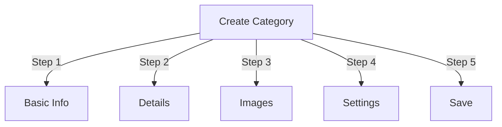

# Upravljanje kategorijama u Publisheru

> Potpuni vodič za stvaranje, organiziranje hijerarhija i upravljanje kategorijama u modulu Publisher.

---

## Osnove kategorije

### Što su kategorije?

Kategorije organiziraju članke u logičke grupe:

```
Example Structure:

  News (Main Category)
    ├── Technology
    ├── Sports
    └── Entertainment

  Tutorials (Main Category)
    ├── Photography
    │   ├── Basics
    │   └── Advanced
    └── Writing
        └── Blogging
```

### Prednosti dobre strukture kategorija

```
✓ Better user navigation
✓ Organized content
✓ Improved SEO
✓ Easier content management
✓ Better editorial workflow
```

---

## Pristup Upravljanju kategorijama

### Navigacija administrativne ploče

```
Admin Panel
└── Modules
    └── Publisher
        └── Categories
            ├── Create New
            ├── Edit
            ├── Delete
            ├── Permissions
            └── Organize
```

### Brzi pristup

1. Prijavite se kao **Administrator**
2. Idite na **Administrator → moduli**
3. Kliknite **Izdavač → Administrator**
4. Kliknite **Kategorije** u lijevom izborniku

---

## Stvaranje kategorija

### Obrazac za stvaranje kategorije



### Korak 1: Osnovne informacije

#### Naziv kategorije

```
Field: Category Name
Type: Text input (required)
Max length: 100 characters
Uniqueness: Should be unique
Example: "Photography"
```

**Smjernice:**
- Opisno i dosljedno u jednini ili množini
- Pravilno velikim slovima
- Izbjegavajte posebne znakove
- Budite razumno kratki

#### Opis kategorije

```
Field: Description
Type: Textarea (optional)
Max length: 500 characters
Used in: Category listing pages, category blocks
```

**Svrha:**
- Objašnjava sadržaj kategorije
- Pojavljuje se iznad članaka kategorije
- Pomaže korisnicima da razumiju opseg
- Koristi se za SEO meta opis

**Primjer:**
```
"Photography tips, tutorials, and inspiration for
all skill levels. From composition basics to advanced
lighting techniques, master your craft."
```

### Korak 2: Nadređena kategorija

#### Stvorite hijerarhiju

```
Field: Parent Category
Type: Dropdown
Options: None (root), or existing categories
```

**Primjeri hijerarhije:**

```
Flat Structure:
  News
  Tutorials
  Reviews

Nested Structure:
  News
    Technology
    Business
    Sports
  Tutorials
    Photography
      Basics
      Advanced
    Writing
```

**Stvori potkategoriju:**

1. Kliknite padajući izbornik **Nadređena kategorija**
2. Odaberite nadređenu (npr. "Vijesti")
3. Ispunite naziv kategorije
4. Spremiti
5. Nova kategorija pojavljuje se kao dijete

### Korak 3: Slika kategorije

#### Prenesi sliku kategorije

```
Field: Category Image
Type: Image upload (optional)
Format: JPG, PNG, GIF, WebP
Max size: 5 MB
Recommended: 300x200 px (or your theme size)
```

**Za prijenos:**

1. Kliknite gumb **Učitaj sliku**
2. Odaberite sliku s računala
3. Izrežite/promijenite veličinu ako je potrebno
4. Kliknite **Upotrijebi ovu sliku**

**Gdje se koristi:**
- Stranica s popisom kategorija
- Zaglavlje bloka kategorije
- Breadcrumb (neki themes)
- Dijeljenje na društvenim mrežama

### Korak 4: Postavke kategorije

#### Postavke zaslona

```yaml
Status:
  - Enabled: Yes/No
  - Hidden: Yes/No (hidden from menus, still accessible)

Display Options:
  - Show description: Yes/No
  - Show image: Yes/No
  - Show article count: Yes/No
  - Show subcategories: Yes/No

Layout:
  - Items per page: 10-50
  - Display order: Date/Title/Author
  - Display direction: Ascending/Descending
```

#### dozvole za kategoriju

```yaml
Who Can View:
  - Anonymous: Yes/No
  - Registered: Yes/No
  - Specific groups: Configure per group

Who Can Submit:
  - Registered: Yes/No
  - Specific groups: Configure per group
  - Author must have: "submit articles" permission
```

### Korak 5: SEO postavke

#### Meta oznake

```
Field: Meta Description
Type: Text (160 characters)
Purpose: Search engine description

Field: Meta Keywords
Type: Comma-separated list
Example: photography, tutorials, tips, techniques
```

#### URL Konfiguracija

```
Field: URL Slug
Type: Text
Auto-generated from category name
Example: "photography" from "Photography"
Can be customized before saving
```

### Spremi kategoriju

1. Ispunite sva potrebna polja:
   - Naziv kategorije ✓
   - Opis (preporučeno)
2. Izborno: Učitajte sliku, postavite SEO
3. Kliknite **Spremi kategoriju**
4. Pojavljuje se poruka potvrde
5. Kategorija je sada dostupna

---

## Hijerarhija kategorija

### Stvorite ugniježđenu strukturu

```
Step-by-step example: Create News → Technology subcategory

1. Go to Categories admin
2. Click "Add Category"
3. Name: "News"
4. Parent: (leave blank - this is root)
5. Save
6. Click "Add Category" again
7. Name: "Technology"
8. Parent: "News" (select from dropdown)
9. Save
```

### Prikaz hijerarhijskog stabla

```
Categories view shows tree structure:

📁 News
  📄 Technology
  📄 Sports
  📄 Entertainment
📁 Tutorials
  📄 Photography
    📄 Basics
    📄 Advanced
  📄 Writing
```

Pritisnite strelice za proširenje da biste prikazali/sakrili potkategorije.

### Reorganizirajte kategorije

#### Premjesti kategoriju

1. Idite na popis kategorija
2. Kliknite **Uredi** na kategoriji
3. Promijenite **Matičnu kategoriju**
4. Kliknite **Spremi**
5. Kategorija premještena na novu poziciju

#### Promjena redoslijeda kategorija

Ako je dostupno, koristite povuci i ispusti:

1. Idite na popis kategorija
2. Pritisnite i povucite kategoriju
3. Spustite se u novi položaj
4. Narudžba se sprema automatski

#### Izbriši kategoriju

**Opcija 1: Soft Delete (Hide)**

1. Uredite kategoriju
2. Postavite **Status**: Onemogućeno
3. Kliknite **Spremi**
4. Kategorija skrivena, ali ne i izbrisana

**Opcija 2: Tvrdo brisanje**

1. Idite na popis kategorija
2. Kliknite **Izbriši** na kategoriji
3. Odaberite akciju za članke:
   
   ```
   ☐ Move articles to parent category
   ☐ Move articles to root (News)
   ☐ Delete all articles in category
   ```
4. Potvrdite brisanje

---

## Operacije kategorija

### Uredi kategoriju

1. Idite na **Administrator → Izdavač → Kategorije**
2. Kliknite **Uredi** na kategoriji
3. Izmijenite polja:
   - Ime
   - Opis
   - Roditeljska kategorija
   - Slika
   - Postavke
4. Kliknite **Spremi**

### Uredi dopuštenja kategorije1. Idite na Kategorije
2. Kliknite **dozvole** na kategoriji (ili kliknite kategoriju, a zatim kliknite Dopuštenja)
3. Konfigurirajte grupe:

```
For each group:
  ☐ View articles in this category
  ☐ Submit articles to this category
  ☐ Edit own articles
  ☐ Edit all articles
  ☐ Approve/Moderate articles
  ☐ Manage category
```

4. Kliknite **Spremi dopuštenja**

### Postavi sliku kategorije

**Učitaj novu sliku:**

1. Uredite kategoriju
2. Kliknite **Promijeni sliku**
3. Učitajte ili odaberite sliku
4. Izrežite/promijenite veličinu
5. Kliknite **Upotrijebi sliku**
6. Kliknite **Spremi kategoriju**

**Ukloni sliku:**

1. Uredite kategoriju
2. Kliknite **Ukloni sliku** (ako je dostupno)
3. Kliknite **Spremi kategoriju**

---

## dozvole za kategoriju

### Matrica dopuštenja

```
                 Anonymous  Registered  Editor  Admin
View category        ✓         ✓         ✓       ✓
Submit article       ✗         ✓         ✓       ✓
Edit own article     ✗         ✓         ✓       ✓
Edit all articles    ✗         ✗         ✓       ✓
Moderate articles    ✗         ✗         ✓       ✓
Manage category      ✗         ✗         ✗       ✓
```

### Postavite dopuštenja na razini kategorije

#### Kontrola pristupa po kategoriji

1. Idite na popis **Kategorije**
2. Odaberite kategoriju
3. Kliknite **dozvole**
4. Za svaku grupu odaberite dopuštenja:

```
Example: News category
  Anonymous:   View only
  Registered:  Submit articles
  Editors:     Approve articles
  Admins:      Full control
```

5. Kliknite **Spremi**

#### Dopuštenja na razini polja

Kontrolirajte koja polja obrasca korisnici mogu vidjeti/uređivati:

```
Example: Limit field visibility for Registered users

Registered users can see/edit:
  ✓ Title
  ✓ Description
  ✓ Content
  ✗ Author (auto-set to current user)
  ✗ Scheduled date (only editors)
  ✗ Featured (only admins)
```

**Konfiguriraj u:**
- dozvole za kategoriju
- Potražite odjeljak "Vidljivost polja".

---

## Najbolji primjeri iz prakse za kategorije

### Struktura kategorije

```
✓ Keep hierarchy 2-3 levels deep
✗ Don't create too many top-level categories
✗ Don't create categories with one article

✓ Use consistent naming (plural or singular)
✗ Don't use vague names ("Stuff", "Other")

✓ Create categories for articles that exist
✗ Don't create empty categories in advance
```

### Smjernice za imenovanje

```
Good names:
  "Photography"
  "Web Development"
  "Travel Tips"
  "Business News"

Avoid:
  "Articles" (too vague)
  "Content" (redundant)
  "News&Updates" (inconsistent)
  "PHOTOGRAPHY STUFF" (formatting)
```

### Organizacijski savjeti

```
By Topic:
  News
    Technology
    Sports
    Entertainment

By Type:
  Tutorials
    Video
    Text
    Interactive

By Audience:
  For Beginners
  For Experts
  Case Studies

Geographic:
  North America
    United States
    Canada
  Europe
```

---

## Blokovi kategorija

### Blok kategorije izdavača

Prikaz popisa kategorija na vašoj web stranici:

1. Idite na **Administrator → Blokovi**
2. Pronađite **Izdavač - Kategorije**
3. Kliknite **Uredi**
4. Konfigurirajte:

```
Block Title: "News Categories"
Show subcategories: Yes/No
Show article count: Yes/No
Height: (pixels or auto)
```

5. Kliknite **Spremi**

### Blok članaka kategorije

Prikaži najnovije članke iz određene kategorije:

1. Idite na **Administrator → Blokovi**
2. Pronađite **Izdavač - Članci kategorije**
3. Kliknite **Uredi**
4. Odaberite:

```
Category: News (or specific category)
Number of articles: 5
Show images: Yes/No
Show description: Yes/No
```

5. Kliknite **Spremi**

---

## Analitika kategorije

### Pregledajte statistiku kategorije

Iz kategorija admin:

```
Each category shows:
  - Total articles: 45
  - Published: 42
  - Draft: 2
  - Pending approval: 1
  - Total views: 5,234
  - Latest article: 2 hours ago
```

### Pregledajte promet kategorije

Ako je analitika omogućena:

1. Pritisnite naziv kategorije
2. Pritisnite karticu **Statistika**
3. Pogled:
   - Pregledi stranice
   - Popularni članci
   - Prometni trendovi
   - Korišteni pojmovi za pretraživanje

---

## predlošci kategorija

### Prilagodite prikaz kategorije

Ako koristite prilagođeni templates, svaka kategorija može nadjačati:

```
publisher_category.tpl
  ├── Category header
  ├── Category description
  ├── Category image
  ├── Article listing
  └── Pagination
```

**Za prilagodbu:**

1. Kopirajte datoteku predloška
2. Izmijenite HTML/CSS
3. Dodijelite kategoriji u admin
4. Kategorija koristi prilagođeni predložak

---

## Uobičajeni zadaci

### Stvorite hijerarhiju vijesti

```
Admin → Publisher → Categories
1. Create "News" (parent)
2. Create "Technology" (parent: News)
3. Create "Sports" (parent: News)
4. Create "Entertainment" (parent: News)
```

### Premještanje članaka između kategorija

1. Idite na **Članci** admin
2. Odaberite članke (potvrdni okviri)
3. Odaberite **"Promijeni kategoriju"** s padajućeg izbornika skupnih radnji
4. Odaberite novu kategoriju
5. Kliknite **Ažuriraj sve**

### Sakrij kategoriju bez brisanja

1. Uredite kategoriju
2. Postavite **Status**: Onemogućeno/Skriveno
3. Spremiti
4. Kategorija nije prikazana u izbornicima (još uvijek dostupna putem URL)

### Stvorite kategoriju za skice

```
Best Practice:

Create "In Review" category
  ├── Purpose: Articles awaiting approval
  ├── Permissions: Hidden from public
  ├── Only admins/editors can see
  ├── Move articles here until approved
  └── Move to "News" when published
```

---

## Uvoz/Izvoz kategorija

### Izvoz kategorija

Ako je dostupno:

1. Idite na **Kategorije** admin
2. Kliknite **Izvezi**
3. Odaberite format: CSV/JSON/XML
4. Preuzmite datoteku
5. Sigurnosna kopija spremljena

### Uvoz kategorija

Ako je dostupno:

1. Pripremite datoteku s kategorijama
2. Idite na **Kategorije** admin
3. Kliknite **Uvezi**
4. Učitajte datoteku
5. Odaberite strategiju ažuriranja:
   - Samo stvaranje novog
   - Ažurirajte postojeće
   - Zamijenite sve
6. Kliknite **Uvezi**

---

## Kategorije rješavanja problema

### Problem: Potkategorije se ne prikazuju

**Rješenje:**
```
1. Verify parent category status is "Enabled"
2. Check permissions allow viewing
3. Verify subcategories have status "Enabled"
4. Clear cache: Admin → Tools → Clear Cache
5. Check theme shows subcategories
```

### Problem: Ne mogu izbrisati kategoriju

**Rješenje:**
```
1. Category must have no articles
2. Move or delete articles first:
   Admin → Articles
   Select articles in category
   Change category to another
3. Then delete empty category
4. Or choose "move articles" option when deleting
```
### Problem: Slika kategorije se ne prikazuje

**Rješenje:**
```
1. Verify image uploaded successfully
2. Check image file format (JPG, PNG)
3. Verify upload directory permissions
4. Check theme displays category images
5. Try re-uploading image
6. Clear browser cache
```

### Problem: Dopuštenja ne stupaju na snagu

**Rješenje:**
```
1. Check group permissions in Category
2. Check global Publisher permissions
3. Check user belongs to configured group
4. Clear session cache
5. Log out and log back in
6. Check permission modules installed
```

---

## Kategorija Kontrolni popis najboljih praksi

Prije postavljanja kategorija:

- [ ] Hijerarhija je duboka 2-3 razine
- [ ] Svaka kategorija ima 5+ članaka
- [ ] Nazivi kategorija su dosljedni
- [ ] dozvole su odgovarajuće
- [ ] Slike kategorija su optimizirane
- [ ] Opisi su dovršeni
- [ ] SEO metapodaci popunjeni
- [ ] URL-ovi su prijateljski nastrojeni
- [ ] Kategorije testirane na front-endu
- [ ] Dokumentacija ažurirana

---

## Povezani vodiči

- Izrada članka
- Upravljanje dozvolama
- Konfiguracija modula
- Vodič za instalaciju

---

## Sljedeći koraci

- Stvorite članke u kategorijama
- Konfigurirajte dopuštenja
- Prilagodite pomoću prilagođenih predložaka

---

#izdavač #kategorije #organizacija #hijerarhija #upravljanje #xoops
