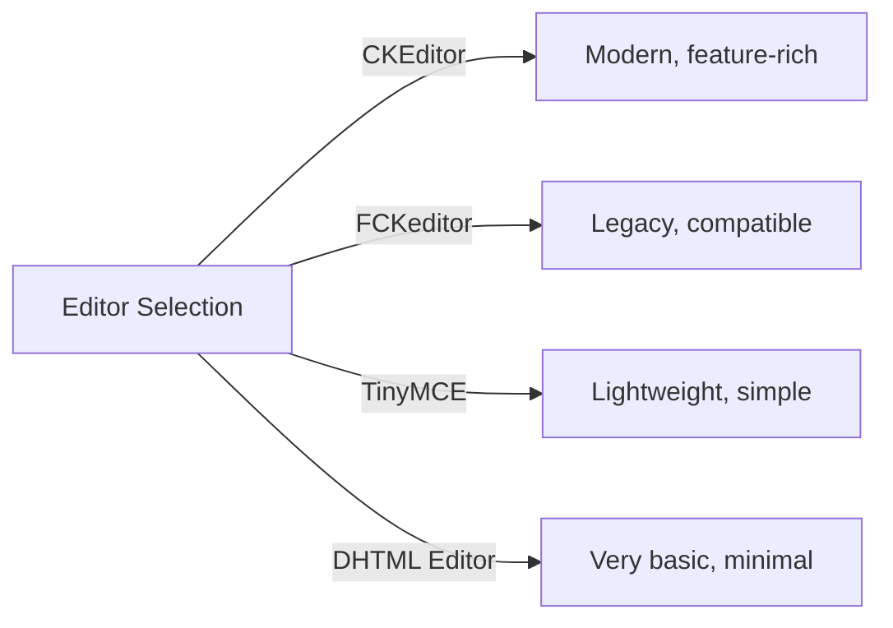
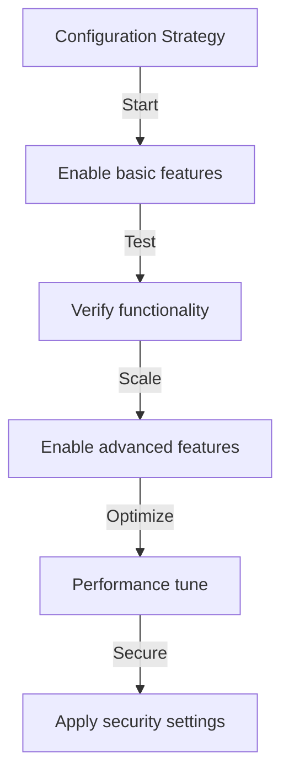

# Osnovna konfiguracija izdavača

> Konfigurirajte postavke, postavke i opće opcije modula Publisher za svoju instalaciju XOOPS.

---

## Pristup konfiguraciji

### Navigacija administrativne ploče

```
XOOPS Admin Panel
└── Modules
    └── Publisher
        ├── Preferences
        ├── Settings
        └── Configuration
```

1. Prijavite se kao **Administrator**
2. Idite na **administratorska ploča → moduli**
3. Pronađite modul **Publisher**
4. Kliknite vezu **Preferences** ili **Administrator**

---

## Opće postavke

### Konfiguracija pristupa

```
Admin Panel → Modules → Publisher
```

Kliknite **ikonu zupčanika** ili **Postavke** za ove opcije:

#### Opcije prikaza

| Postavka | Mogućnosti | Zadano | Opis |
|---------|---------|---------|-------------|
| **Stavki po stranici** | 5-50 | 10 | Članci prikazani u popisima |
| **Prikaži put kroz web stranicu** | Da/Ne | Da | Prikaz navigacijske staze |
| **Koristite straničenje** | Da/Ne | Da | Paginiraj dugačke popise |
| **Prikaži datum** | Da/Ne | Da | Prikaz datuma članka |
| **Prikaži kategoriju** | Da/Ne | Da | Prikaži kategoriju članaka |
| **Prikaži autora** | Da/Ne | Da | Prikaži autora članka |
| **Prikaži prikaze** | Da/Ne | Da | Prikaži broj pregleda članka |

**Primjer konfiguracije:**

```yaml
Items Per Page: 15
Show Breadcrumb: Yes
Use Paging: Yes
Show Date: Yes
Show Category: Yes
Show Author: Yes
Show Views: Yes
```

#### Opcije autora

| Postavka | Zadano | Opis |
|---------|---------|-------------|
| **Prikaži ime autora** | Da | Prikaži pravo ime ili korisničko ime |
| **Koristite korisničko ime** | Ne | Prikaži korisničko ime umjesto imena |
| **Prikaži e-poštu autora** | Ne | Prikaz e-pošte za kontakt autora |
| **Prikaži avatar autora** | Da | Prikaži korisnički avatar |

---

## Konfiguracija uređivača

### Odaberite WYSIWYG uređivač

Publisher podržava više uređivača:

#### Dostupni uređivači



### CKEditor (preporučeno)

**Najbolje za:** većinu korisnika, moderni preglednici, pune značajke

1. Idite na **Postavke**
2. Postavite **Uređivač**: CKEditor
3. Konfigurirajte opcije:

```
Editor: CKEditor 4.x
Toolbar: Full
Height: 400px
Width: 100%
Remove plugins: []
Add plugins: [mathjax, codesnippet]
```

### FCKeditor

**Najbolje za:** Kompatibilnost, stariji sustavi

```
Editor: FCKeditor
Toolbar: Default
Custom config: (optional)
```

### TinyMCE

**Najbolje za:** Minimalni otisak, osnovno uređivanje

```
Editor: TinyMCE
Plugins: [paste, table, link, image]
Toolbar: minimal
```

---

## Postavke datoteka i prijenosa

### Konfigurirajte direktorije za učitavanje

```
Admin → Publisher → Preferences → Upload Settings
```

#### Postavke vrste datoteke

```yaml
Allowed File Types:
  Images:
    - jpg
    - jpeg
    - gif
    - png
    - webp
  Documents:
    - pdf
    - doc
    - docx
    - xls
    - xlsx
    - ppt
    - pptx
  Archives:
    - zip
    - rar
    - 7z
  Media:
    - mp3
    - mp4
    - webm
    - mov
```

#### Ograničenja veličine datoteke

| Vrsta datoteke | Maksimalna veličina | Bilješke |
|-----------|----------|-------|
| **Slike** | 5 MB | Po slikovnoj datoteci |
| **Dokumenti** | 10 MB | PDF, Office datoteke |
| **Mediji** | 50 MB | Video/audio datoteke |
| **Sve datoteke** | 100 MB | Ukupno po učitavanju |

**Konfiguracija:**

```
Max Image Upload Size: 5 MB
Max Document Upload Size: 10 MB
Max Media Upload Size: 50 MB
Total Upload Size: 100 MB
Max Files per Article: 5
```

### Promjena veličine slike

Izdavač automatski mijenja veličinu slika radi dosljednosti:

```yaml
Thumbnail Size:
  Width: 150
  Height: 150
  Mode: Crop/Resize

Category Image Size:
  Width: 300
  Height: 200
  Mode: Resize

Article Featured Image:
  Width: 600
  Height: 400
  Mode: Resize
```

---

## Postavke komentara i interakcije

### Konfiguracija komentara

```
Preferences → Comments Section
```

#### Opcije komentara

```yaml
Allow Comments:
  - Enabled: Yes/No
  - Default: Yes
  - Per-article override: Yes

Comment Moderation:
  - Moderate comments: Yes/No
  - Moderate guest comments only: Yes/No
  - Spam filter: Enabled
  - Max comments per day: (unlimited)

Comment Display:
  - Display format: Threaded/Flat
  - Comments per page: 10
  - Date format: Full date/Time ago
  - Show comment count: Yes/No
```

### Konfiguracija ocjena

```yaml
Allow Ratings:
  - Enabled: Yes/No
  - Default: Yes
  - Per-article override: Yes

Rating Options:
  - Rating scale: 5 stars (default)
  - Allow user to rate own: No
  - Show average rating: Yes
  - Show rating count: Yes
```

---

## Postavke SEO & URL

### Optimizacija za tražilice

```
Preferences → SEO Settings
```

#### URL Konfiguracija

```yaml
SEO URLs:
  - Enabled: No (set to Yes for SEO URLs)
  - URL rewriting: None/Apache mod_rewrite/IIS rewrite

URL Format:
  - Category: /category/news
  - Article: /article/welcome-to-site
  - Archive: /archive/2024/01

Meta Description:
  - Auto-generate: Yes
  - Max length: 160 characters

Meta Keywords:
  - Auto-generate: Yes
  - From: Article tags, title
```

### Omogući SEO URL-ove (napredno)

**Preduvjeti:**
- Apache s omogućenim `mod_rewrite`
- Omogućena podrška za `.htaccess`

**Koraci konfiguracije:**

1. Idite na **Postavke → SEO postavke**
2. Postavite **SEO URL-ove**: Da
3. Postavite **URL prepisivanje**: Apache mod_rewrite
4. Provjerite postoji li datoteka `.htaccess` u mapi izdavača

**.htaccess konfiguracija:**

```apache
<IfModule mod_rewrite.c>
    RewriteEngine On
    RewriteBase /modules/publisher/

    # Category rewrites
    RewriteRule ^category/([0-9]+)-(.*)\.html$ index.php?op=showcategory&categoryid=$1 [L,QSA]

    # Article rewrites
    RewriteRule ^article/([0-9]+)-(.*)\.html$ index.php?op=showitem&itemid=$1 [L,QSA]

    # Archive rewrites
    RewriteRule ^archive/([0-9]+)/([0-9]+)/$ index.php?op=archive&year=$1&month=$2 [L,QSA]
</IfModule>
```

---

## predmemorija i izvedba

### Konfiguracija predmemoriranja

```
Preferences → Cache Settings
```

```yaml
Enable Caching:
  - Enabled: Yes
  - Cache type: File (or Memcache)

Cache Lifetime:
  - Category lists: 3600 seconds (1 hour)
  - Article lists: 1800 seconds (30 minutes)
  - Single article: 7200 seconds (2 hours)
  - Recent articles block: 900 seconds (15 minutes)

Cache Clear:
  - Manual clear: Available in admin
  - Auto-clear on article save: Yes
  - Clear on category change: Yes
```

### Očisti predmemoriju

**Ručno brisanje predmemorije:**1. Idite na **Administrator → Izdavač → Alati**
2. Kliknite **Izbriši predmemoriju**
3. Odaberite vrste cache za brisanje:
   - [ ] Kategorija cache
   - [ ] Članak cache
   - [ ] Blok cache
   - [ ] Svi cache
4. Kliknite **Očisti odabrano**

**Naredbeni redak:**

```bash
# Clear all Publisher cache
php /path/to/xoops/admin/cache_manage.php publisher

# Or directly delete cache files
rm -rf /path/to/xoops/var/cache/publisher/*
```

---

## Obavijesti i tijek rada

### Obavijesti e-poštom

```
Preferences → Notifications
```

```yaml
Notify Admin on New Article:
  - Enabled: Yes
  - Recipient: Admin email
  - Include summary: Yes

Notify Moderators:
  - Enabled: Yes
  - On new submission: Yes
  - On pending articles: Yes

Notify Author:
  - On approval: Yes
  - On rejection: Yes
  - On comment: No (optional)
```

### Tijek rada za podnošenje

```yaml
Require Approval:
  - Enabled: Yes
  - Editor approval: Yes
  - Admin approval: No

Draft Save:
  - Auto-save interval: 60 seconds
  - Save local versions: Yes
  - Revision history: Last 5 versions
```

---

## Postavke sadržaja

### Zadane postavke objavljivanja

```
Preferences → Content Settings
```

```yaml
Default Article Status:
  - Draft/Published: Draft
  - Featured by default: No
  - Auto-publish time: None

Default Visibility:
  - Public/Private: Public
  - Show on front page: Yes
  - Show in categories: Yes

Scheduled Publishing:
  - Enabled: Yes
  - Allow per-article: Yes

Content Expiration:
  - Enabled: No
  - Auto-archive old: No
  - Archive after days: (unlimited)
```

### WYSIWYG opcije sadržaja

```yaml
Allow HTML:
  - In articles: Yes
  - In comments: No

Allow Embedded Media:
  - Videos (iframe): Yes
  - Images: Yes
  - Plugins: No

Content Filtering:
  - Strip tags: No
  - XSS filter: Yes (recommended)
```

---

## Postavke tražilice

### Konfigurirajte integraciju pretraživanja

```
Preferences → Search Settings
```

```yaml
Enable Article Indexing:
  - Include in site search: Yes
  - Index type: Full text/Title only

Search Options:
  - Search in titles: Yes
  - Search in content: Yes
  - Search in comments: Yes

Meta Tags:
  - Auto generate: Yes
  - OG tags (social): Yes
  - Twitter cards: Yes
```

---

## Napredne postavke

### Način otklanjanja pogrešaka (samo za razvoj)

```
Preferences → Advanced
```

```yaml
Debug Mode:
  - Enabled: No (only for development!)

Development Features:
  - Show SQL queries: No
  - Log errors: Yes
  - Error email: admin@example.com
```

### Optimizacija baze podataka

```
Admin → Tools → Optimize Database
```

```bash
# Manual optimization
mysql> OPTIMIZE TABLE publisher_items;
mysql> OPTIMIZE TABLE publisher_categories;
mysql> OPTIMIZE TABLE publisher_comments;
```

---

## Prilagodba modula

### predlošci tema

```
Preferences → Display → Templates
```

Odaberite set predložaka:
- Zadano
- Klasično
- Moderno
- Tamno
- Prilagođeno

Svaki predložak kontrolira:
- Izgled članka
- Popis kategorija
- Arhivski prikaz
- Prikaz komentara

---

## Savjeti za konfiguraciju

### Najbolji primjeri iz prakse



1. **Počnite jednostavno** - prvo omogućite osnovne značajke
2. **Testirajte svaku promjenu** - Provjerite prije nego nastavite
3. **Omogući predmemoriranje** - Poboljšava performanse
4. **Backup First** - Izvezite postavke prije velikih promjena
5. **Monitor Logs** - Redovito provjeravajte zapisnike grešaka

### Optimizacija performansi

```yaml
For Better Performance:
  - Enable caching: Yes
  - Cache lifetime: 3600 seconds
  - Limit items per page: 10-15
  - Compress images: Yes
  - Minify CSS/JS: Yes (if available)
```

### Ojačavanje sigurnosti

```yaml
For Better Security:
  - Moderate comments: Yes
  - Disable HTML in comments: Yes
  - XSS filtering: Yes
  - File type whitelist: Strict
  - Max upload size: Reasonable limit
```

---

## Postavke izvoza/uvoza

### Konfiguracija sigurnosne kopije

```
Admin → Tools → Export Settings
```

**Za sigurnosno kopiranje trenutne konfiguracije:**

1. Kliknite **Izvezi konfiguraciju**
2. Spremite preuzetu datoteku `.cfg`
3. Pohranite na sigurno mjesto

**Za vraćanje:**

1. Kliknite **Uvezi konfiguraciju**
2. Odaberite datoteku `.cfg`
3. Kliknite **Vrati**

---

## Povezani vodiči za konfiguraciju

- Upravljanje kategorijama
- Izrada članka
- Konfiguracija dopuštenja
- Vodič za instalaciju

---

## Konfiguracija za rješavanje problema

### Postavke se ne spremaju

**Rješenje:**
1. Provjerite dopuštenja direktorija na `/var/config/`
2. Provjerite PHP pristup za pisanje
3. Provjerite PHP zapisnik grešaka za probleme
4. Obrišite preglednik cache i pokušajte ponovno

### Urednik se ne pojavljuje

**Rješenje:**
1. Provjerite je li instaliran dodatak za uređivač
2. Provjerite konfiguraciju uređivača XOOPS
3. Isprobajte drugu opciju uređivača
4. Provjerite konzolu preglednika za pogreške JavaScript

### Problemi s izvedbom

**Rješenje:**
1. Omogućite predmemoriju
2. Smanjite stavke po stranici
3. Komprimirajte slike
4. Provjerite optimizaciju baze podataka
5. Pregledajte dnevnik sporih upita

---

## Sljedeći koraci

- Konfigurirajte dopuštenja grupe
- Napravite svoj prvi članak
- Postavite kategorije
- Pregledajte prilagođene predloške

---

#publisher #configuration #preferences #settings #xoops
