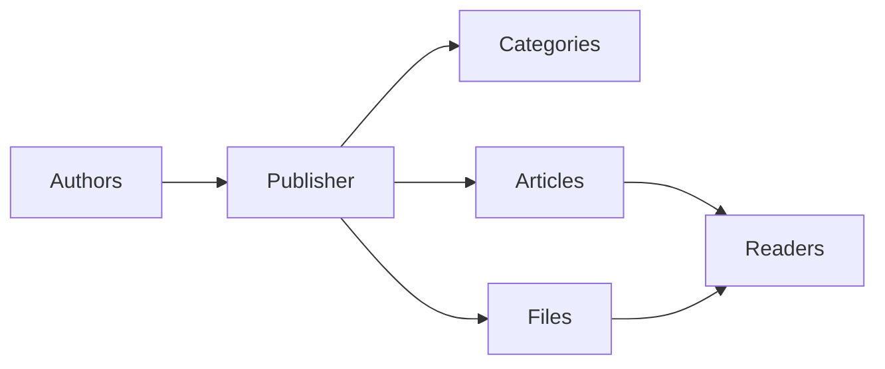
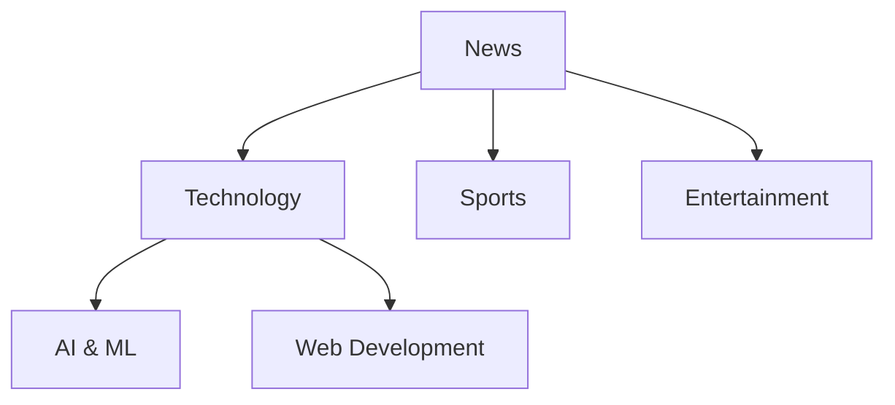
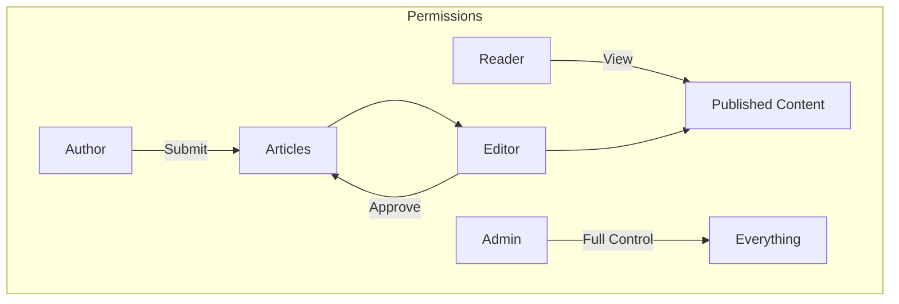
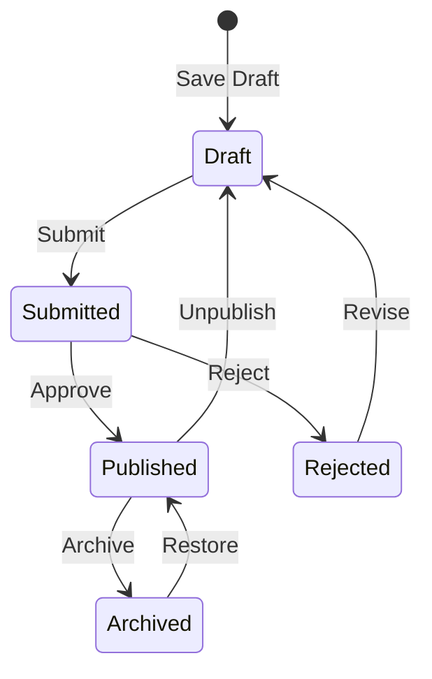

# Početak rada s Publisherom

> Vodič korak po korak za postavljanje i korištenje modula vijesti/blog izdavača.

---

## Što je Publisher?

Publisher je vrhunski modul za upravljanje sadržajem za XOOPS, dizajniran za:

- **Stranice s vijestima** - Objavite članke s kategorijama
- **Blogovi** - Osobni blogovi ili blogovi s više autora``
- **Dokumentacija** - Organizirane baze znanja
- **Sadržajni portali** - Mješoviti medijski sadržaj



---

## Brzo postavljanje

### Korak 1: Instalirajte Publisher

1. Preuzmite s [GitHub](https://github.com/XoopsModules25x/publisher)
2. Prenesite na `modules/publisher/`
3. Idite na Administrator → moduli → Instaliraj

### Korak 2: Stvorite kategorije



1. Admin → Izdavač → Kategorije
2. Kliknite "Dodaj kategoriju"
3. Ispunite:
   - **Ime**: Naziv kategorije
   - **Opis**: Što ova kategorija sadrži
   - **Slika**: izborna slika kategorije
4. Postavite dopuštenja (tko može poslati/pregledati)
5. Spremiti

### Korak 3: Konfigurirajte postavke

1. Administrator → Izdavač → Postavke
2. Ključne postavke za konfiguraciju:

| Postavka | Preporučeno | Opis |
|---------|-------------|-------------|
| Stavki po stranici | 10-20 | Članci na indeksu |
| Urednik | TinyMCE/CKEditor | Uređivač obogaćenog teksta |
| Dopusti ocjene | Da | Povratne informacije čitatelja |
| Dopusti komentare | Da | Rasprave |
| Automatsko odobravanje | Ne | Urednička kontrola |

### Korak 4: Napravite svoj prvi članak

1. Glavni izbornik → Izdavač → Pošalji članak
2. Ispunite obrazac:
   - **Naslov**: naslov članka
   - **Kategorija**: Gdje pripada
   - **Sažetak**: Kratki opis
   - **Tijelo**: Cijeli sadržaj članka
3. Dodajte izborne elemente:
   - Istaknuta slika
   - Datotečni prilozi
   - SEO postavke
4. Pošaljite na pregled ili objavite

---

## Korisničke uloge



### Čitatelj
- Pogledajte objavljene članke
- Ocijenite i komentirajte
- Pretražite sadržaj

### Autor
- Pošaljite nove članke
- Uređivanje vlastitih članaka
- Priložite datoteke

### Urednik
- Odobravanje/odbijanje podnesaka
- Uredite bilo koji članak
- Upravljanje kategorijama

### Administrator
- Potpuna kontrola modula
- Konfigurirajte postavke
- Upravljanje dopuštenjima

---

## Pisanje članaka

### Urednik članaka

```
┌─────────────────────────────────────────────────────┐
│ Title: [Your Article Title                        ] │
├─────────────────────────────────────────────────────┤
│ Category: [Select Category          ▼]              │
├─────────────────────────────────────────────────────┤
│ Summary:                                            │
│ ┌─────────────────────────────────────────────────┐ │
│ │ Brief description shown in listings...          │ │
│ └─────────────────────────────────────────────────┘ │
├─────────────────────────────────────────────────────┤
│ Body:                                               │
│ ┌─────────────────────────────────────────────────┐ │
│ │ [B] [I] [U] [Link] [Image] [Code]               │ │
│ ├─────────────────────────────────────────────────┤ │
│ │                                                  │ │
│ │ Full article content goes here...               │ │
│ │                                                  │ │
│ └─────────────────────────────────────────────────┘ │
├─────────────────────────────────────────────────────┤
│ [Submit] [Preview] [Save Draft]                     │
└─────────────────────────────────────────────────────┘
```

### Najbolji primjeri iz prakse

1. **Uvjerljivi naslovi** - jasni, privlačni naslovi
2. **Dobri sažeci** - Navedite čitatelje da kliknu
3. **Strukturirani sadržaj** - Koristite naslove, popise, slike
4. **Pravilna kategorizacija** - Pomozite čitateljima pronaći sadržaj
5. **SEO optimizacija** - Ključne riječi u naslovu i sadržaju

---

## Upravljanje sadržajem

### Tijek statusa članka



### Opisi statusa

| Status | Opis |
|--------|-------------|
| Nacrt | Radovi u tijeku |
| Poslano | Čeka recenziju |
| Objavljeno | Uživo na mjestu |
| Isteklo | Prošli datum isteka |
| Odbijeno | Potrebna revizija |
| Arhivirano | Uklonjeno s popisa |

---

## Navigacija

### Pristupanje izdavaču

- **Glavni izbornik** → Izdavač
- **Izravno URL**: `yoursite.com/modules/publisher/`

### Ključne stranice

| Stranica | URL | Svrha |
|------|-----|---------|
| Kazalo | `/modules/publisher/` | Popisi članaka |
| Kategorija | `/modules/publisher/category.php?id=X` | Članci iz kategorije |
| članak | `/modules/publisher/item.php?itemid=X` | Pojedinačni članak |
| Pošalji | `/modules/publisher/submit.php` | Novi članak |
| Traži | `/modules/publisher/search.php` | Pronađi članke |

---

## Blokovi

Izdavač nudi nekoliko blokova za vaše web mjesto:

### Nedavni članci
Prikazuje najnovije objavljene članke

### Izbornik kategorije
Navigacija po kategoriji

### Popularni članci
Najgledaniji sadržaj### Nasumični članak
Pokažite slučajni sadržaj

### Reflektor
Izdvojeni članci

---

## Povezana dokumentacija

- Izrada i uređivanje članaka
- Upravljanje kategorijama
- Extending Publisher

---

#xoops #publisher #user-guide #getting-started #cms
