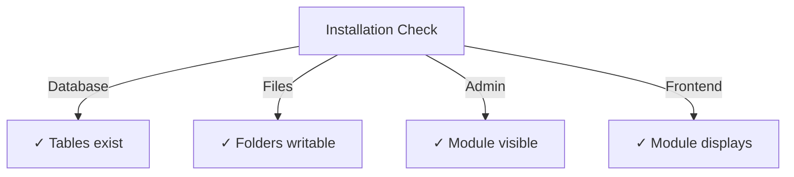

# Vodič za instalaciju izdavača

> Potpune upute za instalaciju i konfiguraciju modula Publisher za XOOPS CMS.

---

## Zahtjevi sustava

### Minimalni zahtjevi

| Zahtjev | Verzija | Bilješke |
|-------------|---------|-------|
| XOOPS | 2.5.10+ | Osnovna CMS platforma |
| PHP | 7.1+ | PHP 8.x preporučeno |
| MySQL | 5,7+ | Poslužitelj baze podataka |
| Web poslužitelj | Apache/Nginx | Uz podršku za prepisivanje |

### PHP Proširenja

```
- PDO (PHP Data Objects)
- pdo_mysql or mysqli
- mb_string (multibyte strings)
- curl (for external content)
- json
- gd (image processing)
```

### Prostor na disku

- **Datoteke modula**: ~5 MB
- **Direktorij predmemorije**: preporučuje se 50+ MB
- **Učitaj imenik**: Po potrebi za sadržaj

---

## Kontrolni popis prije instalacije

Prije instaliranja Publishera provjerite:

- [ ] Jezgra XOOPS je instalirana i radi
- [ ] Administratorski račun ima dozvole za upravljanje modulom
- [ ] Izrađena sigurnosna kopija baze podataka
- [ ] dozvole datoteke dopuštaju pristup pisanju u direktorij `/modules/`
- [ ] PHP ograničenje memorije je najmanje 128 MB
- [ ] Ograničenja veličine datoteke za učitavanje su prikladna (najmanje 10 MB)

---

## Koraci instalacije

### Korak 1: Preuzmite Publisher

#### Opcija A: s GitHuba (preporučeno)

```bash
# Navigate to modules directory
cd /path/to/xoops/htdocs/modules/

# Clone the repository
git clone https://github.com/XoopsModules25x/publisher.git

# Verify download
ls -la publisher/
```

#### Opcija B: Ručno preuzimanje

1. Posjetite [Izdanja GitHub izdavača](https://github.com/XoopsModules25x/publisher/releases)
2. Preuzmite najnoviju datoteku `.zip`
3. Ekstrakt u `modules/publisher/`

### Korak 2: Postavite dozvole za datoteke

```bash
# Set proper ownership
chown -R www-data:www-data /path/to/xoops/htdocs/modules/publisher

# Set directory permissions (755)
find publisher -type d -exec chmod 755 {} \;

# Set file permissions (644)
find publisher -type f -exec chmod 644 {} \;

# Make scripts executable
chmod 755 publisher/admin/index.php
chmod 755 publisher/index.php
```

### Korak 3: Instalirajte putem XOOPS Admin

1. Prijavite se na **XOOPS Admin Panel** kao administrator
2. Idite na **Sustav → moduli**
3. Kliknite **Instaliraj modul**
4. Pronađite **Izdavač** na popisu
5. Pritisnite gumb **Instaliraj**
6. Pričekajte da instalacija završi (pokazuje stvorene tablice baze podataka)

```
Installation Progress:
✓ Tables created
✓ Configuration initialized
✓ Permissions set
✓ Cache cleared
Installation Complete!
```

---

## Početno postavljanje

### Korak 1: Pristup Administratoru izdavača

1. Idite na **administratorska ploča → moduli**
2. Pronađite modul **Publisher**
3. Kliknite vezu **Administrator**
4. Sada ste u administraciji izdavača

### Korak 2: Konfigurirajte postavke modula

1. Kliknite **Preferences** u lijevom izborniku
2. Konfigurirajte osnovne postavke:

```
General Settings:
- Editor: Select your WYSIWYG editor
- Items per page: 10
- Show breadcrumb: Yes
- Allow comments: Yes
- Allow ratings: Yes

SEO Settings:
- SEO URLs: No (enable later if needed)
- URL rewriting: None

Upload Settings:
- Max upload size: 5 MB
- Allowed file types: jpg, png, gif, pdf, doc, docx
```

3. Kliknite **Spremi postavke**

### Korak 3: Stvorite prvu kategoriju

1. Kliknite **Kategorije** u lijevom izborniku
2. Kliknite **Dodaj kategoriju**
3. Ispunite obrazac:

```
Category Name: News
Description: Latest news and updates
Image: (optional) Upload category image
Parent Category: (leave blank for top-level)
Status: Enabled
```

4. Kliknite **Spremi kategoriju**

### Korak 4: Provjerite instalaciju

Provjerite ove pokazatelje:



#### Provjera baze podataka

```bash
mysql -u xoops_user -p xoops_database
mysql> SHOW TABLES LIKE 'publisher%';

# Should show tables:
# - publisher_categories
# - publisher_items
# - publisher_comments
# - publisher_files
```

#### Prednja provjera

1. Posjetite svoju početnu stranicu XOOPS
2. Potražite blok **Izdavač** ili **Vijesti**
3. Trebao bi prikazati nedavne članke

---

## Konfiguracija nakon instalacije

### Odabir urednika

Publisher podržava više WYSIWYG uređivača:

| Urednik | Prednosti | Protiv |
|--------|------|------|
| FCKeditor | Bogat značajkama | Starije, veće |
| CKEditor | Moderni standard | Složenost konfiguracije |
| TinyMCE | Lagan | Ograničene značajke |
| DHTML uređivač | Osnovno | Vrlo osnovno |

**Za promjenu urednika:**

1. Idite na **Postavke**
2. Dođite do postavke **Uređivač**
3. Odaberite s padajućeg izbornika
4. Spremite i testirajte

### Prenesi postavku imenika

```bash
# Create upload directories
mkdir -p /path/to/xoops/uploads/publisher/
mkdir -p /path/to/xoops/uploads/publisher/categories/
mkdir -p /path/to/xoops/uploads/publisher/images/
mkdir -p /path/to/xoops/uploads/publisher/files/

# Set permissions
chmod 755 /path/to/xoops/uploads/publisher/
chmod 755 /path/to/xoops/uploads/publisher/*
```

### Konfigurirajte veličine slika

U postavkama postavite veličine sličica:

```
Category image size: 300 x 200 px
Article image size: 600 x 400 px
Thumbnail size: 150 x 100 px
```

---

## Koraci nakon instalacije

### 1. Postavite dopuštenja grupe1. Idite na **dozvole** u admin izborniku
2. Konfigurirajte pristup za grupe:
   - Anonimno: samo pogled
   - Registrirani korisnici: Pošaljite članke
   - Urednici: odobravaju/uređuju članke
   - Administratori: Potpuni pristup

### 2. Konfigurirajte vidljivost modula

1. Idite na **Blokovi** u XOOPS admin
2. Pronađite blokove izdavača:
   - Izdavač - Najnoviji članci
   - Izdavač - Kategorije
   - Izdavač - Arhiv
3. Konfigurirajte vidljivost bloka po stranici

### 3. Uvoz testnog sadržaja (izborno)

Za testiranje uvezite uzorke članaka:

1. Idite na **Administrator izdavača → Uvoz**
2. Odaberite **Uzorak sadržaja**
3. Kliknite **Uvezi**

### 4. Omogućite SEO URL-ove (nije obavezno)

Za URL-ove pogodne za pretraživanje:

1. Idite na **Postavke**
2. Postavite **SEO URL-ove**: Da
3. Omogućite **.htaccess** ponovno pisanje
4. Provjerite postoji li datoteka `.htaccess` u mapi izdavača

```apache
# .htaccess example
<IfModule mod_rewrite.c>
    RewriteEngine On
    RewriteBase /modules/publisher/
    RewriteRule ^category/([0-9]+)-(.*)\.html$ index.php?op=showcategory&categoryid=$1 [L]
    RewriteRule ^article/([0-9]+)-(.*)\.html$ index.php?op=showitem&itemid=$1 [L]
</IfModule>
```

---

## Instalacija za rješavanje problema

### Problem: modul se ne pojavljuje u admin

**Rješenje:**
```bash
# Check file permissions
ls -la /path/to/xoops/modules/publisher/

# Check xoops_version.php exists
ls /path/to/xoops/modules/publisher/xoops_version.php

# Verify PHP syntax
php -l /path/to/xoops/modules/publisher/xoops_version.php
```

### Problem: Tablice baze podataka nisu stvorene

**Rješenje:**
1. Provjerite ima li korisnik MySQL privilegiju CREATE TABLE
2. Provjerite zapisnik pogrešaka baze podataka:
   ```bash
   mysql> SHOW WARNINGS;
   ```
3. Ručno uvezite SQL:
   ```bash
   mysql -u user -p database < modules/publisher/sql/mysql.sql
   ```

### Problem: Prijenos datoteke nije uspio

**Rješenje:**
```bash
# Check directory exists and is writable
stat /path/to/xoops/uploads/publisher/

# Fix permissions
chmod 777 /path/to/xoops/uploads/publisher/

# Verify PHP settings
php -i | grep upload_max_filesize
```

### Problem: pogreške "Stranica nije pronađena".

**Rješenje:**
1. Provjerite postoji li datoteka `.htaccess`
2. Provjerite je li Apache `mod_rewrite` omogućen:
   ```bash
   a2enmod rewrite
   systemctl restart apache2
   ```
3. Provjerite `AllowOverride All` u Apache konfiguraciji

---

## Nadogradnja s prethodnih verzija

### Od izdavača 1.x do 2.x

1. **Sigurnosna kopija trenutne instalacije:**
   ```bash
   cp -r modules/publisher/ modules/publisher-backup/
   mysqldump -u user -p database > publisher-backup.sql
   ```

2. **Preuzmite Publisher 2.x**

3. **Prebriši datoteke:**
   ```bash
   rm -rf modules/publisher/
   unzip publisher-2.0.zip -d modules/
   ```

4. **Pokreni ažuriranje:**
   - Idite na **Administrator → Izdavač → Ažuriranje**
   - Kliknite **Ažuriraj bazu podataka**
   - Pričekajte završetak

5. **Potvrdi:**
   - Provjerite ispravnost prikaza svih artikala
   - Provjerite jesu li dopuštenja netaknuta
   - Testna datoteka uploads

---

## Sigurnosna razmatranja

### dozvole za datoteke

```
- Core files: 644 (readable by web server)
- Directories: 755 (browseable by web server)
- Upload directories: 755 or 777
- Config files: 600 (not readable by web)
```

### Onemogući izravan pristup osjetljivim datotekama

Kreirajte `.htaccess` u direktorijima za učitavanje:

```apache
<FilesMatch "\.(php|phtml|php3|php4|php5|phtml)$">
    Deny from all
</FilesMatch>
```

### Sigurnost baze podataka

```bash
# Use strong password
ALTER USER 'publisher_user'@'localhost' IDENTIFIED BY 'strong_password_here';

# Grant minimal permissions
GRANT SELECT, INSERT, UPDATE, DELETE ON publisher_db.* TO 'publisher_user'@'localhost';
FLUSH PRIVILEGES;
```

---

## Popis za provjeru

Nakon instalacije provjerite:

- [ ] modul se pojavljuje na popisu admin modules
- [ ] Može pristupiti odjeljku izdavača admin
- [ ] Može stvarati kategorije
- [ ] Može stvarati članke
- [ ] Prikaz članaka na sučelju
- [ ] Datoteka uploads rad
- [ ] Slike se prikazuju ispravno
- [ ] Dopuštenja su ispravno primijenjena
- [ ] Stvorene tablice baze podataka
- [ ] U direktorij predmemorije može se pisati

---

## Sljedeći koraci

Nakon uspješne instalacije:

1. Pročitajte Vodič za osnovnu konfiguraciju
2. Napravite svoj prvi članak
3. Postavite dopuštenja grupe
4. Pregledajte upravljanje kategorijama

---

## Podrška i resursi

- **Problemi s GitHubom**: [Problemi izdavača](https://github.com/XoopsModules25x/publisher/issues)
- **XOOPS Forum**: [Podrška zajednice](https://www.xoops.org/modules/newbb/)
- **GitHub Wiki**: [Pomoć pri instalaciji](https://github.com/XoopsModules25x/publisher/wiki)

---

#izdavač #instalacija #postavljanje #xoops #modul #konfiguracija
