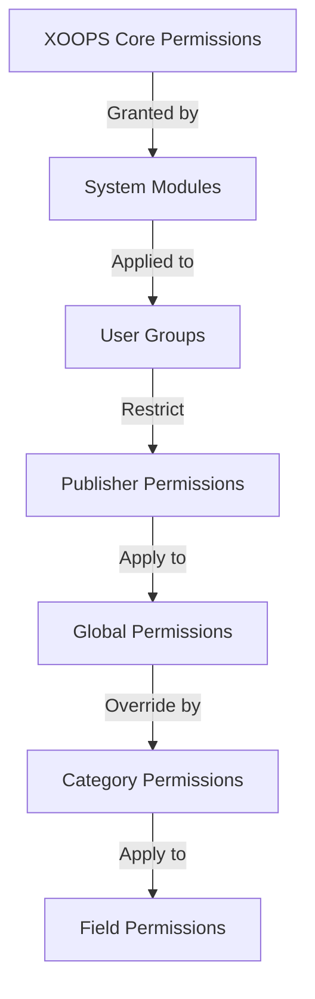

# Postavljanje dopuštenja izdavača

> Potpuni vodič za konfiguriranje dopuštenja grupe, kontrolu pristupa i upravljanje korisničkim pristupom u Publisheru.

---

## Osnove dopuštenja

### Što su dopuštenja?

Dopuštenja kontroliraju što različite grupe korisnika mogu raditi u Publisheru:

```
Who can:
  - View articles
  - Submit articles
  - Edit articles
  - Approve articles
  - Manage categories
  - Configure settings
```

### Razine dopuštenja

```
Anonymous
  └── View published articles only

Registered Users
  ├── View articles
  ├── Submit articles (pending approval)
  └── Edit own articles

Editors/Moderators
  ├── All registered permissions
  ├── Approve articles
  ├── Edit all articles
  └── Manage some categories

Administrators
  └── Full access to everything
```

---

## Upravljanje dozvolama za pristup

### Idite na Dopuštenja

```
Admin Panel
└── Modules
    └── Publisher
        ├── Permissions
        ├── Category Permissions
        └── Group Management
```

### Brzi pristup

1. Prijavite se kao **Administrator**
2. Idite na **Administrator → moduli**
3. Kliknite **Izdavač → Administrator**
4. Kliknite **dozvole** u lijevom izborniku

---

## Globalne dozvole

### dozvole na razini modula

Upravljajte pristupom Publisher modulu i značajkama:

```
Permissions configuration view:
┌─────────────────────────────────────┐
│ Permission             │ Anon │ Reg │ Editor │ Admin │
├────────────────────────┼──────┼─────┼────────┼───────┤
│ View articles          │  ✓   │  ✓  │   ✓    │  ✓   │
│ Submit articles        │  ✗   │  ✓  │   ✓    │  ✓   │
│ Edit own articles      │  ✗   │  ✓  │   ✓    │  ✓   │
│ Edit all articles      │  ✗   │  ✗  │   ✓    │  ✓   │
│ Approve articles       │  ✗   │  ✗  │   ✓    │  ✓   │
│ Manage categories      │  ✗   │  ✗  │   ✗    │  ✓   │
│ Access admin panel     │  ✗   │  ✗  │   ✓    │  ✓   │
└─────────────────────────────────────┘
```

### Opisi dopuštenja

| Dopuštenje | Korisnici | Učinak |
|------------|-------|--------|
| **Pogledajte članke** | Sve grupe | Može vidjeti objavljene članke na front-end |
| **Pošaljite članke** | Registriran+ | Može stvarati nove članke (čeka odobrenje) |
| **Uredite vlastite članke** | Registriran+ | Mogu uređivati/brisati vlastite članke |
| **Uredi sve članke** | Urednici+ | Može uređivati ​​članke bilo kojeg korisnika |
| **Brisanje vlastitih članaka** | Registriran+ | Mogu brisati vlastite neobjavljene članke |
| **Izbriši sve članke** | Urednici+ | Može izbrisati bilo koji članak |
| **Odobri članke** | Urednici+ | Može objaviti članke na čekanju |
| **Upravljanje kategorijama** | Administratori | Stvaranje, uređivanje, brisanje kategorija |
| **Administratorski pristup** | Urednici+ | Pristup sučelju admin |

---

## Konfigurirajte globalne dozvole

### Korak 1: Postavke dopuštenja pristupa

1. Idite na **Administrator → moduli**
2. Pronađite **Izdavača**
3. Kliknite **dozvole** (ili vezu Administrator pa zatim Dopuštenja)
4. Vidite matricu dopuštenja

### Korak 2: Postavite dopuštenja grupe

Za svaku grupu konfigurirajte što mogu učiniti:

#### Anonimni korisnici

```yaml
Anonymous Group Permissions:
  View articles: ✓ YES
  Submit articles: ✗ NO
  Edit articles: ✗ NO
  Delete articles: ✗ NO
  Approve articles: ✗ NO
  Manage categories: ✗ NO
  Admin access: ✗ NO

Result: Anonymous users can only view published content
```

#### Registrirani korisnici

```yaml
Registered Group Permissions:
  View articles: ✓ YES
  Submit articles: ✓ YES (with approval required)
  Edit own articles: ✓ YES
  Edit all articles: ✗ NO
  Delete own articles: ✓ YES (drafts only)
  Delete all articles: ✗ NO
  Approve articles: ✗ NO
  Manage categories: ✗ NO
  Admin access: ✗ NO

Result: Registered users can contribute content after approval
```

#### Grupa urednika

```yaml
Editors Group Permissions:
  View articles: ✓ YES
  Submit articles: ✓ YES
  Edit own articles: ✓ YES
  Edit all articles: ✓ YES
  Delete own articles: ✓ YES
  Delete all articles: ✓ YES
  Approve articles: ✓ YES
  Manage categories: ✓ LIMITED
  Admin access: ✓ YES
  Configure settings: ✗ NO

Result: Editors manage content but not settings
```

#### Administratori

```yaml
Admins Group Permissions:
  ✓ FULL ACCESS to all features

  - All editor permissions
  - Manage all categories
  - Configure all settings
  - Manage permissions
  - Install/uninstall
```

### Korak 3: Spremite dopuštenja

1. Konfigurirajte dopuštenja svake grupe
2. Potvrdite okvire za dopuštene radnje
3. Poništite okvire za odbijene radnje
4. Kliknite **Spremi dopuštenja**
5. Pojavljuje se poruka potvrde

---

## dozvole na razini kategorije

### Postavite pristup kategoriji

Kontrolirajte tko može pregledavati/podnijeti određene kategorije:

```
Admin → Publisher → Categories
→ Select category → Permissions
```

### Matrica dopuštenja kategorije

```
                 Anonymous  Registered  Editor  Admin
View category        ✓         ✓         ✓       ✓
Submit to category   ✗         ✓         ✓       ✓
Edit own in category ✗         ✓         ✓       ✓
Edit all in category ✗         ✗         ✓       ✓
Approve in category  ✗         ✗         ✓       ✓
Manage category      ✗         ✗         ✗       ✓
```

### Konfigurirajte dozvole za kategoriju

1. Idite na **Kategorije** admin
2. Pronađite kategoriju
3. Pritisnite gumb **dozvole**
4. Za svaku grupu odaberite:
   - [ ] Pogledaj ovu kategoriju
   - [ ] Pošaljite članke
   - [ ] Uređivanje vlastitih članaka
   - [ ] Uredi sve članke
   - [ ] Odobravanje članaka
   - [ ] Upravljanje kategorijom
5. Kliknite **Spremi**

### Primjeri dozvola za kategorije

#### Kategorija javnih vijesti

```
Anonymous: View only
Registered: View + Submit (pending approval)
Editors: Approve + Edit
Admins: Full control
```

#### Kategorija internih ažuriranja

```
Anonymous: No access
Registered: View only
Editors: Submit + Approve
Admins: Full control
```

#### Kategorija bloga za goste

```
Anonymous: View only
Registered: Submit (pending approval)
Editors: Approve
Admins: Full control
```

---

## Dopuštenja na razini polja

### Kontrolna vidljivost polja obrasca

Ograničite koja polja obrasca korisnici mogu vidjeti/uređivati:

```
Admin → Publisher → Permissions → Fields
```

### Opcije polja

```yaml
Visible Fields for Registered Users:
  ✓ Title
  ✓ Description
  ✓ Content (body)
  ✓ Featured image
  ✓ Category
  ✓ Tags
  ✗ Author (auto-set)
  ✗ Publication date (editors only)
  ✗ Scheduled date (editors only)
  ✗ Featured flag (editors only)
  ✗ Permissions (admins only)
```

### Primjeri

#### Ograničeno podnošenje za registrirane

Registrirani korisnici vide manje opcija:

```
Available fields:
  - Title ✓
  - Description ✓
  - Content ✓
  - Featured image ✓
  - Category ✓

Hidden fields:
  - Author (auto-current user)
  - Publication date (editors decide)
  - Scheduled date (admins only)
  - Featured status (editors choose)
```

#### Puni obrazac za urednike

Urednici vide sve opcije:

```
Available fields:
  - All basic fields
  - All metadata
  - Author selection ✓
  - Publication date/time ✓
  - Scheduled date ✓
  - Featured status ✓
  - Expiration date ✓
  - Permissions ✓
```

---

## Konfiguracija grupe korisnika

### Stvorite prilagođenu grupu

1. Idite na **Administrator → Korisnici → Grupe**
2. Kliknite **Stvori grupu**
3. Unesite detalje grupe:

```
Group Name: "Community Bloggers"
Group Description: "Users who contribute blog content"
Type: Regular group
```
4. Kliknite **Spremi grupu**
5. Vratite se na dozvole izdavača
6. Postavite dopuštenja za novu grupu

### Grupni primjeri

```
Suggested Groups for Publisher:

Group: Contributors
  - Regular members who submit articles
  - Can edit own articles
  - Cannot approve articles

Group: Reviewers
  - Can see submitted articles
  - Can approve/reject articles
  - Cannot delete others' articles

Group: Editors
  - Can edit any article
  - Can approve articles
  - Can moderate comments
  - Can manage some categories

Group: Publishers
  - Can edit any article
  - Can publish directly (no approval)
  - Can manage all categories
  - Can configure settings
```

---

## Hijerarhije dopuštenja

### Tijek dopuštenja



### Nasljeđivanje dopuštenja

```
Base: Global module permissions
  ↓
Category: Overrides for specific categories
  ↓
Field: Further restricts available fields
  ↓
User: Has permission if ALL levels allow
```

**Primjer:**

```
User wants to edit article:
1. User group must have "edit articles" permission (global)
2. Category must allow editing (category level)
3. Field restrictions must allow (if applicable)
4. User must be author OR editor (for own vs all)

If ANY level denies → Permission denied
```

---

## dozvole tijeka rada odobrenja

### Konfigurirajte odobrenje za podnošenje

Kontrolirajte trebaju li članci odobrenje:

```
Admin → Publisher → Preferences → Workflow
```

#### Mogućnosti odobrenja

```yaml
Submission Workflow:
  Require Approval: Yes

  For Registered Users:
    - New articles: Draft (pending approval)
    - Editors must approve
    - User can edit while pending
    - After approval: User can still edit

  For Editors:
    - New articles: Publish directly (optional)
    - Skip approval queue
    - Or always require approval
```

#### Konfiguriraj po grupi

1. Idite na Postavke
2. Pronađite "Tijek rada za podnošenje"
3. Za svaku grupu postavite:

```
Group: Registered Users
  Require approval: ✓ YES
  Default status: Draft
  Can modify while pending: ✓ YES

Group: Editors
  Require approval: ✗ NO
  Default status: Published
  Can modify published: ✓ YES
```

4. Kliknite **Spremi**

---

## Umjereni članci

### Odobri članke na čekanju

Za korisnike s dozvolom za "odobravanje članaka":

1. Idite na **Administrator → Izdavač → Članci**
2. Filtrirajte prema **Statusu**: Na čekanju
3. Pritisnite članak za recenziju
4. Provjerite kvalitetu sadržaja
5. Postavite **Status**: Objavljeno
6. Izborno: dodajte uredničke bilješke
7. Kliknite **Spremi**

### Odbaci članke

Ako artikl ne zadovoljava standarde:

1. Otvorite članak
2. Postavite **Status**: Skica
3. Dodajte razlog odbijanja (u komentaru ili e-pošti)
4. Kliknite **Spremi**
5. Pošaljite poruku autoru s objašnjenjem odbijanja

### Umjereni komentari

Ako moderirate komentare:

1. Idite na **Administrator → Izdavač → Komentari**
2. Filtrirajte prema **Statusu**: Na čekanju
3. Pregledajte komentar
4. Mogućnosti:
   - Odobrenje: Kliknite **Odobri**
   - Odbijanje: kliknite **Izbriši**
   - Uredi: Kliknite **Uredi**, popravite, spremite
5. Kliknite **Spremi**

---

## Upravljanje korisničkim pristupom

### Prikaz korisničkih grupa

Pogledajte koji korisnici pripadaju grupama:

```
Admin → Users → User Groups

For each user:
  - Primary group (one)
  - Secondary groups (multiple)

Permissions apply from all groups (union)
```

### Dodaj korisnika grupi

1. Idite na **Administrator → Korisnici**
2. Pronađite korisnika
3. Kliknite **Uredi**
4. Pod **Grupe** označite grupe za dodavanje
5. Kliknite **Spremi**

### Promjena korisničkih dopuštenja

Za pojedinačne korisnike (ako je podržano):

1. Idite do korisnika admin
2. Pronađite korisnika
3. Kliknite **Uredi**
4. Potražite nadjačavanje pojedinačnih dopuštenja
5. Konfigurirajte prema potrebi
6. Kliknite **Spremi**

---

## Uobičajeni scenariji dopuštenja

### Scenarij 1: Otvorite blog

Dopusti svima da podnesu:

```
Anonymous: View
Registered: Submit, edit own, delete own
Editors: Approve, edit all, delete all
Admins: Full control

Result: Open community blog
```

### Scenarij 2: Moderirana stranica s vijestima

Strogi postupak odobravanja:

```
Anonymous: View only
Registered: Cannot submit
Editors: Submit, approve others
Admins: Full control

Result: Only approved professionals publish
```

### Scenarij 3: Blog osoblja

Zaposlenici mogu doprinijeti:

```
Create group: "Staff"
Anonymous: View
Registered: View only (non-staff)
Staff: Submit, edit own, publish directly
Admins: Full control

Result: Staff-authored blog
```

### Scenarij 4: Više kategorija s različitim urednicima

Različiti uređivači za različite kategorije:

```
News category:
  Editors group A: Full control

Reviews category:
  Editors group B: Full control

Tutorials category:
  Editors group C: Full control

Result: Decentralized editorial control
```

---

## Testiranje dopuštenja

### Provjerite rad dopuštenja

1. Stvorite probnog korisnika u svakoj grupi
2. Prijavite se kao svaki testni korisnik
3. Pokušajte:
   - Pregledajte članke
   - Pošaljite članak (treba izraditi nacrt ako je dopušteno)
   - Uredi članak (vlastiti i tuđi)
   - Brisanje članka
   - Pristup ploči admin
   - Pristup kategorijama

4. Provjerite odgovaraju li rezultati očekivanim dopuštenjima

### Uobičajeni testni slučajevi

```
Test Case 1: Anonymous user
  [ ] Can view published articles: ✓
  [ ] Cannot submit articles: ✓
  [ ] Cannot access admin: ✓

Test Case 2: Registered user
  [ ] Can submit articles: ✓
  [ ] Articles go to Draft: ✓
  [ ] Can edit own article: ✓
  [ ] Cannot edit others: ✓
  [ ] Cannot access admin: ✓

Test Case 3: Editor
  [ ] Can approve articles: ✓
  [ ] Can edit any article: ✓
  [ ] Can access admin: ✓
  [ ] Cannot delete all: ✓ (or ✓ if allowed)

Test Case 4: Admin
  [ ] Can do everything: ✓
```

---

## Dopuštenja za rješavanje problema

### Problem: Korisnik ne može slati članke

**Provjeri:**
```
1. User group has "submit articles" permission
   Admin → Publisher → Permissions

2. User belongs to allowed group
   Admin → Users → Edit user → Groups

3. Category allows submission from user's group
   Admin → Publisher → Categories → Permissions

4. User is registered (not anonymous)
```

**Rješenje:**
```bash
1. Verify registered user group has submission permission
2. Add user to appropriate group
3. Check category permissions
4. Clear user session cache
```

### Problem: Urednik ne može odobriti članke

**Provjeri:**
```
1. Editor group has "approve articles" permission
2. Articles exist with "Pending" status
3. Editor is in correct group
4. Category allows approval from editor's group
```

**Rješenje:**
```bash
1. Go to Permissions, check "approve articles" is checked for editor group
2. Create test article, set to Draft
3. Try to approve as editor
4. Check error messages in system log
```

### Problem: Mogu vidjeti članke, ali ne mogu pristupiti kategoriji

**Provjeri:**
```
1. Category is not disabled/hidden
2. Category permissions allow viewing
3. User's group is permitted to view category
4. Category is published
```

**Rješenje:**
```bash
1. Go to Categories, check category status is "Enabled"
2. Check category permissions are set
3. Add user's group to category view permission
```

### Problem: dozvole su promijenjene, ali ne stupaju na snagu

**Rješenje:**
```bash
1. Clear cache: Admin → Tools → Clear Cache
2. Clear session: Logout and login again
3. Check system log for errors
4. Verify permissions actually saved
5. Try different browser/incognito window
```

---

## Sigurnosno kopiranje i izvoz dopuštenja

### Dopuštenja za izvoz

Neki sustavi dopuštaju izvoz:

1. Idite na **Administrator → Izdavač → Alati**
2. Kliknite **dozvole za izvoz**
3. Spremite datoteku `.xml` ili `.json`
4. Čuvajte kao rezervnu kopiju### Dopuštenja za uvoz

Vrati iz sigurnosne kopije:

1. Idite na **Administrator → Izdavač → Alati**
2. Kliknite **dozvole za uvoz**
3. Odaberite datoteku sigurnosne kopije
4. Pregledajte promjene
5. Kliknite **Uvezi**

---

## Najbolji primjeri iz prakse

### Kontrolni popis za konfiguraciju dopuštenja

- [ ] Odlučite o korisničkim grupama
- [ ] Dodijelite jasna imena grupama
- [ ] Postavite osnovna dopuštenja za svaku grupu
- [ ] Testirajte svaku razinu dopuštenja
- [ ] Struktura dopuštenja dokumenta
- [ ] Stvorite tijek rada odobrenja
- [ ] Obučite urednike o moderiranju
- [ ] Pratite korištenje dopuštenja
- [ ] Pregled dopuštenja kvartalno
- [ ] Postavke dopuštenja za sigurnosno kopiranje

### Najbolje sigurnosne prakse

```
✓ Principle of Least Privilege
  - Grant minimum necessary permissions

✓ Role-Based Access
  - Use groups for roles (editor, moderator, etc)

✓ Audit Permissions
  - Review who has what access

✓ Separate Duties
  - Submitter, approver, publisher are different

✓ Regular Review
  - Check permissions quarterly
  - Remove access when users leave
  - Update for new requirements
```

---

## Povezani vodiči

- Izrada članaka
- Upravljanje kategorijama
- Osnovna konfiguracija
- Instalacija

---

## Sljedeći koraci

- Postavite dopuštenja za svoj tijek rada
- Stvorite članke s odgovarajućim dopuštenjima
- Konfigurirajte kategorije s dopuštenjima
- Obučite korisnike o izradi članaka

---

#publisher #permissions #groups #access-control #security #moderation #xoops
