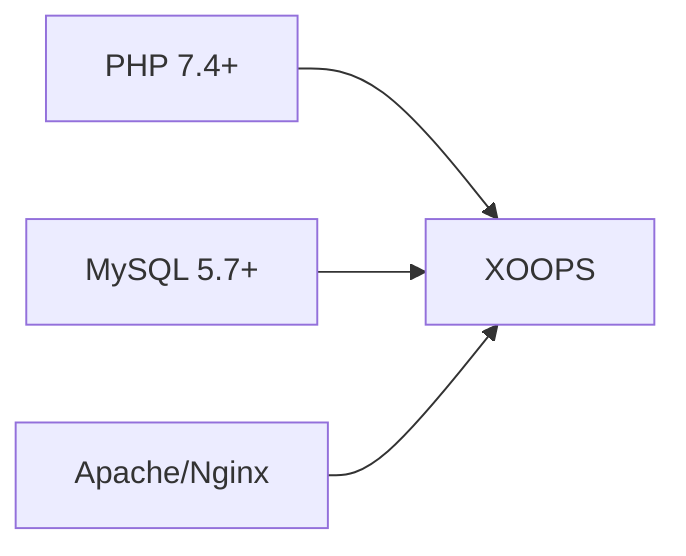
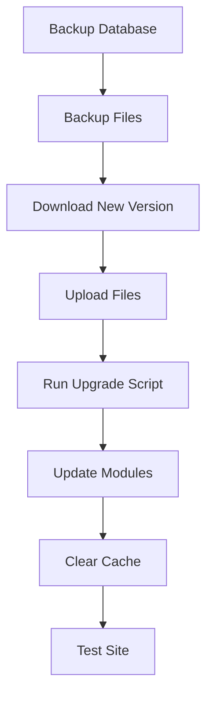

> Uobičajena pitanja i odgovori o instaliranju XOOPS.

---

## Predinstalacija

### P: Koji su minimalni zahtjevi poslužitelja?

**A:** XOOPS 2.5.x zahtijeva:
- PHP 7.4 ili noviji (preporučuje se PHP 8.x)
- MySQL 5.7+ ili MariaDB 10.3+
- Apache s mod_rewrite ili Nginx
- Ograničenje memorije najmanje 64 MB PHP (preporučeno 128 MB+)



### P: Mogu li instalirati XOOPS na dijeljeni hosting?

**O:** Da, XOOPS radi dobro na većini dijeljenih hostinga koji ispunjavaju zahtjeve. Provjerite pruža li vaš domaćin:
- PHP s potrebnim ekstenzijama (mysqli, gd, curl, json, mbstring)
- MySQL pristup bazi podataka
- Mogućnost učitavanja datoteka
- .htaccess podrška (za Apache)

### P: Koja su proširenja PHP potrebna?

**A:** Potrebna proširenja:
- `mysqli` - Povezivost baze podataka
- `gd` - Obrada slike
- `json` - JSON rukovanje
- `mbstring` - Podrška za višebajtni niz

Preporučeno:
- `curl` - Eksterni API pozivi
- `zip` - Instalacija modula
- `intl` - Internacionalizacija

---

## Proces instalacije

### P: Čarobnjak za instalaciju prikazuje praznu stranicu

**O:** Ovo je obično pogreška PHP. Pokušajte:

1. Privremeno omogućite prikaz pogreške:
```php
// Add to htdocs/install/index.php at the top
error_reporting(E_ALL);
ini_set('display_errors', 1);
```

2. Provjerite zapisnik pogrešaka PHP
3. Provjerite kompatibilnost verzije PHP
4. Provjerite jesu li učitana sva potrebna proširenja

### P: Dobivam "Ne mogu pisati na mainfile.php"

**A:** Postavite dozvole za pisanje prije instalacije:

```bash
chmod 666 mainfile.php
# After installation, secure it:
chmod 444 mainfile.php
```

### P: Tablice baze podataka se ne stvaraju

**A:** Provjerite:

1. MySQL korisnik ima privilegije CREATE TABLE:
```sql
GRANT ALL PRIVILEGES ON xoopsdb.* TO 'xoopsuser'@'localhost';
FLUSH PRIVILEGES;
```

2. baza podataka postoji:
```sql
CREATE DATABASE xoopsdb CHARACTER SET utf8mb4 COLLATE utf8mb4_unicode_ci;
```

3. Vjerodajnice u čarobnjaku odgovaraju postavkama baze podataka

### P: Instalacija je dovršena, ali stranica pokazuje pogreške

**A:** Uobičajeni popravci nakon instalacije:

1. Uklonite ili preimenujte instalacijski direktorij:
```bash
mv htdocs/install htdocs/install.bak
```

2. Postavite odgovarajuća dopuštenja:
```bash
chmod -R 755 htdocs/
chmod -R 777 xoops_data/
chmod 444 mainfile.php
```

3. Obrišite cache:
```bash
rm -rf xoops_data/caches/smarty_cache/*
rm -rf xoops_data/caches/smarty_compile/*
```

---

## Konfiguracija

### P: Gdje je konfiguracijska datoteka?

**A:** Glavna konfiguracija je u `mainfile.php` u korijenu XOOPS. Ključne postavke:

```php
define('XOOPS_ROOT_PATH', '/path/to/htdocs');
define('XOOPS_VAR_PATH', '/path/to/xoops_data');
define('XOOPS_URL', 'https://yoursite.com');
define('XOOPS_DB_HOST', 'localhost');
define('XOOPS_DB_USER', 'username');
define('XOOPS_DB_PASS', 'password');
define('XOOPS_DB_NAME', 'database');
define('XOOPS_DB_PREFIX', 'xoops');
```

### P: Kako mogu promijeniti stranicu URL?

**A:** Uredi `mainfile.php`:

```php
define('XOOPS_URL', 'https://newdomain.com');
```

Zatim obrišite cache i ažurirajte sve tvrdo kodirane URL-ove u bazi podataka.

### P: Kako mogu premjestiti XOOPS u drugi direktorij?

**A:**

1. Premjestite datoteke na novu lokaciju
2. Ažurirajte staze u `mainfile.php`:
```php
define('XOOPS_ROOT_PATH', '/new/path/to/htdocs');
define('XOOPS_VAR_PATH', '/new/path/to/xoops_data');
```
3. Ažurirajte bazu podataka ako je potrebno
4. Obrišite sve caches

---

## Nadogradnje

### P: Kako mogu nadograditi XOOPS?

**A:**



1. **Backup svega** (baza podataka + datoteke)
2. Preuzmite novu verziju XOOPS
3. Učitajte datoteke (nemojte prebrisati `mainfile.php`)
4. Pokrenite `htdocs/upgrade/` ako je dostupan
5. Ažurirajte modules putem ploče admin
6. Obrišite sve caches
7. Temeljito testirajte

### P: Mogu li preskočiti verzije prilikom nadogradnje?

**O:** Općenito ne. Nadogradite sekvencijalno kroz glavne verzije kako biste osigurali da se migracije baze podataka izvode ispravno. Provjerite napomene o izdanju za posebne smjernice.### P: Moj modules je prestao raditi nakon nadogradnje

**A:**

1. Provjerite kompatibilnost modula s novom verzijom XOOPS
2. Ažurirajte modules na najnoviju verziju
3. Ponovno generirajte templates: Administrator → Sustav → Održavanje → predlošci
4. Obrišite sve caches
5. Provjerite zapisnike pogrešaka PHP za određene pogreške

---

## Rješavanje problema

### P: Zaboravio sam admin lozinku

**A:** Reset putem baze podataka:

```sql
-- Generate new password hash
UPDATE xoops_users
SET pass = MD5('newpassword')
WHERE uname = 'admin';
```

Ili upotrijebite značajku poništavanja lozinke ako je e-pošta konfigurirana.

### P: Stranica je vrlo spora nakon instalacije

**A:**

1. Omogućite predmemoriju u Admin → Sustav → Postavke
2. Optimizirajte bazu podataka:
```sql
OPTIMIZE TABLE xoops_session;
OPTIMIZE TABLE xoops_online;
```
3. Provjerite spore upite u načinu otklanjanja pogrešaka
4. Omogućite PHP OpCache

### P: Slike/CSS se ne učitavaju

**A:**

1. Provjerite dopuštenja za datoteke (644 za datoteke, 755 za direktorije)
2. Provjerite je li `XOOPS_URL` točan u `mainfile.php`
3. Provjerite .htaccess za sukobe prepisivanja
4. Pregledajte konzolu preglednika za pogreške 404

---

## Povezana dokumentacija

- Vodič za instalaciju
- Osnovna konfiguracija
- Bijeli ekran smrti

---

#xoops #faq #installation #troubleshooting
