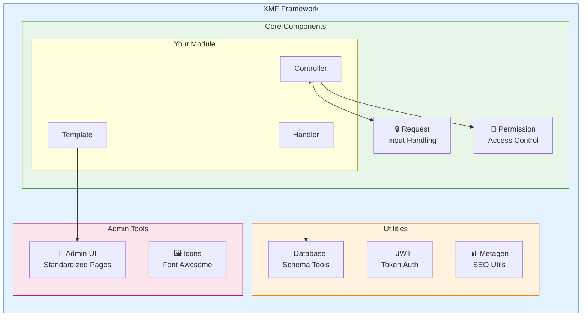
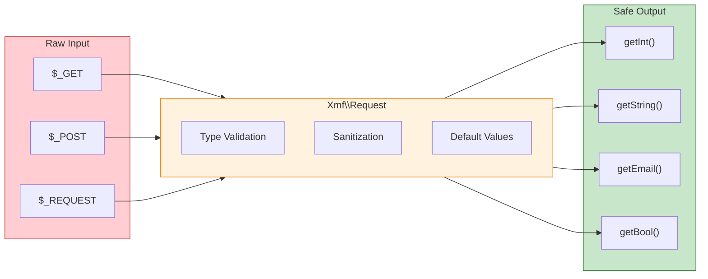

<span class="version-badge version-25x">2.5.x ✅</span> <span class="version-badge version-40x">4.0.x ✅</span>

:::tip[Most do moderne XOOPS]
XMF radi u **i XOOPS 2.5.x i XOOPS 4.0.x**. To je preporučeni način da modernizirate svoj modules danas dok se pripremate za XOOPS 4.0. XMF pruža PSR-4 automatsko učitavanje, prostore imena i pomoćnike koji olakšavaju prijelaz.
:::

**XOOPS Module Framework (XMF)** moćna je biblioteka dizajnirana da pojednostavi i standardizira razvoj modula XOOPS. XMF pruža moderne prakse PHP uključujući prostore imena, automatsko učitavanje i sveobuhvatan skup pomoćnih classes koji smanjuju standardni kod i poboljšavaju mogućnost održavanja.

## Što je XMF?

XMF je zbirka classes i uslužnih programa koji pružaju:

- **Podrška za moderni PHP** - Potpuna podrška za prostor naziva s automatskim učitavanjem PSR-4
- **Rukovanje zahtjevima** - Sigurna provjera valjanosti i dezinfekcija unosa
- **Module Helpers** - Pojednostavljeni pristup konfiguracijama i objektima modula
- **Sustav dozvola** - Upravljanje dozvolama jednostavno za korištenje
- **Database Utilities** - Alati za migraciju shema i upravljanje tablicama
- **JWT podrška** - JSON Implementacija web tokena za sigurnu autentifikaciju
- **Generacija metapodataka** - SEO i uslužni programi za izdvajanje sadržaja
- **Administratorsko sučelje** - Stranice standardiziranog modula administration

### XMF Pregled komponenti



## Ključne značajke

### Prostori imena i automatsko učitavanje

Svi XMF classes nalaze se u `Xmf` imenskom prostoru. Klase se automatski učitavaju kada se referenciraju - nije potreban priručnik includes.

```php
use Xmf\Request;
use Xmf\Module\Helper;

// Classes load automatically when used
$input = Request::getString('input', '');
$helper = Helper::getHelper('mymodule');
```

### Sigurno rukovanje zahtjevima

[Zahtjev class](../05-XMF-Framework/Basics/XMF-Request.md) pruža siguran pristup podacima HTTP zahtjeva s ugrađenom sanacijom:



```php
use Xmf\Request;

$id = Request::getInt('id', 0);
$name = Request::getString('name', '');
$email = Request::getEmail('email', '');
```

### Pomoćni sustav modula

[Module Helper](../05-XMF-Framework/Basics/XMF-Module-Helper.md) pruža praktičan pristup funkcijama vezanim uz module:

```php
$helper = \Xmf\Module\Helper::getHelper('mymodule');

// Access module configuration
$configValue = $helper->getConfig('setting_name', 'default');

// Get module object
$module = $helper->getModule();

// Access handlers
$handler = $helper->getHandler('items');
```

### Upravljanje dozvolama

[Permission-Helper](../05-XMF-Framework/Recipes/Permission-Helper.md) pojednostavljuje rukovanje dozvolama XOOPS:

```php
$permHelper = new \Xmf\Module\Helper\Permission();

// Check user permission
if ($permHelper->checkPermission('view', $itemId)) {
    // User has permission
}
```

## Struktura dokumentacije

### Osnove

- [Getting-Started-with-XMF](../05-XMF-Framework/Basics/Getting-Started-with-XMF.md) - Instalacija i osnovna upotreba
- [XMF-Zahtjev](../05-XMF-Framework/Basics/XMF-Request.md) - Rukovanje zahtjevima i provjera valjanosti unosa
- [XMF-Module-Helper](../05-XMF-Framework/Basics/XMF-Module-Helper.md) - Module helper class upotreba

### Recepti

- [Permission-Helper](../05-XMF-Framework/Recipes/Permission-Helper.md) - Rad s dozvolama
- [Module-Admin-Pages](../05-XMF-Framework/Recipes/Module-Admin-Pages.md) - Stvaranje standardiziranih admin sučelja

### Referenca

- [JWT](../05-XMF-Framework/Reference/JWT.md) - Implementacija JSON web tokena
- [baza podataka](../05-XMF-Framework/Reference/Database.md) - Uslužni programi baze podataka i upravljanje shemom
- [Metagen](Reference/Metagen.md) - Pomoćni programi za metapodatke i SEO

## Zahtjevi

- XOOPS 2.5.8 ili noviji
- PHP 7.2 ili noviji (preporučuje se PHP 8.x)

## InstalacijaXMF je included sa XOOPS 2.5.8 i novijim verzijama. Za starije verzije ili ručnu instalaciju:

1. Preuzmite paket XMF iz repozitorija XOOPS
2. Ekstrahirajte u svoj direktorij XOOPS `/class/xmf/`
3. Autoloader će automatski upravljati učitavanjem class

## Primjer brzog početka

Evo cjelovitog primjera koji prikazuje uobičajene obrasce upotrebe XMF:

```php
<?php
use Xmf\Request;
use Xmf\Module\Helper;
use Xmf\Module\Helper\Permission;

// Get module helper
$helper = Helper::getHelper('mymodule');

// Get configuration values
$itemsPerPage = $helper->getConfig('items_per_page', 10);

// Handle request input
$op = Request::getCmd('op', 'list');
$id = Request::getInt('id', 0);

// Check permissions
$permHelper = new Permission();
if (!$permHelper->checkPermission('view', $id)) {
    redirect_header('index.php', 3, 'Access denied');
}

// Process based on operation
switch ($op) {
    case 'view':
        $handler = $helper->getHandler('items');
        $item = $handler->get($id);
        // ... display item
        break;
    case 'list':
    default:
        // ... list items
        break;
}
```

## Resursi

- [XMF GitHub spremište](https://github.com/XOOPS/XMF)
- [XOOPS Web stranica projekta](https://xoops.org)

---

#xmf #xoops #framework #php #module-development
