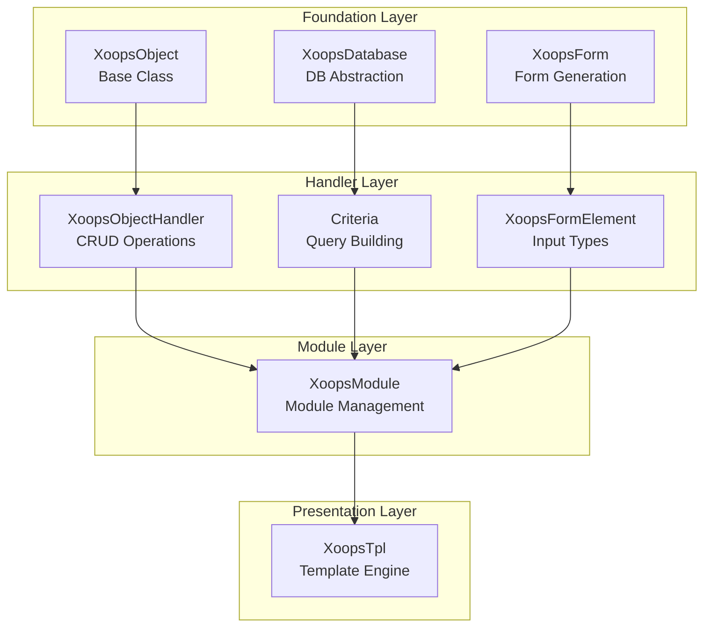
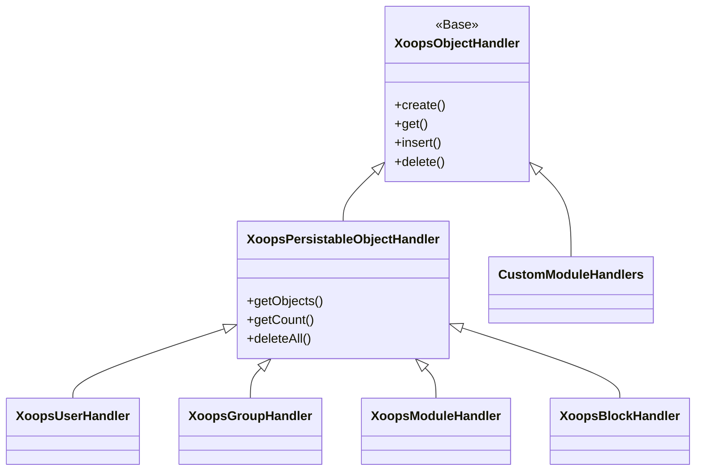
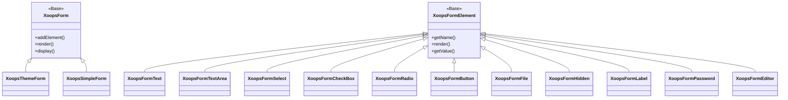

Üdvözöljük az átfogó XOOPS API referenciadokumentációban. Ez a rész részletes dokumentációt tartalmaz a XOOPS tartalomkezelő rendszert alkotó összes alapvető osztályhoz, metódushoz és rendszerhez.

## Áttekintés

A XOOPS API több fő alrendszerbe szerveződik, amelyek mindegyike a CMS funkció egy-egy aspektusáért felelős. Ezen API-k megértése elengedhetetlen a XOOPS modulok, témák és bővítmények fejlesztéséhez.

## API szakaszok

### Alapvető osztályok

Azok az alaposztályok, amelyekre az összes többi XOOPS komponens épül.

| Dokumentáció | Leírás |
|--------------|--------------|
| XOOPSObject | Alaposztály a XOOPS | összes adatobjektumhoz
| XOOPSObjectHandler | Kezelőminta CRUD műveletekhez |

### Adatbázis réteg

Adatbázis-absztrakció és lekérdezésépítő segédprogramok.

| Dokumentáció | Leírás |
|--------------|--------------|
| XOOPSDatabase | Adatbázis-absztrakciós réteg |
| Kritériumrendszer | Lekérdezési feltételek és feltételek |
| QueryBuilder | Modern gördülékeny lekérdezés épület |

### Űrlaprendszer

HTML űrlap létrehozása és érvényesítése.

| Dokumentáció | Leírás |
|--------------|--------------|
| XOOPSForm | Űrlaptartály és renderelés |
| Űrlapelemek | Minden elérhető űrlapelem-típus |

### Kernel osztályok

Alapvető rendszerelemek és szolgáltatások.

| Dokumentáció | Leírás |
|--------------|--------------|
| Kernel osztályok | Rendszermag és alapvető összetevők |

### modulrendszer

modulkezelés és életciklus.

| Dokumentáció | Leírás |
|--------------|--------------|
| modulrendszer | modul betöltése, telepítése és kezelése |

### Sablonrendszer

Okos sablon integráció.

| Dokumentáció | Leírás |
|--------------|--------------|
| Sablonrendszer | Intelligens integráció és sablonkezelés |

### Felhasználói rendszer

Felhasználókezelés és hitelesítés.

| Dokumentáció | Leírás |
|--------------|--------------|
| Felhasználói rendszer | Felhasználói fiókok, csoportok és engedélyek |

## Építészeti áttekintés



## Osztályhierarchia

### Objektummodell

```mermaid
classDiagram
    class XoopsObject {
        <<Base>>
        +getVar()
        +setVar()
        +toArray()
    }
    XoopsObject <|-- XoopsUser
    XoopsObject <|-- XoopsGroup
    XoopsObject <|-- XoopsModule
    XoopsObject <|-- XoopsBlock
    XoopsObject <|-- XoopsComment
    XoopsObject <|-- XoopsNotification
```



### Kezelő modell



### Űrlapmodell



## Tervezési minták

A XOOPS API számos jól ismert tervezési mintát valósít meg:

### Singleton minta
Globális szolgáltatásokhoz, például adatbázis-kapcsolatokhoz és konténerpéldányokhoz használják.

```php
$db = XoopsDatabase::getInstance();
$container = XoopsContainer::getInstance();
```

### Gyári minta
Az objektumkezelők következetesen hoznak létre tartományobjektumokat.

```php
$handler = xoops_getHandler('user');
$user = $handler->create();
```

### Összetett minta
Az űrlapok több űrlapelemet tartalmaznak; A feltételek beágyazott feltételeket tartalmazhatnak.

```php
$criteria = new CriteriaCompo();
$criteria->add(new Criteria('status', 1));
$criteria->add(new CriteriaCompo(...)); // Nested
```

### Megfigyelő minta
Az eseményrendszer lehetővé teszi a modulok közötti laza csatolást.

```php
$dispatcher->addListener('module.news.article_published', $callback);
```

## Példák a gyors használatbavételhez

### Objektum létrehozása és mentése

```php
// Get the handler
$handler = xoops_getHandler('user');

// Create a new object
$user = $handler->create();
$user->setVar('uname', 'newuser');
$user->setVar('email', 'user@example.com');

// Save to database
$handler->insert($user);
```

### Lekérdezés kritériumokkal

```php
// Build criteria
$criteria = new CriteriaCompo();
$criteria->add(new Criteria('level', 0, '>'));
$criteria->setSort('uname');
$criteria->setOrder('ASC');
$criteria->setLimit(10);

// Get objects
$handler = xoops_getHandler('user');
$users = $handler->getObjects($criteria);
```

### Űrlap létrehozása

```php
$form = new XoopsThemeForm('User Profile', 'userform', 'save.php', 'post', true);
$form->addElement(new XoopsFormText('Username', 'uname', 50, 255, $user->getVar('uname')));
$form->addElement(new XoopsFormTextArea('Bio', 'bio', $user->getVar('bio')));
$form->addElement(new XoopsFormButton('', 'submit', _SUBMIT, 'submit'));
echo $form->render();
```

## API Egyezmények

### Elnevezési szabályok

| Típus | Egyezmény | Példa |
|------|-----------|---------|
| Osztályok | PascalCase | `XOOPSUser`, `CriteriaCompo` |
| Módszerek | teveTok | `getVar()`, `setVar()` |
| Tulajdonságok | teveTok (védett) | `$_vars`, `$_handler` |
| Állandók | UPPER_SNAKE_CASE | `XOBJ_DTYPE_INT` |
| Adatbázis táblázatok | kígyótok | `users`, `groups_users_link` |

### Adattípusok

A XOOPS szabványos adattípusokat határoz meg az objektumváltozókhoz:

| Állandó | Típus | Leírás |
|----------|------|--------------|
| `XOBJ_DTYPE_TXTBOX` | String | Szövegbevitel (fertőtlenített) |
| `XOBJ_DTYPE_TXTAREA` | String | Szövegterület tartalma |
| `XOBJ_DTYPE_INT` | Egész | Numerikus értékek |
| `XOBJ_DTYPE_URL` | String | URL érvényesítés |
| `XOBJ_DTYPE_EMAIL` | String | E-mail ellenőrzés |
| `XOBJ_DTYPE_ARRAY` | Array | Soros tömbök |
| `XOBJ_DTYPE_OTHER` | Vegyes | Egyedi kezelés |
| `XOBJ_DTYPE_SOURCE` | String | Forráskód (minimális fertőtlenítés) |
| `XOBJ_DTYPE_STIME` | Egész | Rövid időbélyeg |
| `XOBJ_DTYPE_MTIME` | Egész | Közepes időbélyeg |
| `XOBJ_DTYPE_LTIME` | Egész | Hosszú időbélyeg |

## Hitelesítési módszerek

A API többféle hitelesítési módszert támogat:### API Kulcs hitelesítés
```
X-API-Key: your-api-key
```

### OAuth hordozó token
```
Authorization: Bearer your-oauth-token
```

### Munkamenet alapú hitelesítés
A meglévő XOOPS munkamenetet használja, amikor bejelentkezik.

## REST API végpontok

Ha a REST API engedélyezve van:

| Végpont | Módszer | Leírás |
|----------|--------|--------------|
| `/api.php/rest/users` | GET | Felhasználók listázása |
| `/api.php/rest/users/{id}` | GET | Felhasználó létrehozása a ID |
| `/api.php/rest/users` | POST | Felhasználó létrehozása |
| `/api.php/rest/users/{id}` | PUT | Felhasználó frissítése |
| `/api.php/rest/users/{id}` | DELETE | Felhasználó törlése |
| `/api.php/rest/modules` | GET | modulok listázása |

## Kapcsolódó dokumentáció

- modulfejlesztési útmutató
- Témafejlesztési útmutató
- Rendszerkonfiguráció
- Bevált biztonsági gyakorlatok

## Verzióelőzmények

| Verzió | Változások |
|---------|----------|
| 2.5.11 | Jelenlegi stabil kiadás |
| 2.5.10 | GraphQL API támogatás hozzáadva |
| 2.5.9 | Továbbfejlesztett kritériumrendszer |
| 2.5.8 | PSR-4 automatikus betöltés támogatása |

---

*Ez a dokumentáció a XOOPS Tudásbázis része. A legfrissebb frissítésekért keresse fel a [XOOPS GitHub adattárat](https://github.com/XOOPS).*
