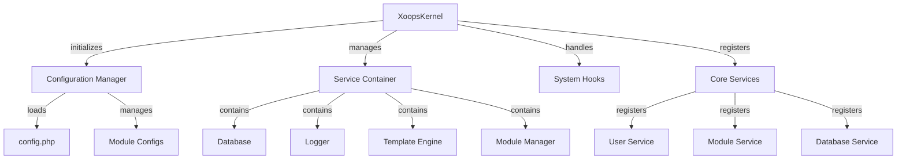

A XOOPS Kernel biztosítja az alapvető keretrendszert a rendszer indításához, a konfigurációk kezeléséhez, a rendszeresemények kezeléséhez és az alapvető segédprogramok biztosításához. Ezek az osztályok alkotják a XOOPS alkalmazás gerincét.

## Rendszerarchitektúra



## XOOPSKernel osztály

A fő kernelosztály, amely inicializálja és kezeli a XOOPS rendszert.

### Osztály áttekintése

```php
namespace Xoops;

class XoopsKernel
{
    private static ?XoopsKernel $instance = null;
    protected ServiceContainer $services;
    protected ConfigurationManager $config;
    protected array $modules = [];
    protected bool $isLoaded = false;
}
```

### Konstruktor

```php
private function __construct()
```

A privát kivitelező egyszemélyes mintát kényszerít ki.

### getInstance

Lekéri a singleton kernel példányt.

```php
public static function getInstance(): XoopsKernel
```

**Vissza:** `XOOPSKernel` – Az egyszemélyes kernelpéldány

**Példa:**
```php
$kernel = XoopsKernel::getInstance();
```

### Indítási folyamat

A kernel rendszerindítási folyamata a következő lépéseket követi:

1. **Inicializálás** - Hibakezelők beállítása, állandók meghatározása
2. **Konfiguráció** - Konfigurációs fájlok betöltése
3. **Szolgáltatás regisztráció** - Az alapvető szolgáltatások regisztrálása
4. **modulfelismerés** - Az aktív modulok vizsgálata és azonosítása
5. **Adatbázis inicializálása** - Csatlakozás az adatbázishoz
6. **Takarítás** - Készüljön fel a kérések kezelésére

```php
public function boot(): void
```

**Példa:**
```php
$kernel = XoopsKernel::getInstance();
$kernel->boot();
```

### Service Container Methods

#### regisztrációSzolgáltatás

Regisztrál egy szolgáltatást a szolgáltatástárolóban.

```php
public function registerService(
    string $name,
    callable|object $definition
): void
```

**Paraméterek:**

| Paraméter | Típus | Leírás |
|-----------|------|--------------|
| `$name` | húr | Szolgáltatásazonosító |
| `$definition` | hívható\|tárgy | Szervizgyár vagy példány |

**Példa:**
```php
$kernel->registerService('custom.handler', function($c) {
    return new CustomHandler();
});
```

#### getService

Lekér egy regisztrált szolgáltatást.

```php
public function getService(string $name): mixed
```

**Paraméterek:**

| Paraméter | Típus | Leírás |
|-----------|------|--------------|
| `$name` | húr | Szolgáltatásazonosító |

**Visszaküldés:** `mixed` – A kért szolgáltatás

**Példa:**
```php
$database = $kernel->getService('database');
$logger = $kernel->getService('logger');
```

#### hasService

Ellenőrzi, hogy egy szolgáltatás regisztrálva van-e.

```php
public function hasService(string $name): bool
```

**Példa:**
```php
if ($kernel->hasService('cache')) {
    $cache = $kernel->getService('cache');
}
```

## Konfigurációkezelő

Kezeli az alkalmazáskonfigurációt és a modulbeállításokat.

### Osztály áttekintése

```php
namespace Xoops\Core;

class ConfigurationManager
{
    protected array $config = [];
    protected array $defaults = [];
    protected string $configPath;
}
```

### Módszerek

#### betöltése

A konfigurációt betölti fájlból vagy tömbből.

```php
public function load(string|array $source): void
```

**Paraméterek:**

| Paraméter | Típus | Leírás |
|-----------|------|--------------|
| `$source` | string\|tömb | Konfigurációs fájl elérési útja vagy tömbje |

**Példa:**
```php
$config = $kernel->getService('config');
$config->load(XOOPS_ROOT_PATH . '/include/config.php');
$config->load(['sitename' => 'My Site', 'admin_email' => 'admin@example.com']);
```

#### kap

Lekér egy konfigurációs értéket.

```php
public function get(string $key, mixed $default = null): mixed
```

**Paraméterek:**

| Paraméter | Típus | Leírás |
|-----------|------|--------------|
| `$key` | húr | Konfigurációs kulcs (pont jelölés) |
| `$default` | vegyes | Alapértelmezett érték, ha nem található |

**Visszaküldés:** `mixed` - Konfigurációs érték

**Példa:**
```php
$siteName = $config->get('sitename');
$adminEmail = $config->get('admin.email', 'admin@example.com');
```

#### készlet

Beállít egy konfigurációs értéket.

```php
public function set(string $key, mixed $value): void
```

**Paraméterek:**

| Paraméter | Típus | Leírás |
|-----------|------|--------------|
| `$key` | húr | Konfigurációs kulcs |
| `$value` | vegyes | Konfigurációs érték |

**Példa:**
```php
$config->set('sitename', 'New Site Name');
$config->set('features.cache_enabled', true);
```

#### getmoduleConfig

Konfigurációt kér egy adott modulhoz.

```php
public function getModuleConfig(
    string $moduleName
): array
```

**Paraméterek:**

| Paraméter | Típus | Leírás |
|-----------|------|--------------|
| `$moduleName` | húr | modul könyvtár neve |

**Vissza:** `array` - modul konfigurációs tömb

**Példa:**
```php
$publisherConfig = $config->getModuleConfig('publisher');
```

## Rendszerhookok

A rendszerhookok lehetővé teszik a modulok és beépülő modulok számára, hogy kódot hajtsanak végre az alkalmazás életciklusának meghatározott pontjain.

### HookManager osztály

```php
namespace Xoops\Core;

class HookManager
{
    protected array $hooks = [];
    protected array $listeners = [];
}
```

### Módszerek

#### addHook

Regisztrál egy hook pontot.

```php
public function addHook(string $name): void
```

**Paraméterek:**

| Paraméter | Típus | Leírás |
|-----------|------|--------------|
| `$name` | húr | Horogazonosító |

**Példa:**
```php
$hooks = $kernel->getService('hooks');
$hooks->addHook('system.startup');
$hooks->addHook('user.login');
$hooks->addHook('module.install');
```

#### figyelj

A hallgatót egy hookhoz rögzíti.

```php
public function listen(
    string $hookName,
    callable $callback,
    int $priority = 10
): void
```

**Paraméterek:**

| Paraméter | Típus | Leírás |
|-----------|------|--------------|
| `$hookName` | húr | Horogazonosító |
| `$callback` | hívható | A végrehajtandó függvény |
| `$priority` | int | Végrehajtási prioritás (magasabb futtatások először) |

**Példa:**
```php
$hooks->listen('user.login', function($user) {
    error_log('User ' . $user->uname . ' logged in');
}, 10);

$hooks->listen('module.install', function($module) {
    // Custom module installation logic
    echo "Installing " . $module->getName();
}, 5);
```

#### trigger

Kivégzi az összes hallgatót egy hookért.

```php
public function trigger(
    string $hookName,
    mixed $arguments = null
): array
```

**Paraméterek:**| Paraméter | Típus | Leírás |
|-----------|------|--------------|
| `$hookName` | húr | Horogazonosító |
| `$arguments` | vegyes | A hallgatóknak továbbítandó adatok |

**Visszaküldés:** `array` - Eredmények az összes hallgatótól

**Példa:**
```php
$results = $hooks->trigger('system.startup');
$results = $hooks->trigger('user.created', $newUser);
```

## Az alapszolgáltatások áttekintése

A rendszermag számos alapvető szolgáltatást regisztrál a rendszerindítás során:

| Szolgáltatás | osztály | Cél |
|---------|-------|---------|
| `database` | XOOPSDatabase | Adatbázis-absztrakciós réteg |
| `config` | ConfigurationManager | Konfigurációkezelés |
| `logger` | Logger | Alkalmazásnaplózás |
| `template` | XOOPSTpl | Sablon motor |
| `user` | UserManager | Felhasználókezelési szolgáltatás |
| `module` | moduleManager | modulkezelés |
| `cache` | CacheManager | Gyorsítótárazási réteg |
| `hooks` | HookManager | Rendszeresemény-hookok |

## Teljes használati példa

```php
<?php
/**
 * Custom module boot process utilizing kernel
 */

// Get kernel instance
$kernel = XoopsKernel::getInstance();

// Boot the system
$kernel->boot();

// Get services
$config = $kernel->getService('config');
$database = $kernel->getService('database');
$logger = $kernel->getService('logger');
$hooks = $kernel->getService('hooks');

// Access configuration
$siteName = $config->get('sitename');
$adminEmail = $config->get('admin.email');

// Register module-specific hooks
$hooks->listen('user.login', function($user) {
    // Log user login
    $logger->info('User login: ' . $user->uname);

    // Track in database
    $database->query(
        'INSERT INTO ' . $database->prefix('event_log') .
        ' (type, user_id, message, timestamp) VALUES (?, ?, ?, ?)',
        ['login', $user->uid(), 'User login', time()]
    );
});

$hooks->listen('module.install', function($module) {
    $logger->info('Module installed: ' . $module->getName());
});

// Trigger hooks
$hooks->trigger('system.startup');

// Use database service
$result = $database->query(
    'SELECT * FROM ' . $database->prefix('users') .
    ' LIMIT 10'
);

while ($row = $database->fetchArray($result)) {
    echo "User: " . htmlspecialchars($row['uname']) . "\n";
}

// Register custom service
$kernel->registerService('custom.repository', function($c) {
    return new CustomRepository($c->getService('database'));
});

// Later access custom service
$repo = $kernel->getService('custom.repository');
```

## Alapkonstansok

A rendszermag számos fontos állandót határoz meg a rendszerindítás során:

```php
// System paths
define('XOOPS_ROOT_PATH', '/var/www/xoops');
define('XOOPS_HTDOCS_PATH', XOOPS_ROOT_PATH . '/htdocs');
define('XOOPS_MODULES_PATH', XOOPS_ROOT_PATH . '/htdocs/modules');
define('XOOPS_THEMES_PATH', XOOPS_ROOT_PATH . '/htdocs/themes');

// Web paths
define('XOOPS_URL', 'http://example.com');
define('XOOPS_HTDOCS_URL', XOOPS_URL . '/htdocs');

// Database
define('XOOPS_DB_PREFIX', 'xoops_');
```

## Hibakezelés

A kernel hibakezelőket állít be a rendszerindítás során:

```php
// Set custom error handler
set_error_handler(function($errno, $errstr, $errfile, $errline) {
    $kernel->getService('logger')->error(
        "Error: $errstr in $errfile:$errline"
    );
});

// Set exception handler
set_exception_handler(function($exception) {
    $kernel->getService('logger')->critical(
        "Exception: " . $exception->getMessage()
    );
});
```

## Bevált gyakorlatok

1. **Egyszeri rendszerindítás** – A `boot()`-t csak egyszer hívja az alkalmazás indításakor
2. **A Service Container használata** – Regisztráljon és kérjen le szolgáltatásokat a kernelen keresztül
3. **Kezelje korai hookokat** - Regisztrálja a hookhallgatókat, mielőtt elindítaná őket
4. **Fontos események naplózása** – Hibakereséshez használja a naplózó szolgáltatást
5. **Gyorsítótár konfigurációja** - Töltsd be egyszer a konfigurációt, és használd újra
6. **Hibakezelés** - Mindig állítson be hibakezelőket a kérések feldolgozása előtt

## Kapcsolódó dokumentáció

- ../module/module-System - modulrendszer és életciklus
- ../Template/Template-System - Sablonmotor integráció
- ../User/User-System - Felhasználó hitelesítés és kezelése
- ../Database/XOOPSDatabase - Adatbázis réteg

---

*Lásd még: [XOOPS Kernelforrás](https://github.com/XOOPS/XOOPSCore27/tree/master/htdocs/class)*
