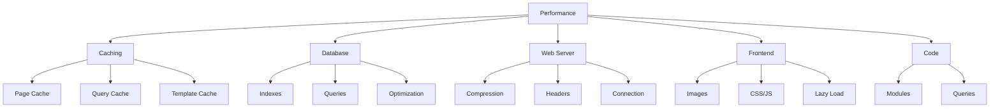

# XOOPS Teljesítményoptimalizálás

Comprehensive guide to optimizing XOOPS for maximum speed and efficiency.

## Teljesítményoptimalizálás áttekintése



## Gyorsítótárazási konfiguráció

A gyorsítótárazás a teljesítmény javításának leggyorsabb módja.

### Oldalszintű gyorsítótár

Teljes oldal gyorsítótárazás engedélyezése a XOOPS-ban:

**Felügyeleti panel > Rendszer > Beállítások > Gyorsítótár beállításai**

```
Enable Caching: Yes
Cache Type: File Cache (or APCu/Memcache)
Cache Lifetime: 3600 seconds (1 hour)
Cache Module Lists: Yes
Cache Configuration: Yes
Cache Search Results: Yes
```

### Fájlalapú gyorsítótár

Állítsa be a fájl gyorsítótár helyét:

```bash
# Create cache directory outside web root (more secure)
mkdir -p /var/cache/xoops
chown www-data:www-data /var/cache/xoops
chmod 755 /var/cache/xoops

# Edit mainfile.php
define('XOOPS_CACHE_PATH', '/var/cache/xoops/');
```

### APCu gyorsítótár

Az APCu a memórián belüli gyorsítótárat biztosít (nagyon gyors):

```bash
# Install APCu
apt-get install php-apcu

# Verify installation
php -m | grep apcu

# Configure in php.ini
apc.enabled = 1
apc.memory_size = 128M
apc.ttl = 0
apc.user_ttl = 3600
apc.shm_size = 128
```

Engedélyezés a XOOPS-ban:

**Felügyeleti panel > Rendszer > Beállítások > Gyorsítótár beállításai**

```
Cache Type: APCu
```

### Memcache/Redis Gyorsítótár

Elosztott gyorsítótárazás nagy forgalmú webhelyekhez:

**Telepítse a Memcache-t:**

```bash
# Install Memcache server
apt-get install memcached

# Start service
systemctl start memcached
systemctl enable memcached

# Verify running
netstat -tlnp | grep memcached
# Should show listening on port 11211
```

**Konfigurálás a XOOPS-ban:**

mainfile.php szerkesztése:

```php
// Memcache configuration
define('XOOPS_CACHE_TYPE', 'memcache');
define('XOOPS_CACHE_HOST', 'localhost');
define('XOOPS_CACHE_PORT', 11211);
define('XOOPS_CACHE_TIMEOUT', 0);
```

Vagy az adminisztrációs panelen:

```
Cache Type: Memcache
Memcache Host: localhost:11211
```

### Sablon gyorsítótár

Fordítsa le és tárolja gyorsítótárban a XOOPS sablonokat:

```bash
# Ensure templates_c is writable
chmod 777 /var/www/html/xoops/templates_c/

# Clear old cached templates
rm -rf /var/www/html/xoops/templates_c/*
```

Konfigurálás a témában:

```html
<!-- In theme xoops_version.php -->
{smarty.const.XOOPS_VAR_PATH|constant}
<{$xoops_meta}>

<!-- Templates use caching -->
{cache}
    [Cached content here]
{/cache}
```

## Adatbázis optimalizálás

### Adatbázis-indexek hozzáadása

A megfelelően indexelt adatbázisok sokkal gyorsabban kérdeznek le.

```sql
-- Check current indexes
SHOW INDEXES FROM xoops_users;

-- Common indexes to add
ALTER TABLE xoops_users ADD INDEX idx_uname (uname);
ALTER TABLE xoops_users ADD INDEX idx_email (email);
ALTER TABLE xoops_users ADD INDEX idx_uid_active (uid, user_actkey);

-- Add indexes to posts/content tables
ALTER TABLE xoops_posts ADD INDEX idx_post_published (post_published);
ALTER TABLE xoops_posts ADD INDEX idx_post_uid (post_uid);
ALTER TABLE xoops_posts ADD INDEX idx_post_created (post_created);

-- Verify indexes created
SHOW INDEXES FROM xoops_users\G
```

### Táblázatok optimalizálása

A rendszeres táblázatoptimalizálás javítja a teljesítményt:

```sql
-- Optimize all tables
OPTIMIZE TABLE xoops_users;
OPTIMIZE TABLE xoops_posts;
OPTIMIZE TABLE xoops_config;
OPTIMIZE TABLE xoops_comments;

-- Or optimize all at once
REPAIR TABLE xoops_users;
OPTIMIZE TABLE xoops_users;
REPAIR TABLE xoops_posts;
OPTIMIZE TABLE xoops_posts;
```

Automatikus optimalizálási szkript létrehozása:

```bash
#!/bin/bash
# Database optimization script

echo "Optimizing XOOPS database..."

mysql -u xoops_user -p xoops_db << EOF
-- Optimize all tables
OPTIMIZE TABLE xoops_users;
OPTIMIZE TABLE xoops_posts;
OPTIMIZE TABLE xoops_config;
OPTIMIZE TABLE xoops_comments;
OPTIMIZE TABLE xoops_users_online;

-- Show database size
SELECT table_schema,
       ROUND(SUM(data_length + index_length) / 1024 / 1024, 2) as total_mb
FROM information_schema.tables
WHERE table_schema = 'xoops_db'
GROUP BY table_schema;
EOF

echo "Database optimization completed!"
```

Ütemezés cronnal:

```bash
# Weekly optimization
crontab -e
# Add: 0 3 * * 0 /usr/local/bin/optimize-xoops-db.sh
```

### Lekérdezésoptimalizálás

Tekintse át a lassú lekérdezéseket:

```sql
-- Enable slow query log
SET GLOBAL slow_query_log = 'ON';
SET GLOBAL long_query_time = 2;

-- View slow queries
SELECT * FROM mysql.slow_log;

-- Or check slow log file
tail -100 /var/log/mysql/slow.log
```

Általános optimalizálási technikák:

```php
// SLOW - Avoid unnecessary queries in loops
foreach ($users as $user) {
    $profile = getUserProfile($user['uid']);  // Query in loop!
    echo $profile['name'];
}

// FAST - Get all data at once
$profiles = getAllUserProfiles($user_ids);
foreach ($users as $user) {
    echo $profiles[$user['uid']]['name'];
}
```

### Pufferkészlet növelése

A MySQL konfigurálása a jobb gyorsítótárazás érdekében:

`/etc/mysql/mysql.conf.d/mysqld.cnf` szerkesztése:

```ini
# InnoDB Buffer Pool (50-80% of system RAM)
innodb_buffer_pool_size = 1G

# Query Cache (optional, can be disabled in MySQL 5.7+)
query_cache_size = 64M
query_cache_type = 1

# Max Connections
max_connections = 500

# Max Allowed Packet
max_allowed_packet = 256M

# Connection timeout
connect_timeout = 10
```

Indítsa újra a MySQL-t:

```bash
systemctl restart mysql
```

## Webszerver optimalizálás

### Gzip-tömörítés engedélyezése

A válaszok tömörítése a sávszélesség csökkentése érdekében:

**Apache konfiguráció:**

```apache
<IfModule mod_deflate.c>
    AddOutputFilterByType DEFLATE text/html text/plain text/xml text/css text/javascript application/javascript application/json

    # Don't compress images and already compressed files
    SetEnvIfNoCase Request_URI \.(jpg|jpeg|png|gif|zip|gzip)$ no-gzip dont-vary

    # Log compressed responses
    DeflateBufferSize 8096
</IfModule>
```

**Nginx konfiguráció:**

```nginx
gzip on;
gzip_types text/html text/plain text/css text/javascript application/javascript application/json;
gzip_min_length 1000;
gzip_vary on;
gzip_comp_level 6;

# Don't compress already compressed formats
gzip_disable "msie6";
```

Tömörítés ellenőrzése:

```bash
# Check if response is gzipped
curl -I -H "Accept-Encoding: gzip" http://your-domain.com/xoops/

# Should show:
# Content-Encoding: gzip
```

### Böngésző fejlécek gyorsítótárazása

Állítsa be a gyorsítótár lejáratát a statikus eszközökhöz:

**Apache:**

```apache
<IfModule mod_expires.c>
    ExpiresActive On

    # Cache images for 30 days
    ExpiresByType image/jpeg "access plus 30 days"
    ExpiresByType image/gif "access plus 30 days"
    ExpiresByType image/png "access plus 30 days"
    ExpiresByType image/svg+xml "access plus 30 days"

    # Cache CSS/JS for 30 days
    ExpiresByType text/css "access plus 30 days"
    ExpiresByType application/javascript "access plus 30 days"
    ExpiresByType text/javascript "access plus 30 days"

    # Cache fonts for 1 year
    ExpiresByType font/eot "access plus 1 year"
    ExpiresByType font/ttf "access plus 1 year"
    ExpiresByType font/woff "access plus 1 year"
    ExpiresByType font/woff2 "access plus 1 year"

    # Don't cache HTML
    ExpiresByType text/html "access plus 1 hour"
</IfModule>
```

**Nginx:**

```nginx
location ~* \.(jpg|jpeg|png|gif|ico|svg|woff|woff2|ttf|eot)$ {
    expires 30d;
    add_header Cache-Control "public, immutable";
}

location ~* \.(css|js)$ {
    expires 30d;
    add_header Cache-Control "public";
}

location ~ \.html$ {
    expires 1h;
    add_header Cache-Control "public";
}
```

### Connection Keep-Alive

Állandó HTTP kapcsolatok engedélyezése:

**Apache:**

```apache
<IfModule mod_http.c>
    KeepAlive On
    KeepAliveTimeout 15
    MaxKeepAliveRequests 100
</IfModule>
```

**Nginx:**

```nginx
keepalive_timeout 15s;
keepalive_requests 100;
```

## Előtér-optimalizálás

### Képek optimalizálása

Csökkentse a képfájlok méretét:

```bash
# Batch compress JPEG images
for img in *.jpg; do
    convert "$img" -quality 85 "optimized_$img"
done

# Batch compress PNG images
for img in *.png; do
    optipng -o2 "$img"
done

# Or use imagemin CLI
npm install -g imagemin-cli
imagemin images/ --out-dir=images-optimized
```

### A CSS és a JavaScript kicsinyítése

Csökkentse a CSS/JS fájlméretet:

**A Node.js eszközök használata:**

```bash
# Install minifiers
npm install -g uglify-js clean-css-cli

# Minify JavaScript
uglifyjs script.js -o script.min.js

# Minify CSS
cleancss style.css -o style.min.css
```

**Online eszközök használata:**
- CSS Minifier: https://cssminifier.com/
- JavaScript Minifier: https://www.minifycode.com/javascript-minifier/

### Képek Lusta betöltése

Csak szükség esetén töltsön be képeket:

```html
<!-- Add loading="lazy" attribute -->


<!-- Or use JavaScript library for older browsers -->


<script src="https://cdnjs.cloudflare.com/ajax/libs/vanilla-lazyload/17.1.2/lazyload.min.js"></script>
<script>
    var lazyLoad = new LazyLoad({
        elements_selector: ".lazy"
    });
</script>
```

### A megjelenítést blokkoló erőforrások csökkentése

A CSS/JS stratégiai betöltése:

```html
<!-- Load critical CSS inline -->
<style>
    /* Critical styles for above-the-fold */
</style>

<!-- Defer non-critical CSS -->
<link rel="stylesheet" href="style.css" media="print" onload="this.media='all'">

<!-- Defer JavaScript -->
<script src="script.js" defer></script>

<!-- Or use async for non-critical scripts -->
<script src="analytics.js" async></script>
```

## CDN Integráció

Használjon tartalomszolgáltató hálózatot a gyorsabb globális hozzáférés érdekében.

### Népszerű CDN-ek

| CDN | Költség | Jellemzők |
|---|---|---|
| Cloudflare | Free/Paid | DDoS, DNS, gyorsítótár, Analytics |
| AWS CloudFront | Fizetett | Nagy teljesítményű, globális |
| Nyuszi CDN | Megfizethető | Tárhely, videó, gyorsítótár |
| jsDelivr | Ingyenes | JavaScript-könyvtárak |
| cdnjs | Ingyenes | Népszerű könyvtárak |

### Cloudflare beállítása

1. Regisztráljon a https://www.cloudflare.com/ címen
2. Add your domain
3. Frissítse a névszervereket a Cloudflare segítségével
4. Engedélyezze a gyorsítótárazási beállításokat:
   - Gyorsítótár szintje: Agresszív
   - Gyorsítótárazás mindenről: Be
   - Böngésző gyorsítótárazása TTL: 1 hónap

5. A XOOPS-ban frissítse domainjét a Cloudflare DNS használatához.

### A CDN konfigurálása a XOOPS-ban

A képek URL-jének frissítése a következőre: CDN:

Témasablon szerkesztése:

```html
<!-- Original -->


<!-- With CDN -->

```

Vagy állítsa be a PHP-ban:

```php
// In mainfile.php or config
define('XOOPS_CDN_URL', 'https://cdn.your-domain.com');

// In template

```

## Teljesítményfigyelés

### PageSpeed Insights teszt

Tesztelje webhelye teljesítményét:

1. Látogassa meg a Google PageSpeed Insights webhelyet: https://pagespeed.web.dev/
2. Adja meg XOOPS URL
3. Tekintse át az ajánlásokat
4. Hajtsa végre a javasolt fejlesztéseket

### Kiszolgálóteljesítmény-figyelés

Valós idejű szerver mérőszámok figyelése:

```bash
# Install monitoring tools
apt-get install htop iotop nethogs

# Monitor CPU and memory
htop

# Monitor disk I/O
iotop

# Monitor network
nethogs
```

### PHP Teljesítményprofil

A lassú PHP kód azonosítása:

```php
<?php
// Use Xdebug for profiling
xdebug_start_trace('profile');

// Your code here
$result = someExpensiveFunction();

xdebug_stop_trace();
?>
```

### MySQL Query Monitoring

Lassú lekérdezések nyomon követése:

```bash
# Enable query logging
mysql -u root -p

SET GLOBAL general_log = 'ON';
SET GLOBAL log_output = 'FILE';
SET GLOBAL general_log_file = '/var/log/mysql/query.log';

# Review slow queries
tail -f /var/log/mysql/slow.log

# Analyze query with EXPLAIN
EXPLAIN SELECT * FROM xoops_users WHERE uid = 1\G
```

## Teljesítményoptimalizálási ellenőrzőlista

A legjobb teljesítmény érdekében hajtsa végre ezeket:- [ ] **Gyorsítótár:** file/APCu/Memcache gyorsítótár engedélyezése
- [ ] **Adatbázis:** Indexek hozzáadása, táblázatok optimalizálása
- [ ] **Tömörítés:** Gzip-tömörítés engedélyezése
- [ ] **Böngésző gyorsítótár:** A gyorsítótár fejléceinek beállítása
- [ ] **Képek:** Optimalizálás és tömörítés
- [ ] **CSS/JS:** Fájlok kicsinyítése
- [ ] **Lazy Loading:** Készülék a képekhez
- [ ] **CDN:** Használja statikus eszközökhöz
- [ ] **Keep-Alive:** Állandó kapcsolatok engedélyezése
- [ ] **modulok:** A nem használt modulok letiltása
- [ ] **Témák:** Használjon könnyű, optimalizált témákat
- [ ] **Monitoring:** Nyomon követheti a teljesítménymutatókat
- [ ] **Rendszeres karbantartás:** Gyorsítótár törlése, DB optimalizálása

## Teljesítményoptimalizáló szkript

Automatizált optimalizálás:

```bash
#!/bin/bash
# Performance optimization script

echo "=== XOOPS Performance Optimization ==="

# Clear cache
echo "Clearing cache..."
rm -rf /var/www/html/xoops/cache/*
rm -rf /var/www/html/xoops/templates_c/*

# Optimize database
echo "Optimizing database..."
mysql -u xoops_user -p xoops_db << EOF
OPTIMIZE TABLE xoops_users;
OPTIMIZE TABLE xoops_posts;
OPTIMIZE TABLE xoops_config;
OPTIMIZE TABLE xoops_comments;
EOF

# Check file permissions
echo "Verifying file permissions..."
find /var/www/html/xoops -type f -exec chmod 644 {} \;
find /var/www/html/xoops -type d -exec chmod 755 {} \;
chmod 777 /var/www/html/xoops/cache
chmod 777 /var/www/html/xoops/templates_c
chmod 777 /var/www/html/xoops/uploads
chmod 777 /var/www/html/xoops/var

# Generate performance report
echo "Performance Optimization Complete!"
echo ""
echo "Next steps:"
echo "1. Test site at https://pagespeed.web.dev/"
echo "2. Monitor performance in admin panel"
echo "3. Consider CDN for static assets"
echo "4. Review slow queries in MySQL"
```

## Előtte és Utána mutatók

A pálya fejlesztései:

```
Before Optimization:
- Page Load Time: 3.5 seconds
- Database Queries: 45
- Cache Hit Rate: 0%
- Database Size: 250MB

After Optimization:
- Page Load Time: 0.8 seconds (77% faster)
- Database Queries: 8 (cached)
- Cache Hit Rate: 85%
- Database Size: 120MB (optimized)
```

## Következő lépések

1. Tekintse át az alapvető konfigurációt
2. Biztosítsa a biztonsági intézkedéseket
3. Gyorsítótárazás megvalósítása
4. Kövesse nyomon a teljesítményt eszközökkel
5. Állítsa be a mérőszámok alapján

---

**Címkék:** #teljesítmény #optimalizálás #gyorsítótár #adatbázis #cdn

**Kapcsolódó cikkek:**
- ../../06-Publisher-module/User-Guide/Basic-Configuration
- Rendszerbeállítások
- Biztonság-konfiguráció
- ../Installation/Server-Requirements
