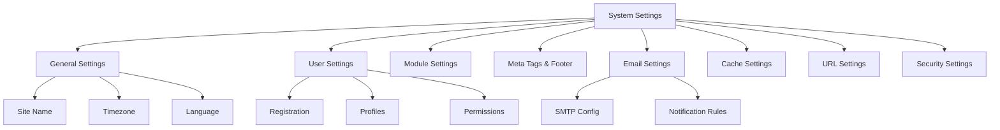

# XOOPS Rendszerbeállítások

Ez az útmutató a XOOPS adminisztrációs panelen elérhető teljes rendszerbeállításokat tartalmazza, kategóriák szerint rendezve.

## Rendszerbeállítások architektúrája



## A rendszerbeállítások elérése

### Helyszín

**Felügyeleti panel > Rendszer > Beállítások**

Vagy navigáljon közvetlenül:

```
http://your-domain.com/xoops/admin/index.php?fct=preferences
```

### Engedélykövetelmények

- Csak a rendszergazdák (webmesterek) férhetnek hozzá a rendszerbeállításokhoz
- A változások az egész oldalt érintik
- A legtöbb változtatás azonnal életbe lép

## Általános beállítások

A XOOPS telepítés alapkonfigurációja.

### Alapvető információk

```
Site Name: [Your Site Name]
Default Description: [Brief description of your site]
Site Slogan: [Catchy slogan]
Admin Email: admin@your-domain.com
Webmaster Name: Administrator Name
Webmaster Email: admin@your-domain.com
```

### Megjelenés beállításai

```
Default Theme: [Select theme]
Default Language: English (or preferred language)
Items Per Page: 15 (typically 10-25)
Words in Snippet: 25 (for search results)
Theme Upload Permission: Disabled (security)
```

### Területi beállítások

```
Default Timezone: [Your timezone]
Date Format: %Y-%m-%d (YYYY-MM-DD format)
Time Format: %H:%M:%S (HH:MM:SS format)
Daylight Saving Time: [Auto/Manual/None]
```

**Időzóna formátum táblázat:**

| Régió | Időzóna | UTC Eltolás |
|---|---|---|
| USA keleti | America/New_York | -5 / -4 |
| US Central | America/Chicago | -6 / -5 |
| US Mountain | America/Denver | -7 / -6 |
| USA csendes-óceáni | America/Los_Angeles | -8 / -7 |
| UK/London | Europe/London | 0 / +1 |
| France/Germany | Europe/Paris | +1 / +2 |
| Japán | Asia/Tokyo | +9 |
| Kína | Asia/Shanghai | +8 |
| Australia/Sydney | Australia/Sydney | +10 / +11 |

### Keresési konfiguráció

```
Enable Search: Yes
Search Admin Pages: Yes/No
Search Archives: Yes
Default Search Type: All / Pages only
Words Excluded from Search: [Comma-separated list]
```

**Gyakori kizárt szavak:** the, a, an, and, or, but, in, on, at, by, to, from

## Felhasználói beállítások

A felhasználói fiók viselkedésének és regisztrációs folyamatának szabályozása.

### Felhasználói regisztráció

```
Allow User Registration: Yes/No
Registration Type:
  ☐ Auto-activate (Instant access)
  ☐ Admin approval (Admin must approve)
  ☐ Email verification (User must verify email)

Notification to Users: Yes/No
User Email Verification: Required/Optional
```

### Új felhasználói konfiguráció

```
Auto-login New Users: Yes/No
Assign Default User Group: Yes
Default User Group: [Select group]
Create User Avatar: Yes/No
Initial User Avatar: [Select default]
```

### Felhasználói profil beállításai

```
Allow User Profiles: Yes
Show Member List: Yes
Show User Statistics: Yes
Show Last Online Time: Yes
Allow User Avatar: Yes
Avatar Max File Size: 100KB
Avatar Dimensions: 100x100 pixels
```

### Felhasználói e-mail beállítások

```
Allow Users to Hide Email: Yes
Show Email on Profile: Yes
Notification Email Interval: Immediately/Daily/Weekly/Never
```

### Felhasználói tevékenység követése

```
Track User Activity: Yes
Log User Logins: Yes
Log Failed Logins: Yes
Track IP Address: Yes
Clear Activity Logs Older Than: 90 days
```

### Fiókkorlátok

```
Allow Duplicate Email: No
Minimum Username Length: 3 characters
Maximum Username Length: 15 characters
Minimum Password Length: 6 characters
Require Special Characters: Yes
Require Numbers: Yes
Password Expiration: 90 days (or Never)
Accounts Inactive Days to Delete: 365 days
```

## modul beállításai

Konfigurálja az egyes modulok viselkedését.

### Közös modulopciók

Minden telepített modulhoz beállíthatja:

```
Module Status: Active/Inactive
Display in Menu: Yes/No
Module Weight: [1-999] (higher = lower in display)
Homepage Default: This module shows when visiting /
Admin Access: [Allowed user groups]
User Access: [Allowed user groups]
```

### Rendszermodul beállítások

```
Show Homepage as: Portal / Module / Static Page
Default Homepage Module: [Select module]
Show Footer Menu: Yes
Footer Color: [Color selector]
Show System Stats: Yes
Show Memory Usage: Yes
```

### Konfiguráció modulonként

Minden modulnak lehetnek modulspecifikus beállításai:

**Példa – Oldalmodul:**
```
Enable Comments: Yes/No
Moderate Comments: Yes/No
Comments Per Page: 10
Enable Ratings: Yes
Allow Anonymous Ratings: Yes
```

**Példa – Felhasználói modul:**
```
Avatar Upload Folder: ./uploads/
Maximum Upload Size: 100KB
Allow File Upload: Yes
Allowed File Types: jpg, gif, png
```

modul-specifikus beállítások elérése:
- **Adminisztrálás > modulok > [modul neve] > Beállítások**

## Metacímkék és SEO beállítások

Metacímkék konfigurálása a keresőoptimalizáláshoz.

### Globális metacímkék

```
Meta Keywords: xoops, cms, content management system
Meta Description: A powerful content management system for building dynamic websites
Meta Author: Your Name
Meta Copyright: Copyright 2025, Your Company
Meta Robots: index, follow
Meta Revisit: 30 days
```

### A metacímkék bevált gyakorlatai

| Címke | Cél | ajánlás |
|---|---|---|
| Kulcsszavak | Keresési kifejezések | 5-10 releváns kulcsszó, vesszővel elválasztva |
| Leírás | Keresés a listában | 150-160 karakter |
| Szerző | Oldal készítője | Az Ön neve vagy cége |
| Copyright | Jogi | Az Ön szerzői jogi megjegyzése |
| Robotok | A robottal kapcsolatos utasítások | index, követés (indexelés engedélyezése) |

### Lábléc beállításai

```
Show Footer: Yes
Footer Color: Dark/Light
Footer Background: [Color code]
Footer Text: [HTML allowed]
Additional Footer Links: [URL and text pairs]
```

**Minta lábléc HTML:**
```html
<p>Copyright &copy; 2025 Your Company. All rights reserved.</p>
<p><a href="/privacy">Privacy Policy</a> | <a href="/terms">Terms of Use</a></p>
```

### Közösségi metacímkék (Open Graph)

```
Enable Open Graph: Yes
Facebook App ID: [App ID]
Twitter Card Type: summary / summary_large_image / player
Default Share Image: [Image URL]
```

## E-mail beállítások

E-mail kézbesítési és értesítési rendszer beállítása.

### E-mail kézbesítési mód

```
Use SMTP: Yes/No

If SMTP:
  SMTP Host: smtp.gmail.com
  SMTP Port: 587 (TLS) or 465 (SSL)
  SMTP Security: TLS / SSL / None
  SMTP Username: [email@example.com]
  SMTP Password: [password]
  SMTP Authentication: Yes/No
  SMTP Timeout: 10 seconds

If PHP mail():
  Sendmail Path: /usr/sbin/sendmail -t -i
```

### E-mail konfiguráció

```
From Address: noreply@your-domain.com
From Name: Your Site Name
Reply-To Address: support@your-domain.com
BCC Admin Emails: Yes/No
```

### Értesítési beállítások

```
Send Welcome Email: Yes/No
Welcome Email Subject: Welcome to [Site Name]
Welcome Email Body: [Custom message]

Send Password Reset Email: Yes/No
Include Random Password: Yes/No
Token Expiration: 24 hours
```

### Rendszergazdai értesítések

```
Notify Admin on Registration: Yes
Notify Admin on Comments: Yes
Notify Admin on Submissions: Yes
Notify Admin on Errors: Yes
```

### Felhasználói értesítések

```
Notify User on Registration: Yes
Notify User on Comments: Yes
Notify User on Private Messages: Yes
Allow Users to Disable Notifications: Yes
Default Notification Frequency: Immediately
```

### E-mail sablonok

Értesítési e-mailek testreszabása az adminisztrációs panelen:

**Elérési út:** Rendszer > E-mail sablonok

Elérhető sablonok:
- Felhasználó regisztráció
- Jelszó visszaállítása
- Megjegyzés értesítés
- Privát üzenet
- Rendszerfigyelmeztetések
- modul-specifikus e-mailek

## Gyorsítótár beállításai

A teljesítmény optimalizálása gyorsítótárazással.

### Gyorsítótár konfigurációja

```
Enable Caching: Yes/No
Cache Type:
  ☐ File Cache
  ☐ APCu (Alternative PHP Cache)
  ☐ Memcache (Distributed caching)
  ☐ Redis (Advanced caching)

Cache Lifetime: 3600 seconds (1 hour)
```

### Gyorsítótár beállításai típus szerint

**Fájlgyorsítótár:**
```
Cache Directory: /var/www/html/xoops/cache/
Clear Interval: Daily
Maximum Cache Files: 1000
```

**APCu gyorsítótár:**
```
Memory Allocation: 128MB
Fragmentation Level: Low
```

**Memcache/Redis:**
```
Server Host: localhost
Server Port: 11211 (Memcache) / 6379 (Redis)
Persistent Connection: Yes
```

### Mi kerül gyorsítótárba

```
Cache Module Lists: Yes
Cache Configuration Data: Yes
Cache Template Data: Yes
Cache User Session Data: Yes
Cache Search Results: Yes
Cache Database Queries: Yes
Cache RSS Feeds: Yes
Cache Images: Yes
```

## URL Beállítások

A URL újraírás és formázás konfigurálása.

### Barátságos URL beállítások

```
Enable Friendly URLs: Yes/No
Friendly URL Type:
  ☐ Path Info: /page/about
  ☐ Query String: /index.php?p=about

Trailing Slash: Include / Omit
URL Case: Lower case / Case sensitive
```

### URL Átírási szabályok

```
.htaccess Rules: [Display current]
Nginx Rules: [Display current if Nginx]
IIS Rules: [Display current if IIS]
```

## Biztonsági beállítások

A biztonsággal kapcsolatos konfiguráció szabályozása.

### Jelszavas biztonság

```
Password Policy:
  ☐ Require uppercase letters
  ☐ Require lowercase letters
  ☐ Require numbers
  ☐ Require special characters

Minimum Password Length: 8 characters
Password Expiration: 90 days
Password History: Remember last 5 passwords
Force Password Change: On next login
```

### Bejelentkezési biztonság

```
Lock Account After Failed Attempts: 5 attempts
Lock Duration: 15 minutes
Log All Login Attempts: Yes
Log Failed Logins: Yes
Admin Login Alert: Send email on admin login
Two-Factor Authentication: Disabled/Enabled
```

### Fájlfeltöltés biztonsága

```
Allow File Uploads: Yes/No
Maximum File Size: 128MB
Allowed File Types: jpg, gif, png, pdf, zip, doc, docx
Scan Uploads for Malware: Yes (if available)
Quarantine Suspicious Files: Yes
```

### Session Security

```
Session Management: Database/Files
Session Timeout: 1800 seconds (30 min)
Session Cookie Lifetime: 0 (until browser closes)
Secure Cookie: Yes (HTTPS only)
HTTP Only Cookie: Yes (prevent JavaScript access)
```

### CORS Beállítások

```
Allow Cross-Origin Requests: No
Allowed Origins: [List domains]
Allow Credentials: No
Allowed Methods: GET, POST
```

## Speciális beállítások

További konfigurációs lehetőségek haladó felhasználók számára.

### Hibakeresési mód

```
Debug Mode: Disabled/Enabled
Log Level: Error / Warning / Info / Debug
Debug Log File: /var/log/xoops_debug.log
Display Errors: Disabled (production)
```

### Teljesítményhangolás

```
Optimize Database Queries: Yes
Use Query Cache: Yes
Compress Output: Yes
Minify CSS/JavaScript: Yes
Lazy Load Images: Yes
```

### Tartalombeállítások
```
Allow HTML in Posts: Yes/No
Allowed HTML Tags: [Configure]
Strip Harmful Code: Yes
Allow Embed: Yes/No
Content Moderation: Automatic/Manual
Spam Detection: Yes
```

## Beállítások Export/Import

### Biztonsági mentés beállításai

Aktuális beállítások exportálása:

**Felügyeleti panel > Rendszer > Eszközök > Exportálási beállítások**

```bash
# Settings exported as JSON file
# Download and store securely
```

### Beállítások visszaállítása

Korábban exportált beállítások importálása:

**Felügyeleti panel > Rendszer > Eszközök > Beállítások importálása**

```bash
# Upload JSON file
# Verify changes before confirming
```

## Konfigurációs hierarchia

XOOPS beállítási hierarchia (fentről lefelé – az első meccs nyer):

```
1. mainfile.php (Constants)
2. Module-specific config
3. Admin System Settings
4. Theme configuration
5. User preferences (for user-specific settings)
```

## Beállítások biztonsági mentési szkript

Készítsen biztonsági másolatot az aktuális beállításokról:

```php
<?php
// Backup script: /var/www/html/xoops/backup-settings.php
require_once __DIR__ . '/mainfile.php';

$config_handler = xoops_getHandler('config');
$configs = $config_handler->getConfigs();

$backup = [
    'exported_date' => date('Y-m-d H:i:s'),
    'xoops_version' => XOOPS_VERSION,
    'php_version' => PHP_VERSION,
    'settings' => []
];

foreach ($configs as $config) {
    $backup['settings'][$config->getVar('conf_name')] = [
        'value' => $config->getVar('conf_value'),
        'description' => $config->getVar('conf_desc'),
        'type' => $config->getVar('conf_type'),
    ];
}

// Save to JSON file
file_put_contents(
    '/backups/xoops_settings_' . date('YmdHis') . '.json',
    json_encode($backup, JSON_PRETTY_PRINT)
);

echo "Settings backed up successfully!";
?>
```

## Általános beállítások módosításai

### Webhely nevének módosítása

1. Adminisztráció > Rendszer > Beállítások > Általános beállítások
2. A "Webhelynév" módosítása
3. Kattintson a "Mentés" gombra.

### Enable/Disable Regisztráció

1. Adminisztráció > Rendszer > Beállítások > Felhasználói beállítások
2. Kapcsolja be a "Felhasználói regisztráció engedélyezése" lehetőséget.
3. Válassza ki a regisztráció típusát
4. Kattintson a "Mentés" gombra.

### Az alapértelmezett téma módosítása

1. Adminisztráció > Rendszer > Beállítások > Általános beállítások
2. Válassza az "Alapértelmezett téma" lehetőséget
3. Kattintson a "Mentés" gombra.
4. Törölje a gyorsítótárat a módosítások életbe lépéséhez

### Kapcsolatfelvételi e-mail frissítése

1. Adminisztráció > Rendszer > Beállítások > Általános beállítások
2. Módosítsa az „Admin e-mail” címet
3. A "Webmester e-mail" módosítása
4. Kattintson a "Mentés" gombra.

## Ellenőrző lista

A rendszerbeállítások konfigurálása után ellenőrizze:

- [ ] A webhely neve megfelelően jelenik meg
- [ ] Az időzóna a megfelelő időt mutatja
- [ ] Az e-mail értesítéseket megfelelően küldik el
- [ ] A felhasználói regisztráció a konfiguráció szerint működik
- [ ] A kezdőlapon a kiválasztott alapértelmezés látható
- [ ] A keresési funkció működik
- [ ] A gyorsítótár javítja az oldal betöltési idejét
- [ ] A barátságos URL-ek működnek (ha engedélyezve vannak)
- [ ] A metacímkék az oldal forrásában jelennek meg
- [ ] Rendszergazdai értesítések érkeztek
- [ ] A biztonsági beállítások kényszerítve

## Hibaelhárítási beállítások

### A beállítások nem kerülnek mentésre

**Megoldás:**
```bash
# Check file permissions on config directory
chmod 755 /var/www/html/xoops/var/

# Verify database writable
# Try saving again in admin panel
```

### A változtatások nem lépnek érvénybe

**Megoldás:**
```bash
# Clear cache
rm -rf /var/www/html/xoops/cache/*
rm -rf /var/www/html/xoops/templates_c/*

# If still not working, restart web server
systemctl restart apache2
```

### Nem küld e-mailt

**Megoldás:**
1. Ellenőrizze a SMTP hitelesítő adatait az e-mail beállításokban
2. Tesztelje a "Teszt e-mail küldése" gombbal
3. Ellenőrizze a hibanaplókat
4. Próbálkozzon a PHP mail() használatával a SMTP helyett

## Következő lépések

A rendszerbeállítások konfigurálása után:

1. Adja meg a biztonsági beállításokat
2. A teljesítmény optimalizálása
3. Fedezze fel az adminisztrációs panel funkcióit
4. Felhasználókezelés beállítása

---

**Címkék:** #rendszerbeállítások #konfiguráció #beállítások #admin-panel

**Kapcsolódó cikkek:**
- ../../06-Publisher-module/User-Guide/Basic-Configuration
- Biztonság-konfiguráció
- Teljesítmény-optimalizálás
- ../First-Steps/Admin-Panel-Overview
