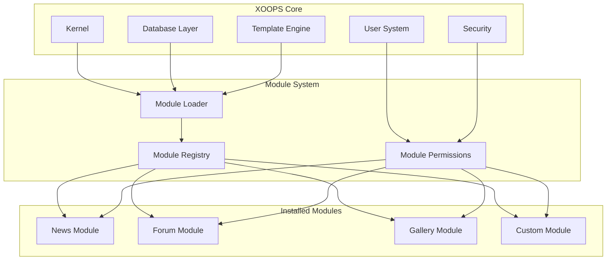
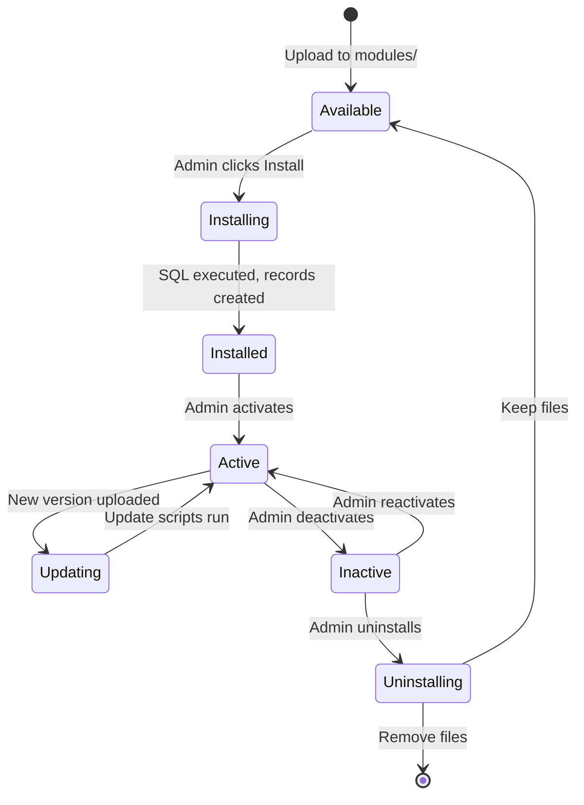

# ADR-001: moduláris architektúra

> Építészeti döntési rekord a XOOPS alapvető moduláris tervezési filozófiájához.

---

## Állapot

**Elfogadva** – Alapító döntés a XOOPS kezdete óta

---

## Kontextus

A XOOPS (eXtensible Object-Oriented Portal System) olyan architektúrára volt szüksége, amely:

1. Engedélyezze a külső fejlesztőknek a funkciók kiterjesztését
2. Engedélyezze a webhely rendszergazdái számára a testreszabást kódolás nélkül
3. Támogassa a független fejlesztést és frissítéseket
4. Biztosítson elszigetelést a különböző jellemzők között
5. Lépjen át az egyszerű blogokról az összetett portálokra

A 2000-es évek eleji CMS környezet olyan monolitikus rendszereket kínált, amelyeket nehéz volt testreszabni és bővíteni.

---

## Döntési diagram



---

## Döntés

Egy **moduláris architektúrát** valósítunk meg, ahol:

### 1. A mag infrastruktúrát biztosít
- Adatbázis absztrakció
- Felhasználói hitelesítés és engedélyek
- Sablon renderelés (Smarty)
- Biztonsági segédprogramok
- Formagenerálás
- Közös közművek

### 2. A modulok önállóak
Minden modul:
- Saját könyvtárszerkezettel rendelkezik
- Saját osztályokat, sablonokat tartalmaz, SQL
- Meghatározza a saját konfigurációját
- Függetlenül lehet installed/uninstalled
- Verziókövetéssel rendelkezik

### 3. Szabványos modulstruktúra
```
modules/modulename/
├── admin/                  # Admin interface
│   ├── index.php
│   └── menu.php
├── class/                  # PHP classes
├── include/                # Include files
├── language/               # Translations
├── sql/                    # Database schema
├── templates/              # Smarty templates
├── blocks/                 # Block definitions
├── xoops_version.php       # Module manifest
├── index.php               # Entry point
└── header.php              # Module bootstrap
```

### 4. moduljegyzék (xoops_version.php)
```php
<?php
$modversion['name']        = 'Module Name';
$modversion['version']     = '1.0.0';
$modversion['description'] = 'Module description';
$modversion['dirname']     = basename(__DIR__);
$modversion['hasMain']     = 1;
$modversion['hasAdmin']    = 1;
$modversion['sqlfile']['mysql'] = 'sql/mysql.sql';
$modversion['tables']      = ['modulename_table1'];
$modversion['templates']   = [...];
$modversion['config']      = [...];
$modversion['blocks']      = [...];
```

### 5. Kommunikációs modul
- Alapvető API-kon keresztül (kezelők, események)
- Adatbázis kapcsolatok
- Előfeszítő hookok
- Közös szolgáltatások

---

## modul életciklusa



---

## Következmények

### Pozitív

1. **Bővíthetőség**: A közösség által létrehozott modulok ezrei
2. **Függetlenség**: A modulok külön is fejleszthetők
3. **Rugalmasság**: A webhelyek kombinálhatják a funkciókat
4. **Karbantarthatóság**: A frissítések nem érintik a többi modult
5. **Piactér**: modulökoszisztéma alakult ki
6. **Tanulási görbe**: A fejlesztők egy mintát tanulnak meg

### Negatív

1. **Overhead**: Minden modulnak van bootstrap költsége
2. **Duplikáció**: A közös kód megismétlődhet
3. **Integráció**: A modulok közötti funkciók gondos tervezést igényelnek
4. **Verziózás**: modulkompatibilitás-kezelés szükséges
5. **Minőségi eltérés**: A harmadik féltől származó modul minősége változó

### Semleges

1. **Adatbázis**: Minden modul a saját tábláit kezeli
2. **Sablonok**: A témának különböző modulokat kell tartalmaznia
3. **Frissítések**: A mag és a modulok egymástól függetlenül frissülnek

---

## Megfontolt alternatívák

### 1. Monolit építészet
**Elutasítva** – Túl merev, nehezen testreszabható

### 2. Plugin architektúra (WordPress-stílus)
**Részben átvett** – A blokkok és az előtöltések beépülő modulokhoz hasonló hookokat biztosítanak a modulokon belül

### 3. Komponens architektúra (Joomla-stílus)
**Elutasítva** – Bonyolultabb, kevésbé fejlesztőbarát

### 4. Mikroszolgáltatások
**Nem alkalmazható** – Túl bonyolult a megosztott hosting korszakhoz

---

## Kapcsolódó határozatok

- ADR-002: Objektumorientált adatbázis-hozzáférés
- ADR-003: Smarty sablonmotor
- ADR-005: Engedélyrendszer

---

## Referenciák

- XOOPS Projekttörténet
- PHP alkalmazásarchitektúra minták
- CMS összehasonlító tanulmányok (2001-2005)

---

#xoops #architecture #adr #modules #design-döntés
