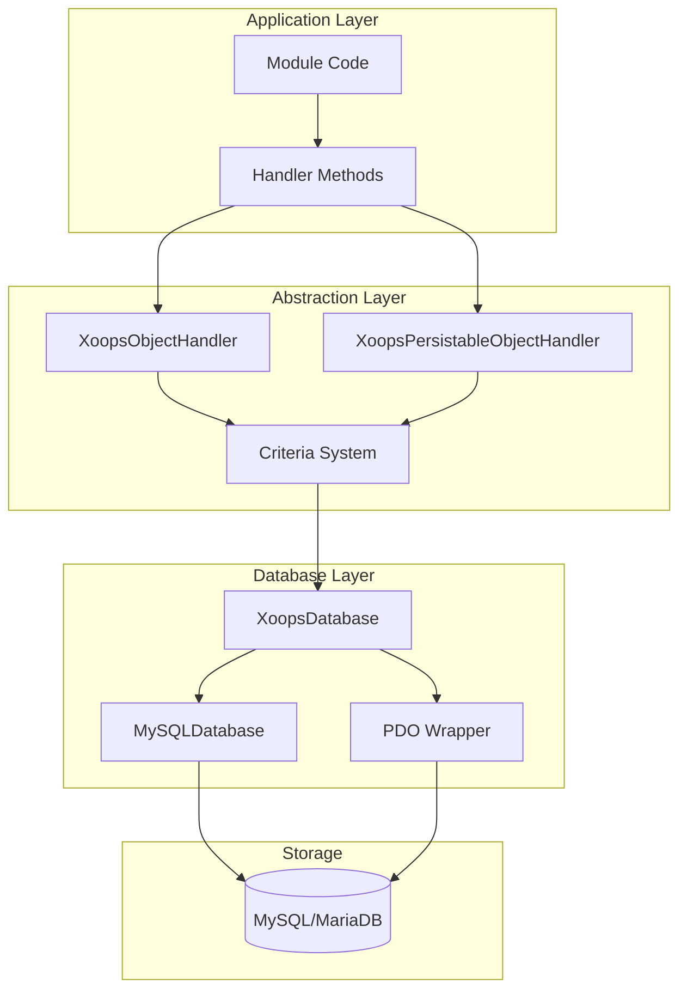
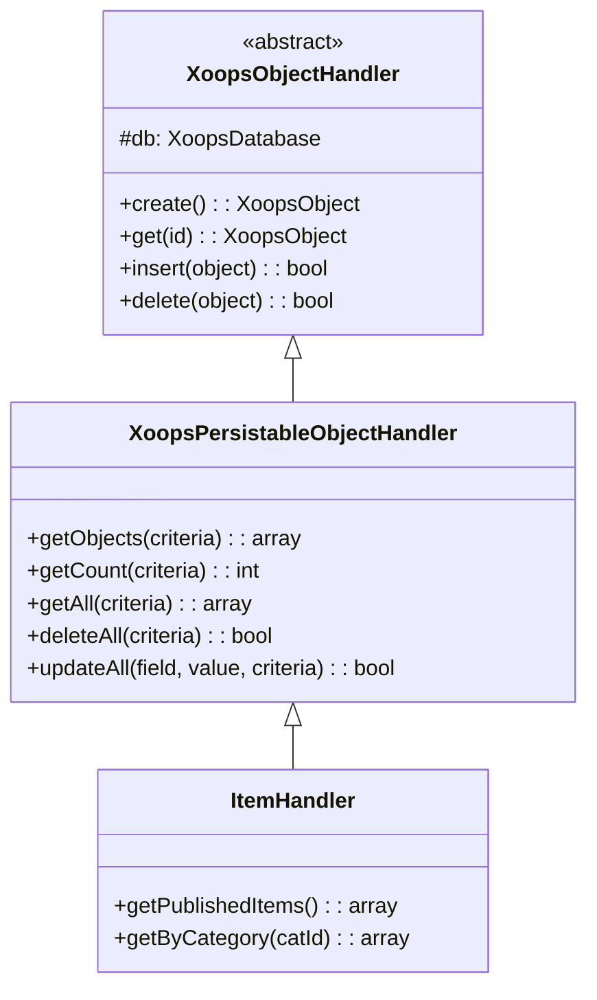
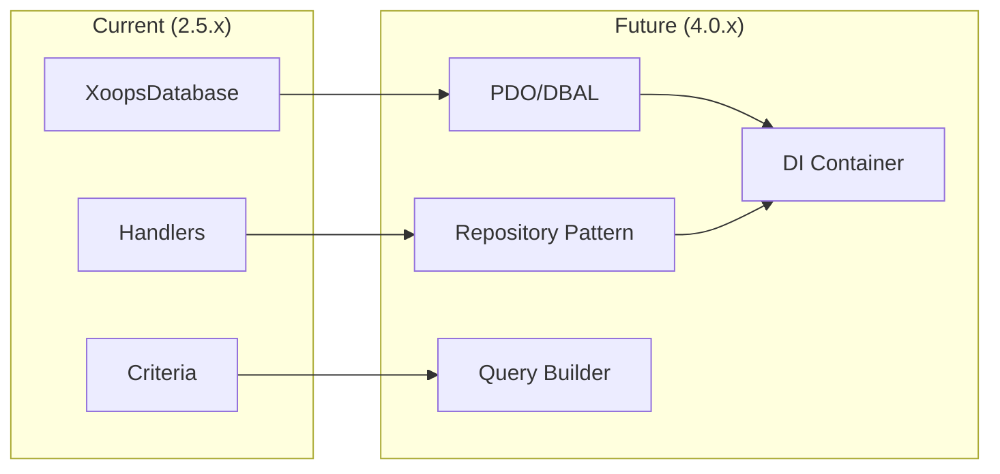

# ADR-002: Adatbázis-absztrakció

> Architektúra döntési rekordja a XOOPS objektumorientált adatbázis-hozzáférési mintájához.

---

## Állapot

**Elfogadva** – Magminta a XOOPS 2.0 óta

---

## Kontextus

A XOOPS-nak olyan adatbázis-interakciós stratégiára volt szüksége, amely:

1. Absztrakt adatbázis-specifikus SQL szintaxis
2. Konzisztens CRUD műveleteket biztosítson az összes modulon
3. Engedélyezze az adatok automatikus fertőtlenítését és menekülését
4. Támogassa a jövőbeni adatbázis-motor módosításokat
5. Egyszerűsítse a közös műveleteket a fejlesztők számára

Az alternatívák a következők voltak:
- Nyers SQL a kódbázisban
- Teljes ORM (Doktrína, ékesszóló)
- Egyedi könnyű absztrakció

---

## Döntési diagram



---

## Döntés

**Kezelői mintát** valósítunk meg a következőkkel:

### 1. XOOPSObject – Adattároló

Minden adatentitás kiterjeszti az XOOPSObject-et:

```php
class Item extends XoopsObject
{
    public function __construct()
    {
        $this->initVar('id', XOBJ_DTYPE_INT, null, false);
        $this->initVar('title', XOBJ_DTYPE_TXTBOX, '', true, 255);
        $this->initVar('content', XOBJ_DTYPE_TXTAREA, '', false);
        $this->initVar('status', XOBJ_DTYPE_INT, 0, false);
    }
}
```

### 2. Kezelő – Operations Manager

Minden objektumhoz tartozik egy megfelelő kezelő:

```php
class ItemHandler extends XoopsPersistableObjectHandler
{
    public function __construct($db)
    {
        parent::__construct($db, 'mymodule_items', Item::class, 'id', 'title');
    }

    // CRUD methods inherited:
    // - create(), get(), insert(), delete()
    // - getObjects(), getCount(), getAll()
}
```

### 3. Feltételek – Lekérdezéskészítő

Objektumorientált lekérdezési feltételek:

```php
$criteria = new CriteriaCompo();
$criteria->add(new Criteria('status', 1));
$criteria->add(new Criteria('created', time() - 86400, '>='));
$criteria->setSort('created');
$criteria->setOrder('DESC');
$criteria->setLimit(10);

$items = $handler->getObjects($criteria);
```

---

## Adattípus állandók

```php
// Variable types with automatic sanitization
XOBJ_DTYPE_INT       // Integer
XOBJ_DTYPE_TXTBOX    // Single-line text (escaped)
XOBJ_DTYPE_TXTAREA   // Multi-line text (escaped)
XOBJ_DTYPE_EMAIL     // Email validation
XOBJ_DTYPE_URL       // URL validation
XOBJ_DTYPE_ARRAY     // Serialized array
XOBJ_DTYPE_OTHER     // No processing
XOBJ_DTYPE_FLOAT     // Floating point
```

---

## Kezelői öröklés



---

## Következmények

### Pozitív

1. **Konzisztencia**: Minden modul ugyanazt a mintát használja
2. **Biztonság**: Az automatikus kilépés megakadályozza a SQL befecskendezést
3. **Egyszerűség**: A gyakori műveletek minimális kódot igényelnek
4. **Karbantarthatóság**: Az adatbázisréteg módosításai nem érintik a modulokat
5. **Tesztelhetőség**: A kezelőket ki lehet gúnyolni tesztelés céljából

### Negatív

1. **Teljesítmény**: Extra absztrakciós költség
2. **Bonyolultság**: Tanulási görbe új fejlesztők számára
3. **Korlátozások**: Az összetett lekérdezésekhez nyers SQL
4. **N+1 Probléma**: Nincs beépített lelkes töltés

### Enyhítések

- **Teljesítmény**: A gyakran használt objektumok gyorsítótárazása
- ** Összetett lekérdezések**: Ha szükséges, engedélyezze a nyers SQL
- **N+1**: Használja a getAll() függvényt megfelelő feltételekkel

---

## Evolution to XOOPS 4.0



XOOPS 4.0 tervek:
- DBAL doktrína az adatbázis-absztrakcióhoz
- A kezelőket helyettesítő adattár minta
- Lekérdezéskészítő összetett lekérdezésekhez
- Teljes PSR-11 konténerintegráció

---

## Kódpéldák

### Alapvető CRUD

```php
$helper = Helper::getInstance();
$handler = $helper->getHandler('Item');

// Create
$item = $handler->create();
$item->setVar('title', 'New Item');
$handler->insert($item);

// Read
$item = $handler->get($id);
$title = $item->getVar('title');

// Update
$item->setVar('title', 'Updated Title');
$handler->insert($item);

// Delete
$handler->delete($item);
```

### Összetett lekérdezés

```php
$criteria = new CriteriaCompo();
$criteria->add(new Criteria('status', 'published'));
$criteria->add(new Criteria('category_id', '(1,2,3)', 'IN'));
$criteria->add(new Criteria('created', strtotime('-30 days'), '>='));
$criteria->setSort('views');
$criteria->setOrder('DESC');
$criteria->setLimit(10);
$criteria->setStart(0);

$items = $handler->getObjects($criteria);
$total = $handler->getCount($criteria);
```

---

## Kapcsolódó határozatok

- ADR-001: moduláris felépítés
- ADR-003: Smarty sablonmotor

---

## Referenciák

- Martin Fowler - Vállalati alkalmazásarchitektúra mintái
- Domain-vezérelt tervezési koncepciók
- Active Record vs Data Mapper minták

---

#xoops #architecture #adr #adatbázis #kezelő #design-döntés
