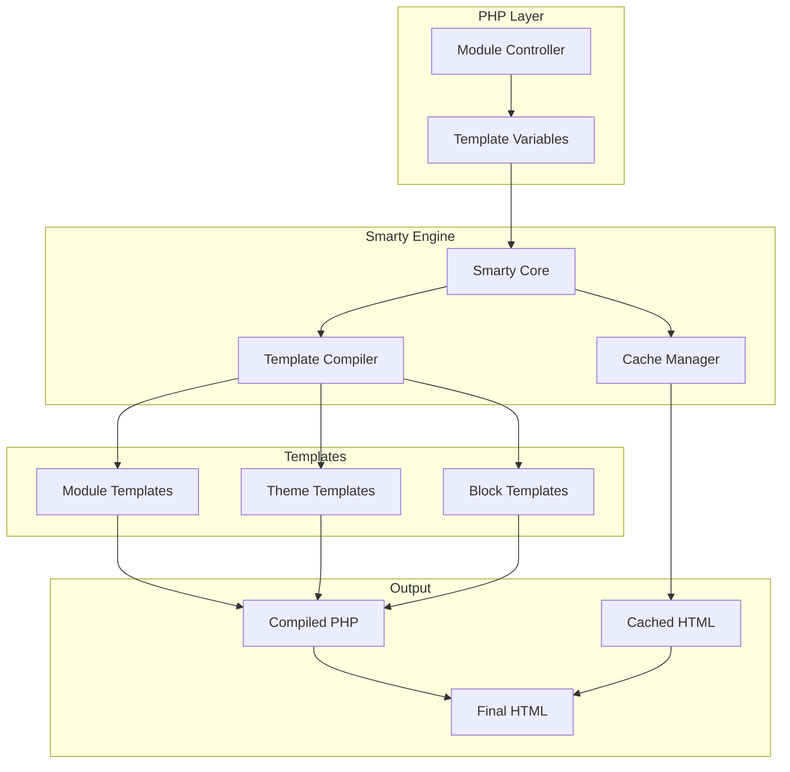
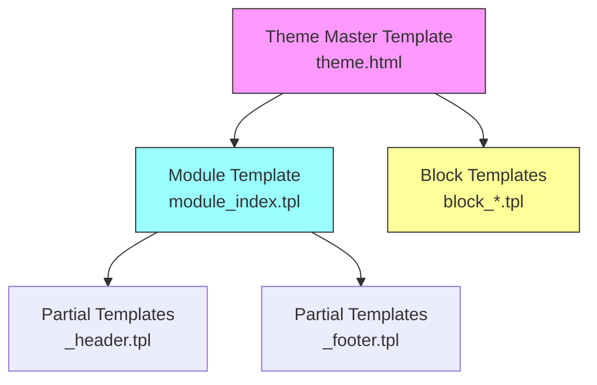
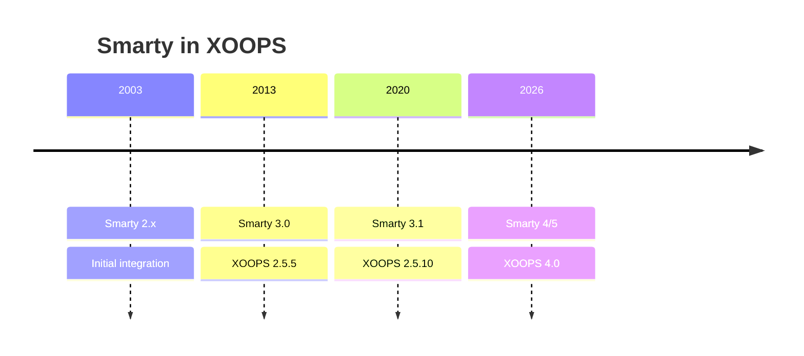

# ADR-003: Sablonmotor (Smarty)

> Architektúra Döntési rekord a XOOPS Smarty sablonmotor elfogadásához.

---

## Állapot

**Elfogadva** – Alapvető döntés a XOOPS 2.0 óta

**Fejlődik** – A Smarty 4/5-ra való átállás a XOOPS 4.0-ra tervezett

---

## Kontextus

A XOOPS-nak olyan sablonmegoldásra volt szüksége, amely:

1. Külön prezentáció az üzleti logikától
2. Engedélyezze a tématervezőknek, hogy PHP ismerete nélkül dolgozzanak
3. Támogassa a sablon öröklését és tartalmazza
4. Gyorsítótárazás biztosítása a teljesítmény érdekében
5. Engedélyezze a felhasználó által testreszabható sablonokat
6. A nemzetköziesedés támogatása

---

## Döntési diagram



---

## Döntés

A **Smarty**-t fogjuk használni sablonmotorként, mert:

### 1. A gondok szétválasztása

```php
// PHP (Controller) - Business logic
$items = $itemHandler->getPublishedItems();
$xoopsTpl->assign('items', $items);

// Smarty (View) - Presentation
// templates/items.tpl
```

```smarty
{* Smarty template - No PHP logic *}
<{foreach item=item from=$items}>
    <article>
        <h2><{$item.title}></h2>
        <p><{$item.summary}></p>
    </article>
<{/foreach}>
```

### 2. XOOPS Határolók

A XOOPS a `<{` and `}>`-t használja a szabványos `{` `}` helyett:

```smarty
{* Standard Smarty *}
{$variable}

{* XOOPS Smarty - Avoids JavaScript conflicts *}
<{$variable}>
```

### 3. Sablonhierarchia



### 4. Sablon tárolása

- **Adatbázis**: Testreszabott sablonok tárolva a visszaállításhoz
- **Fájlrendszer**: Eredeti sablonok a modulkönyvtárakban
- **Gyorsítótár**: Összeállított sablonok a teljesítmény érdekében

---

## Intelligens konfiguráció

```php
// XOOPS Smarty initialization
$xoopsTpl = new XoopsTpl();

// Custom delimiters
$xoopsTpl->left_delim = '<{';
$xoopsTpl->right_delim = '}>';

// Caching
$xoopsTpl->caching = XOOPS_TEMPLATE_CACHE;
$xoopsTpl->cache_lifetime = 3600;

// Security
$xoopsTpl->security_policy = new Smarty_Security($xoopsTpl);
$xoopsTpl->security_policy->php_functions = [];
$xoopsTpl->security_policy->php_modifiers = ['escape', 'count'];
```

---

## Használt sablon funkciók

### Változók

```smarty
{* Simple variable *}
<{$title}>

{* Object property *}
<{$item.title}>

{* With modifier *}
<{$content|truncate:200:'...'}>

{* Escaped output *}
<{$userInput|escape:'html'}>
```

### Vezérlési struktúrák

```smarty
{* Conditional *}
<{if $isAdmin}>
    <a href="admin.php">Admin</a>
<{elseif $isUser}>
    <a href="profile.php">Profile</a>
<{else}>
    <a href="login.php">Login</a>
<{/if}>

{* Loop *}
<{foreach item=item from=$items name=itemloop}>
    <{$smarty.foreach.itemloop.index}>: <{$item.title}>
<{/foreach}>
```

### Tartalmazza

```smarty
{* Include another template *}
<{include file="db:mymodule_header.tpl"}>

{* Include with variables *}
<{include file="db:mymodule_item.tpl" item=$currentItem}>

{* Include from theme *}
<{include file="file:$theme_path/partials/sidebar.tpl"}>
```

---

## Következmények

### Pozitív

1. **Tervezőbarát**: HTML-szerű szintaxis
2. **Gyorsítótár**: Beépített sablon gyorsítótár
3. **Biztonság**: PHP kód elkülönítése
4. **Rugalmasság**: Módosítók, funkciók, bővítmények
5. **Testreszabás**: A felhasználók módosíthatják a sablonokat
6. **Közösség**: Nagy Smarty ökoszisztéma

### Negatív

1. **Tanulási görbe**: Smarty-specifikus szintaxis
2. **Rezsi**: Fordítási lépés szükséges
3. **Hibakeresés**: A sablonhibák rejtélyesek lehetnek
4. **Verzióval kapcsolatos problémák**: A verziók közötti változások megszakítása

### Enyhítések

- **Tanulás**: Átfogó dokumentáció
- **Teljesítmény**: Agresszív gyorsítótár
- **Hibakeresés**: Hibakeresési konzol, hibaüzenetek törlése
- **Verziók**: Kompatibilitási réteg a XOOPS-ban

---

## Verzióelőzmények



---

## Migráció: Smarty 3 4/5-ra

### Megtörő változások

```smarty
{* Smarty 3 - Deprecated *}
<{php}>echo date('Y');<{/php}>

{* Smarty 4+ - Use modifiers or assign from PHP *}
<{$current_year}>

{* Smarty 3 - {section} deprecated *}
<{section name=i loop=$items}>
    <{$items[i].title}>
<{/section}>

{* Smarty 4+ - Use {foreach} *}
<{foreach $items as $item}>
    <{$item.title}>
<{/foreach}>
```

### Kompatibilitási réteg

A XOOPS kompatibilitási réteget biztosít a sima átmenetekhez:

```php
// XoopsTpl extends Smarty with compatibility methods
class XoopsTpl extends Smarty
{
    public function assign($tpl_var, $value = null)
    {
        // Handles both Smarty 3 and 4 syntax
        return parent::assign($tpl_var, $value);
    }
}
```

---

## Megfontolt alternatívák

### 1. Gally
**Előnyök**: Modern, Symfony ökoszisztéma
**Hátrányok**: eltérő szintaxis, migrációs erőfeszítés
**Döntés**: Lehetséges jövőbeli opció a XOOPS 3.x számára

### 2. Penge (Laravel)
**Előnyök**: tiszta szintaxis, népszerű
**Hátrányok**: Laravel-specifikus
**Döntés**: Nem alkalmas önálló használatra

### 3. Natív PHP sablonok
**Előnyök**: Nincs tanulási görbe, gyors
**Hátrányok**: Biztonsági kockázatok, nincs szétválasztás
**Határozat**: Karbantarthatóság miatt elutasítva

---

## Kapcsolódó határozatok

- ADR-001: moduláris felépítés
- ADR-002: Adatbázis-absztrakció

---

## Referenciák

- Okos dokumentáció: https://www.smarty.net/docs/en/
- XOOPS sablonrendszer útmutató
- MVC minta a webalkalmazásokban

---

#xoops #architecture #adr #okos #sablonok #design-döntés
