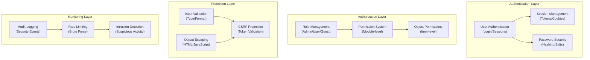

# ADR-004: Biztonsági rendszer architektúrája

> Átfogó biztonsági architektúra a XOOPS CMS számára, amely védelmet nyújt a modern fenyegetésekkel szemben.

---

## Állapot

**Elfogadva** – Az alapvető biztonsági réteg a XOOPS 2.5 óta

---

## Kontextus

### Problémanyilatkozat

A XOOPS-nak olyan robusztus biztonsági rendszerre van szüksége, amely:

1. **Véd a gyakori webes biztonsági rések ellen** (OWASP Top 10)
2. **Részletes engedélyvezérlést** biztosít a modulok között
3. **Lehetővé teszi a biztonságos felhasználói hitelesítést** a modern szabványok szerint
4. **Megakadályozza az adatszivárgást** és az illetéktelen hozzáférést
5. **Támogatja a többszintű hozzáférés-vezérlést** (adminisztrátor, moderátor, felhasználó, vendég)
6. **Zökkenőmentesen integrálható az összes modullal**

### Jelenlegi fenyegetések

A modern webes támadások a következők:

- **SQL injekció** - Rosszindulatú SQL a felhasználói bevitelben
- **XSS (cross-site Scripting)** - JavaScript beillesztése az oldalakba
- **CSRF (cross-site Request Forgery)** - Jogosulatlan űrlapbeküldések
- **Authentication bypass** - Gyenge session/password kezelés
- **Engedélyezés megkerülése** - A jogosultság kiterjesztése
- **Adatexpozíció** - Érzékeny adatok az URL-ekben, naplókban vagy gyorsítótárban

### XOOPS Biztonsági követelmények

1. Felhasználó hitelesítés és munkamenet-kezelés
2. Szerep alapú hozzáférés-vezérlés (RBAC)
3. modulok és objektumok engedélyezési rendszere
4. Bemenet ellenőrzése és kimeneti kilépés
5. Védelem a gyakori támadások ellen
6. Biztonsági események naplózása
7. Biztonságos jelszókezelés
8. CSRF token védelem

---

## Döntés

### Alapvető biztonsági architektúra



---

## Biztonsági összetevők

### 1. Hitelesítési rendszer

**Felhasználói bejelentkezési folyamat:**

```php
<?php
// 1. Validate credentials
$user = $userHandler->findByLogin($username);
if (!$user || !password_verify($password, $user->getVar('pass'))) {
    throw new AuthenticationException('Invalid credentials');
}

// 2. Check if account is active
if (!$user->getVar('uactive')) {
    throw new AuthenticationException('Account inactive');
}

// 3. Create secure session
session_regenerate_id(true);
$_SESSION['uid'] = $user->getVar('uid');
$_SESSION['token'] = bin2hex(random_bytes(32));
$_SESSION['created'] = time();

// 4. Log the login
$this->auditLog('USER_LOGIN', $user->getVar('uid'));
```

**Jelszóbiztonság:**

```php
<?php
// Use password_hash (not MD5 or SHA1)
$hashed = password_hash($password, PASSWORD_BCRYPT, [
    'cost' => 12, // High cost = slow brute force
]);

// Verify password
if (!password_verify($inputPassword, $hashed)) {
    throw new Exception('Invalid password');
}

// Rehash if algorithm or cost changed
if (password_needs_rehash($hashed, PASSWORD_BCRYPT, ['cost' => 12])) {
    $newHash = password_hash($password, PASSWORD_BCRYPT, ['cost' => 12]);
    $user->setVar('pass', $newHash);
    $userHandler->insert($user);
}
```

### 2. Session Management

**Biztonságos munkamenet-kezelés:**

```php
<?php
// Session configuration
ini_set('session.cookie_httponly', true);  // No JS access
ini_set('session.cookie_secure', true);     // HTTPS only
ini_set('session.cookie_samesite', 'Strict'); // CSRF protection
ini_set('session.gc_maxlifetime', 3600);   // 1 hour timeout
ini_set('session.sid_length', 64);         // 64-char session ID

// Validate session
function validateSession() {
    // Check timeout
    if (time() - $_SESSION['created'] > 3600) {
        session_destroy();
        throw new SessionExpiredException();
    }

    // Validate user agent (prevent session hijacking)
    if ($_SESSION['user_agent'] !== $_SERVER['HTTP_USER_AGENT']) {
        throw new SessionInvalidException();
    }

    // Validate IP (optional, can be too strict)
    if (!in_array($_SERVER['REMOTE_ADDR'], $_SESSION['ips'])) {
        $_SESSION['ips'][] = $_SERVER['REMOTE_ADDR'];
    }
}
```

### 3. Engedélyezés (RBAC)

**Szerepkör alapú hozzáférés-vezérlés:**

```php
<?php
class XoopsUser {
    public function hasPermission(string $permissionName): bool
    {
        // Get user groups
        $groups = $this->getGroups();

        // Check if any group has permission
        foreach ($groups as $groupId) {
            if ($this->checkGroupPermission($groupId, $permissionName)) {
                return true;
            }
        }

        return false;
    }

    /**
     * User groups and their permissions
     * Admin: Full access
     * Moderator: Content management
     * User: Create own content
     * Guest: Read-only access
     */
    private function checkGroupPermission(int $groupId, string $permission): bool
    {
        $permissions = [
            1 => ['admin_access'],                 // Admin group
            2 => ['moderate_content', 'edit_own'], // Moderator group
            3 => ['create_content', 'edit_own'],   // User group
            4 => [],                               // Guest group (no permissions)
        ];

        return in_array($permission, $permissions[$groupId] ?? []);
    }
}
```

### 4. Bevitel ellenőrzése

**A SQL befecskendezési és típushibák megelőzése:**

```php
<?php
// Always use prepared statements
$sql = 'SELECT * FROM users WHERE id = ?';
$result = $db->query($sql, [$userId]); // ✅ Safe

// Input validation
function validateUserInput(array $data): array
{
    return [
        'email' => filter_var($data['email'] ?? '', FILTER_VALIDATE_EMAIL),
        'age' => filter_var($data['age'] ?? 0, FILTER_VALIDATE_INT),
        'website' => filter_var($data['website'] ?? '', FILTER_VALIDATE_URL),
        'title' => substr(trim($data['title'] ?? ''), 0, 255),
    ];
}

// XOOPS Safe Input class
$safe = \Xmf\Request::getHtmlRequest('var_name', '');
$int = \Xmf\Request::getInt('page', 1);
```

### 5. Output Escape

**A XSS támadások megelőzése:**

```php
<?php
// In PHP templates
echo htmlspecialchars($userInput, ENT_QUOTES, 'UTF-8');

// In Smarty templates (automatic escaping)
<{$user_input}>  {* Escaped by default *}
<{$html|escape:false}>  {* Only when needed *}

// JavaScript context
<script>
var message = "<{$userMessage|escape:'javascript'}>";
</script>

// URL context
<a href="<{$url|escape:'url'}>">Link</a>
```

### 6. CSRF Védelem

**A több telephelyre vonatkozó kérelem hamisításának megelőzése:**

```php
<?php
// Generate CSRF token
session_start();
if (empty($_SESSION['csrf_token'])) {
    $_SESSION['csrf_token'] = bin2hex(random_bytes(32));
}

// In forms
<form method="POST">
    <input type="hidden" name="csrf_token" value="<{$csrf_token}>">
    <button type="submit">Submit</button>
</form>

// Validate token
if ($_SERVER['REQUEST_METHOD'] === 'POST') {
    if (hash_equals($_SESSION['csrf_token'], $_POST['csrf_token'] ?? '')) {
        // Process form
    } else {
        throw new InvalidTokenException('CSRF token invalid');
    }
}
```

---

## Következmények

### Pozitív hatások

1. **Átfogó védelem** – A főbb sebezhetőségi osztályokat fedi le
2. **Réteges biztonság** – Több rétegű védelem
3. **Rugalmas RBAC** - Finom szemcsés engedélykezelés
4. **Audit Trail** - Kövesse nyomon a biztonsági eseményeket
5. **Ipari szabvány** – megfelel a OWASP ajánlásoknak
6. **modulintegráció** – A modulok könnyen használhatják a biztonsági API-kat

### Negatív hatások

1. **Bonyolultság** - Több kódra és konfigurációra van szükség
2. **Teljesítmény** – A kivonatolás és az érvényesítés többletköltséget jelent
3. **Felhasználói élmény** – A biztonság néha kényelmetlen
4. **Karbantartás** – Folyamatos biztonsági frissítéseket igényel
5. **Képzés szükséges** – A fejlesztőknek követniük kell a gyakorlatokat

### Kockázatok és mérséklések

| Kockázat | Súlyosság | Mérséklés |
|------|----------|-----------|
| A fejlesztő figyelmen kívül hagyja a biztonságot | Magas | Kódfelülvizsgálat, biztonsági képzés |
| Új sebezhetőséget fedeztek fel | Közepes | Rendszeres biztonsági auditok, frissítések |
| Teljesítményhatás | Alacsony | A forró útvonalak optimalizálása, gyorsítótárazás |
| Túl bonyolult engedélyek | Közepes | Világos dokumentáció, példák |

---

## Biztonsági bevált gyakorlatok

### modulfejlesztőknek

```php
<?php
// ✅ DO: Use prepared statements
$result = $db->prepare('SELECT * FROM table WHERE id = ?')->execute([$id]);

// ❌ DON'T: Concatenate queries
$result = $db->query("SELECT * FROM table WHERE id = $id");

// ✅ DO: Escape output
echo htmlspecialchars($user_input, ENT_QUOTES, 'UTF-8');

// ❌ DON'T: Output raw user data
echo $user_input;

// ✅ DO: Check permissions
if (!$user->hasPermission('edit_content')) {
    throw new PermissionException();
}

// ❌ DON'T: Trust user roles directly
if ($_POST['is_admin']) {
    // Make user admin - SECURITY HOLE!
}

// ✅ DO: Validate input types
$page = (int)$_GET['page'];

// ❌ DON'T: Use untrusted values directly
$sql .= " LIMIT " . $_GET['limit'];
```

---

## Megfontolt alternatívák

### OAuth/OpenID Csatlakozás

**Miért nem választotta kezdetben:** Túl bonyolult a megosztott tárhelykörnyezethez, de jó a jövőbeni integrációhoz külső hitelesítési rendszerekkel.

### Kéttényezős hitelesítés (2FA)

**Állapot:** Kiterjesztésként elfogadott, nem alapvető követelmény, lásd: ADR-006

### HTTP csak munkamenet-cookie-k

**Állapot:** Megvalósítva – megakadályozza a JavaScript hozzáférést a munkamenet adataihoz

---

## Kapcsolódó határozatok

- ADR-001: moduláris felépítés - A modulok biztonságot nyújtanak
- ADR-005: modulengedély-rendszer
- ADR-006: Kéttényezős hitelesítés (jövőben)

---

## Referenciák

### Biztonsági szabványok- [OWASP Top 10](https://owasp.org/www-project-top-ten/)
- [NIST kiberbiztonsági keretrendszer](https://www.nist.gov/cyberframework)
- [CWE Top 25](https://cwe.mitre.org/top25/)

### PHP Biztonság

- [PHP biztonsági kézikönyv](https://www.php.net/manual/en/security.php)
- [password_hash() Dokumentáció](https://www.php.net/manual/en/function.password-hash.php)
- [Munkamenet biztonság](https://www.php.net/manual/en/session.security.php)

### Eszközök

- [OWASP ZAP](https://www.zaproxy.org/) - Biztonsági tesztelés
- [Snyk](https://snyk.io/) - Sebezhetőségi vizsgálat
- [SonarQube](https://www.sonarqube.org/) - Kódminőség

---

## Megvalósítási ellenőrzőlista

- [ ] Felhasználó hitelesítési rendszer
- [ ] Munkamenet menedzsment
- [ ](bcrypt) Jelszókivonat
- [ ] Szerep alapú hozzáférés-vezérlés
- [ ] modulengedélyek
- [ ] Bemenet érvényesítési keretrendszer
- [ ] Kilépő kimenet (PHP + Smarty)
- [ ] CSRF token védelem
- [ ] Biztonsági ellenőrzés naplózása
- [ ] Sebességkorlátozás
- [ ] Biztonsági fejlécek

---

## Verzióelőzmények

| Verzió | Dátum | Változások |
|---------|------|---------|
| 1.0.0 | 2024-01-28 | Kezdeti dokumentum |

---

#xoops #adr #biztonság #architektúra #hitelesítés #engedélyezés #rbac
