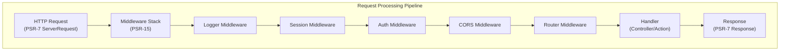

# ADR-005: PSR-15 Köztes szoftver minta a XOOPS 4.0-hoz

> A PSR-15 HTTP szerver kéréskezelők (középső szoftverek) elfogadása a jobb kérésfeldolgozási folyamat érdekében.

:::vigyázat [XOOPS 4.0 javaslat – nem érhető el a 2.5.x verzióban]
Ez a ADR egy **javasolt architektúrát ír le a XOOPS 4.0** számára. A PSR-15 köztes szoftver **nem érhető el a XOOPS 2.5.x** verzióban. A jelenlegi 2.5.x modulok az Oldalvezérlő mintát használják `mainfile.php` rendszerindítással. Lásd a XOOPS architektúrát a kérés aktuális életciklusához.
:::

---

## Állapot

**Javasolt** – Kiértékelés alatt a XOOPS 4.0 kiadáshoz

---

## Kontextus

### Jelenlegi megközelítés

A XOOPS 2.5 monolitikus kéréskezelési megközelítést alkalmaz:

```php
// Current: Sequential processing
require_once 'mainfile.php';
// → Kernel initialization
// → User authentication
// → Module loading
// → Page rendering

// All in one flow, mixed concerns
```

### Problémák a jelenlegi megközelítéssel

1. ** Vegyes aggályok** – A hitelesítés, a naplózás és az útválasztás összefonódik
2. **Nehezen tesztelhető** – Nehezen tesztelhető egyedi kérések feldolgozási lépései
3. **Nehezen bővíthető** – A modulok csak a preload/events-n keresztül csatlakoztathatók
4. **Gyenge elválasztás** – A kérésfeldolgozási logika szétszórva a kódbázisban
5. **Nem komponálható** – A feldolgozási lépéseket nem lehet könnyen láncolni vagy átrendezni

### Mi az a PSR-15 köztes szoftver?

A PSR-15 szabványos interfészt határoz meg a HTTP köztes szoftverhez:

```php
<?php
interface RequestHandlerInterface {
    public function handle(ServerRequestInterface $request): ResponseInterface;
}

interface MiddlewareInterface {
    public function process(
        ServerRequestInterface $request,
        RequestHandlerInterface $handler
    ): ResponseInterface;
}
```

**Middleware lánc:**

```
Request
  ↓
[Logger] → logs request
  ↓
[Auth] → validates user session
  ↓
[CORS] → checks cross-origin
  ↓
[Router] → dispatches to handler
  ↓
[Handler] → generates response
  ↓
Response
```

---

## Döntés

### A PSR-15 Middleware Stack elfogadása a XOOPS 4.0-hoz

Valósítson meg egy köztesszoftver-alapú kérésfeldolgozási folyamatot a PSR-15 szabvány szerint.

### Építészeti áttekintés



### Alapvető köztes szoftverkomponensek

#### 1. Alkalmazási köztes szoftver (alapréteg)

```php
<?php
declare(strict_types=1);

namespace XoopsCore;

use Psr\Http\Message\ResponseInterface;
use Psr\Http\Message\ServerRequestInterface;
use Psr\Http\Server\MiddlewareInterface;
use Psr\Http\Server\RequestHandlerInterface;

class SessionMiddleware implements MiddlewareInterface
{
    public function process(
        ServerRequestInterface $request,
        RequestHandlerInterface $handler
    ): ResponseInterface {
        // 1. Retrieve session (or start new)
        $sessionId = $request->getCookieParams()['PHPSESSID'] ?? null;
        $session = $this->sessionManager->load($sessionId);

        // 2. Attach session to request
        $request = $request->withAttribute('session', $session);

        // 3. Pass to next middleware
        $response = $handler->handle($request);

        // 4. Set session cookie if needed
        if ($session->isModified()) {
            $response = $response->withAddedHeader(
                'Set-Cookie',
                'PHPSESSID=' . $session->getId() . '; HttpOnly; SameSite=Strict'
            );
        }

        return $response;
    }
}
```

#### 2. Hitelesítési köztes szoftver

```php
<?php
class AuthMiddleware implements MiddlewareInterface
{
    public function process(
        ServerRequestInterface $request,
        RequestHandlerInterface $handler
    ): ResponseInterface {
        // Get session from previous middleware
        $session = $request->getAttribute('session');

        // Authenticate user from session
        $user = $this->authenticate($session);

        // Attach user to request
        $request = $request->withAttribute('user', $user);

        return $handler->handle($request);
    }

    private function authenticate(?Session $session): User
    {
        if ($session && $session->has('uid')) {
            return $this->userRepository->findById($session->get('uid'));
        }

        return new AnonymousUser();
    }
}
```

#### 3. Engedélyezési köztes szoftver

```php
<?php
class AuthorizationMiddleware implements MiddlewareInterface
{
    public function __construct(private AuthorizationChecker $checker)
    {
    }

    public function process(
        ServerRequestInterface $request,
        RequestHandlerInterface $handler
    ): ResponseInterface {
        $user = $request->getAttribute('user');
        $route = $request->getAttribute('route');

        // Check if user has permission for this route
        if (!$this->checker->isGranted($user, $route)) {
            return new JsonResponse(
                ['error' => 'Unauthorized'],
                403
            );
        }

        return $handler->handle($request);
    }
}
```

#### 4. modul Middleware

```php
<?php
// Modules can provide their own middleware
class PublisherAccessMiddleware implements MiddlewareInterface
{
    public function process(
        ServerRequestInterface $request,
        RequestHandlerInterface $handler
    ): ResponseInterface {
        $user = $request->getAttribute('user');

        // Module-specific access control
        if (!$user->hasPermission('publisher_view')) {
            return new HtmlResponse('Access denied', 403);
        }

        return $handler->handle($request);
    }
}
```

### Megvalósítási példa

```php
<?php
// bootstrap.php - Application setup

use Psr\Http\Message\ServerRequestInterface;
use Psr\Http\Server\RequestHandlerInterface;
use Xoops\Core\Middleware\{
    LoggerMiddleware,
    SessionMiddleware,
    AuthMiddleware,
    CorsMiddleware,
    ErrorHandlingMiddleware
};

// Create middleware pipeline
$middlewareStack = [
    // 1. Error handling (outermost)
    new ErrorHandlingMiddleware(),

    // 2. Logging
    new LoggerMiddleware($logger),

    // 3. CORS handling
    new CorsMiddleware($corsConfig),

    // 4. Session management
    new SessionMiddleware($sessionManager),

    // 5. Authentication
    new AuthMiddleware($userRepository),

    // 6. Authorization
    new AuthorizationMiddleware($authChecker),

    // 7. Routing and dispatching
    new RoutingMiddleware($router),

    // 8. Module middleware (dynamic)
    ...$this->loadModuleMiddleware(),
];

// Process request through middleware stack
$request = ServerRequestFactory::fromGlobals();
$dispatcher = new MiddlewareDispatcher($middlewareStack);
$response = $dispatcher->dispatch($request);

// Send response
http_response_code($response->getStatusCode());
foreach ($response->getHeaders() as $name => $values) {
    foreach ($values as $value) {
        header("$name: $value", false);
    }
}
echo $response->getBody();
```

### modul integráció

A modulok köztes szoftvert biztosíthatnak:

```php
<?php
// Publisher module - xoops_version.php

$modversion['middleware'] = [
    'PublisherAccessMiddleware' => true,      // Auto-load
    'PublisherLogMiddleware' => true,
];

// Or custom:
$modversion['middleware_factory'] = function() {
    return [
        new PublisherCacheMiddleware(),
        new PublisherPermissionMiddleware(),
    ];
};
```

---

## Következmények

### Pozitív hatások

1. **Az aggályok szétválasztása** – Minden köztes szoftver egy felelősséget visel
2. **Tesztelhetőség** – Könnyen tesztelhető az egyes köztes szoftver-összetevők
3. **Összeállíthatóság** – A köztes szoftverek keverhetők és átrendelhetők
4. **Szabványoknak megfelelő** – PSR-15 és PSR-7 szabványt használ
5. **Bővíthetőség** – A modulok könnyen hozzáadhatnak egyéni köztes szoftvert
6. **Hibakeresés** – A csővezetéken keresztüli kérésfolyam törlése
7. **Teljesítmény** – Adott köztes szoftverrétegek optimalizálása
8. **Interoperabilitás** – Használhat harmadik féltől származó PSR-15 köztes szoftvert

### Negatív hatások

1. **Tanulási görbe** – A fejlesztőknek meg kell érteniük a PSR-15
2. **Performance Overhead** - Több függvényhívás folyamatban
3. **Bonyolultság** – Több mozgó alkatrész, mint monolitikus megközelítés
4. **Migration Effort** – Meglévő kód átalakítása szükséges
5. **Függőségek** – PSR-7 HTTP könyvtár szükséges

### Kockázatok és mérséklések

| Kockázat | Súlyosság | Mérséklés |
|------|----------|-----------|
| Komplex köztes szoftverláncok | Közepes | Világos dokumentáció, példák |
| A teljesítmény romlása | Közepes | Összehasonlítás, forró utak optimalizálása |
| Fejlesztői visszaélés | Közepes | Kód áttekintése, bevált gyakorlatok útmutatója |
| A migrációt megtörő változások | Magas | Amortizációs időszak, segítők |
| Köztesszoftver-rendelési problémák | Közepes | Függőségi grafikon törlése |

---

## Megvalósítási terv

### 1. fázis: alapozás (2026 második negyedéve)

- [ ] A PSR-7 HTTP üzenetcsomagoló megvalósítása
- [ ] MiddlewareDispatcher létrehozása
- [ ] Az alapvető köztes szoftver megvalósítása (munkamenet, hitelesítés)
- [ ] Frissítse a kernelt a köztes szoftver használatához

### 2. fázis: Integráció (2026. harmadik negyedév)

- [ ] A meglévő funkciók migrálása köztes szoftverre
- [ ] modul köztes szoftver támogatás hozzáadása
- [ ] Köztesszoftvertesztelő segédprogramok létrehozása
- [ ] Írjon átfogó dokumentációt

### 3. fázis: Migráció (2026 IV. negyedév)

- [ ] Kompatibilitási réteg biztosítása a régi kódhoz
- [ ] Súgómodulok frissítése új köztes szoftverre
- [ ] Teljesítményoptimalizálás
- [ ] Biztonsági audit

### 4. fázis: Megjelenés (2027. I. negyedév)

- [ ] XOOPS 4.0 kiadás köztes szoftverrel
- [ ] A régi preload/hook rendszer elavultsága
- [ ] Közösségi visszajelzések és frissítések

---## Sikerkritériumok

- [ ] Az összes alapvető funkció köztes szoftverre költözik
- [ ] 90%+ tesztlefedettség a köztes szoftverekhez
- [ ] Példákkal kiegészített dokumentáció
- [ ] Az előző verzió 10%-án belüli teljesítmény
- [ ] A modulok sikeresen alkalmazzák az új köztes szoftver rendszert
- [ ] Közösségi örökbefogadási arány >80%

---

## A köztes szoftver bevált gyakorlatai

### Tedd

- Tartsa fókuszban a köztes szoftvert (egyetlen felelősség)
- Változatlanság használata (új request/response létrehozása)
- Kezelje a hibákat kecsesen
- Dokumentumfüggőségek
- Add típus tippeket
- Írjon teszteket a köztes szoftverekhez
- Használjon szabványos PSR-15 interfészt

### Ne

- Ne módosítsa a megosztott request/response objektumokat
- Ne érjen hozzá közvetlenül a globálisokhoz
- Ne hozzon létre függőséget a köztes szoftverek sorrendjétől
- Ne vegyen észre minden kivételt
- Ne keverje össze az üzleti logikát a köztes szoftverrel
- Ne kényszerítse túl sok köztes szoftvert

---

## Példák

### Egyéni köztes szoftver

```php
<?php
// Example: Rate limiting middleware

use Psr\Http\Message\ResponseInterface;
use Psr\Http\Message\ServerRequestInterface;
use Psr\Http\Server\MiddlewareInterface;
use Psr\Http\Server\RequestHandlerInterface;

class RateLimitMiddleware implements MiddlewareInterface
{
    public function __construct(
        private RateLimiter $limiter,
        private int $limit = 100,
        private int $window = 3600
    ) {
    }

    public function process(
        ServerRequestInterface $request,
        RequestHandlerInterface $handler
    ): ResponseInterface {
        $user = $request->getAttribute('user');
        $identifier = $user->getId() ?? $request->getClientIp();

        // Check rate limit
        $remaining = $this->limiter->check($identifier, $this->limit, $this->window);

        if ($remaining < 0) {
            return new JsonResponse(
                ['error' => 'Rate limit exceeded'],
                429
            );
        }

        // Add rate limit headers
        $response = $handler->handle($request);
        return $response
            ->withAddedHeader('X-RateLimit-Limit', (string)$this->limit)
            ->withAddedHeader('X-RateLimit-Remaining', (string)$remaining);
    }
}
```

---

## Kapcsolódó határozatok

- ADR-001: moduláris építészet - Alapozás
- ADR-004: Biztonsági rendszer - Köztes szoftvert használ a hitelesítéshez
- ADR-006: Kétfaktoros hitelesítés - Köztes szoftver is lehet

---

## Referenciák

### PSR szabványok

- [PSR-7: HTTP üzenetinterfész](https://www.php-fig.org/psr/psr-7/)
- [PSR-15: HTTP szerverkéréskezelők](https://www.php-fig.org/psr/psr-15/)

### Köztes szoftver-keretrendszerek

- [Slim Framework](https://www.slimframework.com/) - Példák a köztes szoftverekre
- [Zend Expressive](https://docs.zendframework.com/zend-expressive/) - PSR-15 keretrendszer
- [Guzzle](https://docs.guzzlephp.org/) - HTTP kliens köztes szoftver

### Eszközök

- [RelayPHP](https://relayphp.com/) - Köztes szoftver könyvtár
- [PSR-15 köztes szoftver](https://github.com/middlewares) - Köztes szoftverek gyűjteménye

---

## Verzióelőzmények

| Verzió | Dátum | Változások |
|---------|------|---------|
| 1.0.0 | 2024-01-28 | Eredeti javaslat |

---

#xoops #adr #psr-15 #middleware #architecture #psr-7
