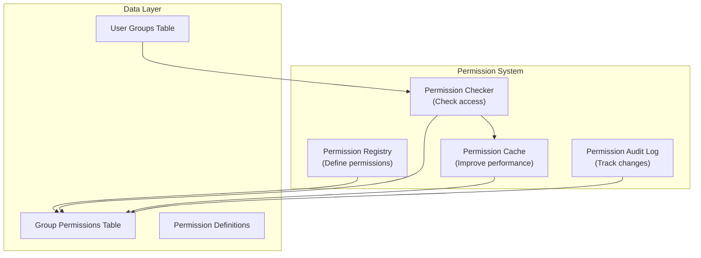

# ADR-006: modulengedély-rendszer

> Finomszemcsés, hierarchikus engedélyrendszer a XOOPS modulokhoz, amely lehetővé teszi a részletes hozzáférés-szabályozást.

---

## Állapot

**Elfogadva** – A XOOPS 2.5.x verzióban implementálva és a XOOPS 4.0 verzióban kiterjesztve

---

## Kontextus

### Problémanyilatkozat

A XOOPS modulokhoz rugalmas engedélyvezérlőkre van szükség, amelyek lehetővé teszik:

1. **modulszintű engedélyek** – A felhasználó hozzáférhet ehhez a modulhoz?
2. **Objektumszintű engedélyek** – A felhasználó hozzáférhet ehhez a konkrét elemhez?
3. **Műveletszintű engedélyek** – A felhasználó végrehajthatja ezt a műveletet?
4. **Egyéni engedélyek** – Meghatározhatják a modulok saját engedélyeiket?

### Jelenlegi állapot

A XOOPS 2.5 a XOOPSGroupPermission rendszert használja:

```php
<?php
$perm_handler = xoops_getHandler('groupperm');
$isAllowed = $perm_handler->checkRight(
    'modulename',
    'action',
    $itemId,
    $groupId
);
```

### Kihívások

1. **Komplex lekérdezések** - Az engedélyek ellenőrzéséhez adatbázis-csatlakozások szükségesek
2. **Korlátozott hierarchia** – Nehéz engedélycsoportokat létrehozni
3. **Gyenge gyorsítótárazás** - Nincs beépített engedélyes gyorsítótárazás
4. **modulváltozatok** - Minden modul másképp valósítható meg
5. **Teljesítmény** – Több DB-lekérdezés az engedélyek ellenőrzéséhez

---

## Döntés

### Hierarchikus engedélyezési rendszer megvalósítása

Hozzon létre egy szabványosított, gyorsítótárazott engedélyrendszert, amely támogatja:

1. **Hierarchikus engedélyek** – Szülőcsoportoktól való öröklés
2. **Szerepkör alapú hozzáférés** – Szerepkörökhöz rendelt engedélyek hozzárendelése (adminisztrátor, moderátor, felhasználó, vendég)
3. **Objektumengedélyek** - Finomszemcsés vezérlés elemenként
4. **Gyorsítótárazás** – Gyorsítótárazási engedélyek a lekérdezések számának csökkentése érdekében
5. **Egyéni engedélyek** – A modulok maguk határozzák meg
6. **Audit Trail** - Engedélyváltozások naplózása

### Engedélyhierarchia

```
User
  └── Group 1 (Admin)
      └── Permission: admin_module
      └── Permission: edit_all_items
      └── Permission: delete_all_items
  └── Group 2 (Moderator)
      └── Permission: moderate_comments
      └── Permission: edit_own_items
  └── Group 3 (User)
      └── Permission: view_published_items
      └── Permission: edit_own_items
  └── Group 4 (Guest)
      └── Permission: view_published_items
```

### Építészet



---

## Alapkomponensek

### 1. Az engedély meghatározása

```php
<?php
// Module defines its permissions in xoops_version.php

$modversion['permissions'] = [
    [
        'name' => 'module_view',
        'description' => 'Can view module',
        'level' => 'module',
    ],
    [
        'name' => 'item_view',
        'description' => 'Can view items',
        'level' => 'item',
    ],
    [
        'name' => 'item_create',
        'description' => 'Can create items',
        'level' => 'item',
    ],
    [
        'name' => 'item_edit',
        'description' => 'Can edit items',
        'level' => 'item',
    ],
    [
        'name' => 'item_delete',
        'description' => 'Can delete items',
        'level' => 'item',
    ],
    [
        'name' => 'admin_manage',
        'description' => 'Can manage module',
        'level' => 'admin',
    ],
];

// Default permissions by group
$modversion['group_permissions'] = [
    // Admin group gets all permissions
    '1' => [
        'module_view' => 1,
        'item_view' => 1,
        'item_create' => 1,
        'item_edit' => 1,
        'item_delete' => 1,
        'admin_manage' => 1,
    ],
    // User group
    '3' => [
        'module_view' => 1,
        'item_view' => 1,
        'item_create' => 1,
        'item_edit' => 0,
        'item_delete' => 0,
        'admin_manage' => 0,
    ],
    // Guest group
    '4' => [
        'module_view' => 1,
        'item_view' => 1,
        'item_create' => 0,
        'item_edit' => 0,
        'item_delete' => 0,
        'admin_manage' => 0,
    ],
];
```

### 2. Engedélyellenőrző

```php
<?php
declare(strict_types=1);

namespace XoopsCore\Permission;

class PermissionChecker
{
    private PermissionCache $cache;
    private PermissionRepository $repository;

    public function hasPermission(
        User $user,
        string $permissionName,
        ?int $itemId = null
    ): bool {
        // Check cache first
        $cacheKey = "perm_{$user->getId()}_{$permissionName}_{$itemId}";
        if ($this->cache->has($cacheKey)) {
            return $this->cache->get($cacheKey);
        }

        $hasPermission = false;

        // Check all user groups
        foreach ($user->getGroups() as $group) {
            if ($this->checkGroupPermission($group, $permissionName, $itemId)) {
                $hasPermission = true;
                break;
            }
        }

        // Cache result
        $this->cache->set($cacheKey, $hasPermission, 3600);

        // Log high-level access checks
        if ($hasPermission && $this->shouldAuditLog($permissionName)) {
            $this->auditLog('PERMISSION_CHECKED', [
                'user_id' => $user->getId(),
                'permission' => $permissionName,
                'item_id' => $itemId,
                'result' => 'ALLOWED',
            ]);
        }

        return $hasPermission;
    }

    private function checkGroupPermission(
        Group $group,
        string $permissionName,
        ?int $itemId = null
    ): bool {
        $sql = 'SELECT COUNT(*) FROM ' . $this->table . '
                WHERE groupid = ?
                AND permission = ?
                AND itemid = ?
                AND granted = 1';

        $stmt = $this->db->prepare($sql);
        $stmt->execute([$group->getId(), $permissionName, $itemId ?? 0]);

        return $stmt->fetchColumn() > 0;
    }
}
```

### 3. Engedélyszintek

```php
<?php
// Different permission levels with different scopes

class PermissionLevel
{
    // Module-level: Affects entire module
    public const LEVEL_MODULE = 'module';

    // Admin-level: Admin panel access
    public const LEVEL_ADMIN = 'admin';

    // Item-level: Specific objects/items
    public const LEVEL_ITEM = 'item';

    // Field-level: Specific object fields
    public const LEVEL_FIELD = 'field';

    // Action-level: Specific actions/operations
    public const LEVEL_ACTION = 'action';
}
```

### 4. Objektumszintű engedélyek

```php
<?php
// Fine-grained control for specific items

class Item extends XoopsObject
{
    /**
     * Check if user can view this item
     */
    public function canView(User $user): bool
    {
        // Public items anyone can view
        if ($this->getVar('status') === 'published') {
            return true;
        }

        // Owner can always view their items
        if ($this->getVar('user_id') === $user->getId()) {
            return true;
        }

        // Check group permissions
        $permChecker = xoops_getActiveModule()->getPermissionChecker();
        return $permChecker->hasPermission(
            $user,
            'item_view',
            $this->getVar('id')
        );
    }

    public function canEdit(User $user): bool
    {
        // Owner can edit their items
        if ($this->getVar('user_id') === $user->getId()) {
            return $permChecker->hasPermission($user, 'item_edit', $this->getVar('id'));
        }

        // Check if user can edit all items
        return $permChecker->hasPermission($user, 'item_edit_all', $this->getVar('id'));
    }

    public function canDelete(User $user): bool
    {
        return $permChecker->hasPermission($user, 'item_delete', $this->getVar('id'));
    }
}
```

### 5. Használat a vezérlőkben

```php
<?php
// Example: Article controller

class ArticleController
{
    private PermissionChecker $permChecker;

    public function view(int $id, User $user): Response
    {
        $article = $this->repository->find($id);

        // Check permission
        if (!$article->canView($user)) {
            throw new AccessDeniedException('Cannot view this article');
        }

        return new HtmlResponse($this->renderArticle($article));
    }

    public function edit(int $id, User $user): Response
    {
        $article = $this->repository->find($id);

        // Check permission
        if (!$article->canEdit($user)) {
            throw new AccessDeniedException('Cannot edit this article');
        }

        // Handle form submission
        if ($this->request->isMethod('POST')) {
            $article->setVar('title', $this->request->getPost('title'));
            $article->setVar('content', $this->request->getPost('content'));
            $this->repository->insert($article);

            $this->auditLog('ARTICLE_EDITED', ['id' => $id, 'user_id' => $user->getId()]);

            // Invalidate permission cache
            $this->permChecker->clearCache($user->getId());

            return new RedirectResponse('/article/' . $id);
        }

        return new HtmlResponse($this->renderForm($article));
    }

    public function delete(int $id, User $user): Response
    {
        $article = $this->repository->find($id);

        if (!$article->canDelete($user)) {
            throw new AccessDeniedException('Cannot delete this article');
        }

        $this->repository->delete($article);

        $this->auditLog('ARTICLE_DELETED', ['id' => $id, 'user_id' => $user->getId()]);

        // Invalidate cache
        $this->permChecker->clearCache($user->getId());

        return new JsonResponse(['success' => true]);
    }
}
```

---

## Következmények

### Pozitív hatások

1. **Granuláris vezérlés** - Finomhangolt engedélykezelés
2. **Szabványos** – Konzisztens a modulok között
3. **Gyorsítótárazott** – Jobb teljesítmény gyorsítótárazással
4. **Auditable** - Kövesse nyomon, ki mit változtatott
5. **Rugalmas** - Egyéni engedélyek támogatása
6. **Skálázható** – Bonyolult engedélyhierarchiákat kezel
7. **Tesztelhető** - Könnyen tesztelhető

### Negatív hatások

1. **Bonyolultság** - Több kódot kell kezelni
2. **Adatbázis Overhead** - További táblák és csatlakozások
3. **Gyorsítótár érvénytelenítése** – A módosítások esetén törölnie kell a gyorsítótárat
4. **Tanulási görbe** – A fejlesztőknek meg kell érteniük a rendszert
5. **Teljesítmény** - Ha a gyorsítótár nincs megfelelően konfigurálva

### Kockázatok és mérséklések

| Kockázat | Súlyosság | Mérséklés |
|------|----------|-----------|
| Túl bonyolult engedélyek | Közepes | Jó alapértelmezések, dokumentáció |
| Elavult adatok gyorsítótárazása | Magas | TTL, intelligens érvénytelenítés |
| Teljesítmény regresszió | Közepes | Lekérdezések összehasonlítása, optimalizálása |
| Engedély megkerülése | Magas | Biztonsági audit, tesztek |

---

## Engedélytervezési minták

### 1. minta: Tulajdonos alapú engedélyek

```php
<?php
// User can edit their own items but not others'

public function canEdit(User $user): bool
{
    // Owner can always edit
    if ($this->isOwner($user)) {
        return true;
    }

    // Check group permissions for editing others' items
    return $this->permChecker->hasPermission($user, 'edit_all_items');
}

private function isOwner(User $user): bool
{
    return $this->getVar('user_id') === $user->getId();
}
```

### 2. minta: Állapot alapú engedélyek

```php
<?php
// Different permissions based on status

public function canView(User $user): bool
{
    switch ($this->getVar('status')) {
        case 'published':
            // Anyone with module permission can view
            return $this->permChecker->hasPermission($user, 'item_view');

        case 'draft':
            // Only owner or admin can view
            return $this->isOwner($user) ||
                   $this->permChecker->hasPermission($user, 'admin_manage');

        case 'archived':
            // Only admin can view
            return $this->permChecker->hasPermission($user, 'admin_manage');

        default:
            return false;
    }
}
```

### 3. minta: Szerep alapú engedélyek

```php
<?php
// Check against specific roles

public function hasAdminRole(User $user): bool
{
    return $user->getGroups()->contains('admin_group');
}

public function hasModeratorRole(User $user): bool
{
    return $user->getGroups()->contains('moderator_group') ||
           $this->hasAdminRole($user);
}

public function canModerate(User $user): bool
{
    return $this->hasModeratorRole($user);
}
```

---

## Kapcsolódó határozatok

- ADR-001: moduláris architektúra - A modulok határozzák meg a jogosultságokat
- ADR-004: Biztonsági rendszer - A biztonság alapja
- ADR-005: Köztes szoftver - Kényszerítheti az engedélyeket

---

## Referenciák

### Engedélymodellek

- [RBAC (szerep alapú hozzáférés-vezérlés)](https://en.wikipedia.org/wiki/Role-based_access_control)
- [ABAC (Attribútum-alapú hozzáférés-vezérlés)](https://en.wikipedia.org/wiki/Attribute-based_access_control)
- [ACL (Hozzáférés-vezérlési lista)](https://en.wikipedia.org/wiki/Access-control_list)

### Megvalósítás

- [Symfony Security](https://symfony.com/doc/current/security.html)
- [Laravel-engedély](https://laravel.com/docs/authorization)

---

## Megvalósítási ellenőrzőlista

- [ ] Szabványos engedélyszintek meghatározása
- [ ] PermissionChecker osztály létrehozása
- [ ] Gyorsítótárazási stratégia megvalósítása
- [ ] Auditnapló hozzáadása
- [ ] Segítő funkciók létrehozása
- [ ] Írjon átfogó teszteket
- [ ] Dokumentum fejlesztőknek
- [ ] Frissítse az összes modult
- [ ] Teljesítményoptimalizálás
- [ ] Biztonsági felülvizsgálat

---

## Verzióelőzmények

| Verzió | Dátum | Változások |
|---------|------|---------|
| 1.0.0 | 2024-01-28 | Kezdeti dokumentum |

---#xoops #adr #engedélyek #engedélyezés #rbac #biztonság
