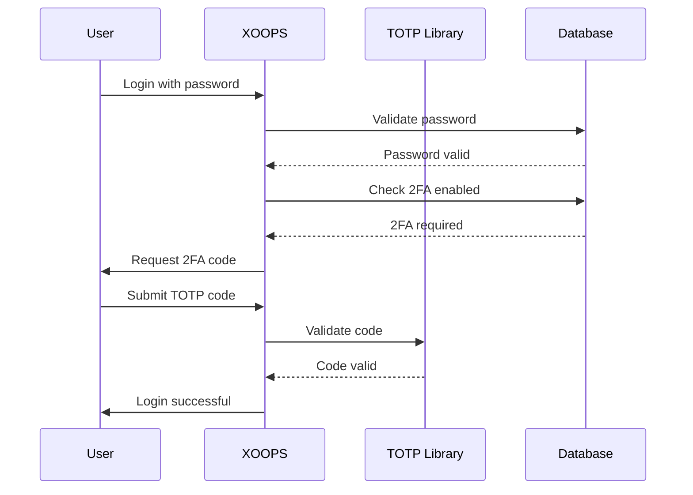

## Állapot

Javasolt

## Kontextus

A XOOPS-nak fokozott biztonságra van szüksége a felhasználói hitelesítéshez. A kéttényezős hitelesítés (2FA) a jelszavakon túl további biztonsági réteget biztosít, még akkor is védi a fiókokat, ha a jelszavak feltörtek.

Főbb szempontok:
- Visszafelé kompatibilitás a meglévő hitelesítéssel
- Több 2FA módszer támogatása
- Felhasználói élmény a beállítás és a bejelentkezés során
- Az elveszett eszközök helyreállítási mechanizmusai
- Integráció a meglévő engedélyezési rendszerrel

## Döntés

A TOTP-t (Time-based One-Time Password) fogjuk megvalósítani elsődleges 2FA módszerként, amely támogatja a biztonsági kódokat.

### Megvalósítási megközelítés



### Adatbázisséma

```sql
CREATE TABLE `{PREFIX}_users_2fa` (
    `user_id` INT(11) NOT NULL,
    `secret` VARCHAR(32) NOT NULL,
    `enabled` TINYINT(1) DEFAULT 0,
    `backup_codes` TEXT,
    `last_used` INT(11),
    `created` INT(11) NOT NULL,
    PRIMARY KEY (`user_id`),
    FOREIGN KEY (`user_id`) REFERENCES `{PREFIX}_users`(`uid`)
);
```

### Szolgáltatási felület

```php
interface TwoFactorAuthInterface
{
    public function enable(int $userId): TwoFactorSetup;
    public function disable(int $userId): void;
    public function verify(int $userId, string $code): bool;
    public function generateBackupCodes(int $userId): array;
    public function isEnabled(int $userId): bool;
}
```

### Köztes szoftver integráció

```php
class TwoFactorMiddleware implements MiddlewareInterface
{
    public function process(
        ServerRequestInterface $request,
        RequestHandlerInterface $handler
    ): ResponseInterface {
        $session = $request->getAttribute('session');

        if ($session->has('pending_2fa_user_id')) {
            // User needs to complete 2FA
            if ($this->isVerificationRequest($request)) {
                return $handler->handle($request);
            }
            return new RedirectResponse('/2fa/verify');
        }

        return $handler->handle($request);
    }
}
```

## Következmények

### Pozitív

- Jelentősen javított fiókbiztonság
- Ipari szabvány TOTP kompatibilitás (Google Authenticator, Authy stb.)
- A biztonsági kódok megakadályozzák a fiókzárolást
- Opcionális felhasználónként – nem kényszeríti az elfogadást
- A PSR-15 köztes szoftver tiszta integrációt tesz lehetővé

### Negatív

- A további bejelentkezési lépések hatással vannak a felhasználói élményre
- A felhasználóknak kezelniük kell a hitelesítő alkalmazásokat
- Az elveszett eszközök helyreállítási folyamatot igényelnek
- További adatbázis-tárolás és lekérdezések
- Titkosítókönyvtár-függőséget igényel

### Migrációs útvonal

1. Adjon hozzá adatbázistáblát a 2FA adatokhoz
2. Valósítsa meg a TOTP szolgáltatást könyvtárfüggőséggel
3. Köztes szoftver hozzáadása a hitelesítési lánchoz
4. Hozzon létre beállítási és ellenőrzési felhasználói felületet
5. Adminisztrátori lehetőség, hogy meghatározott csoportokhoz 2FA-t kérjen

## Megfontolt alternatívák

### SMS-alapú OTP

Elutasítva a következők miatt:
- SIM sebezhetőségek cseréje
- A SMS átjáró költsége
- A telefonszám-ellenőrzés bonyolultsága
- Adatvédelmi aggályok

### Hardveres biztonsági kulcsok (WebAuthn)

Elhalasztva a jövőbeli ADR:
- Bonyolultabb megvalósítás
- Korlátozott böngészőtámogatás
- Magasabb felhasználói költségek
- Később hozzáadható a TOTP mellé

### E-mail alapú OTP

Elutasítva a következők miatt:
- Az e-mail fiók kompromisszuma legyőzi a célt
- A kézbesítési késések hatással vannak az UX-re
- Spamszűrő problémák

## Referenciák

- [RFC 6238 - TOTP](https://tools.ietf.org/html/rfc6238)
- [Google Authenticator Key Format](https://github.com/google/google-authenticator/wiki/Key-Uri-Format)
- ../../02-Core-Concepts/Security/Security-Best-Practices - Biztonsági irányelvek
- ../../02-Core-Concepts/Users-Permissions/Authentication - Auth rendszerdokumentáció
