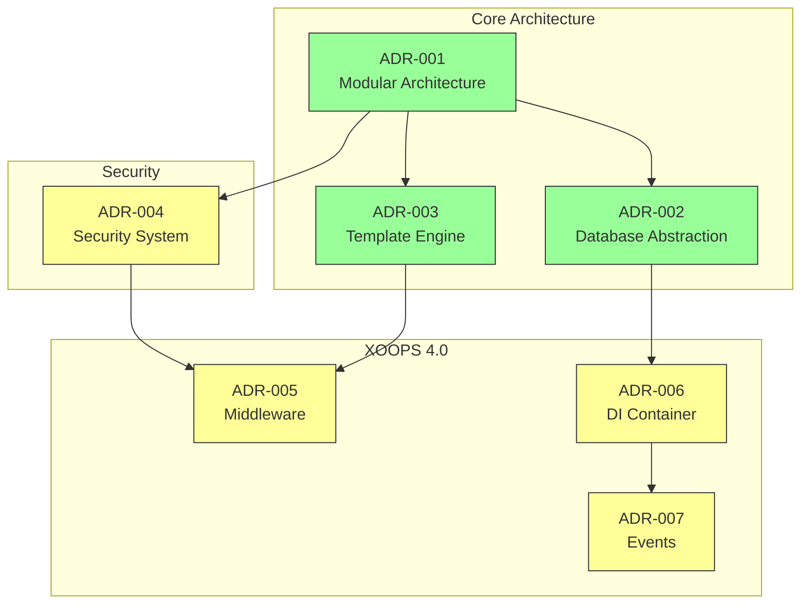
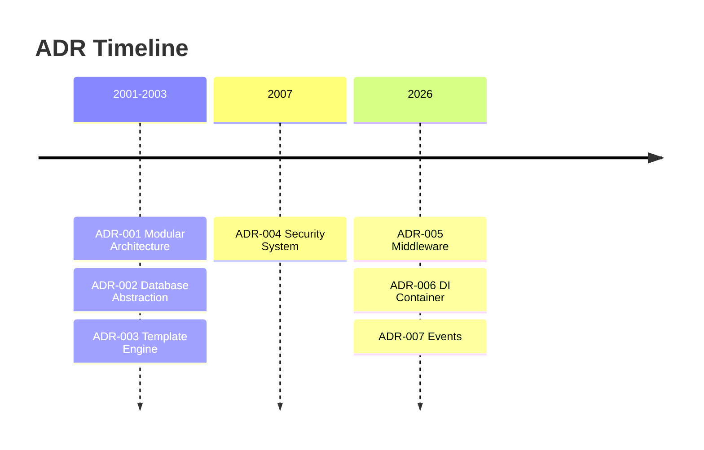

# 📋 Architecture Decision Records Index

> A XOOPS CMS-t formáló építészeti döntések átfogó indexe.

---

## Mik azok az ADR-ek?

Az Architecture Decision Records (ADR-ek) a XOOPS fejlesztése során hozott jelentős építészeti döntéseket dokumentálják. Megragadják az egyes választások kontextusát, döntését és következményeit, értékes történelmi kontextust biztosítva a fenntartók és a közreműködők számára.

---

## ADR Állapotjelmagyarázat

| Állapot | Jelentése |
|--------|----------|
| **Javasolt** | Megbeszélés alatt, még nem fogadták el |
| **Elfogadva** | A határozatot elfogadták |
| **Elavult** | Már nem ajánlott |
| **Felváltva** | Egy másik ADR |

---

## Jelenlegi ADR-ek

### Alapozó határozatok

| ADR | Cím | Állapot | Hatás |
|-----|-------|--------|---------|
| ADR-001 | moduláris architektúra | Elfogadva | Core |
| ADR-002 | Objektum-orientált adatbázis-hozzáférés | Elfogadva | Core |
| ADR-003 | Smarty Template Engine | Elfogadva | Core |

### Tervezett ADR-ek (XOOPS 4.0)

| ADR | Cím | Állapot | Hatás |
|-----|-------|--------|---------|
| ADR-004 | Biztonsági rendszer tervezése | Javasolt | Biztonság |
| ADR-005 | PSR-15 Köztes szoftver | Javasolt | Építészet |
| ADR-006 | Dependency Injection Container | Javasolt | Építészet |
| ADR-007 | Rendezvényrendszer újratervezése | Javasolt | Építészet |

---

## ADR Kapcsolatok



---

## Idővonal



---

## Új ADR létrehozása

Új építészeti döntés meghozatalakor:

1. Másolja ki a ADR sablont
2. Töltse ki az összes részt
3. Küldje el lehívási kérelemként
4. Beszélje meg a GitHub-problémákat
5. Frissítse az állapotot a döntés után

### ADR sablonszerkezet

```markdown
# ADR-XXX: Title

## Status
Proposed | Accepted | Deprecated | Superseded

## Context
What is the issue motivating this decision?

## Decision
What is the change that we're proposing?

## Consequences
What becomes easier or harder as a result?

## Alternatives Considered
What other options were evaluated?
```

---

## 🔗 Kapcsolódó dokumentáció

- Alapvető fogalmak
- Hozzájárulási irányelvek
- XOOPS 4.0 ütemterv

---

#xoops #adr #architecture #index #döntések
