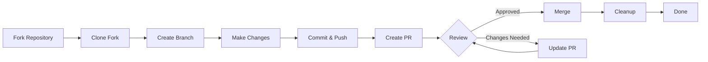

> Ez az útmutató végigvezeti a XOOPS-hoz való hozzájárulás teljes folyamatán, a kezdeti beállítástól az egyesített lekérési kérésig.

---

## Prerequisites

Mielőtt elkezdené a hozzájárulást, győződjön meg arról, hogy rendelkezik:

- **Git** telepítve és konfigurálva
- **GitHub-fiók** (ingyenes)
- **PHP 7.4+** for XOOPS development
- **Composer** a függőségkezeléshez
- Git munkafolyamatok alapismerete
- Magatartási kódex ismerete

---

## 1. lépés: Fork the Repository

### A GitHub webes felületén

1. Navigáljon a tárhoz (pl. `XOOPS/XOOPSCore27`)
2. Kattintson a **Villa** gombra a jobb felső sarokban
3. Válassza ki az elágazás helyét (személyes fiókja)
4. Várja meg, amíg a villa befejeződik

### Why Fork?

- Megkapod a saját példányodat, amin dolgozhatsz
- A karbantartóknak nem kell sok fiókot kezelniük
- Teljes mértékben uralod a villát
- A Pull Requests hivatkozik a villájára és az upstream repo-ra

---

## 2. lépés: Klónozza a villát helyileg

```bash
# Clone your fork (replace YOUR_USERNAME)
git clone https://github.com/YOUR_USERNAME/XoopsCore27.git
cd XoopsCore27

# Add upstream remote to track original repository
git remote add upstream https://github.com/XOOPS/XoopsCore27.git

# Verify remotes are set correctly
git remote -v
# origin    https://github.com/YOUR_USERNAME/XoopsCore27.git (fetch)
# origin    https://github.com/YOUR_USERNAME/XoopsCore27.git (push)
# upstream  https://github.com/XOOPS/XoopsCore27.git (fetch)
# upstream  https://github.com/XOOPS/XoopsCore27.git (nofetch)
```

---

## 3. lépés: Fejlesztői környezet beállítása

### Install Dependencies

```bash
# Install Composer dependencies
composer install

# Install development dependencies
composer install --dev

# For module development
cd modules/mymodule
composer install
```

### Configure Git

```bash
# Set your Git identity
git config user.name "Your Name"
git config user.email "your.email@example.com"

# Optional: Set global Git config
git config --global user.name "Your Name"
git config --global user.email "your.email@example.com"
```

### Run Tests

```bash
# Make sure tests pass in clean state
./vendor/bin/phpunit

# Run specific test suite
./vendor/bin/phpunit --testsuite unit
```

---

## 4. lépés: Feature Branch létrehozása

### Fiókelnevezési Egyezmény

Kövesse a következő mintát: `<type>/<description>`

**Types:**
- `feature/` - Új funkció
- `fix/` - Hibajavítás
- `docs/` - Csak dokumentáció
- `refactor/` - Kódrefaktorálás
- `test/` - Teszt kiegészítések
- `chore/` - Karbantartás, szerszámozás

**Példák:**
```bash
# Feature branch
git checkout -b feature/add-two-factor-auth

# Bug fix branch
git checkout -b fix/prevent-xss-in-forms

# Documentation branch
git checkout -b docs/update-api-guide

# Always branch from upstream/main (or develop)
git checkout -b feature/my-feature upstream/main
```

### Tartsa naprakészen a fióktelepet

```bash
# Before you start work, sync with upstream
git fetch upstream
git merge upstream/main

# Later, if upstream has changed
git fetch upstream
git rebase upstream/main
```

---

## 5. lépés: Végezze el a változtatásokat

### Fejlesztési gyakorlatok

1. **Írjon kódot** a PHP szabványok szerint
2. **Írjon teszteket** az új funkciókhoz
3. **Ha szükséges, frissítse a dokumentációt**
4. **Linterek** és kódformázók futtatása

### Code Quality Checks

```bash
# Run all tests
./vendor/bin/phpunit

# Run with coverage
./vendor/bin/phpunit --coverage-html coverage/

# Run PHP CS Fixer
./vendor/bin/php-cs-fixer fix --dry-run

# Run PHPStan static analysis
./vendor/bin/phpstan analyse class/ src/
```

### Commit Good Changes

```bash
# Check what you changed
git status
git diff

# Stage specific files
git add class/MyClass.php
git add tests/MyClassTest.php

# Or stage all changes
git add .

# Commit with descriptive message
git commit -m "feat(auth): add two-factor authentication support"
```

---

## 6. lépés: Tartsa szinkronban az ágat

Miközben a funkción dolgozik, a fő ág előrehaladhat:

```bash
# Fetch latest changes from upstream
git fetch upstream

# Option A: Rebase (preferred for clean history)
git rebase upstream/main

# Option B: Merge (simpler but adds merge commits)
git merge upstream/main

# If conflicts occur, resolve them then:
git add .
git rebase --continue  # or git merge --continue
```

---

## 7. lépés: Nyomja a villájához

```bash
# Push your branch to your fork
git push origin feature/my-feature

# On subsequent pushes
git push

# If you rebased, you might need force push (use carefully!)
git push --force-with-lease origin feature/my-feature
```

---

## 8. lépés: Lehívási kérelem létrehozása

### On GitHub Web Interface

1. Lépjen a GitHubon a villához
2. Értesítést fog látni, hogy hozzon létre PR-t fiókjában
3. Kattintson az **"Kérés összehasonlítása és lekérése"** lehetőségre.
4. Vagy kattintson manuálisan az **"Új lekérési kérelem"** elemre, és válassza ki az ágat

### PR cím és leírás

**Title Format:**
```
<type>(<scope>): <subject>
```

Examples:
```
feat(auth): add two-factor authentication
fix(forms): prevent XSS in text input
docs: update installation guide
refactor(core): improve performance
```

**Leírássablon:**

```markdown
## Description
Brief explanation of what this PR does.

## Changes
- Changed X from A to B
- Added feature Y
- Fixed bug Z

## Type of Change
- [ ] New feature (adds new functionality)
- [ ] Bug fix (fixes an issue)
- [ ] Breaking change (API/behavior change)
- [ ] Documentation update

## Testing
- [ ] Added tests for new functionality
- [ ] All existing tests pass
- [ ] Manual testing performed

## Screenshots (if applicable)
Include before/after screenshots for UI changes.

## Related Issues
Closes #123
Related to #456

## Checklist
- [ ] Code follows style guidelines
- [ ] Self-reviewed own code
- [ ] Commented complex code
- [ ] Updated documentation
- [ ] No new warnings generated
- [ ] Tests pass locally
```

### PR Review Checklist

Beküldés előtt győződjön meg:

- [ ] A kód követi a PHP szabványokat
- [ ] A tesztek szerepelnek és sikeresek
- [ ] Dokumentáció frissítve (ha szükséges)
- [ ] No merge conflicts
- [ ] A véglegesítési üzenetek egyértelműek
- [ ] A kapcsolódó kérdésekre hivatkozunk
- [ ] PR leírás részletes
- [ ] Nincs hibakeresési kód vagy konzolnapló

---

## 9. lépés: Válaszoljon a visszajelzésre

### During Code Review

1. **Olvassa el figyelmesen a megjegyzéseket** - Értse meg a visszajelzést
2. **Tegyen fel kérdéseket** - Ha nem egyértelmű, kérjen pontosítást
3. **Az alternatívák megvitatása** - Tisztelettel vitassa meg a megközelítéseket
4. **Végezze el a kért módosításokat** - Frissítse fiókját
5. ** Frissített véglegesítések kényszerítése** – Ha átírja az előzményeket

```bash
# Make changes
git add .
git commit --amend  # Modify last commit
git push --force-with-lease origin feature/my-feature

# Or add new commits
git commit -m "Address feedback on PR review"
git push origin feature/my-feature
```

### Expect Iteration

- A legtöbb PR több felülvizsgálati kört igényel
- Légy türelmes és konstruktív
- Tekintse meg a visszajelzést tanulási lehetőségként
- A karbantartók javasolhatnak refaktorokat

---

## 10. lépés: Egyesítés és tisztítás

### After Approval

Miután a karbantartók jóváhagyták és egyesítik:

1. **A GitHub automatikus egyesítése** vagy a karbantartói kattintások egyesítése
2. **Az Ön fiókja törölve lett** (általában automatikusan)
3. **Változások az upstreamben**

### Local Cleanup

```bash
# Switch to main branch
git checkout main

# Update main with merged changes
git fetch upstream
git merge upstream/main

# Delete local feature branch
git branch -d feature/my-feature

# Delete from your fork (if not auto-deleted)
git push origin --delete feature/my-feature
```

---

## Workflow Diagram



---

## Common Scenarios

### Szinkronizálás indítás előtt

```bash
# Always start fresh
git fetch upstream
git checkout -b feature/new-thing upstream/main
```

### Adding More Commits

```bash
# Just push again
git add .
git commit -m "feat: additional changes"
git push origin feature/new-thing
```

### Fixing Mistakes

```bash
# Last commit has wrong message
git commit --amend -m "Correct message"
git push --force-with-lease

# Revert to previous state (careful!)
git reset --soft HEAD~1  # Keep changes
git reset --hard HEAD~1  # Discard changes
```

### Egyesítési konfliktusok kezelése

```bash
# Rebase and resolve conflicts
git fetch upstream
git rebase upstream/main

# Edit conflicted files to resolve
# Then continue
git add .
git rebase --continue
git push --force-with-lease
```

---

## Bevált gyakorlatok

### Tedd

- Tartsa a fióktelepeket az egyes kérdésekre összpontosítva
- Tegyen apró, logikus kötelezettségeket
- Írjon leíró commit üzeneteket
- Gyakran frissítse fiókját
- Test before pushing
- Document changes
- Legyen reagál a visszajelzésekre

### Ne- Dolgozzon közvetlenül a main/master ágon
- Keverje össze a nem kapcsolódó változásokat egy PR-ben
- A generált fájlok vagy node_modules véglegesítése
- Kényszernyomás, miután a PR nyilvános (használd a --force-with-lease)
- A kódellenőrzési visszajelzés figyelmen kívül hagyása
- Hatalmas PR-ok létrehozása (bontás kisebbekre)
- Érzékeny adatok rögzítése (API kulcsok, jelszavak)

---

## Tips for Success

### Communicate

- Tegyen fel kérdéseket kérdésekben a munka megkezdése előtt
- Ask for guidance on complex changes
- Beszélje meg a megközelítést a PR leírásban
- A visszajelzésekre azonnal válaszoljon

### Follow Standards

- Tekintse át a PHP szabványokat
- Ellenőrizze a problémajelentési irányelveket
- Olvassa el a Hozzájárulás áttekintését
- Kövesse a Pull Request irányelveit

### Learn the Codebase

- Olvassa el a meglévő kódmintákat
- Hasonló megvalósítások tanulmányozása
- Értsd az építészetet
- Check Core Concepts

---

## Kapcsolódó dokumentáció

- Magatartási kódex
- Pull Request Guidelines
- Issue Reporting
- PHP kódolási szabványok
- Közreműködő áttekintés

---

#xoops #git #github #hozzájárulás #munkafolyamat #pull-request
