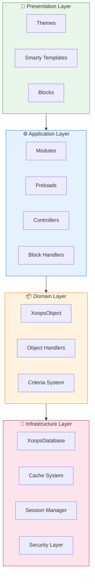
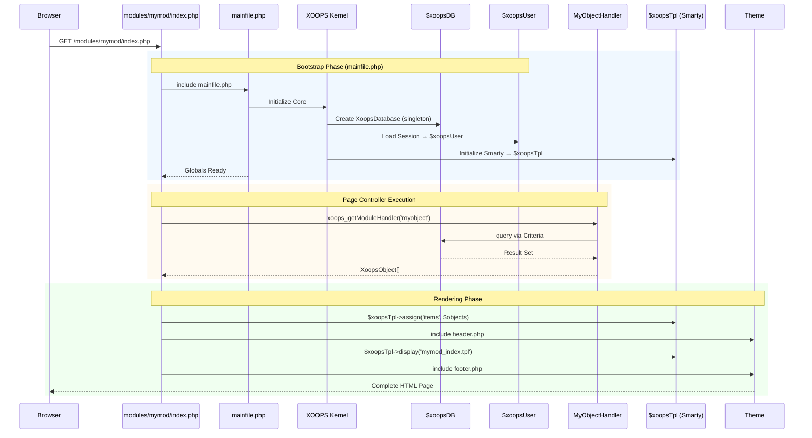

:::note[A dokumentumról]
Ez az oldal a XOOPS **koncepcionális architektúráját** írja le, amely a jelenlegi (2.5.x) és a jövőbeli (4.0.x) verziókra egyaránt vonatkozik. Néhány diagram a réteges tervezési látásmódot mutatja be.

**Verzióspecifikus részletekért:**
- **XOOPS 2.5.x Ma:** `mainfile.php`, globális (`$xoopsDB`, `$xoopsUser`), előtöltést és kezelőmintát használ
- **XOOPS 4.0 Cél:** PSR-15 köztes szoftver, DI konténer, útválasztó - lásd [Útiterv](../../07-XOOPS-4.0/XOOPS-4.0-Roadmap.md)
:::

Ez a dokumentum átfogó áttekintést nyújt a XOOPS rendszerarchitektúráról, elmagyarázva, hogyan működnek együtt a különböző összetevők egy rugalmas és bővíthető tartalomkezelő rendszer létrehozásában.

## Áttekintés

A XOOPS moduláris architektúrát követ, amely külön rétegekre osztja szét a problémákat. A rendszer több alapelv köré épül fel:

- **modularitás**: A funkcionalitás független, telepíthető modulokba szerveződik
- **Bővíthetőség**: A rendszer az alapkód módosítása nélkül bővíthető
- **Absztrakció**: Az adatbázis- és prezentációs rétegek elvonatkoztattak az üzleti logikától
- **Biztonság**: A beépített biztonsági mechanizmusok védelmet nyújtanak a gyakori sebezhetőségekkel szemben

## Rendszerrétegek



### 1. Bemutató réteg

A bemutató réteg kezeli a felhasználói felület megjelenítését a Smarty sablonmotor segítségével.

**Főbb összetevők:**
- **Témák**: Vizuális stílus és elrendezés
- **Intelligens sablonok**: Dinamikus tartalommegjelenítés
- **Blocks**: Újrafelhasználható tartalommodulok

### 2. Alkalmazási réteg

Az alkalmazási réteg üzleti logikát, vezérlőket és modulfunkciókat tartalmaz.

**Főbb összetevők:**
- **modulok**: Önálló funkciócsomagok
- **Kezelők**: Adatkezelési osztályok
- **Előtöltés**: Eseményfigyelők és hoook

### 3. Domain réteg

A tartományi réteg alapvető üzleti objektumokat és szabályokat tartalmaz.

**Főbb összetevők:**
- **XOOPSObject**: Alaposztály minden tartományobjektumhoz
- **Kezelők**: CRUD műveletek tartományobjektumokhoz

### 4. Infrastruktúra réteg

Az infrastruktúra réteg olyan alapvető szolgáltatásokat nyújt, mint az adatbázis-hozzáférés és a gyorsítótár.

## Életciklus kérése

A kérés életciklusának megértése döntő fontosságú a hatékony XOOPS fejlesztéshez.

### XOOPS 2.5.x oldalvezérlő folyamata

A jelenlegi XOOPS 2.5.x **Page Controller** mintát használ, ahol minden PHP fájl a saját kérését kezeli. A globálisok (`$xoopsDB`, `$xoopsUser`, `$xoopsTpl` stb.) a rendszerindítás során inicializálódnak, és a végrehajtás során elérhetők.



### Key Globals a 2.5.x-ben

| Globális | Típus | Inicializált | Cél |
|--------|------|--------------|---------|
| `$xoopsDB` | `XOOPSDatabase` | Bootstrap | Adatbázis kapcsolat (singleton) |
| `$xoopsUser` | `XOOPSUser\|null` | Munkamenet terhelés | Jelenlegi bejelentkezett felhasználó |
| `$xoopsTpl` | `XOOPSTpl` | Sablon init | Smarty sablon motor |
| `$xoopsmodule` | `XOOPSmodule` | modulterhelés | Jelenlegi modulkörnyezet |
| `$xoopsConfig` | `array` | Config load | Rendszerkonfiguráció |

:::megjegyzés[XOOPS 4.0 összehasonlítás]
A XOOPS 4.0 verzióban az oldalvezérlő mintát egy **PSR-15 Middleware Pipeline** és útválasztó alapú diszpécsere váltja fel. A globálisokat felváltja a függőségi injekció. Lásd a [Hibrid mód szerződés](../../07-XOOPS-4.0/Specifications/Hybrid-Mode-Contract.md) című részt a kompatibilitási garanciákért az átállás során.
:::

### 1. Bootstrap fázis

```php
// mainfile.php is the entry point
include_once XOOPS_ROOT_PATH . '/mainfile.php';

// Core initialization
$xoops = Xoops::getInstance();
$xoops->boot();
```

**Lépések:**
1. Konfiguráció betöltése (`mainfile.php`)
2. Inicializálja az automatikus betöltőt
3. Állítsa be a hibakezelést
4. Adatbázis-kapcsolat létrehozása
5. Felhasználói munkamenet betöltése
6. Inicializálja a Smarty sablonmotort

### 2. Útválasztási fázis

```php
// Request routing to appropriate module
$module = $GLOBALS['xoopsModule'];
$controller = $module->getController();
$controller->dispatch($request);
```

**Lépések:**
1. Elemzési kérés URL
2. Azonosítsa a célmodult
3. Töltse be a modul konfigurációját
4. Ellenőrizze az engedélyeket
5. Útvonal a megfelelő kezelőhöz

### 3. Végrehajtási fázis

```php
// Controller execution
$data = $handler->getObjects($criteria);
$xoopsTpl->assign('items', $data);
```

**Lépések:**
1. Hajtsa végre a vezérlő logikáját
2. Interakció az adatréteggel
3. Folyamat üzleti szabályok
4. Készítse elő a nézetadatokat

### 4. Rendering fázis

```php
// Template rendering
include XOOPS_ROOT_PATH . '/header.php';
$xoopsTpl->display('db:module_template.tpl');
include XOOPS_ROOT_PATH . '/footer.php';
```

**Lépések:**
1. Alkalmazza a téma elrendezését
2. Render modul sablon
3. Folyamatblokkok
4. Kimeneti válasz

## Alapkomponensek

### XOOPSObjectA XOOPS összes adatobjektumának alaposztálya.

```php
<?php
class MyModuleItem extends XoopsObject
{
    public function __construct()
    {
        $this->initVar('id', XOBJ_DTYPE_INT, null, false);
        $this->initVar('title', XOBJ_DTYPE_TXTBOX, '', true, 255);
        $this->initVar('content', XOBJ_DTYPE_TXTAREA, '', false);
        $this->initVar('created', XOBJ_DTYPE_INT, time(), false);
    }
}
```

**Főbb módszerek:**
- `initVar()` - Objektumtulajdonságok meghatározása
- `getVar()` - Tulajdonságok értékeinek lekérése
- `setVar()` - Tulajdonságértékek beállítása
- `assignVars()` - Tömeges hozzárendelés a tömbből

### XOOPSPersistableObjectHandler

Kezeli a CRUD műveleteket XOOPSObject példányokhoz.

```php
<?php
class MyModuleItemHandler extends XoopsPersistableObjectHandler
{
    public function __construct(\XoopsDatabase $db)
    {
        parent::__construct($db, 'mymodule_items', 'MyModuleItem', 'id', 'title');
    }

    public function getActiveItems($limit = 10)
    {
        $criteria = new CriteriaCompo();
        $criteria->add(new Criteria('status', 1));
        $criteria->setSort('created');
        $criteria->setOrder('DESC');
        $criteria->setLimit($limit);

        return $this->getObjects($criteria);
    }
}
```

**Főbb módszerek:**
- `create()` - Új objektumpéldány létrehozása
- `get()` - Objektum lekérése a ID segítségével
- `insert()` - Objektum mentése az adatbázisba
- `delete()` - Objektum eltávolítása az adatbázisból
- `getObjects()` - Több objektum lekérése
- `getCount()` - Számolja az egyező objektumokat

### modul felépítése

Minden XOOPS modul szabványos könyvtárszerkezetet követ:

```
modules/mymodule/
├── class/                  # PHP classes
│   ├── MyModuleItem.php
│   └── MyModuleItemHandler.php
├── include/                # Include files
│   ├── common.php
│   └── functions.php
├── templates/              # Smarty templates
│   ├── mymodule_index.tpl
│   └── mymodule_item.tpl
├── admin/                  # Admin area
│   ├── index.php
│   └── menu.php
├── language/               # Translations
│   └── english/
│       ├── main.php
│       └── modinfo.php
├── sql/                    # Database schema
│   └── mysql.sql
├── xoops_version.php       # Module info
├── index.php               # Module entry
└── header.php              # Module header
```

## Dependency Injection Container

A modern XOOPS fejlesztés kihasználhatja a függőségi injekciót a jobb tesztelhetőség érdekében.

### A konténer alapvető megvalósítása

```php
<?php
class XoopsDependencyContainer
{
    private array $services = [];

    public function register(string $name, callable $factory): void
    {
        $this->services[$name] = $factory;
    }

    public function resolve(string $name): mixed
    {
        if (!isset($this->services[$name])) {
            throw new \InvalidArgumentException("Service not found: $name");
        }

        $factory = $this->services[$name];

        if (is_callable($factory)) {
            return $factory($this);
        }

        return $factory;
    }

    public function has(string $name): bool
    {
        return isset($this->services[$name]);
    }
}
```

### PSR-11 kompatibilis tartály

```php
<?php
namespace Xmf\Di;

use Psr\Container\ContainerInterface;

class BasicContainer implements ContainerInterface
{
    protected array $definitions = [];

    public function set(string $id, mixed $value): void
    {
        $this->definitions[$id] = $value;
    }

    public function get(string $id): mixed
    {
        if (!$this->has($id)) {
            throw new \InvalidArgumentException("Service not found: $id");
        }

        $entry = $this->definitions[$id];

        if (is_callable($entry)) {
            return $entry($this);
        }

        return $entry;
    }

    public function has(string $id): bool
    {
        return isset($this->definitions[$id]);
    }
}
```

### Használati példa

```php
<?php
// Service registration
$container = new XoopsDependencyContainer();

$container->register('database', function () {
    return XoopsDatabaseFactory::getDatabaseConnection();
});

$container->register('userHandler', function ($c) {
    return new XoopsUserHandler($c->resolve('database'));
});

// Service resolution
$userHandler = $container->resolve('userHandler');
$user = $userHandler->get($userId);
```

## Kiterjesztési pontok

A XOOPS számos bővítési mechanizmust kínál:

### 1. Előretöltés

Az előtöltések lehetővé teszik a modulok számára, hogy bekapcsolódjanak az alapvető eseményekbe.

```php
<?php
// modules/mymodule/preloads/core.php
class MymoduleCorePreload extends XoopsPreloadItem
{
    public static function eventCoreHeaderEnd($args)
    {
        // Execute when header processing ends
    }

    public static function eventCoreFooterStart($args)
    {
        // Execute when footer processing starts
    }
}
```

### 2. Beépülő modulok

A beépülő modulok speciális funkciókat bővítenek ki a modulokon belül.

```php
<?php
// modules/mymodule/plugins/notify.php
class MymoduleNotifyPlugin
{
    public function onItemCreate($item)
    {
        // Send notification when item is created
    }
}
```

### 3. Szűrők

A szűrők módosítják az adatokat, amint azok áthaladnak a rendszeren.

```php
<?php
// Content filter example
$myts = MyTextSanitizer::getInstance();
$content = $myts->displayTarea($rawContent, 1, 1, 1);
```

## Bevált gyakorlatok

### Kódszervezet

1. **Használjon névtereket** az új kódhoz:
   
   ```php
   namespace XoopsModules\MyModule;

   class Item extends \XoopsObject
   {
       // Implementation
   }
   ```

2. **Kövesse a PSR-4 automatikus betöltést**:
   
   ```json
   {
       "autoload": {
           "psr-4": {
               "XoopsModules\\MyModule\\": "class/"
           }
       }
   }
   ```

3. **Külön aggályok**:
   - Domain logika a `class/`-ban
   - Bemutató `templates/`-ban
   - Vezérlők a modul gyökérben

### Teljesítmény

1. **Használja a gyorsítótárat** a drága műveletekhez
2. **Lusta betöltés** erőforrások, ha lehetséges
3. **Minimálisra csökkentse az adatbázis-lekérdezéseket** a feltételek kötegelése segítségével
4. **Optimalizálja a sablonokat** az összetett logika elkerülésével

### Biztonság

1. **Érvényesítse az összes bevitelt** a `XMF\Request` használatával
2. **Escape kimenet** a sablonokban
3. **Használjon elkészített utasításokat** az adatbázis-lekérdezésekhez
4. **Ellenőrizze az engedélyeket** érzékeny műveletek előtt

## Kapcsolódó dokumentáció

- [Tervezési minták](Design-Patterns.md) - A XOOPS-ban használt tervezési minták
- [Adatbázisréteg](../Database/Database-Layer.md) - Adatbázis-absztrakció részletei
- [Smarty Basics](../Templates/Smarty-Basics.md) - Sablonrendszerdokumentáció
- [Bevált biztonsági gyakorlatok](../Security/Security-Best-Practices.md) - Biztonsági irányelvek

---

#xoops #architecture #core #design #system-design
