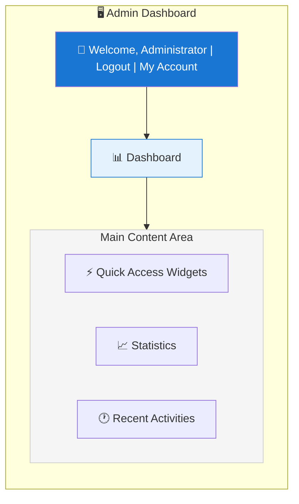
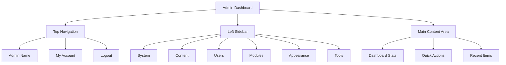

# XOOPS Felügyeleti panel áttekintése

Teljes útmutató a navigációhoz és a XOOPS rendszergazdai vezérlőpult használatához.

## Az Admin Panel elérése

### Adminisztrátori bejelentkezés

Nyissa meg a böngészőt, és navigáljon ide:

```
http://your-domain.com/xoops/admin/
```

Vagy ha a XOOPS a gyökérben van:

```
http://your-domain.com/admin/
```

Adja meg rendszergazdai hitelesítő adatait:

```
Username: [Your admin username]
Password: [Your admin password]
```

### Bejelentkezés után

Ekkor megjelenik a fő adminisztrátori vezérlőpult:



## Felügyeleti panel elrendezése



## Irányítópult-összetevők

### Felső sáv

A felső sáv alapvető vezérlőket tartalmaz:

| Elem | Cél |
|---|---|
| **Admin logó** | Kattintson ide az vezérlőpulthoz való visszatéréshez |
| **Üdvözlő üzenet** | Megjeleníti a bejelentkezett rendszergazda nevét |
| **Fiókom** | Rendszergazdai profil és jelszó szerkesztése |
| **Súgó** | Hozzáférési dokumentáció |
| **Kijelentkezés** | Kijelentkezés az adminisztrációs panelből |

### Bal oldali navigációs oldalsáv

A főmenü funkció szerint rendezve:

```
├── System
│   ├── Dashboard
│   ├── Preferences
│   ├── Admin Users
│   ├── Groups
│   ├── Permissions
│   ├── Modules
│   └── Tools
├── Content
│   ├── Pages
│   ├── Categories
│   ├── Comments
│   └── Media Manager
├── Users
│   ├── Users
│   ├── User Requests
│   ├── Online Users
│   └── User Groups
├── Modules
│   ├── Modules
│   ├── Module Settings
│   └── Module Updates
├── Appearance
│   ├── Themes
│   ├── Templates
│   ├── Blocks
│   └── Images
└── Tools
    ├── Maintenance
    ├── Email
    ├── Statistics
    ├── Logs
    └── Backups
```

### Fő tartalom terület

Információkat és vezérlőket jelenít meg a kiválasztott szakaszhoz:

- Űrlapok a konfigurációhoz
- Adattáblák listákkal
- Diagramok és statisztikák
- Gyorsbillentyűk
- Súgószöveg és eszköztippek

### Irányítópult widgetek

Gyors hozzáférés a legfontosabb információkhoz:

- **Rendszerinformációk:** PHP verzió, MySQL verzió, XOOPS verzió
- **Gyors statisztika:** Felhasználók száma, összes hozzászólás, telepített modulok
- **Legutóbbi tevékenység:** Legutóbbi bejelentkezések, tartalomváltozások, hibák
- **Szerver állapota:** CPU, memória, lemezhasználat
- **Értesítések:** Rendszerriasztások, függőben lévő frissítések

## Alapvető rendszergazdai funkciók

### Rendszerkezelés

**Helyszín:** Rendszer > [Különféle lehetőségek]

#### Beállítások

Alapvető rendszerbeállítások konfigurálása:

```
System > Preferences > [Settings Category]
```

Kategóriák:
- Általános beállítások (webhely neve, időzóna)
- Felhasználói beállítások (regisztráció, profilok)
- E-mail beállítások (SMTP konfiguráció)
- Gyorsítótár beállításai (gyorsítótárazási lehetőségek)
- URL beállítások (barátságos URL-ek)
- Metacímkék (SEO beállítások)

Lásd: Alapkonfiguráció és rendszerbeállítások.

#### Rendszergazda felhasználók

Rendszergazdai fiókok kezelése:

```
System > Admin Users
```

Funkciók:
- Új rendszergazdák hozzáadása
- Szerkessze a rendszergazdai profilokat
- Adminisztrátori jelszavak módosítása
- Törölje a rendszergazdai fiókokat
- Adminisztrátori jogosultságok beállítása

### Tartalomkezelés

**Helyszín:** Tartalom > [Különféle lehetőségek]

#### Pages/Articles

Webhely tartalmának kezelése:

```
Content > Pages (or your module)
```

Funkciók:
- Hozzon létre új oldalakat
- Meglévő tartalom szerkesztése
- Oldalak törlése
- Publish/unpublish
- Kategóriák beállítása
- Változások kezelése

#### Kategóriák

Tartalom rendezése:

```
Content > Categories
```

Funkciók:
- Kategóriahierarchia létrehozása
- Kategóriák szerkesztése
- Kategóriák törlése
- Hozzárendelés oldalakhoz

#### Megjegyzések

Felhasználói megjegyzések moderálása:

```
Content > Comments
```

Funkciók:
- Az összes megjegyzés megtekintése
- Jóváhagyja a megjegyzéseket
- Megjegyzések szerkesztése
- Spam törlése
- A hozzászólók letiltása

### Felhasználókezelés

**Helyszín:** Felhasználók > [Különféle lehetőségek]

#### Felhasználók

Felhasználói fiókok kezelése:

```
Users > Users
```

Funkciók:
- Az összes felhasználó megtekintése
- Hozzon létre új felhasználókat
- Felhasználói profilok szerkesztése
- Fiókok törlése
- Jelszavak visszaállítása
- Felhasználói állapot módosítása
- Hozzárendelés csoportokhoz

#### Online felhasználók

Aktív felhasználók figyelése:

```
Users > Online Users
```

Műsorok:
- Jelenleg online felhasználók
- Utolsó tevékenység ideje
- IP cím
- Felhasználó helye (ha be van állítva)

#### Felhasználói csoportok

Felhasználói szerepkörök és engedélyek kezelése:

```
Users > Groups
```

Funkciók:
- Egyéni csoportok létrehozása
- Csoportengedélyek beállítása
- Felhasználók hozzárendelése csoportokhoz
- Csoportok törlése

### modulkezelés

**Helyszín:** modulok > [Különféle lehetőségek]

#### modulok

modulok telepítése és konfigurálása:

```
Modules > Modules
```

Funkciók:
- A telepített modulok megtekintése
- Enable/disable modulok
- modulok frissítése
- Konfigurálja a modul beállításait
- Új modulok telepítése
- Tekintse meg a modul részleteit

#### Frissítések keresése

```
Modules > Modules > Check for Updates
```

Kijelzők:
- Elérhető modulfrissítések
- Változásnapló
- Letöltési és telepítési lehetőségek

### Megjelenéskezelés

**Helyszín:** Megjelenés > [Különféle lehetőségek]

#### Témák

Webhelytémák kezelése:

```
Appearance > Themes
```

Funkciók:
- Telepített témák megtekintése
- Állítsa be az alapértelmezett témát
- Új témák feltöltése
- Témák törlése
- Téma előnézet
- Téma konfiguráció

#### Blokkok

Tartalomblokkok kezelése:

```
Appearance > Blocks
```

Funkciók:
- Hozzon létre egyéni blokkokat
- Szerkessze a blokk tartalmát
- Rendezd el a blokkokat az oldalon
- Állítsa be a blokk láthatóságát
- Blokkok törlése
- Konfigurálja a blokk gyorsítótárat

#### SablonokSablonok kezelése (speciális):

```
Appearance > Templates
```

Haladó felhasználóknak és fejlesztőknek.

### Rendszereszközök

**Helyszín:** Rendszer > Eszközök

#### Karbantartási mód

Felhasználói hozzáférés megakadályozása a karbantartás során:

```
System > Maintenance Mode
```

Konfigurálás:
- Enable/disable karbantartás
- Egyedi karbantartási üzenet
- Engedélyezett IP-címek (tesztelés céljából)

#### Adatbázis-kezelés

```
System > Database
```

Funkciók:
- Ellenőrizze az adatbázis konzisztenciáját
- Adatbázis-frissítések futtatása
- Asztalok javítása
- Az adatbázis optimalizálása
- Adatbázis-struktúra exportálása

#### Tevékenységnaplók

```
System > Logs
```

Monitor:
- Felhasználói tevékenység
- Adminisztratív intézkedések
- Rendszeresemények
- Hibanaplók

## Gyors műveletek

Az vezérlőpultról elérhető gyakori feladatok:

```
Quick Links:
├── Create New Page
├── Add New User
├── Create Content Block
├── Upload Image
├── Send Mass Email
├── Update All Modules
└── Clear Cache
```

## A Felügyeleti panel billentyűparancsai

Gyors navigáció:

| Parancsikon | Akció |
|---|---|
| `Ctrl+H` | Tovább a segítséghez |
| `Ctrl+D` | Ugrás az vezérlőpultra |
| `Ctrl+Q` | Gyors keresés |
| `Ctrl+L` | Kijelentkezés |

## Felhasználói fiókok kezelése

### Saját fiók

Hozzáférés rendszergazdai profiljához:

1. Kattintson a "Fiókom" lehetőségre a jobb felső sarokban
2. Profiladatok szerkesztése:
   - E-mail cím
   - Igazi név
   - Felhasználói információk
   - Avatar

### Jelszó módosítása

Módosítsa az adminisztrátori jelszavát:

1. Nyissa meg a **Fiókom** oldalt
2. Kattintson a "Jelszó módosítása" gombra.
3. Írja be az aktuális jelszót
4. Írja be az új jelszót (kétszer)
5. Kattintson a "Mentés" gombra.

**Biztonsági tippek:**
- Használjon erős jelszavakat (16+ karakter)
- Tartalmazzon nagybetűket, kisbetűket, számokat, szimbólumokat
- Jelszóváltás 90 naponta
- Soha ne ossza meg adminisztrátori hitelesítő adatait

### Kijelentkezés

Kijelentkezés az adminisztrációs panelről:

1. Kattintson a "Kijelentkezés" gombra a jobb felső sarokban
2. A rendszer átirányítja a bejelentkezési oldalra

## Felügyeleti panel statisztikái

### Irányítópult statisztika

A webhely mutatóinak gyors áttekintése:

| Metrikus | Érték |
|--------|--------|
| Online felhasználók | 12 |
| Összes felhasználó | 256 |
| Összes hozzászólás | 1,234 |
| Összes hozzászólás | 5,678 |
| Összes modul | 8 |

### Rendszerállapot

Szerver és teljesítmény információ:

| Alkatrész | Version/Value |
|-----------|---------------|
| XOOPS Verzió | 2.5.11 |
| PHP Verzió | 8.2.x |
| MySQL Verzió | 8.0.x |
| Szerver betöltése | 0,45, 0,42 |
| Üzemidő | 45 nap |

### Legutóbbi tevékenység

A legutóbbi események idővonala:

```
12:45 - Admin login
12:30 - New user registered
12:15 - Page published
12:00 - Comment posted
11:45 - Module updated
```

## Értesítési rendszer

### Rendszergazdai figyelmeztetések

Értesítések fogadása a következőkről:

- Új felhasználói regisztrációk
- A megjegyzések moderálásra várnak
- Sikertelen bejelentkezési kísérletek
- Rendszerhibák
- modul frissítések érhetők el
- Adatbázis problémák
- Lemezterületre vonatkozó figyelmeztetések

Riasztások konfigurálása:

**Rendszer > Beállítások > E-mail beállítások**

```
Notify Admin on Registration: Yes
Notify Admin on Comments: Yes
Notify Admin on Errors: Yes
Alert Email: admin@your-domain.com
```

## Általános rendszergazdai feladatok

### Hozzon létre egy új oldalt

1. Nyissa meg a **Tartalom > Oldalak** (vagy a megfelelő modult) menüpontot.
2. Kattintson az "Új oldal hozzáadása" gombra.
3. Töltse ki:
   - Cím
   - Tartalom
   - Leírás
   - Kategória
   - Metaadatok
4. Kattintson a „Közzététel” gombra.

### Felhasználók kezelése

1. Lépjen a **Felhasználók > Felhasználók** oldalra.
2. Felhasználói lista megtekintése a következővel:
   - Felhasználónév
   - E-mail
   - Regisztráció dátuma
   - Utolsó bejelentkezés
   - Állapot

3. Kattintson a felhasználónévre a következőkhöz:
   - Profil szerkesztése
   - Jelszó módosítása
   - Csoportok szerkesztése
   - Block/unblock felhasználó

### modul konfigurálása

1. Lépjen a **modulok > modulok** elemre.
2. Keresse meg a modult a listában
3. Kattintson a modul nevére
4. Kattintson a "Beállítások" vagy a "Beállítások" elemre.
5. Konfigurálja a modul beállításait
6. Mentse el a változtatásokat

### Hozzon létre egy új blokkot

1. Lépjen a **Megjelenés > Blokkok** elemre.
2. Kattintson az "Új blokk hozzáadása" gombra.
3. Írja be:
   - Cím blokkolása
   - Tartalom letiltása (HTML engedélyezett)
   - Pozíció az oldalon
   - Láthatóság (összes oldal vagy konkrét)
   - modul (ha van)
4. Kattintson a "Küldés" gombra.

## Felügyeleti panel súgója

### Beépített dokumentáció

Súgó elérése az adminisztrációs panelről:

1. Kattintson a "Súgó" gombra a felső sávban
2. Környezetérzékeny súgó az aktuális oldalhoz
3. Hivatkozások a dokumentációhoz
4. Gyakran ismételt kérdések

### Külső erőforrások

- XOOPS Hivatalos webhely: https://xoops.org/
- Közösségi fórum: https://xoops.org/modules/newbb/
- modul tárolója: https://xoops.org/modules/repository/
- Bugs/Issues: https://github.com/XOOPS/XOOPSCore/issues

## A Felügyeleti panel testreszabása

### Admin téma

Válassza ki a rendszergazdai felület témáját:

**Rendszer > Beállítások > Általános beállítások**

```
Admin Theme: [Select theme]
```

Elérhető témák:
- Alapértelmezett (világos)
- Sötét mód
- Egyedi témák

### Irányítópult testreszabása

Válassza ki, hogy mely widgetek jelenjenek meg:

**Irányítópult > Testreszabás**

Válasszon:
- Rendszerinformációk
- Statisztika
- Legutóbbi tevékenység
- Gyors linkek
- Egyedi kütyü## Felügyeleti panel engedélyei

A különböző adminisztrátori szintek eltérő jogosultságokkal rendelkeznek:

| Szerep | Képességek |
|---|---|
| **Webmester** | Teljes hozzáférés az összes rendszergazdai funkcióhoz |
| **Adminisztrátor** | Korlátozott adminisztrátori funkciók |
| **Moderátor** | Csak a tartalom moderálása |
| **Szerkesztő** | Tartalom létrehozása és szerkesztése |

Engedélyek kezelése:

**Rendszer > Engedélyek**

## Biztonsági bevált módszerek a felügyeleti panelhez

1. **Erős jelszó:** 16+ karakterből álló jelszót használjon
2. **Rendszeres változtatások:** Jelszóváltás 90 naponta
3. **Monitor Access:** Rendszeresen ellenőrizze az „Admin Users” naplókat
4. **Hozzáférés korlátozása:** A nagyobb biztonság érdekében nevezze át az adminisztrátori mappát
5. **A HTTPS használata:** Mindig a HTTPS-n keresztül érje el az adminisztrátort
6. **IP engedélyezési lista:** A rendszergazdai hozzáférés korlátozása meghatározott IP-címekre
7. **Rendszeres kijelentkezés:** Kijelentkezés, ha végzett
8. **Böngésző biztonsága:** Rendszeresen törölje a böngésző gyorsítótárát

Lásd: Biztonsági konfiguráció.

## Hibaelhárítási felügyeleti panel

### Nem fér hozzá a felügyeleti panelhez

**Megoldás:**
1. Ellenőrizze a bejelentkezési adatokat
2. Törölje a böngésző gyorsítótárát és a cookie-kat
3. Próbálkozzon másik böngészővel
4. Ellenőrizze, hogy az adminisztrátori mappa elérési útja helyes-e
5. Ellenőrizze a fájlengedélyeket az adminisztrációs mappában
6. Ellenőrizze az adatbázis-kapcsolatot a mainfile.php-ban

### Üres adminisztrátori oldal

**Megoldás:**
```bash
# Check PHP errors
tail -f /var/log/apache2/error.log

# Enable debug mode temporarily
sed -i "s/define('XOOPS_DEBUG', 0)/define('XOOPS_DEBUG', 1)/" /var/www/html/xoops/mainfile.php

# Check file permissions
ls -la /var/www/html/xoops/admin/
```

### Lassú adminisztrációs panel

**Megoldás:**
1. Gyorsítótár törlése: **Rendszer > Eszközök > Gyorsítótár törlése**
2. Adatbázis optimalizálása: **Rendszer > Adatbázis > Optimalizálás**
3. Ellenőrizze a szerver erőforrásait: `htop`
4. Tekintse át a lassú lekérdezéseket a MySQL-ban

### A modul nem jelenik meg

**Megoldás:**
1. Ellenőrizze a modul telepítését: **modulok > modulok**
2. Ellenőrizze, hogy a modul engedélyezve van-e
3. Ellenőrizze a hozzárendelt engedélyeket
4. Ellenőrizze a modulfájlok létezését
5. Tekintse át a hibanaplókat

## Következő lépések

Az adminisztrációs panel megismerése után:

1. Hozza létre első oldalát
2. Felhasználói csoportok beállítása
3. Telepítsen további modulokat
4. Konfigurálja az alapvető beállításokat
5. Végezze el a biztonságot

---

**Címkék:** #admin-panel #dashboard #navigation #bekezdés

**Kapcsolódó cikkek:**
- ../Configuration/Basic-Configuration
- ../Configuration/System-Settings
- Az első oldal létrehozása
- Kezelő-felhasználók
- modulok telepítése
