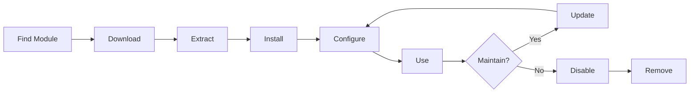

# XOOPS modulok telepítése és kezelése

Ismerje meg, hogyan bővítheti ki a XOOPS funkciót modulok telepítésével és konfigurálásával.

## A XOOPS modulok megértése

### Mik azok a modulok?

A modulok olyan bővítmények, amelyek funkcionalitást adnak a XOOPS-hoz:

| Típus | Cél | Példák |
|---|---|---|
| **Tartalom** | Adott tartalomtípusok kezelése | Hírek, Blog, Jegyek |
| **Közösség** | Felhasználói interakció | Fórum, Megjegyzések, Vélemények |
| **e-kereskedelem** | Termékek értékesítése | Bolt, Kosár, Fizetés |
| **Média** | Fogantyú files/images | Galéria, Letöltések, Videók |
| **Közüzem** | Eszközök és segédeszközök | E-mail, biztonsági mentés, elemzések |

### Core vs. opcionális modulok

| modul | Típus | Tartalmazza | Kivehető |
|---|---|---|---|
| **Rendszer** | Core | Igen | Nem |
| **Felhasználó** | Core | Igen | Nem |
| **Profil** | Ajánlott | Igen | Igen |
| **PM (Privát üzenet)** | Ajánlott | Igen | Igen |
| **WF-Channel** | Választható | Gyakran | Igen |
| **Hírek** | Választható | Nem | Igen |
| **Fórum** | Választható | Nem | Igen |

## modul életciklusa



## modulok keresése

### XOOPS modul tároló

Hivatalos XOOPS modul tároló:

**Látogatás:** https://xoops.org/modules/repository/

```
Directory > Modules > [Browse Categories]
```

Böngésszen kategória szerint:
- Tartalomkezelés
- Közösség
- e-kereskedelem
- Multimédia
- Fejlesztés
- Webhely adminisztrációja

### modulok értékelése

Telepítés előtt ellenőrizze:

| Kritériumok | Mit kell keresni |
|---|---|
| **Kompatibilitás** | Működik az Ön XOOPS verziójával |
| **Értékelés** | Jó felhasználói vélemények és értékelések |
| **Frissítések** | Nemrég karbantartott |
| **Letöltések** | Népszerű és széles körben használt |
| **Követelmények** | Kompatibilis a szerverével |
| **Engedély** | GPL vagy hasonló nyílt forráskódú |
| **Támogatás** | Aktív fejlesztő és közösség |

### Olvassa el a modul információit

Az egyes modulok listája a következőket mutatja:

```
Module Name: [Name]
Version: [X.X.X]
Requires: XOOPS [Version]
Author: [Name]
Last Update: [Date]
Downloads: [Number]
Rating: [Stars]
Description: [Brief description]
Compatibility: PHP [Version], MySQL [Version]
```

## modulok telepítése

### 1. módszer: Telepítés a felügyeleti panelen

**1. lépés: Hozzáférés modulok szakasza**

1. Jelentkezzen be az adminisztrációs panelre
2. Lépjen a **modulok > modulok** elemre.
3. Kattintson az **"Új modul telepítése"** vagy a **"modulok böngészése"** lehetőségre.

**2. lépés: modul feltöltése**

A lehetőség – Közvetlen feltöltés:
1. Kattintson a **"Fájl kiválasztása"** lehetőségre.
2. Válassza ki a modul .zip fájlját a számítógépről
3. Kattintson a **"Feltöltés"** gombra.

B lehetőség – URL Feltöltés:
1. Illessze be a URL modult
2. Kattintson a **"Letöltés és telepítés"** elemre.

**3. lépés: Tekintse át a modul adatait**

```
Module Name: [Name shown]
Version: [Version]
Author: [Author info]
Description: [Full description]
Requirements: [PHP/MySQL versions]
```

Tekintse át és kattintson a **"Telepítés folytatása"** gombra

**4. lépés: Válassza ki a telepítés típusát**

```
☐ Fresh Install (New installation)
☐ Update (Upgrade existing)
☐ Delete Then Install (Replace existing)
```

Válassza ki a megfelelő opciót.

**5. lépés: Erősítse meg a telepítést**

Tekintse át a végső megerősítést:
```
Module will be installed to: /modules/modulename/
Database: xoops_db
Proceed? [Yes] [No]
```

A megerősítéshez kattintson az **"Igen"** gombra.

**6. lépés: A telepítés kész**

```
Installation successful!

Module: [Module Name]
Version: [Version]
Tables created: [Number]
Files installed: [Number]

[Go to Module Settings]  [Return to Modules]
```

### 2. módszer: Kézi telepítés (speciális)

Kézi telepítéshez vagy hibaelhárításhoz:

**1. lépés: Töltse le a modult**

1. Töltse le a .zip modult a tárolóból
2. Kivonat a `/var/www/html/xoops/modules/modulename/`-ba

```bash
# Extract module
unzip module_name.zip
cp -r module_name /var/www/html/xoops/modules/

# Set permissions
chmod -R 755 /var/www/html/xoops/modules/module_name
```

**2. lépés: Telepítési parancsfájl futtatása**

```
Visit: http://your-domain.com/xoops/modules/module_name/admin/index.php?op=install
```

Vagy az adminisztrációs panelen keresztül (Rendszer > modulok > DB frissítése).

**3. lépés: Ellenőrizze a telepítést**

1. Lépjen a **modulok > modulok** elemre az adminisztrációban
2. Keresse meg modulját a listában
3. Ellenőrizze, hogy „Aktív” állapotú-e

## modul konfigurálása

### Hozzáférés modul beállításai

1. Lépjen a **modulok > modulok** elemre.
2. Keresse meg a modult
3. Kattintson a modul nevére
4. Kattintson a **"Beállítások"** vagy a **"Beállítások"** elemre.

### Közös modulbeállítások

A legtöbb modul a következőket kínálja:

```
Module Status: [Enabled/Disabled]
Display in Menu: [Yes/No]
Module Weight: [1-999] (display order)
Visible To Groups: [Checkboxes for user groups]
```

### modul-specifikus opciók

Minden modul egyedi beállításokkal rendelkezik. Példák:

**Hírek modul:**
```
Items Per Page: 10
Show Author: Yes
Allow Comments: Yes
Moderation Required: Yes
```

**Fórum modul:**
```
Topics Per Page: 20
Posts Per Page: 15
Maximum Attachment Size: 5MB
Enable Signatures: Yes
```

**Galéria modul:**
```
Images Per Page: 12
Thumbnail Size: 150x150
Maximum Upload: 10MB
Watermark: Yes/No
```

Tekintse át a modul dokumentációját a konkrét lehetőségekért.

### Konfiguráció mentése

A beállítások módosítása után:

1. Kattintson a **"Küldés"** vagy a **"Mentés"** gombra.
2. Megerősítő üzenet jelenik meg:
   
   ```
   Settings saved successfully!
   ```

## modulblokkok kezelése

Sok modul "blokkokat" hoz létre - widget-szerű tartalomterületeket.

### modulblokkok megtekintése

1. Lépjen a **Megjelenés > Blokkok** elemre.
2. Keressen blokkokat a moduljából
3. A legtöbb modulon a "[modul neve] - [Blokk leírása]" látható

### Blokkok konfigurálása

1. Kattintson a blokk nevére
2. Állítsa be:
   - Cím blokkolása
   - Láthatóság (összes oldal vagy konkrét)
   - Elhelyezés az oldalon (balra, középre, jobbra)
   - Felhasználói csoportok, akik láthatják
3. Kattintson a **„Küldés”** gombra.### Blokk megjelenítése a kezdőlapon

1. Lépjen a **Megjelenés > Blokkok** elemre.
2. Keresse meg a kívánt blokkot
3. Kattintson a **"Szerkesztés"** gombra.
4. Beállítás:
   - **Látható:** Csoportok kiválasztása
   - **Pozíció:** Válassza ki az oszlopot (left/center/right)
   - **Oldalak:** Kezdőlap vagy az összes oldal
5. Kattintson a **„Küldés”** gombra.

## Egyedi modulpéldák telepítése

### Hírek modul telepítése

**Tökéletes:** Blogbejegyzésekhez, közleményekhez

1. Töltse le a Hírek modult a tárhelyről
2. Feltöltés: **modulok > modulok > Telepítés**
3. Konfigurálja a **modulok > Hírek > Beállítások** menüpontban:
   - Történetek oldalanként: 10
   - Megjegyzések engedélyezése: Igen
   - Jóváhagyás közzététel előtt: Igen
4. Hozzon létre blokkokat a legfrissebb hírekhez
5. Kezdj el történeteket publikálni!

### Fórum modul telepítése

**Tökéletes:** Közösségi beszélgetéshez

1. Töltse le a Fórum modult
2. Telepítés adminisztrációs panelen keresztül
3. Hozzon létre fórumkategóriákat a modulban
4. Beállítások konfigurálása:
   - Topics/page: 20
   - Posts/page: 15
   - Moderálás engedélyezése: Igen
5. Rendeljen engedélyeket felhasználói csoportokhoz
6. Hozzon létre blokkokat a legújabb témákhoz

### Galéria modul telepítése

**Tökéletes:** Képes kirakat

1. Töltse le a Galéria modult
2. Telepítse és konfigurálja
3. Hozzon létre fotóalbumokat
4. Tölts fel képeket
5. Állítsa be a viewing/uploading engedélyeit
6. Képgaléria megjelenítése a weboldalon

## modulok frissítése

### Frissítések keresése

```
Admin Panel > Modules > Modules > Check for Updates
```

Ez mutatja:
- Elérhető modulfrissítések
- Jelenlegi vs. új verzió
- Changelog/release jegyzetek

### modul frissítése

1. Lépjen a **modulok > modulok** elemre.
2. Kattintson az elérhető frissítéssel rendelkező modulra
3. Kattintson a **"Frissítés"** gombra
4. Válassza a **"Frissítés" lehetőséget a Telepítés típusa között**
5. Kövesse a telepítővarázsló utasításait
6. modul frissítve!

### Fontos frissítési megjegyzések

Frissítés előtt:

- [ ] Adatbázis biztonsági mentése
- [ ] A modul fájlok biztonsági mentése
- [ ] Változásnapló áttekintése
- [ ] Először tesztelje az átmeneti kiszolgálón
- [ ] Vegye figyelembe az egyéni módosításokat

Frissítés után:
- [ ] A működőképesség ellenőrzése
- [ ] Ellenőrizze a modul beállításait
- [ ] Vélemény warnings/errors
- [ ] Gyorsítótár törlése

## modulengedélyek

### Felhasználói csoporthoz való hozzáférés hozzárendelése

Szabályozza, hogy mely felhasználói csoportok férhetnek hozzá a modulokhoz:

**Helyszín:** Rendszer > Engedélyek

Minden modulhoz állítsa be:

```
Module: [Module Name]

Admin Access: [Select groups]
User Access: [Select groups]
Read Permission: [Groups allowed to view]
Write Permission: [Groups allowed to post]
Delete Permission: [Administrators only]
```

### Közös engedélyszintek

```
Public Content (News, Pages):
├── Admin Access: Webmaster
├── User Access: All logged-in users
└── Read Permission: Everyone

Community Features (Forum, Comments):
├── Admin Access: Webmaster, Moderators
├── User Access: All logged-in users
└── Write Permission: All logged-in users

Admin Tools:
├── Admin Access: Webmaster only
└── User Access: Disabled
```

## modulok letiltása és eltávolítása

### modul letiltása (Fájlok megőrzése)

modul megtartása, de elrejtése a webhelyről:

1. Lépjen a **modulok > modulok** elemre.
2. Keresse meg a modult
3. Kattintson a modul nevére
4. Kattintson a **"Letiltás"** lehetőségre, vagy állítsa az állapotot Inaktívra
5. A modul elrejtve, de az adatok megmaradtak

Bármikor újra engedélyezni:
1. Kattintson a modulra
2. Kattintson az **"Engedélyezés"** gombra.

### Teljesen távolítsa el a modult

modul és adatai törlése:

1. Lépjen a **modulok > modulok** elemre.
2. Keresse meg a modult
3. Kattintson az **"Eltávolítás"** vagy a **"Törlés"** elemre.
4. Erősítse meg: "Törli a modult és az összes adatot?"
5. A megerősítéshez kattintson az **"Igen"** gombra

**Figyelem:** Az eltávolítás törli az összes moduladatot!

### Telepítse újra az eltávolítás után

Ha eltávolít egy modult:
- modulfájlok törölve
- Adatbázis táblák törölve
- Minden adat elveszett
- Újbóli használathoz újra kell telepíteni
- Visszaállítható biztonsági másolatból

## modul telepítésének hibaelhárítása

### A modul nem jelenik meg a telepítés után

**Tünet:** A modul szerepel, de nem látható a helyszínen

**Megoldás:**
```
1. Check module is "Active" (Modules > Modules)
2. Enable module blocks (Appearance > Blocks)
3. Verify user permissions (System > Permissions)
4. Clear cache (System > Tools > Clear Cache)
5. Check .htaccess doesn't block module
```

### Telepítési hiba: "A táblázat már létezik"

**Jelenség:** Hiba a modul telepítése közben

**Megoldás:**
```
1. Module partially installed before
2. Try "Delete then Install" option
3. Or uninstall first, then install fresh
4. Check database for existing tables:
   mysql> SHOW TABLES LIKE 'xoops_module%';
```

### A modul hiányzó függőségei

**Jelenség:** A modul nem települ – másik modul szükséges

**Megoldás:**
```
1. Note required modules from error message
2. Install required modules first
3. Then install the module
4. Install in correct order
```

### Üres oldal a modul elérésekor

**Jelenség:** A modul betöltődik, de nem mutat semmit

**Megoldás:**
```
1. Enable debug mode in mainfile.php:
   define('XOOPS_DEBUG', 1);

2. Check PHP error log:
   tail -f /var/log/php_errors.log

3. Verify file permissions:
   chmod -R 755 /var/www/html/xoops/modules/modulename

4. Check database connection in module config

5. Disable module and reinstall
```

### modul megszakítások webhely

**Jelenség:** A modul telepítése megszakítja a webhelyet

**Megoldás:**
```
1. Disable the problematic module immediately:
   Admin > Modules > [Module] > Disable

2. Clear cache:
   rm -rf /var/www/html/xoops/cache/*
   rm -rf /var/www/html/xoops/templates_c/*

3. Restore from backup if needed

4. Check error logs for root cause

5. Contact module developer
```

## A modul biztonsági szempontjai

### Csak megbízható forrásból telepítse

```
✓ Official XOOPS Repository
✓ GitHub official XOOPS modules
✓ Trusted module developers
✗ Unknown websites
✗ Unverified sources
```

### Ellenőrizze a modul engedélyeit

Telepítés után:

1. Tekintse át a modul kódját, hogy nem észlel-e gyanús tevékenységet
2. Ellenőrizze, hogy az adatbázistáblákban nincsenek-e anomáliák
3. Figyelje a fájlváltozásokat
4. Tartsa naprakészen a modulokat
5. Távolítsa el a nem használt modulokat

### Engedélyek bevált gyakorlata

```
Module directory: 755 (readable, not writable by web server)
Module files: 644 (readable only)
Module data: Protected by database
```

## modulfejlesztési források

### Tanuljon modulfejlesztést

- Hivatalos dokumentáció: https://xoops.org/
- GitHub adattár: https://github.com/XOOPS/
- Közösségi fórum: https://xoops.org/modules/newbb/
- Fejlesztői útmutató: Elérhető a docs mappában

## Bevált gyakorlatok a modulokhoz1. **Egyenként telepítse:** Az ütközések figyelése
2. **Teszt telepítés után:** Ellenőrizze a működőképességet
3. **Dokumentum egyéni konfigurációja:** Jegyezze fel beállításait
4. **Frissítés:** A modulfrissítések azonnali telepítése
5. **A nem használt elemek eltávolítása:** A nem szükséges modulok törlése
6. **Biztonsági mentés előtt:** Telepítés előtt mindig készítsen biztonsági másolatot
7. **Olvassa el a dokumentációt:** Ellenőrizze a modul utasításait
8. **Csatlakozzon a közösséghez:** Kérjen segítséget, ha szükséges

## modul telepítési ellenőrzőlista

Minden modul telepítéséhez:

- [ ] Kutasson és olvasson véleményeket
- [ ] Ellenőrizze a XOOPS verzió kompatibilitását
- [ ] Adatbázis és fájlok biztonsági mentése
- [ ] A legújabb verzió letöltése
- [ ] Telepítés adminisztrációs panelen keresztül
- [ ] Beállítások konfigurálása
- [ ] Create/position blokkok
- [ ] Felhasználói engedélyek beállítása
- [ ] Működés tesztelése
- [ ] Dokumentumkonfiguráció
- [ ] Frissítések ütemezése

## Következő lépések

A modulok telepítése után:

1. Hozzon létre tartalmat a modulokhoz
2. Felhasználói csoportok beállítása
3. Fedezze fel a rendszergazdai funkciókat
4. A teljesítmény optimalizálása
5. Szükség szerint telepítsen további modulokat

---

**Címkék:** #modulok #telepítés #kiterjesztés #kezelés

**Kapcsolódó cikkek:**
- Admin-Panel-Overview
- Kezelő-felhasználók
- Az első oldal létrehozása
- ../Configuration/System-Settings
