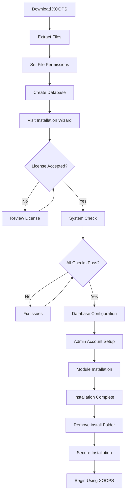

# Teljes XOOPS telepítési útmutató

Ez az útmutató átfogó áttekintést nyújt a XOOPS telepítéséhez a semmiből a telepítővarázsló segítségével.

## Előfeltételek

A telepítés megkezdése előtt győződjön meg arról, hogy rendelkezik:

- Hozzáférés a webszerverhez a FTP vagy SSH segítségével
- Rendszergazdai hozzáférés az adatbázis-kiszolgálóhoz
- Regisztrált domain név
- A szerverkövetelmények ellenőrizve
- Biztonsági mentési eszközök állnak rendelkezésre

## Telepítési folyamat



## Telepítés lépésről lépésre

### 1. lépés: Töltse le a XOOPS-t

Töltse le a legújabb verziót a [https://xoops.org/](https://xoops.org/) webhelyről:

```bash
# Using wget
wget https://xoops.org/download/xoops-2.5.8.zip

# Using curl
curl -O https://xoops.org/download/xoops-2.5.8.zip
```

### 2. lépés: Fájlok kibontása

Bontsa ki a XOOPS archívumot webgyökérébe:

```bash
# Navigate to web root
cd /var/www/html

# Extract XOOPS
unzip xoops-2.5.8.zip

# Rename folder (optional, but recommended)
mv xoops-2.5.8 xoops
cd xoops
```

### 3. lépés: Állítsa be a fájlengedélyeket

Állítsa be a megfelelő engedélyeket a XOOPS könyvtárakhoz:

```bash
# Make directories writable (755 for dirs, 644 for files)
find . -type d -exec chmod 755 {} \;
find . -type f -exec chmod 644 {} \;

# Make specific directories writable by web server
chmod 777 uploads/
chmod 777 templates_c/
chmod 777 var/
chmod 777 cache/

# Secure mainfile.php after installation
chmod 644 mainfile.php
```

### 4. lépés: Adatbázis létrehozása

Hozzon létre egy új adatbázist a XOOPS számára a MySQL használatával:

```sql
-- Create database
CREATE DATABASE xoops_db CHARACTER SET utf8mb4 COLLATE utf8mb4_unicode_ci;

-- Create user
CREATE USER 'xoops_user'@'localhost' IDENTIFIED BY 'secure_password_here';

-- Grant privileges
GRANT ALL PRIVILEGES ON xoops_db.* TO 'xoops_user'@'localhost';
FLUSH PRIVILEGES;
```

Vagy a phpMyAdmin használatával:

1. Jelentkezzen be a phpMyAdminba
2. Kattintson az "Adatbázisok" fülre
3. Írja be az adatbázis nevét: `xoops_db`
4. Válassza ki az „utf8mb4_unicode_ci” leválogatást
5. Kattintson a "Létrehozás" gombra.
6. Hozzon létre egy felhasználót az adatbázissal megegyező névvel
7. Adjon meg minden kiváltságot

### 5. lépés: Futtassa a Telepítővarázslót

Nyissa meg a böngészőt, és navigáljon ide:

```
http://your-domain.com/xoops/install/
```

#### Rendszerellenőrzési fázis

A varázsló ellenőrzi a kiszolgáló konfigurációját:

- PHP verzió >= 5.6.0
- MySQL/MariaDB elérhető
- Szükséges PHP bővítmények (GD, PDO stb.)
- Címtárengedélyek
- Adatbázis-kapcsolat

**Ha az ellenőrzések sikertelenek:**

A megoldásokért lásd a #Gyakori telepítési problémák című részt.

#### Adatbázis konfiguráció

Adja meg az adatbázis hitelesítő adatait:

```
Database Host: localhost
Database Name: xoops_db
Database User: xoops_user
Database Password: [your_secure_password]
Table Prefix: xoops_
```

**Fontos megjegyzések:**
- Ha az adatbázis gazdagépe eltér a localhost-tól (például távoli kiszolgáló), adja meg a megfelelő gazdagépnevet
- A táblázat előtagja segít, ha több XOOPS példány fut egy adatbázisban
- Használjon erős jelszót vegyes kis- és nagybetűkkel, számokkal és szimbólumokkal

#### Rendszergazdai fiók beállítása

Hozza létre rendszergazdai fiókját:

```
Admin Username: admin (or choose custom)
Admin Email: admin@your-domain.com
Admin Password: [strong_unique_password]
Confirm Password: [repeat_password]
```

**Legjobb gyakorlatok:**
- Egyedi felhasználónevet használjon, ne „admin”
- 16+ karakterből álló jelszót használjon
- Tárolja a hitelesítő adatokat egy biztonságos jelszókezelőben
- Soha ne ossza meg adminisztrátori hitelesítő adatait

#### modul telepítése

Válassza ki a telepítendő alapértelmezett modulokat:

- **Rendszermodul** (szükséges) - Alapvető XOOPS funkciók
- **Felhasználói modul** (kötelező) - Felhasználókezelés
- **Profil modul** (ajánlott) - Felhasználói profilok
- **PM (Privát üzenet) modul** (ajánlott) - Belső üzenetküldés
- **WF-Channel module** (opcionális) - Tartalomkezelés

Válassza ki az összes ajánlott modult a teljes telepítéshez.

### 6. lépés: A telepítés befejezése

Az összes lépés után megjelenik egy megerősítő képernyő:

```
Installation Complete!

Your XOOPS installation is ready to use.
Admin Panel: http://your-domain.com/xoops/admin/
User Panel: http://your-domain.com/xoops/
```

### 7. lépés: Biztosítsa a telepítést

#### Telepítési mappa eltávolítása

```bash
# Remove the install directory (CRITICAL for security)
rm -rf /var/www/html/xoops/install/

# Or rename it
mv /var/www/html/xoops/install/ /var/www/html/xoops/install.bak
```

**WARNING:** Soha ne hagyja elérhetővé a telepítési mappát éles környezetben!

#### Biztonságos mainfile.php

```bash
# Make mainfile.php read-only
chmod 644 /var/www/html/xoops/mainfile.php

# Set ownership
chown www-data:www-data /var/www/html/xoops/mainfile.php
```

#### Állítsa be a megfelelő fájlengedélyeket

```bash
# Recommended production permissions
find . -type f -name "*.php" -exec chmod 644 {} \;
find . -type d -exec chmod 755 {} \;

# Writable directories for web server
chmod 777 uploads/ var/ cache/ templates_c/
```

#### HTTPS/SSL engedélyezése

Konfigurálja a SSL-t a webkiszolgálón (nginx vagy Apache).

**Apache esetén:**
```apache
<VirtualHost *:443>
    ServerName your-domain.com
    DocumentRoot /var/www/html/xoops

    SSLEngine on
    SSLCertificateFile /etc/ssl/certs/your-cert.crt
    SSLCertificateKeyFile /etc/ssl/private/your-key.key

    # Force HTTPS redirect
    <IfModule mod_rewrite.c>
        RewriteEngine On
        RewriteCond %{HTTPS} off
        RewriteRule ^(.*)$ https://%{HTTP_HOST}%{REQUEST_URI} [L,R=301]
    </IfModule>
</VirtualHost>
```

## Telepítés utáni konfiguráció

### 1. Nyissa meg a Felügyeleti panelt

Navigáljon ide:
```
http://your-domain.com/xoops/admin/
```

Jelentkezzen be rendszergazdai hitelesítő adataival.

### 2. Konfigurálja az alapvető beállításokat

Konfigurálja a következőket:

- A webhely neve és leírása
- Admin e-mail cím
- Időzóna és dátumformátum
- Keresőoptimalizálás

### 3. Telepítés tesztelése

- [ ] Látogassa meg a honlapot
- [ ] Ellenőrizze a modulok betöltését
- [ ] Ellenőrizze, hogy működik-e a felhasználói regisztráció
- [ ] Tesztelje az adminisztrációs panel funkcióit
- [ ] Ellenőrizze, hogy a SSL/HTTPS működik

### 4. Biztonsági mentések ütemezése

Automatikus biztonsági mentések beállítása:

```bash
# Create backup script (backup.sh)
#!/bin/bash
DATE=$(date +%Y%m%d_%H%M%S)
BACKUP_DIR="/backups/xoops"
XOOPS_DIR="/var/www/html/xoops"

# Backup database
mysqldump -u xoops_user -p[password] xoops_db > $BACKUP_DIR/db_$DATE.sql

# Backup files
tar -czf $BACKUP_DIR/files_$DATE.tar.gz $XOOPS_DIR

echo "Backup completed: $DATE"
```

Ütemezés cronnal:
```bash
# Daily backup at 2 AM
0 2 * * * /usr/local/bin/backup.sh
```

## Gyakori telepítési problémák

### Probléma: Engedély megtagadva hibák

**Jelenség:** „Engedély megtagadva” fájlok feltöltésekor vagy létrehozásakor

**Megoldás:**
```bash
# Check web server user
ps aux | grep apache  # For Apache
ps aux | grep nginx   # For Nginx

# Fix permissions (replace www-data with your web server user)
chown -R www-data:www-data /var/www/html/xoops
chmod -R 755 /var/www/html/xoops
chmod 777 uploads/ var/ cache/ templates_c/
```

### Probléma: Nem sikerült csatlakozni az adatbázishoz

**Tünet:** "Nem lehet csatlakozni az adatbázis-kiszolgálóhoz"**Megoldás:**
1. Ellenőrizze az adatbázis hitelesítő adatait a telepítő varázslóban
2. Ellenőrizze, hogy a MySQL/MariaDB fut-e:
   
   ```bash
   service mysql status  # or mariadb
   ```
3. Ellenőrizze az adatbázis létezését:
   
   ```sql
   SHOW DATABASES;
   ```
4. Tesztelje a kapcsolatot parancssorból:
   
   ```bash
   mysql -h localhost -u xoops_user -p xoops_db
   ```

### Probléma: Üres fehér képernyő

**Tünet:** A XOOPS felkeresése üres oldalt mutat

**Megoldás:**
1. Ellenőrizze a PHP hibanaplókat:
   
   ```bash
   tail -f /var/log/apache2/error.log
   ```
2. Engedélyezze a hibakeresési módot a mainfile.php-ban:
   
   ```php
   define('XOOPS_DEBUG', 1);
   ```
3. Ellenőrizze a fájlengedélyeket a mainfile.php és a konfigurációs fájlokon
4. Ellenőrizze, hogy a PHP-MySQL bővítmény telepítve van-e

### Probléma: Nem lehet írni a feltöltési könyvtárba

**Tünet:** A feltöltési funkció nem működik, "Nem lehet írni a feltöltésekbe/"

**Megoldás:**
```bash
# Check current permissions
ls -la uploads/

# Fix permissions
chmod 777 uploads/
chown www-data:www-data uploads/

# For specific files
chmod 644 uploads/*
```

### Probléma: PHP bővítmények hiányoznak

**Tünet:** A rendszerellenőrzés sikertelen, ha hiányoznak a bővítmények (GD, MySQL stb.)

**Megoldás (Ubuntu/Debian):**
```bash
# Install PHP GD library
apt-get install php-gd

# Install PHP MySQL support
apt-get install php-mysql

# Restart web server
systemctl restart apache2  # or nginx
```

**Megoldás (CentOS/RHEL):**
```bash
# Install PHP GD library
yum install php-gd

# Install PHP MySQL support
yum install php-mysql

# Restart web server
systemctl restart httpd
```

### Probléma: Lassú telepítési folyamat

**Jelenség:** A telepítővarázsló időtúllépése vagy nagyon lassan fut

**Megoldás:**
1. Növelje a PHP időtúllépést a php.ini-ban:
   
   ```ini
   max_execution_time = 300  # 5 minutes
   ```
2. A MySQL max_allowed_packet növelése:
   
   ```sql
   SET GLOBAL max_allowed_packet = 256M;
   ```
3. Ellenőrizze a szerver erőforrásait:
   
   ```bash
   free -h  # Check RAM
   df -h    # Check disk space
   ```

### Probléma: A felügyeleti panel nem érhető el

**Jelenség:** A telepítés után nem lehet hozzáférni az adminisztrációs panelhez

**Megoldás:**
1. Ellenőrizze, hogy az adminisztrátori felhasználó létezik-e az adatbázisban:
   
   ```sql
   SELECT * FROM xoops_users WHERE uid = 1;
   ```
2. Törölje a böngésző gyorsítótárát és a cookie-kat
3. Ellenőrizze, hogy a sessions mappa írható-e:
   
   ```bash
   chmod 777 var/
   ```
4. Ellenőrizze, hogy a htaccess szabályok nem blokkolják az adminisztrátori hozzáférést

## Ellenőrző lista

A telepítés után ellenőrizze:

- [x] A XOOPS honlap megfelelően betöltődik
- [x] Az adminisztrációs panel a /xoops/admin/ címen érhető el
- [x] A SSL/HTTPS működik
- [x] A telepítési mappa eltávolítva vagy elérhetetlen
- [x] A fájlengedélyek biztonságosak (644 fájlokhoz, 755 könyvtárhoz)
- [x] Adatbázis biztonsági mentések ütemezve
- [x] A modulok hiba nélkül töltődnek be
- [x] A felhasználói regisztrációs rendszer működik
- [x] A fájl feltöltési funkció működik
- [x] Az e-mail értesítéseket megfelelően küldik el

## Következő lépések

A telepítés befejezése után:

1. Olvassa el az Alapvető konfigurációs útmutatót
2. Biztosítsa a telepítést
3. Fedezze fel az adminisztrációs panelt
4. Telepítsen további modulokat
5. Felhasználói csoportok és engedélyek beállítása

---

**Címkék:** #telepítés #beállítás #első lépések #hibaelhárítás

**Kapcsolódó cikkek:**
- Szerver-követelmények
- Frissítés-XOOPS
- ../Configuration/Security-Configuration
