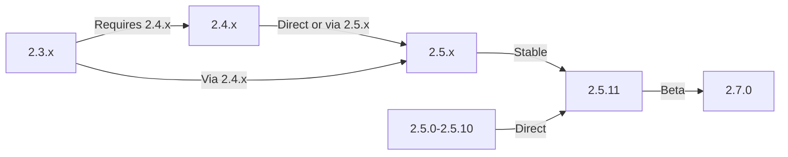

Ez az útmutató leírja a XOOPS frissítését a régebbi verziókról a legújabb kiadásra, miközben megőrzi adatait és testreszabásait.

> **Verzióinformáció**
> - **Stabil:** XOOPS 2.5.11
> - **Béta:** XOOPS 2.7.0 (tesztelés)
> - **Jövő:** XOOPS 4.0 (fejlesztés alatt – lásd az ütemtervet)

## Frissítés előtti ellenőrzőlista

A frissítés megkezdése előtt ellenőrizze:

- [ ] A jelenlegi XOOPS verzió dokumentálva
- [ ] A XOOPS célverzió azonosítva
- [ ] A rendszer teljes biztonsági mentése befejeződött
- [ ] Az adatbázis biztonsági mentése ellenőrizve
- [ ] A telepített modulok listája rögzítve
- [ ] Egyedi módosítások dokumentálva
- [ ] Tesztkörnyezet elérhető
- [ ] Frissítési útvonal ellenőrizve (egyes verziók kihagyják a köztes kiadásokat)
- [ ] Szervererőforrások ellenőrizve (elég lemezterület, memória)
- [ ] Karbantartási mód engedélyezve

## Frissítési útvonal útmutató

Különböző frissítési utak az aktuális verziótól függően:



**Fontos:** Soha ne hagyja ki a főbb verziókat. Ha 2.3.x-ről frissít, először frissítsen 2.4.x-re, majd 2.5.x-re.

## 1. lépés: A rendszer biztonsági mentésének befejezése

### Adatbázis biztonsági mentése

A mysqldump használatával biztonsági másolatot készíthet az adatbázisról:

```bash
# Full database backup
mysqldump -u xoops_user -p xoops_db > /backups/xoops_db_backup_$(date +%Y%m%d_%H%M%S).sql

# Compressed backup
mysqldump -u xoops_user -p xoops_db | gzip > /backups/xoops_db_backup_$(date +%Y%m%d_%H%M%S).sql.gz
```

Vagy a phpMyAdmin használatával:

1. Válassza ki a XOOPS adatbázisát
2. Kattintson az "Exportálás" fülre
3. Válassza ki a „SQL” formátumot
4. Válassza a "Mentés fájlként" lehetőséget.
5. Kattintson a "Go" gombra

Biztonsági másolat ellenőrzése:

```bash
# Check backup size
ls -lh /backups/xoops_db_backup*.sql

# Verify backup integrity (uncompressed)
head -20 /backups/xoops_db_backup_*.sql

# Verify compressed backup
zcat /backups/xoops_db_backup_*.sql.gz | head -20
```

### Fájlrendszer biztonsági mentése

Az összes XOOPS fájl biztonsági mentése:

```bash
# Compressed file backup
tar -czf /backups/xoops_files_$(date +%Y%m%d_%H%M%S).tar.gz /var/www/html/xoops

# Uncompressed (faster, requires more disk space)
tar -cf /backups/xoops_files_$(date +%Y%m%d_%H%M%S).tar /var/www/html/xoops

# Show backup progress
tar -czf /backups/xoops_files_$(date +%Y%m%d_%H%M%S).tar.gz --verbose /var/www/html/xoops | tail
```

A biztonsági másolatok biztonságos tárolása:

```bash
# Secure backup storage
chmod 600 /backups/xoops_*
ls -lah /backups/

# Optional: Copy to remote storage
scp /backups/xoops_* user@backup-server:/secure/backups/
```

### Tesztelje a biztonsági mentés visszaállítását

**CRITICAL:** Mindig ellenőrizze a biztonsági mentés működését:

```bash
# Verify tar archive contents
tar -tzf /backups/xoops_files_*.tar.gz | head -20

# Extract to test location
mkdir /tmp/restore_test
cd /tmp/restore_test
tar -xzf /backups/xoops_files_*.tar.gz

# Verify key files exist
ls -la xoops/mainfile.php
ls -la xoops/install/
```

## 2. lépés: Engedélyezze a Karbantartási módot

A frissítés során akadályozza meg, hogy a felhasználók hozzáférjenek a webhelyhez:

### 1. lehetőség: XOOPS Felügyeleti panel

1. Jelentkezzen be az adminisztrációs panelre
2. Válassza a Rendszer > Karbantartás menüpontot
3. Engedélyezze a "Webhely-karbantartási módot"
4. Állítsa be a karbantartási üzenetet
5. Mentés

### 2. lehetőség: Kézi karbantartási mód

Hozzon létre egy karbantartási fájlt a web gyökérben:

```html
<!-- /var/www/html/maintenance.html -->
<!DOCTYPE html>
<html>
<head>
    <title>Under Maintenance</title>
    <style>
        body { font-family: Arial; text-align: center; padding: 50px; }
        h1 { color: #333; }
        p { color: #666; margin: 20px 0; }
    </style>
</head>
<body>
    <h1>Site Under Maintenance</h1>
    <p>We're currently upgrading our site.</p>
    <p>Expected time: approximately 30 minutes.</p>
    <p>Thank you for your patience!</p>
</body>
</html>
```

Állítsa be az Apache-t a karbantartási oldal megjelenítéséhez:

```apache
# In .htaccess or vhost config
ErrorDocument 503 /maintenance.html

# Redirect all traffic to maintenance page
<IfModule mod_rewrite.c>
    RewriteEngine On
    RewriteCond %{REMOTE_ADDR} !^192\.168\.1\.100$  # Your IP
    RewriteRule ^(.*)$ - [R=503,L]
</IfModule>
```

## 3. lépés: Töltse le az új verziót

Töltse le a XOOPS-t a hivatalos webhelyről:

```bash
# Download latest version
cd /tmp
wget https://xoops.org/download/xoops-2.5.8.zip

# Verify checksum (if provided)
sha256sum xoops-2.5.8.zip
# Compare with official SHA256 hash

# Extract to temporary location
unzip xoops-2.5.8.zip
cd xoops-2.5.8
```

## 4. lépés: A frissítés előtti fájl előkészítése

### Az egyéni módosítások azonosítása

Ellenőrizze a testreszabott alapfájlokat:

```bash
# Look for modified files (files with newer mtime)
find /var/www/html/xoops -type f -newer /var/www/html/xoops/install.php

# Check for custom themes
ls /var/www/html/xoops/themes/
# Note any custom themes

# Check for custom modules
ls /var/www/html/xoops/modules/
# Note any custom modules created by you
```

### Dokumentum jelenlegi állapota

Frissítési jelentés létrehozása:

```bash
cat > /tmp/upgrade_report.txt << EOF
=== XOOPS Upgrade Report ===
Date: $(date)
Current Version: 2.5.6
Target Version: 2.5.8

=== Installed Modules ===
$(ls /var/www/html/xoops/modules/)

=== Custom Modifications ===
[Document any custom theme or module modifications]

=== Themes ===
$(ls /var/www/html/xoops/themes/)

=== Plugin Status ===
[List any custom code modifications]

EOF
```

## 5. lépés: Egyesítse az új fájlokat a jelenlegi telepítéssel

### Stratégia: Egyéni fájlok megőrzése

Cserélje ki a XOOPS alapfájlokat, de őrizze meg:
- `mainfile.php` (az adatbázis konfigurációja)
- Egyéni témák a `themes/`-ban
- Egyedi modulok `modules/`-ban
- Felhasználói feltöltések `uploads/`-ban
- A telephely adatai a `var/`-ban

### Kézi egyesítési folyamat

```bash
# Set variables
XOOPS_OLD="/var/www/html/xoops"
XOOPS_NEW="/tmp/xoops-2.5.8"
BACKUP="/backups/pre-upgrade"

# Create pre-upgrade backup in place
mkdir -p $BACKUP
cp -r $XOOPS_OLD/* $BACKUP/

# Copy new files (but preserve sensitive files)
# Copy everything except protected directories
rsync -av --exclude='mainfile.php' \
    --exclude='modules/custom*' \
    --exclude='themes/custom*' \
    --exclude='uploads' \
    --exclude='var' \
    --exclude='cache' \
    --exclude='templates_c' \
    $XOOPS_NEW/ $XOOPS_OLD/

# Verify critical files preserved
ls -la $XOOPS_OLD/mainfile.php
```

### A upgrade.php használata (ha elérhető)

Néhány XOOPS verzió automatikus frissítési szkriptet tartalmaz:

```bash
# Copy new files with installer
cp -r /tmp/xoops-2.5.8/* /var/www/html/xoops/

# Run upgrade wizard
# Visit: http://your-domain.com/xoops/upgrade/
```

### Fájlengedélyek egyesítés után

A megfelelő engedélyek visszaállítása:

```bash
# Set ownership
chown -R www-data:www-data /var/www/html/xoops

# Set directory permissions
find /var/www/html/xoops -type d -exec chmod 755 {} \;

# Set file permissions
find /var/www/html/xoops -type f -exec chmod 644 {} \;

# Make writable directories
chmod 777 /var/www/html/xoops/cache
chmod 777 /var/www/html/xoops/templates_c
chmod 777 /var/www/html/xoops/uploads
chmod 777 /var/www/html/xoops/var

# Secure mainfile.php
chmod 644 /var/www/html/xoops/mainfile.php
```

## 6. lépés: Adatbázis-áttelepítés

### Adatbázis-módosítások áttekintése

Ellenőrizze a XOOPS kiadási megjegyzéseket az adatbázis-struktúra változásaiért:

```bash
# Extract and review SQL migration files
find /tmp/xoops-2.5.8 -name "*.sql" -type f
# Document all .sql files found
```

### Futtassa az adatbázis-frissítéseket

### 1. lehetőség: Automatikus frissítés (ha elérhető)

Admin panel használata:

1. Jelentkezzen be az adminisztrátorba
2. Lépjen a **Rendszer > Adatbázis** elemre.
3. Kattintson a "Frissítések ellenőrzése" gombra.
4. Tekintse át a függőben lévő módosításokat
5. Kattintson a "Frissítések alkalmazása" gombra.

### 2. lehetőség: Az adatbázis kézi frissítése

A SQL fájlok áttelepítésének végrehajtása:

```bash
# Connect to database
mysql -u xoops_user -p xoops_db

# View pending changes (varies by version)
SELECT * FROM xoops_config WHERE conf_name LIKE '%version%';

# Run migration scripts manually if needed
SOURCE /tmp/xoops-2.5.8/migrate_2.5.6_to_2.5.8.sql;
```

### Adatbázis ellenőrzése

Ellenőrizze az adatbázis integritását a frissítés után:

```sql
-- Check database consistency
REPAIR TABLE xoops_users;
OPTIMIZE TABLE xoops_users;

-- Verify key tables exist
SHOW TABLES LIKE 'xoops_%';

-- Check row counts (should increase or stay same)
SELECT COUNT(*) FROM xoops_users;
SELECT COUNT(*) FROM xoops_posts;
```

## 7. lépés: Ellenőrizze a frissítést

### Kezdőlap ellenőrzése

Látogassa meg XOOPS kezdőlapját:

```
http://your-domain.com/xoops/
```

Várható: Az oldal hiba nélkül betöltődik, megfelelően jelenik meg

### Felügyeleti panel ellenőrzése

Hozzáférés adminisztrátorhoz:

```
http://your-domain.com/xoops/admin/
```

Ellenőrzés:
- [ ] Felügyeleti panel betöltődik
- [ ] Navigáció működik
- [ ] A műszerfal megfelelően jelenik meg
- [ ] Nincsenek adatbázis-hibák a naplókban

### modul ellenőrzése

Ellenőrizze a telepített modulokat:

1. Lépjen a **modulok > modulok** elemre az adminisztrációban
2. Ellenőrizze, hogy az összes modul még telepítve van
3. Ellenőrizze, nincsenek-e hibaüzenetek
4. Engedélyezze a letiltott modulokat

### Naplófájl ellenőrzése

Tekintse át a rendszernaplókat hibákért:

```bash
# Check web server error log
tail -50 /var/log/apache2/error.log

# Check PHP error log
tail -50 /var/log/php_errors.log

# Check XOOPS system log (if available)
# In admin panel: System > Logs
```

### Tesztelje az alapvető funkciókat- [ ] A login/logout felhasználó működik
- [ ] A felhasználói regisztráció működik
- [ ] Fájlfeltöltési funkciók
- [ ] E-mail értesítések küldése
- [ ] A keresési funkció működik
- [ ] Az adminisztrátori funkciók működőképesek
- [ ] A modul funkcionalitása sértetlen

## 8. lépés: Frissítés utáni tisztítás

### Ideiglenes fájlok eltávolítása

```bash
# Remove extraction directory
rm -rf /tmp/xoops-2.5.8

# Clear template cache (safe to delete)
rm -rf /var/www/html/xoops/templates_c/*

# Clear site cache
rm -rf /var/www/html/xoops/cache/*
```

### Távolítsa el a Karbantartási módot

Normál webhely-hozzáférés újbóli engedélyezése:

```apache
# Remove maintenance mode redirect from .htaccess
# Or delete maintenance.html file
rm /var/www/html/maintenance.html
```

### Dokumentáció frissítése

Frissítse a frissítési megjegyzéseket:

```bash
# Document successful upgrade
cat >> /tmp/upgrade_report.txt << EOF

=== Upgrade Results ===
Status: SUCCESS
Upgrade Date: $(date)
New Version: 2.5.8
Duration: [time in minutes]

Post-Upgrade Tests:
- [x] Homepage loads
- [x] Admin panel accessible
- [x] Modules functional
- [x] User registration works
- [x] Database optimized

EOF
```

## Hibaelhárítás frissítések

### Probléma: Üres fehér képernyő a frissítés után

**Tünet:** A kezdőlap nem mutat semmit

**Megoldás:**
```bash
# Check PHP errors
tail -f /var/log/apache2/error.log

# Enable debug mode temporarily
echo "define('XOOPS_DEBUG', 1);" >> /var/www/html/xoops/mainfile.php

# Check file permissions
ls -la /var/www/html/xoops/mainfile.php

# Restore from backup if needed
cp /backups/xoops_files_*.tar.gz /tmp/
cd /tmp && tar -xzf xoops_files_*.tar.gz
```

### Probléma: Adatbázis-kapcsolati hiba

**Jelenség:** „Nem lehet csatlakozni az adatbázishoz” üzenet

**Megoldás:**
```bash
# Verify database credentials in mainfile.php
grep -i "database\|host\|user" /var/www/html/xoops/mainfile.php

# Test connection
mysql -h localhost -u xoops_user -p xoops_db -e "SELECT 1"

# Check MySQL status
systemctl status mysql

# Verify database still exists
mysql -u xoops_user -p -e "SHOW DATABASES" | grep xoops
```

### Probléma: A felügyeleti panel nem érhető el

**Tünet:** Nem érhető el a /xoops/admin/

**Megoldás:**
```bash
# Check .htaccess rules
cat /var/www/html/xoops/.htaccess

# Verify admin files exist
ls -la /var/www/html/xoops/admin/

# Check mod_rewrite enabled
apache2ctl -M | grep rewrite

# Restart web server
systemctl restart apache2
```

### Probléma: A modulok nem töltődnek be

**Jelenség:** A modulok hibákat mutatnak, vagy deaktiválva vannak

**Megoldás:**
```bash
# Verify module files exist
ls /var/www/html/xoops/modules/

# Check module permissions
ls -la /var/www/html/xoops/modules/*/

# Check module configuration in database
mysql -u xoops_user -p xoops_db -e "SELECT * FROM xoops_modules WHERE module_status = 0"

# Reactivate modules in admin panel
# System > Modules > Click module > Update Status
```

### Probléma: Engedély megtagadva hibák

**Jelenség:** „Engedély megtagadva” feltöltés vagy mentés során

**Megoldás:**
```bash
# Check file ownership
ls -la /var/www/html/xoops/ | head -20

# Fix ownership
chown -R www-data:www-data /var/www/html/xoops

# Fix directory permissions
find /var/www/html/xoops -type d -exec chmod 755 {} \;

# Make cache/uploads writable
chmod 777 /var/www/html/xoops/cache
chmod 777 /var/www/html/xoops/templates_c
chmod 777 /var/www/html/xoops/uploads
chmod 777 /var/www/html/xoops/var
```

### Probléma: Lassú oldalbetöltés

**Jelenség:** Az oldalak nagyon lassan töltődnek be a frissítés után

**Megoldás:**
```bash
# Clear all caches
rm -rf /var/www/html/xoops/cache/*
rm -rf /var/www/html/xoops/templates_c/*

# Optimize database
mysql -u xoops_user -p xoops_db << EOF
OPTIMIZE TABLE xoops_users;
OPTIMIZE TABLE xoops_posts;
OPTIMIZE TABLE xoops_config;
ANALYZE TABLE xoops_users;
EOF

# Check PHP error log for warnings
grep -i "deprecated\|warning" /var/log/php_errors.log | tail -20

# Increase PHP memory/execution time temporarily
# Edit php.ini:
memory_limit = 256M
max_execution_time = 300
```

## Visszaállítási eljárás

Ha a frissítés kritikusan sikertelen, állítsa vissza a biztonsági másolatból:

### Adatbázis visszaállítása

```bash
# Restore from backup
mysql -u xoops_user -p xoops_db < /backups/xoops_db_backup_YYYYMMDD_HHMMSS.sql

# Or from compressed backup
gunzip < /backups/xoops_db_backup_YYYYMMDD_HHMMSS.sql.gz | mysql -u xoops_user -p xoops_db

# Verify restoration
mysql -u xoops_user -p xoops_db -e "SELECT COUNT(*) FROM xoops_users"
```

### Fájlrendszer visszaállítása

```bash
# Stop web server
systemctl stop apache2

# Remove current installation
rm -rf /var/www/html/xoops/*

# Extract backup
cd /var/www/html
tar -xzf /backups/xoops_files_YYYYMMDD_HHMMSS.tar.gz

# Fix permissions
chown -R www-data:www-data xoops/
find xoops -type d -exec chmod 755 {} \;
find xoops -type f -exec chmod 644 {} \;
chmod 777 xoops/cache xoops/templates_c xoops/uploads xoops/var

# Start web server
systemctl start apache2

# Verify restoration
# Visit http://your-domain.com/xoops/
```

## Frissítés ellenőrzési ellenőrzőlista

A frissítés befejezése után ellenőrizze:

- [ ] XOOPS verzió frissítve (ellenőrizd az admin > Rendszerinformációt)
- [ ] A kezdőlap hiba nélkül betöltődik
- [ ] Minden modul működőképes
- [ ] A felhasználói bejelentkezés működik
- [ ] Az adminisztrációs panel elérhető
- [ ] A fájlfeltöltés működik
- [ ] E-mail értesítések működőképesek
- [ ] Az adatbázis integritása ellenőrizve
- [ ] A fájlengedélyek megfelelőek
- [ ] Karbantartási mód eltávolítva
- [ ] A biztonsági másolatok biztonságosak és tesztelve
- [ ] Teljesítmény elfogadható
- [ ] SSL/HTTPS működik
- [ ] Nincs hibaüzenet a naplókban

## Következő lépések

Sikeres frissítés után:

1. Frissítse az egyéni modulokat a legújabb verziókra
2. Tekintse át az elavult funkciók kiadási megjegyzéseit
3. Fontolja meg a teljesítmény optimalizálását
4. Frissítse a biztonsági beállításokat
5. Alaposan tesztelje az összes funkciót
6. Tartsa biztonságban a biztonsági másolat fájljait

---

**Címkék:** #frissítés #karbantartás #mentés #adatbázis-migráció

**Kapcsolódó cikkek:**
- ../../06-Publisher-module/User-Guide/Installation
- Szerver-követelmények
- ../Configuration/Basic-Configuration
- ../Configuration/Security-Configuration
