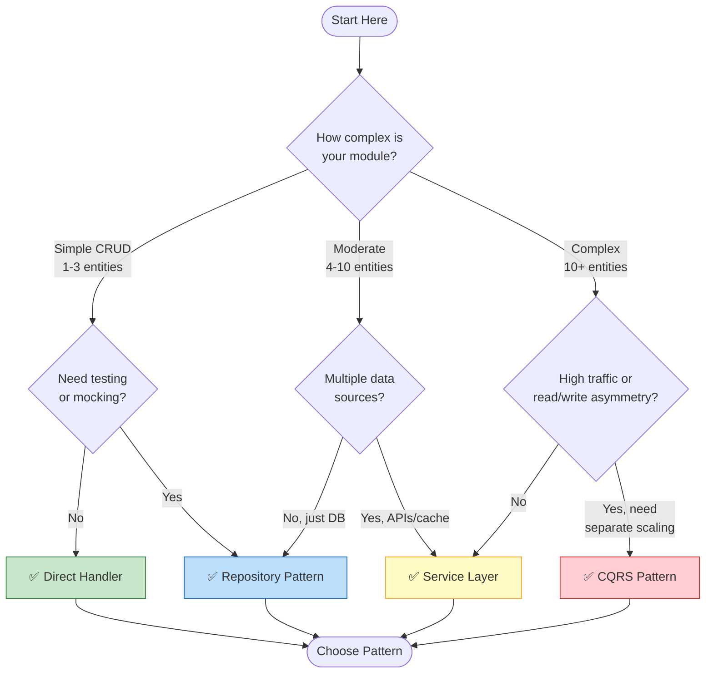
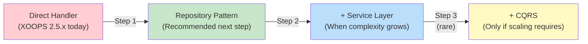

<span class="version-badge version-25x">2.5.x ✅</span> <span class="version-badge version-40x">4.0.x ✅</span>

> **Melyik mintát használjam?** Ez a döntési fa segít a közvetlen kezelők, a tárolóminta, a szolgáltatási réteg és a CQRS közötti választásban.

---

## Gyors döntési fa



---

## Minta-összehasonlítás

| Kritériumok | Közvetlen kezelő | Adattár | Szolgáltatási réteg | CQRS |
|----------|---------------|------------|----------------|------|
| **Bonyolultság** | ⭐ | ⭐⭐ | ⭐⭐⭐ | ⭐⭐⭐⭐⭐ |
| **Tesztelhetőség** | ❌ Kemény | ✅ Jó | ✅ Remek | ✅ Remek |
| **Rugalmasság** | ❌ Alacsony | ✅ Közepes | ✅ Magas | ✅ Nagyon magas |
| **XOOPS 2.5.x** | ✅ Natív | ✅ Működik | ✅ Működik | ⚠️ Komplex |
| **XOOPS 4.0** | ⚠️ Elavult | ✅ Ajánlott | ✅ Ajánlott | ✅ Mérleghez |
| **Csapatlétszám** | 1 dev | 1-3 fejlesztő | 2-5 fejlesztő | 5+ fejlesztő |
| **Karbantartás** | ❌ Magasabb | ✅ Közepes | ✅ Alsó | ⚠️ Szakértelmet igényel |

---

## Mikor kell használni az egyes mintákat

### ✅ Közvetlen kezelő (`XOOPSPersistableObjectHandler`)

**A legjobb:** Egyszerű modulok, gyors prototípusok, tanulás XOOPS

```php
// Simple and direct - good for small modules
$handler = xoops_getModuleHandler('article', 'news');
$articles = $handler->getObjects(new Criteria('status', 1));
```

**Válassza ezt, amikor:**
- Egyszerű modul építése 1-3 adatbázistáblával
- Gyors prototípus készítése
- Te vagy az egyetlen fejlesztő, és nincs szüksége tesztekre
- A modul nem fog jelentősen növekedni

**Korlátozások:**
- Nehezen tesztelhető egységteszt (globális függőség)
- Szoros csatolás a XOOPS adatbázisréteghez
- Az üzleti logika hajlamos beszivárogni a vezérlőkbe

---

### ✅ Repository Pattern

**A legjobb:** A legtöbb modul, tesztelhetőségre vágyó csapatok

```php
// Abstraction allows mocking for tests
interface ArticleRepositoryInterface {
    public function findPublished(): array;
    public function save(Article $article): void;
}

class XoopsArticleRepository implements ArticleRepositoryInterface {
    private $handler;

    public function __construct() {
        $this->handler = xoops_getModuleHandler('article', 'news');
    }

    public function findPublished(): array {
        return $this->handler->getObjects(new Criteria('status', 1));
    }
}
```

**Válassza ezt, amikor:**
- Egységteszteket szeretne írni
- Később módosíthatja az adatforrásokat (DB → API)
- 2+ fejlesztővel dolgozom
- modulok építése forgalmazáshoz

**Frissítési útvonal:** Ez az ajánlott minta a XOOPS 4.0 előkészítéshez.

---

### ✅ Szolgáltatási réteg

**A legjobb:** Összetett üzleti logikával rendelkező modulok

```php
// Service coordinates multiple repositories and contains business rules
class ArticlePublicationService {
    public function __construct(
        private ArticleRepositoryInterface $articles,
        private NotificationServiceInterface $notifications,
        private CacheInterface $cache
    ) {}

    public function publish(int $articleId): void {
        $article = $this->articles->find($articleId);
        $article->setStatus('published');
        $article->setPublishedAt(new DateTime());

        $this->articles->save($article);
        $this->notifications->notifySubscribers($article);
        $this->cache->invalidate("article:{$articleId}");
    }
}
```

**Válassza ezt, amikor:**
- A műveletek több adatforrást ölelnek fel
- Az üzleti szabályok összetettek
- Tranzakciókezelésre van szüksége
- Az alkalmazás több része ugyanezt teszi

**Frissítési útvonal:** Kombinálja a Repository-val a robusztus architektúra érdekében.

---

### ⚠️ CQRS (Parancslekérdezési felelősség elkülönítése)

**A legjobb:** Nagyméretű modulok read/write aszimmetriával

```php
// Commands modify state
class PublishArticleCommand {
    public function __construct(
        public readonly int $articleId,
        public readonly int $publisherId
    ) {}
}

// Queries read state (can use denormalized read models)
class GetPublishedArticlesQuery {
    public function __construct(
        public readonly int $limit = 10
    ) {}
}
```

**Válassza ezt, amikor:**
- Jelentősen meghaladja az írások számát (100:1 vagy több)
- Különböző skálázásra van szüksége az olvasáshoz és az íráshoz
- Összetett reporting/analytics követelmények
- Az események beszerzése előnyös lenne az Ön domainjének

**Figyelem:** A CQRS jelentősen bonyolulttá teszi. A legtöbb XOOPS modulnak nincs rá szüksége.

---

## Ajánlott frissítési útvonal



### 1. lépés: csomagolja a kezelőket adattárakba (2-4 óra)

1. Hozzon létre egy interfészt az adatelérési igényeihez
2. Valósítsa meg a meglévő kezelővel
3. A `xoops_getmoduleHandler()` közvetlen hívása helyett adja be az adattárat

### 2. lépés: Adjon hozzá szolgáltatási réteget, amikor szükséges (1-2 nap)

1. Amikor az üzleti logika megjelenik a vezérlőkben, csomagolja ki egy szolgáltatásba
2. A szolgáltatás tárolókat használ, nem közvetlenül kezelőket
3. A vezérlők elvékonyodnak (útvonal → szolgáltatás → válasz)

### 3. lépés: Csak akkor vegye figyelembe a CQRS-t, ha (ritka)

1. Naponta több millió olvasnivalója van
2. Az olvasási és írási modellek jelentősen eltérnek egymástól
3. Eseménybeszerzésre van szüksége az ellenőrzési nyomvonalhoz
4. Van egy csapata, aki tapasztalt a CQRS-val

---

## Gyors referenciakártya

| kérdés | Válasz |
|----------|---------|
| **"Csak a save/load adatokra van szükségem"** | Közvetlen kezelő |
| **"Teszteket akarok írni"** | Repository Pattern |
| **"Bonyolult üzleti szabályaim vannak"** | Szolgáltatási réteg |
| **"Külön kell méreteznem az olvasmányokat"** | CQRS |
| **"Készülök a XOOPS 4.0-ra"** | Repository + Service Layer |

---

## Kapcsolódó dokumentáció

- [Repository Pattern Guide](Patterns/Repository-Pattern.md)
- [Service Layer Pattern Guide](Patterns/Service-Layer-Pattern.md)
- [CQRS Mintaútmutató](../07-XOOPS-4.0/Implementation-Guides/CQRS-Pattern-Guide.md) *(speciális)*
- [Hibrid üzemmódú szerződés](../07-XOOPS-4.0/Specifications/Hybrid-Mode-Contract.md)

---

#minták #adat-hozzáférés #döntési fa #bevált gyakorlatok #xoops
