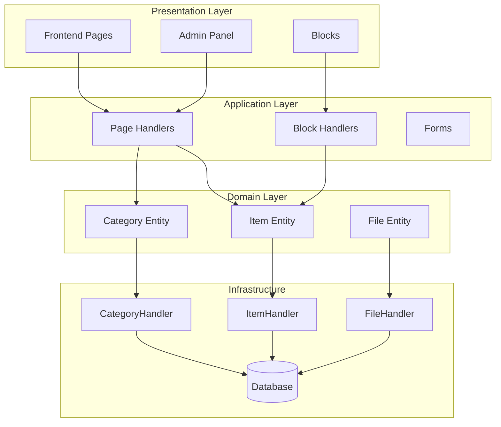
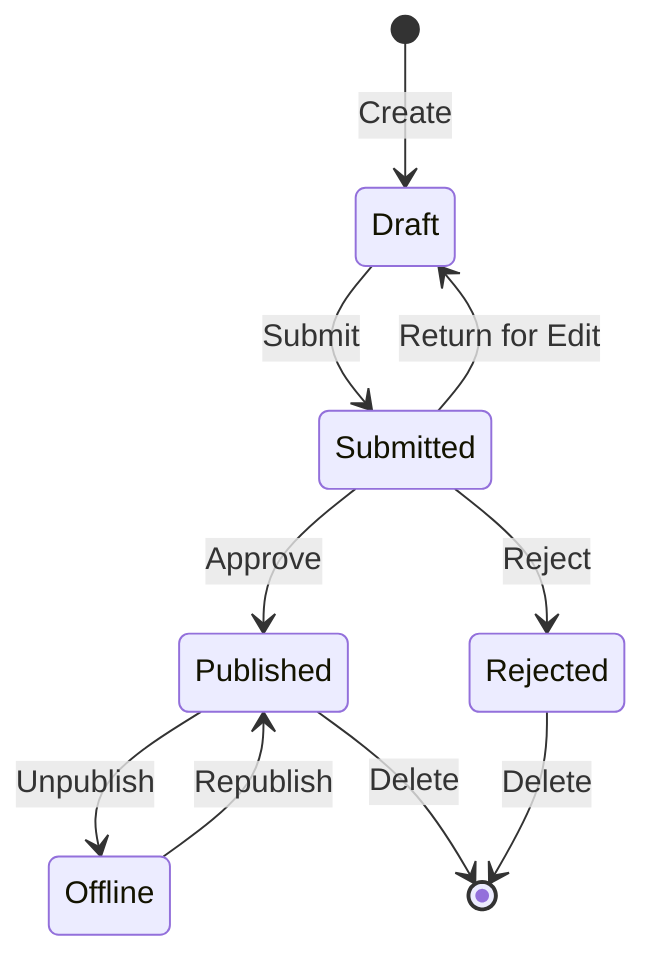

## Áttekintés

Ez a dokumentum technikai elemzést nyújt a Publisher modul architektúrájáról, mintáiról és megvalósítási részleteiről. Használja ezt referenciaként a termelési minőségű XOOPS modul felépítésének megértéséhez.

## Építészeti áttekintés



## Címtárstruktúra

```
publisher/
├── admin/
│   ├── index.php           # Admin dashboard
│   ├── item.php            # Article management
│   ├── category.php        # Category management
│   ├── permission.php      # Permissions
│   ├── file.php            # File manager
│   └── menu.php            # Admin menu
├── assets/
│   ├── css/
│   ├── js/
│   └── images/
├── class/
│   ├── Category.php        # Category entity
│   ├── CategoryHandler.php # Category data access
│   ├── Item.php            # Article entity
│   ├── ItemHandler.php     # Article data access
│   ├── File.php            # File attachment
│   ├── FileHandler.php     # File data access
│   ├── Form/               # Form classes
│   ├── Common/             # Utilities
│   └── Helper.php          # Module helper
├── include/
│   ├── common.php          # Initialization
│   ├── functions.php       # Utility functions
│   ├── oninstall.php       # Install hooks
│   ├── onupdate.php        # Update hooks
│   └── search.php          # Search integration
├── language/
├── templates/
├── sql/
└── xoops_version.php
```

## Entitáselemzés

### Tétel (cikk) entitás

```php
class Item extends \XoopsObject
{
    // Fields
    public function initVar(): void
    {
        $this->initVar('itemid', XOBJ_DTYPE_INT, null, false);
        $this->initVar('categoryid', XOBJ_DTYPE_INT, 0, false);
        $this->initVar('title', XOBJ_DTYPE_TXTBOX, '', true);
        $this->initVar('subtitle', XOBJ_DTYPE_TXTBOX, '');
        $this->initVar('summary', XOBJ_DTYPE_TXTAREA, '');
        $this->initVar('body', XOBJ_DTYPE_TXTAREA, '', true);
        $this->initVar('uid', XOBJ_DTYPE_INT, 0);
        $this->initVar('status', XOBJ_DTYPE_INT, 0);
        $this->initVar('datesub', XOBJ_DTYPE_INT, time());
        // ... more fields
    }

    // Business methods
    public function isPublished(): bool
    {
        return $this->getVar('status') == _PUBLISHER_STATUS_PUBLISHED;
    }

    public function canEdit(int $userId): bool
    {
        return $this->getVar('uid') == $userId
            || $this->isAdmin($userId);
    }
}
```

### Kezelő minta

```php
class ItemHandler extends \XoopsPersistableObjectHandler
{
    public function __construct(\XoopsDatabase $db)
    {
        parent::__construct(
            $db,
            'publisher_items',
            Item::class,
            'itemid',
            'title'
        );
    }

    public function getPublishedItems(int $limit = 10): array
    {
        $criteria = new \CriteriaCompo();
        $criteria->add(new \Criteria('status', _PUBLISHER_STATUS_PUBLISHED));
        $criteria->setSort('datesub');
        $criteria->setOrder('DESC');
        $criteria->setLimit($limit);

        return $this->getObjects($criteria);
    }
}
```

## Engedélyrendszer

### Engedélytípusok

| Engedély | Leírás |
|------------|--------------|
| `publisher_view` | Nézet category/articles |
| `publisher_submit` | Új cikkek beküldése |
| `publisher_approve` | Beadványok automatikus jóváhagyása |
| `publisher_moderate` | Függőben lévő cikkek áttekintése |
| `publisher_global` | Globális modulengedélyek |

### Engedélyellenőrzés

```php
class PermissionHandler
{
    public function isGranted(string $permission, int $categoryId): bool
    {
        $userId = $GLOBALS['xoopsUser']?->uid() ?? 0;
        $groups = $this->getUserGroups($userId);

        return $this->grouppermHandler->checkRight(
            $permission,
            $categoryId,
            $groups,
            $this->helper->getModule()->mid()
        );
    }
}
```

## Munkafolyamat állapotok



## Sablon szerkezete

### Frontend sablonok

| Sablon | Cél |
|----------|----------|
| `publisher_index.tpl` | modul kezdőlapja |
| `publisher_item.tpl` | Egyetlen cikk |
| `publisher_category.tpl` | Kategória lista |
| `publisher_submit.tpl` | Benyújtási űrlap |
| `publisher_search.tpl` | Keresési eredmények |

### Sablonok blokkolása

| Sablon | Cél |
|----------|----------|
| `publisher_block_latest.tpl` | Friss cikkek |
| `publisher_block_spotlight.tpl` | Kiemelt cikk |
| `publisher_block_category.tpl` | Kategória menü |

## Használt kulcsminták

1. **Kezelői minta** – Adatelérési tokozás
2. **Értékobjektum** - Állapotállandók
3. **Sablon módszer** - Űrlap generálása
4. **Stratégia** - Különböző megjelenítési módok
5. **Observer** - Értesítések az eseményekről

## Leckék a modulfejlesztéshez

1. Használja a XOOPSPersistableObjectHandlert a CRUD-hoz
2. Végezzen részletes engedélyeket
3. A bemutatás elkülönítése a logikától
4. Használja a Kritériumokat a lekérdezésekhez
5. Több tartalomállapot támogatása
6. Integrálja a XOOPS értesítési rendszert

## Kapcsolódó dokumentáció

- Cikkek készítése - Cikkkezelés
- Kategóriák kezelése - Kategória rendszer
- Engedélyek - Beállítás - Engedélyek beállítása
- Developer-Guide/Hooks-and-Events - Kiterjesztési pontok
