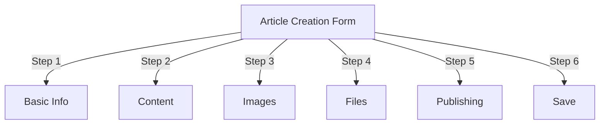
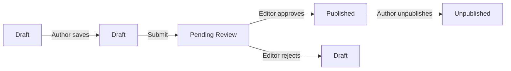
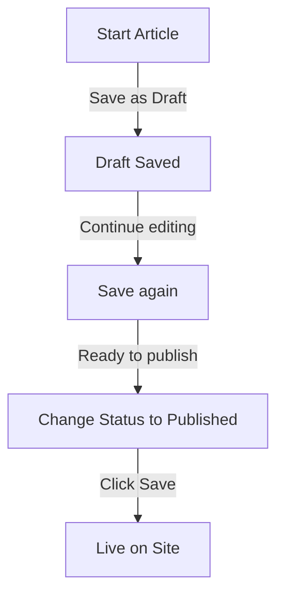

# Cikkek létrehozása a Publisherben

> Útmutató lépésről lépésre cikkek létrehozásához, szerkesztéséhez, formázásához és közzétételéhez a Kiadó modulban.

---

## Hozzáférés a cikkkezeléshez

### Navigáció a Felügyeleti panelen

```
Admin Panel
└── Modules
    └── Publisher
        └── Articles
            ├── Create New
            ├── Edit
            ├── Delete
            └── Publish
```

### Leggyorsabb útvonal

1. Jelentkezzen be **Rendszergazdaként**
2. Kattintson a **modulok** elemre az adminisztrációs sávban
3. Keresse meg a **Kiadó**
4. Kattintson az **Adminisztráció** hivatkozásra
5. Kattintson a **Cikkek** lehetőségre a bal oldali menüben
6. Kattintson a **Cikk hozzáadása** gombra

---

## Cikkkészítési űrlap

### Alapvető információk

Új cikk létrehozásakor töltse ki a következő részeket:



---

## 1. lépés: Alapvető információk

### Kötelező mezők

#### Cikk címe

```
Field: Title
Type: Text input (required)
Max length: 255 characters
Example: "Top 5 Tips for Better Photography"
```

**Irányelvek:**
- Leíró és konkrét
- Adjon meg kulcsszavakat a következőhöz: SEO
- Kerülje a ALL CAPS
- A legjobb megjelenítés érdekében tartson 60 karakternél kevesebbet

#### Válassza ki a kategóriát

```
Field: Category
Type: Dropdown (required)
Options: List of created categories
Example: Photography > Tutorials
```

**Tippek:**
- Szülő- és alkategóriák állnak rendelkezésre
- Válassza ki a legrelevánsabb kategóriát
- Cikkenként csak egy kategória
- Később módosítható

#### Cikk alcíme (opcionális)

```
Field: Subtitle
Type: Text input (optional)
Max length: 255 characters
Example: "Learn photography fundamentals in 5 easy steps"
```

**Használat:**
- Összefoglaló főcím
- Teaser szöveg
- Kiterjesztett cím

### Cikk leírása

#### Rövid leírás

```
Field: Short Description
Type: Textarea (optional)
Max length: 500 characters
```

**Cél:**
- Cikk előnézeti szövege
- Megjelenik a kategória listában
- A keresési eredményekben használják
- A SEO meta leírása

**Példa:**
```
"Discover essential photography techniques that will transform your photos
from ordinary to extraordinary. This comprehensive guide covers composition,
lighting, and exposure settings."
```

#### Teljes tartalom

```
Field: Article Body
Type: WYSIWYG Editor (required)
Max length: Unlimited
Format: HTML
```

A cikk fő tartalmi területe formázott szövegszerkesztéssel.

---

## 2. lépés: Tartalom formázása

### A WYSIWYG szerkesztő használata

#### Szöveg formázása

```
Bold:           Ctrl+B or click [B] button
Italic:         Ctrl+I or click [I] button
Underline:      Ctrl+U or click [U] button
Strikethrough:  Alt+Shift+D or click [S] button
Subscript:      Ctrl+, (comma)
Superscript:    Ctrl+. (period)
```

#### Címsor szerkezete

Hozzon létre megfelelő dokumentumhierarchiát:

```html
<h1>Article Title</h1>      <!-- Use once at top -->
<h2>Main Section</h2>        <!-- For major sections -->
<h3>Subsection</h3>          <!-- For subtopics -->
<h4>Sub-subsection</h4>      <!-- For details -->
```

**A szerkesztőben:**
- Kattintson a **Formátum** legördülő menüre
- Válassza ki az irányszintet (H1-H6)
- Írja be a címsort

#### Listák

**Rendezés nélküli lista (sorok):**

```markdown
• Point one
• Point two
• Point three
```

A szerkesztő lépései:
1. Kattintson a [≡] Felsorolások listája gombra
2. Írja be az egyes pontokat
3. Nyomja meg az Enter billentyűt a következő elemhez
4. Nyomja meg kétszer a Backspace billentyűt a lista befejezéséhez

**Rendezett lista (számozott):**

```markdown
1. First step
2. Second step
3. Third step
```

A szerkesztő lépései:
1. Kattintson az [1.] Számozott lista gombra
2. Írja be az egyes elemeket
3. Nyomja meg az Enter billentyűt a következőhöz
4. Nyomja meg kétszer a Backspace gombot a befejezéshez

**Beágyazott listák:**

```markdown
1. Main point
   a. Sub-point
   b. Sub-point
2. Next point
```

Lépések:
1. Hozzon létre első listát
2. Nyomja meg a Tab billentyűt a behúzáshoz
3. Hozzon létre beágyazott elemeket
4. Nyomja meg a Shift+Tab billentyűket a kihúzáshoz

#### Linkek

**Hiperhivatkozás hozzáadása:**

1. Válassza ki a linkelni kívánt szöveget
2. Kattintson a **[🔗] Link** gombra
3. Írja be a következőt: URL: `https://example.com`
4. Nem kötelező: Adja hozzá a title/target-t
5. Kattintson a **Link beszúrása** lehetőségre.

**Link eltávolítása:**

1. Kattintson a linkelt szövegen belülre
2. Kattintson a **[🔗] Hivatkozás eltávolítása** gombra

#### Kód és idézetek

**Idézetblokk:**

```
"This is an important quote from an expert"
- Attribution
```

Lépések:
1. Írja be az idézet szövegét
2. Kattintson a **[❝] Blockquote** gombra
3. A szöveg behúzott és stílusos

**Kódblokk:**

```python
def hello_world():
    print("Hello, World!")
```

Lépések:
1. Kattintson a **Formátum → Kód** lehetőségre.
2. Illessze be a kódot
3. Nyelv kiválasztása (opcionális)
4. Kód jelenik meg szintaktikai kiemeléssel

---

## 3. lépés: Képek hozzáadása

### Kiemelt kép (Hőskép)

```
Field: Featured Image / Main Image
Type: Image upload
Format: JPG, PNG, GIF, WebP
Max size: 5 MB
Recommended: 600x400 px
```

**Feltöltés:**

1. Kattintson a **Kép feltöltése** gombra
2. Válassza ki a képet a számítógépről
3. Crop/resize, ha szükséges
4. Kattintson a **A kép használata** lehetőségre.

**Képelhelyezés:**
- A cikk tetején jelenik meg
- Használt kategória listákon
- Archívumban látható
- Közösségi megosztáshoz használják

### Soron belüli képek

Képek beszúrása a cikk szövegébe:

1. Helyezze a kurzort a szerkesztőben oda, ahová a képnek mennie kell
2. Kattintson a **[🖼️] Kép** gombra az eszköztáron
3. Válassza ki a feltöltési lehetőséget:
   - Új kép feltöltése
   - Válasszon a galériából
   - Írja be a URL képet
4. Konfigurálás:
   
   ```
   Image Size:
   - Width: 300-600 px
   - Height: Auto (maintains ratio)
   - Alignment: Left/Center/Right
   ```
5. Kattintson a **Kép beszúrása** lehetőségre.

**Szöveg körbefűzése a kép körül:**

A szerkesztőben a beillesztés után:

```html
<!-- Image floats left, text wraps around -->

```

### Képgaléria

Több képből álló galéria létrehozása:

1. Kattintson a **Galéria** gombra (ha elérhető)
2. Több kép feltöltése:
   - Egyetlen kattintás: Adjon hozzá egyet
   - Drag & drop: Több hozzáadása
3. Rendezze el a sorrendet húzással
4. Állítson be minden képhez feliratot
5. Kattintson a **Galéria létrehozása** lehetőségre.

---

## 4. lépés: Fájlok csatolása

### Fájlmellékletek hozzáadása

```
Field: File Attachments
Type: File upload (multiple allowed)
Supported: PDF, DOC, XLS, ZIP, etc.
Max per file: 10 MB
Max per article: 5 files
```

**Csatolás:**

1. Kattintson a **Fájl hozzáadása** gombra
2. Válassza ki a fájlt a számítógépről
3. Nem kötelező: Fájlleírás hozzáadása
4. Kattintson a **Fájl csatolása** lehetőségre.
5. Ismételje meg több fájl esetén is

**Fájlpéldák:**
- PDF útmutatók
- Excel táblázatok
- Word dokumentumok
- ZIP archívum
- Forráskód

### Csatolt fájlok kezelése**Fájl szerkesztése:**

1. Kattintson a fájlnévre
2. Leírás szerkesztése
3. Kattintson a **Mentés** gombra.

**Fájl törlése:**

1. Keresse meg a fájlt a listában
2. Kattintson a **[×] Törlés** ikonra
3. Erősítse meg a törlést

---

## 5. lépés: Közzététel és állapot

### Cikk állapota

```
Field: Status
Type: Dropdown
Options:
  - Draft: Not published, only author sees
  - Pending: Waiting for approval
  - Published: Live on site
  - Archived: Old content
  - Unpublished: Was published, now hidden
```

**Állapot munkafolyamat:**



### Közzétételi beállítások

#### Azonnali közzététel

```
Status: Published
Start Date: Today (auto-filled)
End Date: (leave blank for no expiration)
```

#### Időbeosztás későbbre

```
Status: Scheduled
Start Date: Future date/time
Example: February 15, 2024 at 9:00 AM
```

A cikk a megadott időpontban automatikusan megjelenik.

#### Lejárat beállítása

```
Enable Expiration: Yes
Expiration Date: Future date
Action: Archive/Hide/Delete
Example: April 1, 2024 (article auto-archives)
```

### Láthatósági beállítások

```yaml
Show Article:
  - Display on front page: Yes/No
  - Show in category: Yes/No
  - Include in search: Yes/No
  - Include in recent articles: Yes/No

Featured Article:
  - Mark as featured: Yes/No
  - Featured section position: (number)
```

---

## 6. lépés: SEO és metaadatok

### SEO Beállítások

```
Field: SEO Settings (Expand section)
```

#### Meta leírás

```
Field: Meta Description
Type: Text (160 characters recommended)
Used by: Search engines, social media

Example:
"Learn photography fundamentals in 5 easy steps.
Discover composition, lighting, and exposure techniques."
```

#### Meta kulcsszavak

```
Field: Meta Keywords
Type: Comma-separated list
Max: 5-10 keywords

Example: Photography, Tutorial, Composition, Lighting, Exposure
```

#### URL Slug

```
Field: URL Slug (auto-generated from title)
Type: Text
Format: lowercase, hyphens, no spaces

Auto: "top-5-tips-for-better-photography"
Edit: Change before publishing
```

#### Graph Tags megnyitása

A cikk információiból automatikusan generálva:
- Cím
- Leírás
- Kiemelt kép
- Cikk: URL
- Megjelenés dátuma

Használja a Facebook, a LinkedIn, a WhatsApp stb.

---

## 7. lépés: Megjegyzések és interakció

### Megjegyzés beállításai

```yaml
Allow Comments:
  - Enable: Yes/No
  - Default: Inherit from preferences
  - Override: Specific to this article

Moderate Comments:
  - Require approval: Yes/No
  - Default: Inherit from preferences
```

### Értékelési beállítások

```yaml
Allow Ratings:
  - Enable: Yes/No
  - Scale: 5 stars (default)
  - Show average: Yes/No
  - Show count: Yes/No
```

---

## 8. lépés: Speciális beállítások

### Szerző és szerző

```
Field: Author
Type: Dropdown
Default: Current user
Options: All users with author permission

Display:
  - Show author name: Yes/No
  - Show author bio: Yes/No
  - Show author avatar: Yes/No
```

### Zár szerkesztése

```
Field: Edit Lock
Purpose: Prevent accidental changes

Lock Article:
  - Locked: Yes/No
  - Lock reason: "Final version"
  - Unlock date: (optional)
```

### Felülvizsgálati előzmények

A cikk automatikusan mentett változatai:

```
View Revisions:
  - Click "Revision History"
  - Shows all saved versions
  - Compare versions
  - Restore previous version
```

---

## Mentés és közzététel

### Munkafolyamat mentése



### Cikk mentése

**Automatikus mentés:**
- 60 másodpercenként aktiválódik
- Automatikusan menti piszkozatként
- Mutatja az "Utoljára mentve: 2 perce"

**Kézi mentés:**
- Kattintson a **Mentés és folytatás** gombra a szerkesztés folytatásához
- Kattintson a **Mentés és megtekintés** gombra a közzétett verzió megtekintéséhez
- Kattintson a **Mentés** gombra a mentéshez és bezáráshoz

### Cikk közzététele

1. Állítsa be az **Állapot**: Közzétéve
2. Állítsa be a **Kezdési dátumot**: most (vagy jövőbeli dátum)
3. Kattintson a **Mentés** vagy a **Közzététel** gombra.
4. Megjelenik a megerősítő üzenet
5. A cikk élő (vagy ütemezett)

---

## Meglévő cikkek szerkesztése

### Hozzáférés a cikkszerkesztőhöz

1. Lépjen az **Adminisztrálás → Kiadó → Cikkek** oldalra.
2. Keresse meg a cikket a listában
3. Kattintson a **Szerkesztés** icon/button lehetőségre
4. Végezzen változtatásokat
5. Kattintson a **Mentés** gombra.

### Tömeges szerkesztés

Több cikk szerkesztése egyszerre:

```
1. Go to Articles list
2. Select articles (checkboxes)
3. Choose "Bulk Edit" from dropdown
4. Change selected field
5. Click "Update All"

Available for:
  - Status
  - Category
  - Featured (Yes/No)
  - Author
```

### Cikk előnézete

Közzététel előtt:

1. Kattintson az **Előnézet** gombra
2. Tekintse meg úgy, ahogy az olvasók látják
3. Ellenőrizze a formázást
4. Teszt linkek
5. A módosításhoz térjen vissza a szerkesztőhöz

---

## Cikkkezelés

### Összes cikk megtekintése

**Cikklista nézet:**

```
Admin → Publisher → Articles

Columns:
  - Title
  - Category
  - Author
  - Status
  - Created date
  - Modified date
  - Actions (Edit, Delete, Preview)

Sorting:
  - By title (A-Z)
  - By date (newest/oldest)
  - By status (Published/Draft)
  - By category
```

### Cikkek szűrése

```
Filter Options:
  - By category
  - By status
  - By author
  - By date range
  - Search by title

Example: Show all "Draft" articles by "John" in "News" category
```

### Cikk törlése

**Lágy törlés (ajánlott):**

1. **Állapot** módosítása: Nincs közzétéve
2. Kattintson a **Mentés** gombra.
3. A cikk elrejtve, de nem törölve
4. Később visszaállítható

**Kemény törlés:**

1. Válassza ki a cikket a listából
2. Kattintson a **Törlés** gombra
3. Erősítse meg a törlést
4. A cikk véglegesen eltávolítva

---

## Tartalom bevált gyakorlatai

### Minőségi cikkek írása

```
Structure:
  ✓ Compelling title
  ✓ Clear subtitle/description
  ✓ Engaging opening paragraph
  ✓ Logical sections with headers
  ✓ Supporting visuals
  ✓ Conclusion/summary
  ✓ Call-to-action

Length:
  - Blog posts: 500-2000 words
  - News: 300-800 words
  - Guides: 2000-5000 words
  - Minimum: 300 words
```

### SEO Optimalizálás

```
Title Optimization:
  ✓ Include primary keyword
  ✓ Keep under 60 characters
  ✓ Put keyword near beginning
  ✓ Be descriptive and specific

Content Optimization:
  ✓ Use headings (H1, H2, H3)
  ✓ Include keyword in heading
  ✓ Use bold for important terms
  ✓ Add descriptive links
  ✓ Include images with alt text

Meta Description:
  ✓ Include primary keyword
  ✓ 155-160 characters
  ✓ Action-oriented
  ✓ Unique per article
```

### Formázási tippek

```
Readability:
  ✓ Short paragraphs (2-4 sentences)
  ✓ Bullet points for lists
  ✓ Subheadings every 300 words
  ✓ Generous whitespace
  ✓ Line breaks between sections

Visual Appeal:
  ✓ Featured image at top
  ✓ Inline images in content
  ✓ Alt text on all images
  ✓ Code blocks for technical
  ✓ Blockquotes for emphasis
```

---

## Billentyűparancsok

### Szerkesztő parancsikonok

```
Bold:               Ctrl+B
Italic:             Ctrl+I
Underline:          Ctrl+U
Link:               Ctrl+K
Save Draft:         Ctrl+S
```

### Szöveges gyorsbillentyűk

```
-- →  (dash to em dash)
... → … (three dots to ellipsis)
(c) → © (copyright)
(r) → ® (registered)
(tm) → ™ (trademark)
```

---

## Gyakori feladatok

### Cikk másolása

1. Cikk megnyitása
2. Kattintson a **Duplikálás** vagy a **Klónozás** gombra
3. A cikk tervezetként másolva
4. Szerkessze a címet és a tartalmat
5. Közzététel

### Cikk ütemezése

1. Hozzon létre cikket
2. Állítsa be a **Kezdési dátumot**: Jövőbeli date/time
3. Állítsa be az **Állapot**: Közzétéve
4. Kattintson a **Mentés** gombra.
5. A cikk automatikusan megjelenik

### Batch Publishing

1. Hozzon létre cikkeket piszkozatként
2. Állítsa be a közzétételi dátumokat
3. A cikkek automatikus közzététele ütemezett időpontokban
4. Monitor "Ütemezett" nézetből

### Mozgás a kategóriák között

1. Cikk szerkesztése
2. Módosítsa a **Kategória** legördülő menüt
3. Kattintson a **Mentés** gombra.
4. A cikk új kategóriában jelenik meg

---

## Hibaelhárítás

### Probléma: A cikk nem menthető

**Megoldás:**
```
1. Check form for required fields
2. Verify category is selected
3. Check PHP memory limit
4. Try saving as draft first
5. Clear browser cache
```

### Probléma: A képek nem jelennek meg

**Megoldás:**
```
1. Verify image upload succeeded
2. Check image file format (JPG, PNG)
3. Verify image path in database
4. Check upload directory permissions
5. Try re-uploading image
```

### Probléma: A szerkesztő eszköztár nem jelenik meg

**Megoldás:**
```
1. Clear browser cache
2. Try different browser
3. Disable browser extensions
4. Check JavaScript console for errors
5. Verify editor plugin installed
```

### Probléma: A cikk nem jelenik meg

**Megoldás:**
```
1. Verify Status = "Published"
2. Check Start Date is today or earlier
3. Verify permissions allow publishing
4. Check category is published
5. Clear module cache
```

---

## Kapcsolódó útmutatók

- Konfigurációs útmutató
- Kategóriakezelés
- Engedélyek beállítása
- Egyedi sablonok

---

## Következő lépések

- Hozd létre az első cikket
- Kategóriák beállítása
- Engedélyek konfigurálása
- Tekintse át a sablon testreszabását

---

#kiadó #cikk #tartalom #alkotás #formázás #szerkesztés #xoops
