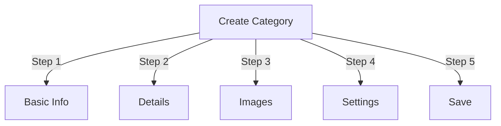

# Kategóriák kezelése a Publisherben

> Teljes útmutató hierarchiák létrehozásához, rendszerezéséhez és kategóriák kezeléséhez a Publisher modulban.

---

## Kategória alapjai

### Mik azok a kategóriák?

A kategóriák a cikkeket logikai csoportokba rendezik:

```
Example Structure:

  News (Main Category)
    ├── Technology
    ├── Sports
    └── Entertainment

  Tutorials (Main Category)
    ├── Photography
    │   ├── Basics
    │   └── Advanced
    └── Writing
        └── Blogging
```

### A jó kategóriastruktúra előnyei

```
✓ Better user navigation
✓ Organized content
✓ Improved SEO
✓ Easier content management
✓ Better editorial workflow
```

---

## Hozzáférés a kategóriakezeléshez

### Navigáció a Felügyeleti panelen

```
Admin Panel
└── Modules
    └── Publisher
        └── Categories
            ├── Create New
            ├── Edit
            ├── Delete
            ├── Permissions
            └── Organize
```

### Gyors hozzáférés

1. Jelentkezzen be **Rendszergazdaként**
2. Lépjen az **Adminisztráció → modulok** elemre.
3. Kattintson a **Kiadó → Adminisztráció** lehetőségre.
4. Kattintson a **Kategóriák** elemre a bal oldali menüben

---

## Kategóriák létrehozása

### Kategória létrehozási űrlap



### 1. lépés: Alapvető információk

#### Kategória neve

```
Field: Category Name
Type: Text input (required)
Max length: 100 characters
Uniqueness: Should be unique
Example: "Photography"
```

**Irányelvek:**
- Leíró és egyes vagy többes szám következetesen
- Rendesen nagybetűvel
- Kerülje a speciális karaktereket
- Legyen elég rövid

#### Kategória leírása

```
Field: Description
Type: Textarea (optional)
Max length: 500 characters
Used in: Category listing pages, category blocks
```

**Cél:**
- Elmagyarázza a kategória tartalmát
- A kategóriás cikkek felett jelenik meg
- Segít a felhasználóknak megérteni a hatókört
- A SEO meta leíráshoz használatos

**Példa:**
```
"Photography tips, tutorials, and inspiration for
all skill levels. From composition basics to advanced
lighting techniques, master your craft."
```

### 2. lépés: Szülőkategória

#### Hierarchia létrehozása

```
Field: Parent Category
Type: Dropdown
Options: None (root), or existing categories
```

**Példák hierarchiára:**

```
Flat Structure:
  News
  Tutorials
  Reviews

Nested Structure:
  News
    Technology
    Business
    Sports
  Tutorials
    Photography
      Basics
      Advanced
    Writing
```

**Alkategória létrehozása:**

1. Kattintson a **Szülőkategória** legördülő menüre
2. Válassza ki a szülőt (pl. "Hírek")
3. Töltse ki a kategória nevét
4. Mentés
5. Az új kategória gyermekként jelenik meg

### 3. lépés: Kategória kép

#### Kategóriakép feltöltése

```
Field: Category Image
Type: Image upload (optional)
Format: JPG, PNG, GIF, WebP
Max size: 5 MB
Recommended: 300x200 px (or your theme size)
```

**Feltöltés:**

1. Kattintson a **Kép feltöltése** gombra
2. Válassza ki a képet a számítógépről
3. Crop/resize, ha szükséges
4. Kattintson a **A kép használata** lehetőségre.

**Hol használták:**
- Kategória listázó oldal
- Kategória blokk fejléce
- kenyérmorzsa (néhány téma)
- Közösségi média megosztás

### 4. lépés: Kategóriabeállítások

#### Megjelenítési beállítások

```yaml
Status:
  - Enabled: Yes/No
  - Hidden: Yes/No (hidden from menus, still accessible)

Display Options:
  - Show description: Yes/No
  - Show image: Yes/No
  - Show article count: Yes/No
  - Show subcategories: Yes/No

Layout:
  - Items per page: 10-50
  - Display order: Date/Title/Author
  - Display direction: Ascending/Descending
```

#### Kategória engedélyek

```yaml
Who Can View:
  - Anonymous: Yes/No
  - Registered: Yes/No
  - Specific groups: Configure per group

Who Can Submit:
  - Registered: Yes/No
  - Specific groups: Configure per group
  - Author must have: "submit articles" permission
```

### 5. lépés: SEO beállítások

#### Metacímkék

```
Field: Meta Description
Type: Text (160 characters)
Purpose: Search engine description

Field: Meta Keywords
Type: Comma-separated list
Example: photography, tutorials, tips, techniques
```

#### URL konfiguráció

```
Field: URL Slug
Type: Text
Auto-generated from category name
Example: "photography" from "Photography"
Can be customized before saving
```

### Kategória mentése

1. Töltse ki az összes kötelező mezőt:
   - Kategória neve ✓
   - Leírás (ajánlott)
2. Nem kötelező: Töltse fel a képet, állítsa be a SEO-t
3. Kattintson a **Kategória mentése** lehetőségre.
4. Megjelenik a megerősítő üzenet
5. A kategória már elérhető

---

## Kategóriahierarchia

### Beágyazott struktúra létrehozása

```
Step-by-step example: Create News → Technology subcategory

1. Go to Categories admin
2. Click "Add Category"
3. Name: "News"
4. Parent: (leave blank - this is root)
5. Save
6. Click "Add Category" again
7. Name: "Technology"
8. Parent: "News" (select from dropdown)
9. Save
```

### Hierarchiafa megtekintése

```
Categories view shows tree structure:

📁 News
  📄 Technology
  📄 Sports
  📄 Entertainment
📁 Tutorials
  📄 Photography
    📄 Basics
    📄 Advanced
  📄 Writing
```

Kattintson a kibontási nyilakra a show/hide alkategóriákhoz.

### Kategóriák átszervezése

#### Kategória áthelyezése

1. Lépjen a Kategóriák listára
2. Kattintson a **Szerkesztés** gombra a kategóriánál
3. Módosítsa a **szülő kategóriát**
4. Kattintson a **Mentés** gombra.
5. A kategória új pozícióba került

#### Kategóriák átrendezése

Ha elérhető, használja a fogd és vidd módszert:

1. Lépjen a Kategóriák listára
2. Kattintson és húzza a kategóriát
3. Helyezzen új pozíciót
4. A rendelés automatikusan mentésre kerül

#### Kategória törlése

**1. lehetőség: Lágy törlés (elrejtés)**

1. Kategória szerkesztése
2. Állítsa be az **Állapot** lehetőséget: Letiltva
3. Kattintson a **Mentés** gombra.
4. A kategória elrejtve, de nem törölve

**2. lehetőség: Hard Delete**

1. Lépjen a Kategóriák listára
2. Kattintson a **Törlés** gombra a kategóriánál
3. Válasszon műveletet a cikkekhez:
   
   ```
   ☐ Move articles to parent category
   ☐ Move articles to root (News)
   ☐ Delete all articles in category
   ```
4. Erősítse meg a törlést

---

## Kategória műveletek

### Kategória szerkesztése

1. Lépjen az **Adminisztráció → Kiadó → Kategóriák** menüpontra.
2. Kattintson a **Szerkesztés** gombra a kategóriánál
3. Mezők módosítása:
   - Név
   - Leírás
   - Szülő kategória
   - Kép
   - Beállítások
4. Kattintson a **Mentés** gombra.

### Kategória engedélyek szerkesztése

1. Lépjen a Kategóriák menüpontra
2. Kattintson az **Engedélyek** lehetőségre a kategóriánál (vagy kattintson a kategóriára, majd kattintson az Engedélyek lehetőségre).
3. Csoportok konfigurálása:

```
For each group:
  ☐ View articles in this category
  ☐ Submit articles to this category
  ☐ Edit own articles
  ☐ Edit all articles
  ☐ Approve/Moderate articles
  ☐ Manage category
```

4. Kattintson az **Engedélyek mentése** lehetőségre.

### Kategóriakép beállítása

**Új kép feltöltése:**

1. Kategória szerkesztése
2. Kattintson a **Kép módosítása** lehetőségre.
3. Töltse fel vagy válassza ki a képet
4. Crop/resize
5. Kattintson a **Kép használata** lehetőségre.
6. Kattintson a **Kategória mentése** gombra.

**Kép eltávolítása:**

1. Kategória szerkesztése
2. Kattintson a **Kép eltávolítása** lehetőségre (ha elérhető)
3. Kattintson a **Kategória mentése** gombra.

---

## Kategória engedélyek

### Engedélymátrix

```
                 Anonymous  Registered  Editor  Admin
View category        ✓         ✓         ✓       ✓
Submit article       ✗         ✓         ✓       ✓
Edit own article     ✗         ✓         ✓       ✓
Edit all articles    ✗         ✗         ✓       ✓
Moderate articles    ✗         ✗         ✓       ✓
Manage category      ✗         ✗         ✗       ✓
```

### Kategória szintű engedélyek beállítása

#### Kategóriánkénti hozzáférés-vezérlés

1. Lépjen a **Kategóriák** listára
2. Válasszon ki egy kategóriát
3. Kattintson az **Engedélyek** elemre.
4. Minden csoporthoz válassza ki az engedélyeket:

```
Example: News category
  Anonymous:   View only
  Registered:  Submit articles
  Editors:     Approve articles
  Admins:      Full control
```

5. Kattintson a **Mentés** gombra.

#### Mezőszintű engedélyek

Szabályozza, mely űrlapmezőket használhatják a felhasználók see/edit:

```
Example: Limit field visibility for Registered users

Registered users can see/edit:
  ✓ Title
  ✓ Description
  ✓ Content
  ✗ Author (auto-set to current user)
  ✗ Scheduled date (only editors)
  ✗ Featured (only admins)
```

**Konfigurálás itt:**
- Kategória engedélyek
- Keresse meg a „Mező láthatósága” részt

---## A kategóriák legjobb gyakorlatai

### Kategória szerkezete

```
✓ Keep hierarchy 2-3 levels deep
✗ Don't create too many top-level categories
✗ Don't create categories with one article

✓ Use consistent naming (plural or singular)
✗ Don't use vague names ("Stuff", "Other")

✓ Create categories for articles that exist
✗ Don't create empty categories in advance
```

### Elnevezési irányelvek

```
Good names:
  "Photography"
  "Web Development"
  "Travel Tips"
  "Business News"

Avoid:
  "Articles" (too vague)
  "Content" (redundant)
  "News&Updates" (inconsistent)
  "PHOTOGRAPHY STUFF" (formatting)
```

### Szervezési tippek

```
By Topic:
  News
    Technology
    Sports
    Entertainment

By Type:
  Tutorials
    Video
    Text
    Interactive

By Audience:
  For Beginners
  For Experts
  Case Studies

Geographic:
  North America
    United States
    Canada
  Europe
```

---

## Kategóriablokkok

### Kiadói kategóriablokk

Kategória listák megjelenítése webhelyén:

1. Lépjen az **Adminisztrálás → Letiltások** lehetőségre.
2. Keresse meg a **Kiadó – Kategóriák**
3. Kattintson a **Szerkesztés** gombra.
4. Konfigurálás:

```
Block Title: "News Categories"
Show subcategories: Yes/No
Show article count: Yes/No
Height: (pixels or auto)
```

5. Kattintson a **Mentés** gombra.

### Kategória cikkek blokkja

Egy adott kategória legújabb cikkeinek megjelenítése:

1. Lépjen az **Adminisztrálás → Letiltások** lehetőségre.
2. Keresse meg a **Kiadó – Kategória cikkek**
3. Kattintson a **Szerkesztés** gombra.
4. Válassza ki:

```
Category: News (or specific category)
Number of articles: 5
Show images: Yes/No
Show description: Yes/No
```

5. Kattintson a **Mentés** gombra.

---

## Kategóriaelemzés

### Kategóriastatisztikák megtekintése

A kategóriák adminisztrátorától:

```
Each category shows:
  - Total articles: 45
  - Published: 42
  - Draft: 2
  - Pending approval: 1
  - Total views: 5,234
  - Latest article: 2 hours ago
```

### Kategória forgalom megtekintése

Ha az elemzés engedélyezve van:

1. Kattintson a kategória nevére
2. Kattintson a **Statisztika** fülre
3. Megtekintés:
   - Oldalmegtekintések
   - Népszerű cikkek
   - Forgalmi trendek
   - Használt keresési kifejezések

---

## Kategória sablonok

### Kategória megjelenítésének testreszabása

Egyéni sablonok használata esetén minden kategória felülírhatja:

```
publisher_category.tpl
  ├── Category header
  ├── Category description
  ├── Category image
  ├── Article listing
  └── Pagination
```

**Testreszabás:**

1. Másoljon sablonfájlt
2. Módosítsa a HTML/CSS
3. Rendeljen kategóriához az admin
4. A kategória egyéni sablont használ

---

## Gyakori feladatok

### Hírhierarchia létrehozása

```
Admin → Publisher → Categories
1. Create "News" (parent)
2. Create "Technology" (parent: News)
3. Create "Sports" (parent: News)
4. Create "Entertainment" (parent: News)
```

### Cikkek mozgatása kategóriák között

1. Lépjen a **Cikkek** adminisztrátor oldalra
2. Válassza ki a cikkeket (jelölőnégyzetek)
3. Válassza a **"Kategória módosítása"** lehetőséget a tömeges műveletek legördülő menüjéből
4. Válasszon új kategóriát
5. Kattintson az **Az összes frissítése** lehetőségre.

### Kategória elrejtése törlés nélkül

1. Kategória szerkesztése
2. Állítsa be az **Állapot**: Disabled/Hidden
3. Mentés
4. A menükben nem szereplő kategória (még mindig elérhető a URL-n keresztül)

### Hozzon létre kategóriát a piszkozatok számára

```
Best Practice:

Create "In Review" category
  ├── Purpose: Articles awaiting approval
  ├── Permissions: Hidden from public
  ├── Only admins/editors can see
  ├── Move articles here until approved
  └── Move to "News" when published
```

---

## Import/Export kategóriák

### Kategóriák exportálása

Ha elérhető:

1. Lépjen a **Kategóriák** adminisztrátor oldalra
2. Kattintson az **Exportálás** gombra.
3. Válassza ki a formátumot: CSV/JSON/XML
4. Töltse le a fájlt
5. Biztonsági másolat mentve

### Kategóriák importálása

Ha elérhető:

1. Készítsen fájlt kategóriákkal
2. Lépjen a **Kategóriák** adminisztrátor oldalra
3. Kattintson az **Importálás** gombra.
4. Fájl feltöltése
5. Válassza ki a frissítési stratégiát:
   - Csak újat hozhat létre
   - Frissítse a meglévőt
   - Cserélje ki az összeset
6. Kattintson az **Importálás** gombra.

---

## Hibaelhárítási kategóriák

### Probléma: Az alkategóriák nem jelennek meg

**Megoldás:**
```
1. Verify parent category status is "Enabled"
2. Check permissions allow viewing
3. Verify subcategories have status "Enabled"
4. Clear cache: Admin → Tools → Clear Cache
5. Check theme shows subcategories
```

### Probléma: A kategória nem törölhető

**Megoldás:**
```
1. Category must have no articles
2. Move or delete articles first:
   Admin → Articles
   Select articles in category
   Change category to another
3. Then delete empty category
4. Or choose "move articles" option when deleting
```

### Probléma: A kategória képe nem jelenik meg

**Megoldás:**
```
1. Verify image uploaded successfully
2. Check image file format (JPG, PNG)
3. Verify upload directory permissions
4. Check theme displays category images
5. Try re-uploading image
6. Clear browser cache
```

### Probléma: Az engedélyek nem lépnek érvénybe

**Megoldás:**
```
1. Check group permissions in Category
2. Check global Publisher permissions
3. Check user belongs to configured group
4. Clear session cache
5. Log out and log back in
6. Check permission modules installed
```

---

## Kategória bevált gyakorlatok ellenőrzőlista

A kategóriák telepítése előtt:

- [ ] A hierarchia 2-3 szint mélységű
- [ ] Minden kategóriában 5+ cikk található
- [ ] A kategórianevek konzisztensek
- [ ] Az engedélyek megfelelőek
- [ ] A kategória képei optimalizálva vannak
- [ ] A leírások elkészültek
- [ ] SEO metaadatok kitöltve
- A [ ] URL-ek barátságosak
- [ ] Kezelőfelületen tesztelt kategóriák
- [ ] A dokumentáció frissítve

---

## Kapcsolódó útmutatók

- Cikk létrehozása
- Engedélykezelés
- modul konfiguráció
- Telepítési útmutató

---

## Következő lépések

- Cikkek létrehozása kategóriákban
- Engedélyek konfigurálása
- Testreszabás egyéni sablonokkal

---

#kiadó #kategóriák #szervezet #hierarchia #menedzsment #xoops
