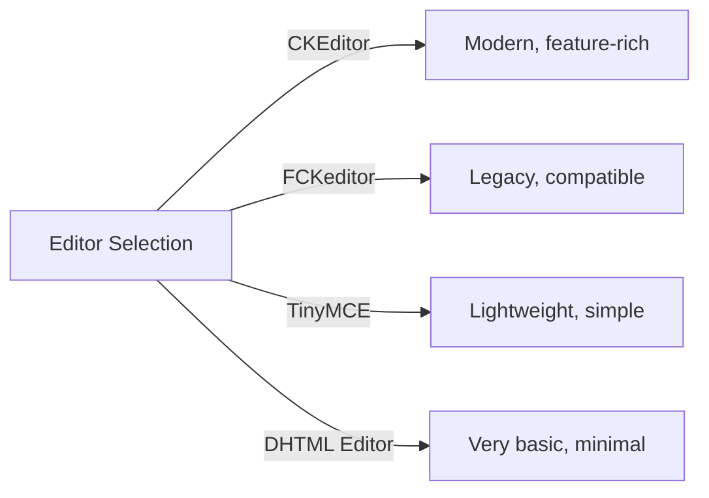
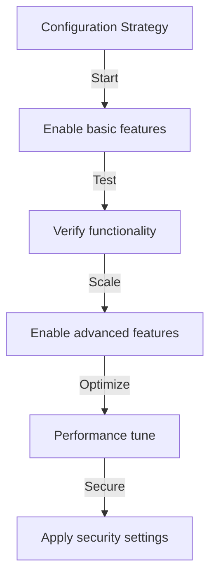

# A Publisher alapkonfigurációja

> Konfigurálja a Publisher modul beállításait, preferenciáit és általános beállításait a XOOPS telepítéséhez.

---

## Hozzáférés a konfigurációhoz

### Navigáció a Felügyeleti panelen

```
XOOPS Admin Panel
└── Modules
    └── Publisher
        ├── Preferences
        ├── Settings
        └── Configuration
```

1. Jelentkezzen be **Rendszergazdaként**
2. Lépjen az **Felügyeleti panel → modulok** elemre.
3. Keresse meg a **Publisher** modult
4. Kattintson a **Preferences** vagy **Admin** linkre

---

## Általános beállítások

### Hozzáférés a konfigurációhoz

```
Admin Panel → Modules → Publisher
```

Kattintson a **fogaskerék ikonra** vagy a **Beállítások** lehetőségre az alábbi lehetőségek megjelenítéséhez:

#### Megjelenítési beállítások

| Beállítás | Opciók | Alapértelmezett | Leírás |
|---------|---------|----------|--------------|
| **Elemek oldalanként** | 5-50 | 10 | A listákban szereplő cikkek |
| **Megjelenítés** | Yes/No | Igen | Navigációs nyomvonal megjelenítése |
| **A lapozás használata** | Yes/No | Igen | Hosszú listák lapozása |
| **Megjelenítés dátuma** | Yes/No | Igen | Cikk dátumának megjelenítése |
| **Kategória megjelenítése** | Yes/No | Igen | Cikkkategória megjelenítése |
| **Show szerző** | Yes/No | Igen | Cikk szerzőjének megjelenítése |
| **Nézetek megjelenítése** | Yes/No | Igen | Cikk megtekintések száma |

**Példa konfigurációra:**

```yaml
Items Per Page: 15
Show Breadcrumb: Yes
Use Paging: Yes
Show Date: Yes
Show Category: Yes
Show Author: Yes
Show Views: Yes
```

#### Szerzői beállítások

| Beállítás | Alapértelmezett | Leírás |
|---------|----------|--------------|
| **A szerző nevének megjelenítése** | Igen | Valódi név vagy felhasználónév megjelenítése |
| **Felhasználónév használata** | Nem | Felhasználónév megjelenítése név helyett |
| **Szerző e-mail-címének megjelenítése** | Nem | A szerző kapcsolatfelvételi e-mail-címének megjelenítése |
| **A szerző avatarjának megjelenítése** | Igen | Felhasználói avatar megjelenítése |

---

## Szerkesztő konfiguráció

### Válassza ki a WYSIWYG szerkesztőt

A Publisher több szerkesztőt is támogat:

#### Elérhető szerkesztők



### CKE-szerkesztő (ajánlott)

**A legjobb:** A legtöbb felhasználó, modern böngészők, teljes funkciók

1. Nyissa meg a **Beállítások**
2. Állítsa be a **Szerkesztő**: CKE-szerkesztőt
3. Beállítások konfigurálása:

```
Editor: CKEditor 4.x
Toolbar: Full
Height: 400px
Width: 100%
Remove plugins: []
Add plugins: [mathjax, codesnippet]
```

### FCKeditor

**A legjobb:** Kompatibilitás, régebbi rendszerek

```
Editor: FCKeditor
Toolbar: Default
Custom config: (optional)
```

### TinyMCE

**A legjobb:** Minimális helyigény, alapvető szerkesztés

```
Editor: TinyMCE
Plugins: [paste, table, link, image]
Toolbar: minimal
```

---

## Fájl- és feltöltési beállítások

### Feltöltési könyvtárak konfigurálása

```
Admin → Publisher → Preferences → Upload Settings
```

#### Fájltípus beállítások

```yaml
Allowed File Types:
  Images:
    - jpg
    - jpeg
    - gif
    - png
    - webp
  Documents:
    - pdf
    - doc
    - docx
    - xls
    - xlsx
    - ppt
    - pptx
  Archives:
    - zip
    - rar
    - 7z
  Media:
    - mp3
    - mp4
    - webm
    - mov
```

#### Fájlméret-korlátok

| Fájltípus | Max méret | Megjegyzések |
|-----------|----------|--------|
| **Képek** | 5 MB | Képfájlonként |
| **Dokumentumok** | 10 MB | PDF, Office-fájlok |
| **Média** | 50 MB | Video/audio fájlok |
| **Minden fájl** | 100 MB | Feltöltésenként összesen |

**Konfiguráció:**

```
Max Image Upload Size: 5 MB
Max Document Upload Size: 10 MB
Max Media Upload Size: 50 MB
Total Upload Size: 100 MB
Max Files per Article: 5
```

### Kép átméretezése

A Publisher automatikusan átméretezi a képeket a következetesség érdekében:

```yaml
Thumbnail Size:
  Width: 150
  Height: 150
  Mode: Crop/Resize

Category Image Size:
  Width: 300
  Height: 200
  Mode: Resize

Article Featured Image:
  Width: 600
  Height: 400
  Mode: Resize
```

---

## Megjegyzés és interakció beállításai

### Megjegyzések Konfiguráció

```
Preferences → Comments Section
```

#### Megjegyzés opciók

```yaml
Allow Comments:
  - Enabled: Yes/No
  - Default: Yes
  - Per-article override: Yes

Comment Moderation:
  - Moderate comments: Yes/No
  - Moderate guest comments only: Yes/No
  - Spam filter: Enabled
  - Max comments per day: (unlimited)

Comment Display:
  - Display format: Threaded/Flat
  - Comments per page: 10
  - Date format: Full date/Time ago
  - Show comment count: Yes/No
```

### Értékelések beállítása

```yaml
Allow Ratings:
  - Enabled: Yes/No
  - Default: Yes
  - Per-article override: Yes

Rating Options:
  - Rating scale: 5 stars (default)
  - Allow user to rate own: No
  - Show average rating: Yes
  - Show rating count: Yes
```

---

## SEO és URL beállítások

### Keresőoptimalizálás

```
Preferences → SEO Settings
```

#### URL konfiguráció

```yaml
SEO URLs:
  - Enabled: No (set to Yes for SEO URLs)
  - URL rewriting: None/Apache mod_rewrite/IIS rewrite

URL Format:
  - Category: /category/news
  - Article: /article/welcome-to-site
  - Archive: /archive/2024/01

Meta Description:
  - Auto-generate: Yes
  - Max length: 160 characters

Meta Keywords:
  - Auto-generate: Yes
  - From: Article tags, title
```

### SEO URL-ek engedélyezése (speciális)

**Előfeltételek:**
- Apache `mod_rewrite`-val
- `.htaccess` támogatás engedélyezve

**Konfigurációs lépések:**

1. Nyissa meg a **Preferences → SEO Settings** menüpontot.
2. Állítsa be a **SEO URL-eket**: Igen
3. **URL újraírás** beállítása: Apache mod_rewrite
4. Ellenőrizze, hogy a `.htaccess` fájl létezik-e a Publisher mappában

**.htaccess konfiguráció:**

```apache
<IfModule mod_rewrite.c>
    RewriteEngine On
    RewriteBase /modules/publisher/

    # Category rewrites
    RewriteRule ^category/([0-9]+)-(.*)\.html$ index.php?op=showcategory&categoryid=$1 [L,QSA]

    # Article rewrites
    RewriteRule ^article/([0-9]+)-(.*)\.html$ index.php?op=showitem&itemid=$1 [L,QSA]

    # Archive rewrites
    RewriteRule ^archive/([0-9]+)/([0-9]+)/$ index.php?op=archive&year=$1&month=$2 [L,QSA]
</IfModule>
```

---

## Gyorsítótár és teljesítmény

### Gyorsítótárazási konfiguráció

```
Preferences → Cache Settings
```

```yaml
Enable Caching:
  - Enabled: Yes
  - Cache type: File (or Memcache)

Cache Lifetime:
  - Category lists: 3600 seconds (1 hour)
  - Article lists: 1800 seconds (30 minutes)
  - Single article: 7200 seconds (2 hours)
  - Recent articles block: 900 seconds (15 minutes)

Cache Clear:
  - Manual clear: Available in admin
  - Auto-clear on article save: Yes
  - Clear on category change: Yes
```

### Törölje a gyorsítótárat

**Kézi gyorsítótár törlése:**

1. Lépjen az **Adminisztrálás → Megjelenítő → Eszközök** menüpontra.
2. Kattintson a **Gyorsítótár törlése** lehetőségre.
3. Válassza ki a törlendő gyorsítótár típusokat:
   - [ ] Kategória gyorsítótár
   - [ ] Cikk gyorsítótár
   - [ ] Gyorsítótár blokkolása
   - [ ] Minden gyorsítótár
4. Kattintson a **Kijelöltek törlése** gombra.

**Parancssor:**

```bash
# Clear all Publisher cache
php /path/to/xoops/admin/cache_manage.php publisher

# Or directly delete cache files
rm -rf /path/to/xoops/var/cache/publisher/*
```

---

## Értesítés és munkafolyamat

### E-mail értesítések

```
Preferences → Notifications
```

```yaml
Notify Admin on New Article:
  - Enabled: Yes
  - Recipient: Admin email
  - Include summary: Yes

Notify Moderators:
  - Enabled: Yes
  - On new submission: Yes
  - On pending articles: Yes

Notify Author:
  - On approval: Yes
  - On rejection: Yes
  - On comment: No (optional)
```

### Beküldési munkafolyamat

```yaml
Require Approval:
  - Enabled: Yes
  - Editor approval: Yes
  - Admin approval: No

Draft Save:
  - Auto-save interval: 60 seconds
  - Save local versions: Yes
  - Revision history: Last 5 versions
```

---

## Tartalombeállítások

### Közzétételi alapértékek

```
Preferences → Content Settings
```

```yaml
Default Article Status:
  - Draft/Published: Draft
  - Featured by default: No
  - Auto-publish time: None

Default Visibility:
  - Public/Private: Public
  - Show on front page: Yes
  - Show in categories: Yes

Scheduled Publishing:
  - Enabled: Yes
  - Allow per-article: Yes

Content Expiration:
  - Enabled: No
  - Auto-archive old: No
  - Archive after days: (unlimited)
```

### WYSIWYG Tartalombeállítások

```yaml
Allow HTML:
  - In articles: Yes
  - In comments: No

Allow Embedded Media:
  - Videos (iframe): Yes
  - Images: Yes
  - Plugins: No

Content Filtering:
  - Strip tags: No
  - XSS filter: Yes (recommended)
```

---

## Keresőmotor beállításai

### A keresési integráció konfigurálása

```
Preferences → Search Settings
```

```yaml
Enable Article Indexing:
  - Include in site search: Yes
  - Index type: Full text/Title only

Search Options:
  - Search in titles: Yes
  - Search in content: Yes
  - Search in comments: Yes

Meta Tags:
  - Auto generate: Yes
  - OG tags (social): Yes
  - Twitter cards: Yes
```

---

## Speciális beállítások

### Hibakeresési mód (csak fejlesztés)

```
Preferences → Advanced
```

```yaml
Debug Mode:
  - Enabled: No (only for development!)

Development Features:
  - Show SQL queries: No
  - Log errors: Yes
  - Error email: admin@example.com
```

### Adatbázis optimalizálás

```
Admin → Tools → Optimize Database
```

```bash
# Manual optimization
mysql> OPTIMIZE TABLE publisher_items;
mysql> OPTIMIZE TABLE publisher_categories;
mysql> OPTIMIZE TABLE publisher_comments;
```

---

## modul testreszabása### Témasablonok

```
Preferences → Display → Templates
```

Válassza ki a sablonkészletet:
- Alapértelmezett
- Klasszikus
- Modern
- Sötét
- Egyedi

Mindegyik sablon a következőket vezérli:
- Cikk elrendezése
- Kategória listázás
- Archív megjelenítés
- Megjegyzés kijelző

---

## Konfigurációs tippek

### Bevált gyakorlatok



1. **Start Simple** – Először engedélyezze az alapvető funkciókat
2. **Minden változtatás tesztelése** - Ellenőrizze, mielőtt továbblép
3. **Gyorsítótár engedélyezése** – Javítja a teljesítményt
4. **Először biztonsági mentés** – A beállítások exportálása a nagyobb változtatások előtt
5. **Monitor Logs** - Rendszeresen ellenőrizze a hibanaplókat

### Teljesítményoptimalizálás

```yaml
For Better Performance:
  - Enable caching: Yes
  - Cache lifetime: 3600 seconds
  - Limit items per page: 10-15
  - Compress images: Yes
  - Minify CSS/JS: Yes (if available)
```

### Biztonsági szigorítás

```yaml
For Better Security:
  - Moderate comments: Yes
  - Disable HTML in comments: Yes
  - XSS filtering: Yes
  - File type whitelist: Strict
  - Max upload size: Reasonable limit
```

---

## Export/Import Beállítások

### Biztonsági mentés konfigurációja

```
Admin → Tools → Export Settings
```

**Az aktuális konfiguráció biztonsági mentése:**

1. Kattintson a **Konfiguráció exportálása** lehetőségre.
2. Mentse el a letöltött `.cfg` fájlt
3. Tárolja biztonságos helyen

**Visszaállításhoz:**

1. Kattintson a **Konfiguráció importálása** lehetőségre.
2. Válassza ki a `.cfg` fájlt
3. Kattintson a **Visszaállítás** gombra.

---

## Kapcsolódó konfigurációs útmutatók

- Kategóriakezelés
- Cikk létrehozása
- Engedély konfiguráció
- Telepítési útmutató

---

## Konfiguráció hibaelhárítása

### A beállításokat nem menti a rendszer

**Megoldás:**
1. Ellenőrizze a `/var/config/` címtárengedélyeit
2. Ellenőrizze a PHP írási hozzáférést
3. Ellenőrizze a PHP hibanaplót, hogy nincs-e probléma
4. Törölje a böngésző gyorsítótárát, és próbálja újra

### A szerkesztő nem jelenik meg

**Megoldás:**
1. Ellenőrizze, hogy a szerkesztő bővítmény telepítve van-e
2. Ellenőrizze a XOOPS szerkesztő konfigurációját
3. Próbáljon ki egy másik szerkesztő opciót
4. Ellenőrizze a böngészőkonzolt JavaScript-hibák szempontjából

### Teljesítménnyel kapcsolatos problémák

**Megoldás:**
1. Engedélyezze a gyorsítótárazást
2. Csökkentse az oldalankénti tételek számát
3. Tömörítse a képeket
4. Ellenőrizze az adatbázis optimalizálását
5. Tekintse át a lassú lekérdezési naplót

---

## Következő lépések

- Csoportengedélyek konfigurálása
- Hozd létre az első cikket
- Kategóriák beállítása
- Egyéni sablonok áttekintése

---

#kiadó #konfiguráció #beállítások #beállítások #xoops
