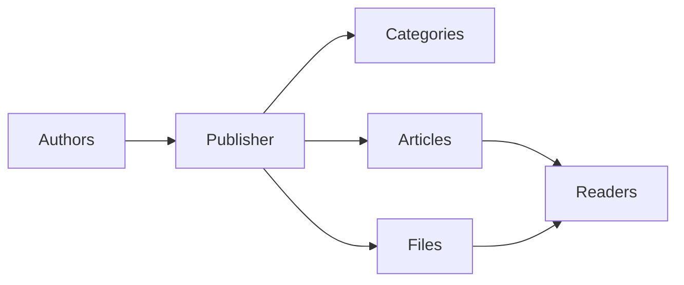
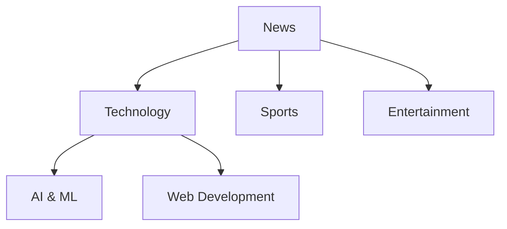
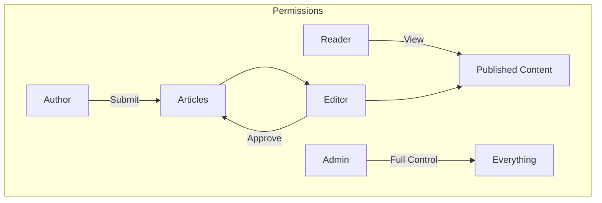
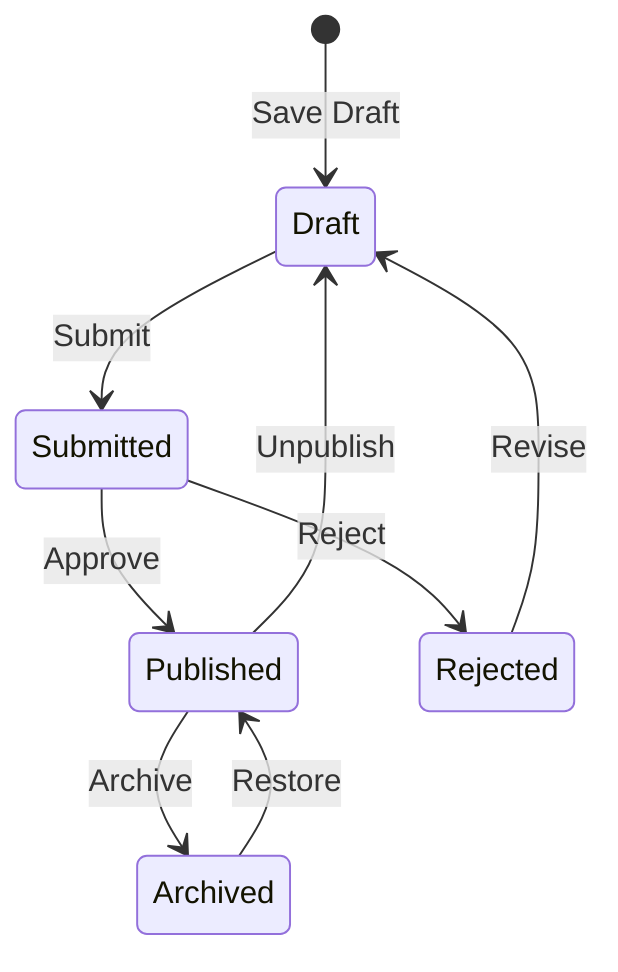

# Kezdő lépések a Publisherrel

> Útmutató lépésről lépésre a Publisher news/blog modul beállításához és használatához.

---

## Mi az a Publisher?

A Publisher a XOOPS első számú tartalomkezelő modulja, amelyet a következőkre terveztek:

- **Híroldalak** - Cikkek közzététele kategóriákkal
- **Blogok** - Személyes vagy többszerzős blogírás``
- **Dokumentáció** - Szervezett tudásbázisok
- **Tartalomportálok** - Vegyes médiatartalom



---

## Gyors beállítás

### 1. lépés: Telepítse a Publisher alkalmazást

1. Letöltés a [GitHub](https://github.com/XOOPSmodules25x/publisher) webhelyről
2. Feltöltés a `modules/publisher/` címre
3. Válassza az Adminisztráció → modulok → Telepítés menüpontot

### 2. lépés: Hozzon létre kategóriákat



1. Adminisztráció → Kiadó → Kategóriák
2. Kattintson a "Kategória hozzáadása" gombra.
3. Töltse ki:
   - **Név**: Kategória neve
   - **Leírás**: Mit tartalmaz ez a kategória
   - **Kép**: Opcionális kategóriakép
4. Állítsa be az engedélyeket (ki tudja submit/view)
5. Mentés

### 3. lépés: Beállítások konfigurálása

1. Adminisztráció → Kiadó → Beállítások
2. Konfigurálandó kulcsbeállítások:

| Beállítás | Ajánlott | Leírás |
|---------|-------------|--------------|
| Elemek oldalanként | 10-20 | Cikkek az indexen |
| Szerkesztő | TinyMCE/CKEditor | Gazdag szövegszerkesztő |
| Értékelések engedélyezése | Igen | Olvasói visszajelzés |
| Megjegyzések engedélyezése | Igen | Megbeszélések |
| Automatikus jóváhagyás | Nem | Szerkesztői ellenőrzés |

### 4. lépés: Készítse el első cikkét

1. Főmenü → Kiadó → Cikk beküldése
2. Töltse ki az űrlapot:
   - **Cím**: Cikk címe
   - **Kategória**: Ahová tartozik
   - **Összefoglaló**: Rövid leírás
   - **Body**: A cikk teljes tartalma
3. Opcionális elemek hozzáadása:
   - Kiemelt kép
   - Fájlmellékletek
   - SEO beállítások
4. Küldje be felülvizsgálatra vagy tegye közzé

---

## Felhasználói szerepkörök



### Olvasó
- Megtekintheti a megjelent cikkeket
- Értékelje és kommentálja
- Keresés a tartalomban

### Szerző
- Új cikkek beküldése
- Saját cikkek szerkesztése
- Fájlok csatolása

### Szerkesztő
- Approve/reject beadványok
- Szerkesszen bármilyen cikket
- Kategóriák kezelése

### Rendszergazda
- Teljes modulvezérlés
- Beállítások konfigurálása
- Engedélyek kezelése

---

## Cikkek írása

### Cikkszerkesztő

```
┌─────────────────────────────────────────────────────┐
│ Title: [Your Article Title                        ] │
├─────────────────────────────────────────────────────┤
│ Category: [Select Category          ▼]              │
├─────────────────────────────────────────────────────┤
│ Summary:                                            │
│ ┌─────────────────────────────────────────────────┐ │
│ │ Brief description shown in listings...          │ │
│ └─────────────────────────────────────────────────┘ │
├─────────────────────────────────────────────────────┤
│ Body:                                               │
│ ┌─────────────────────────────────────────────────┐ │
│ │ [B] [I] [U] [Link] [Image] [Code]               │ │
│ ├─────────────────────────────────────────────────┤ │
│ │                                                  │ │
│ │ Full article content goes here...               │ │
│ │                                                  │ │
│ └─────────────────────────────────────────────────┘ │
├─────────────────────────────────────────────────────┤
│ [Submit] [Preview] [Save Draft]                     │
└─────────────────────────────────────────────────────┘
```

### Bevált gyakorlatok

1. **Lenyűgöző címek** – Világos, megnyerő címsorok
2. **Jó összefoglalók** - Kattintásra csábítsa az olvasókat
3. **Strukturált tartalom** - Használjon címsorokat, listákat, képeket
4. **Megfelelő kategorizálás** – Segítsen az olvasóknak tartalmat találni
5. **SEO optimalizálás** - Kulcsszavak a címben és a tartalomban

---

## Tartalomkezelés

### Cikk állapotának folyamata



### Állapotleírások

| Állapot | Leírás |
|--------|--------------|
| Tervezet | Folyamatban lévő munka |
| Beküldve | Felülvizsgálatra vár |
| Megjelent | Élőben a helyszínen |
| Lejárt | Lejárati dátum |
| Elutasítva | Felülvizsgálatra szorul |
| Archivált | Eltávolítva a listákról |

---

## Navigáció

### Hozzáférés a Publisherhez

- **Főmenü** → Kiadó
- **Közvetlen URL**: `yoursite.com/modules/publisher/`

### Kulcsoldalak

| oldal | URL | Cél |
|------|-----|---------|
| Index | `/modules/publisher/` | Cikk listák |
| Kategória | `/modules/publisher/category.php?id=X` | Kategória cikkek |
| cikk | `/modules/publisher/item.php?itemid=X` | Egyetlen cikk |
| Beküldés | `/modules/publisher/submit.php` | Új cikk |
| Keresés | `/modules/publisher/search.php` | Cikkek keresése |

---

## Blokkok

A Publisher több blokkot biztosít az Ön webhelyéhez:

### Legutóbbi cikkek
Megjeleníti a legutóbb megjelent cikkeket

### Kategória menü
Navigáció kategória szerint

### Népszerű cikkek
Legtöbbször nézett tartalom

### Véletlenszerű cikk
Véletlenszerű tartalom megjelenítése

### Reflektorfény
Kiemelt cikkek

---

## Kapcsolódó dokumentáció

- Cikkek készítése és szerkesztése
- Kategóriák kezelése
- Kiadó kiterjesztése

---

#xoops #kiadó #felhasználói útmutató #első lépések #cms
