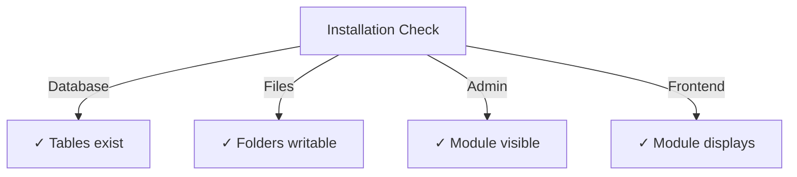

# Kiadói telepítési útmutató

> Teljes utasítások a Publisher modul telepítéséhez és konfigurálásához XOOPS CMS.

---

## Rendszerkövetelmények

### Minimális követelmények

| Követelmény | Verzió | Megjegyzések |
|-------------|---------|-------|
| XOOPS | 2.5.10+ | Core CMS platform |
| PHP | 7,1+ | PHP 8.x ajánlott |
| MySQL | 5,7+ | Adatbázis szerver |
| Webszerver | Apache/Nginx | Átírási támogatással |

### PHP bővítmények

```
- PDO (PHP Data Objects)
- pdo_mysql or mysqli
- mb_string (multibyte strings)
- curl (for external content)
- json
- gd (image processing)
```

### Lemezterület

- **modulfájlok**: ~5 MB
- **Gyorsítótár-könyvtár**: 50+ MB ajánlott
- **Feltöltési könyvtár**: A tartalomhoz szükséges

---

## Telepítés előtti ellenőrzőlista

A Publisher telepítése előtt ellenőrizze:

- [ ] A XOOPS mag telepítve van és fut
- [ ] A rendszergazdai fiók modulkezelési engedélyekkel rendelkezik
- [ ] Adatbázis biztonsági mentése létrehozva
- [ ] A fájlengedélyek írási hozzáférést tesznek lehetővé a `/modules/` könyvtárhoz
- [ ] A PHP memóriakorlát legalább 128 MB
- [ ] A fájl feltöltési méretkorlátozása megfelelő (minimum 10 MB)

---

## Telepítési lépések

### 1. lépés: A Publisher letöltése

#### A lehetőség: a GitHubból (ajánlott)

```bash
# Navigate to modules directory
cd /path/to/xoops/htdocs/modules/

# Clone the repository
git clone https://github.com/XoopsModules25x/publisher.git

# Verify download
ls -la publisher/
```

#### B lehetőség: Kézi letöltés

1. Keresse fel a [GitHub Publisher Releases](https://github.com/XOOPSmodules25x/publisher/releases) oldalt
2. Töltse le a legújabb `.zip` fájlt
3. Kivonat a `modules/publisher/`-ba

### 2. lépés: Állítsa be a fájlengedélyeket

```bash
# Set proper ownership
chown -R www-data:www-data /path/to/xoops/htdocs/modules/publisher

# Set directory permissions (755)
find publisher -type d -exec chmod 755 {} \;

# Set file permissions (644)
find publisher -type f -exec chmod 644 {} \;

# Make scripts executable
chmod 755 publisher/admin/index.php
chmod 755 publisher/index.php
```

### 3. lépés: Telepítés a XOOPS Admin segítségével

1. Jelentkezzen be a **XOOPS Admin Panel** oldalra rendszergazdaként
2. Lépjen a **Rendszer → modulok** elemre.
3. Kattintson a **modul telepítése** lehetőségre.
4. Keresse meg a **Kiadó** elemet a listában
5. Kattintson a **Telepítés** gombra
6. Várja meg, amíg a telepítés befejeződik (megjeleníti a létrehozott adatbázistáblákat)

```
Installation Progress:
✓ Tables created
✓ Configuration initialized
✓ Permissions set
✓ Cache cleared
Installation Complete!
```

---

## Kezdeti beállítás

### 1. lépés: A Publisher Admin elérése

1. Lépjen az **Felügyeleti panel → modulok** elemre.
2. Keresse meg a **Publisher** modult
3. Kattintson az **Adminisztráció** hivatkozásra
4. Ön most a Kiadói adminisztrációban van

### 2. lépés: Konfigurálja a modulbeállításokat

1. Kattintson a **Preferences** lehetőségre a bal oldali menüben
2. Konfigurálja az alapvető beállításokat:

```
General Settings:
- Editor: Select your WYSIWYG editor
- Items per page: 10
- Show breadcrumb: Yes
- Allow comments: Yes
- Allow ratings: Yes

SEO Settings:
- SEO URLs: No (enable later if needed)
- URL rewriting: None

Upload Settings:
- Max upload size: 5 MB
- Allowed file types: jpg, png, gif, pdf, doc, docx
```

3. Kattintson a **Beállítások mentése** gombra.

### 3. lépés: Első kategória létrehozása

1. Kattintson a **Kategóriák** elemre a bal oldali menüben
2. Kattintson a **Kategória hozzáadása** lehetőségre.
3. Töltse ki az űrlapot:

```
Category Name: News
Description: Latest news and updates
Image: (optional) Upload category image
Parent Category: (leave blank for top-level)
Status: Enabled
```

4. Kattintson a **Kategória mentése** lehetőségre.

### 4. lépés: Ellenőrizze a telepítést

Ellenőrizze ezeket a mutatókat:



#### Adatbázis ellenőrzése

```bash
mysql -u xoops_user -p xoops_database
mysql> SHOW TABLES LIKE 'publisher%';

# Should show tables:
# - publisher_categories
# - publisher_items
# - publisher_comments
# - publisher_files
```

#### Front-End Check

1. Látogassa meg XOOPS kezdőlapját
2. Keresse meg a **Kiadó** vagy **Hírek** blokkot
3. Meg kell jelenítenie a legutóbbi cikkeket

---

## Konfiguráció a telepítés után

### Szerkesztő kiválasztása

A Publisher több WYSIWYG szerkesztőt is támogat:

| Szerkesztő | Előnyök | Hátrányok |
|--------|-------|------|
| FCKeditor | Funkciókban gazdag | Régebbi, nagyobb |
| CKEditor | Modern szabvány | A konfiguráció bonyolultsága |
| TinyMCE | Könnyű | Korlátozott funkciók |
| DHTML Szerkesztő | Alapvető | Nagyon alap |

**A szerkesztő módosítása:**

1. Nyissa meg a **Beállítások**
2. Görgessen a **Szerkesztő** beállításhoz
3. Válassza a legördülő menüből
4. Mentse el és tesztelje

### Címtárbeállítás feltöltése

```bash
# Create upload directories
mkdir -p /path/to/xoops/uploads/publisher/
mkdir -p /path/to/xoops/uploads/publisher/categories/
mkdir -p /path/to/xoops/uploads/publisher/images/
mkdir -p /path/to/xoops/uploads/publisher/files/

# Set permissions
chmod 755 /path/to/xoops/uploads/publisher/
chmod 755 /path/to/xoops/uploads/publisher/*
```

### Képméretek konfigurálása

A Beállításokban állítsa be a miniatűrök méretét:

```
Category image size: 300 x 200 px
Article image size: 600 x 400 px
Thumbnail size: 150 x 100 px
```

---

## Telepítés utáni lépések

### 1. Állítsa be a csoportjogosultságokat

1. Lépjen a **Engedélyek** részre az adminisztrációs menüben
2. A csoportok hozzáférésének konfigurálása:
   - Névtelen: Csak megtekintés
   - Regisztrált felhasználók: Cikkek beküldése
   - Szerkesztők: Approve/edit cikkek
   - Adminisztrátorok: Teljes hozzáférés

### 2. Konfigurálja a modul láthatóságát

1. Lépjen a **Blocks** részhez a XOOPS adminisztrátorban
2. Keresse meg a megjelenítői blokkokat:
   - Kiadó - Legújabb cikkek
   - Kiadó - Kategóriák
   - Kiadó - Archívum
3. Állítsa be a blokk láthatóságát oldalanként

### 3. Teszttartalom importálása (opcionális)

Tesztelés céljából importáljon mintacikkeket:

1. Lépjen a **Megjelenítői rendszergazda → Importálás** lehetőségre.
2. Válassza a **Mintatartalom** lehetőséget
3. Kattintson az **Importálás** gombra.

### 4. SEO URL-ek engedélyezése (opcionális)

Keresőbarát URL-ek esetén:

1. Nyissa meg a **Beállítások**
2. Állítsa be a **SEO URL-eket**: Igen
3. Engedélyezze a **.htaccess** átírást
4. Ellenőrizze, hogy a `.htaccess` fájl létezik-e a Publisher mappában

```apache
# .htaccess example
<IfModule mod_rewrite.c>
    RewriteEngine On
    RewriteBase /modules/publisher/
    RewriteRule ^category/([0-9]+)-(.*)\.html$ index.php?op=showcategory&categoryid=$1 [L]
    RewriteRule ^article/([0-9]+)-(.*)\.html$ index.php?op=showitem&itemid=$1 [L]
</IfModule>
```

---

## Telepítési hibaelhárítás

### Probléma: A modul nem jelenik meg az adminisztrációban

**Megoldás:**
```bash
# Check file permissions
ls -la /path/to/xoops/modules/publisher/

# Check xoops_version.php exists
ls /path/to/xoops/modules/publisher/xoops_version.php

# Verify PHP syntax
php -l /path/to/xoops/modules/publisher/xoops_version.php
```

### Probléma: Az adatbázistáblák nem jöttek létre**Megoldás:**
1. Ellenőrizze, hogy a MySQL felhasználó rendelkezik CREATE TABLE jogosultsággal
2. Ellenőrizze az adatbázis hibanaplóját:
   
   ```bash
   mysql> SHOW WARNINGS;
   ```
3. SQL manuális importálása:
   
   ```bash
   mysql -u user -p database < modules/publisher/sql/mysql.sql
   ```

### Probléma: A fájl feltöltése sikertelen

**Megoldás:**
```bash
# Check directory exists and is writable
stat /path/to/xoops/uploads/publisher/

# Fix permissions
chmod 777 /path/to/xoops/uploads/publisher/

# Verify PHP settings
php -i | grep upload_max_filesize
```

### Probléma: "Az oldal nem található" hibák

**Megoldás:**
1. Ellenőrizze, hogy van-e `.htaccess` fájl
2. Ellenőrizze, hogy az Apache `mod_rewrite` engedélyezve van:
   
   ```bash
   a2enmod rewrite
   systemctl restart apache2
   ```
3. Ellenőrizze a `AllowOverride All` elemet az Apache konfigurációjában

---

## Frissítés az előző verziókról

### A Publisher 1.x-től a 2.x-ig

1. **Tartalék jelenlegi telepítés:**
   
   ```bash
   cp -r modules/publisher/ modules/publisher-backup/
   mysqldump -u user -p database > publisher-backup.sql
   ```

2. **A Publisher 2.x letöltése**

3. **Fájlok felülírása:**
   
   ```bash
   rm -rf modules/publisher/
   unzip publisher-2.0.zip -d modules/
   ```

4. **Frissítés futtatása:**
   - Lépjen az **Adminisztráció → Kiadó → Frissítés** menüpontra.
   - Kattintson az **Adatbázis frissítése** lehetőségre
   - Várd meg a befejezést

5. **Ellenőrzés:**
   - Ellenőrizze, hogy minden cikk megfelelően jelenik-e meg
   - Ellenőrizze, hogy az engedélyek sértetlenek-e
   - Tesztelje a fájlfeltöltéseket

---

## Biztonsági szempontok

### Fájlengedélyek

```
- Core files: 644 (readable by web server)
- Directories: 755 (browseable by web server)
- Upload directories: 755 or 777
- Config files: 600 (not readable by web)
```

### Az érzékeny fájlokhoz való közvetlen hozzáférés letiltása

`.htaccess` létrehozása a feltöltési könyvtárakban:

```apache
<FilesMatch "\.(php|phtml|php3|php4|php5|phtml)$">
    Deny from all
</FilesMatch>
```

### Adatbázis biztonság

```bash
# Use strong password
ALTER USER 'publisher_user'@'localhost' IDENTIFIED BY 'strong_password_here';

# Grant minimal permissions
GRANT SELECT, INSERT, UPDATE, DELETE ON publisher_db.* TO 'publisher_user'@'localhost';
FLUSH PRIVILEGES;
```

---

## Ellenőrző lista

A telepítés után ellenőrizze:

- [ ] A modul megjelenik az adminisztrációs modulok listájában
- [ ] Hozzáférhet a Publisher adminisztrátori részéhez
- [ ] Kategóriákat hozhat létre
- [ ] Létrehozhat cikkeket
- [ ] A cikkek a kezelőfelületen jelennek meg
- [ ] A fájlfeltöltés működik
- [ ] A képek megfelelően jelennek meg
- [ ] Az engedélyek megfelelően vannak alkalmazva
- [ ] Adatbázis táblák létrehozva
- [ ] A gyorsítótár-könyvtár írható

---

## Következő lépések

Sikeres telepítés után:

1. Olvassa el az Alapvető konfigurációs útmutatót
2. Hozd létre az első cikket
3. Állítsa be a csoportengedélyeket
4. Tekintse át a kategóriakezelést

---

## Támogatás és források

- **GitHub-problémák**: [Kiadói problémák](https://github.com/XOOPSmodules25x/publisher/issues)
- **XOOPS fórum**: [Közösségi támogatás](https://www.xoops.org/modules/newbb/)
- **GitHub Wiki**: [Telepítési súgó](https://github.com/XOOPSmodules25x/publisher/wiki)

---

#kiadó #telepítés #beállítás #xoops #modul #konfiguráció
