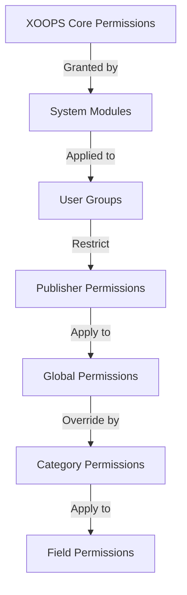

# Kiadói engedélyek beállítása

> Teljes útmutató a csoportengedélyek konfigurálásához, a hozzáférés-vezérléshez és a felhasználói hozzáférés kezeléséhez a Publisherben.

---

## Az engedély alapjai

### Mik azok az engedélyek?

Az engedélyek szabályozzák, hogy a különböző felhasználói csoportok mit tehetnek a Publisherben:

```
Who can:
  - View articles
  - Submit articles
  - Edit articles
  - Approve articles
  - Manage categories
  - Configure settings
```

### Engedélyszintek

```
Anonymous
  └── View published articles only

Registered Users
  ├── View articles
  ├── Submit articles (pending approval)
  └── Edit own articles

Editors/Moderators
  ├── All registered permissions
  ├── Approve articles
  ├── Edit all articles
  └── Manage some categories

Administrators
  └── Full access to everything
```

---

## Hozzáférési engedélyek kezelése

### Lépjen az Engedélyek oldalra

```
Admin Panel
└── Modules
    └── Publisher
        ├── Permissions
        ├── Category Permissions
        └── Group Management
```

### Gyors hozzáférés

1. Jelentkezzen be **Rendszergazdaként**
2. Lépjen az **Adminisztráció → modulok** elemre.
3. Kattintson a **Kiadó → Adminisztráció** lehetőségre.
4. Kattintson az **Engedélyek** elemre a bal oldali menüben

---

## Globális engedélyek

### modulszintű engedélyek

A Publisher modulhoz és a funkciókhoz való hozzáférés szabályozása:

```
Permissions configuration view:
┌─────────────────────────────────────┐
│ Permission             │ Anon │ Reg │ Editor │ Admin │
├────────────────────────┼──────┼─────┼────────┼───────┤
│ View articles          │  ✓   │  ✓  │   ✓    │  ✓   │
│ Submit articles        │  ✗   │  ✓  │   ✓    │  ✓   │
│ Edit own articles      │  ✗   │  ✓  │   ✓    │  ✓   │
│ Edit all articles      │  ✗   │  ✗  │   ✓    │  ✓   │
│ Approve articles       │  ✗   │  ✗  │   ✓    │  ✓   │
│ Manage categories      │  ✗   │  ✗  │   ✗    │  ✓   │
│ Access admin panel     │  ✗   │  ✗  │   ✓    │  ✓   │
└─────────────────────────────────────┘
```

### Engedélyek leírása

| Engedély | Felhasználók | Hatás |
|------------|-------|--------|
| **Cikkek megtekintése** | Minden csoport | Megtekintheti a kezelőfelületen megjelent cikkeket |
| **Cikkek beküldése** | Regisztrált+ | Új cikkeket hozhat létre (jóváhagyásra vár) |
| **Saját cikkek szerkesztése** | Regisztrált+ | Lehet edit/delete saját cikkeket |
| **Az összes cikk szerkesztése** | Szerkesztők+ | Bármely felhasználó cikkét szerkesztheti |
| **Saját cikkek törlése** | Regisztrált+ | Törölhetik saját kiadatlan cikkeiket |
| **Az összes cikk törlése** | Szerkesztők+ | Bármilyen cikket törölhet |
| **Cikkek jóváhagyása** | Szerkesztők+ | Megjelenthet függőben lévő cikkeket |
| **Kategóriák kezelése** | Adminok | Kategóriák létrehozása, szerkesztése, törlése |
| **Adminisztrátori hozzáférés** | Szerkesztők+ | Adminisztrációs felület elérése |

---

## Globális engedélyek konfigurálása

### 1. lépés: Hozzáférés az engedélybeállításokhoz

1. Lépjen az **Adminisztráció → modulok** menüpontra.
2. Keresse meg a **Kiadó**
3. Kattintson az **Engedélyek** lehetőségre (vagy az Adminisztrációs hivatkozásra, majd az Engedélyek elemre).
4. Engedélymátrixot lát

### 2. lépés: Csoportengedélyek beállítása

Minden csoportnál állítsa be, hogy mit tehetnek:

#### Névtelen felhasználók

```yaml
Anonymous Group Permissions:
  View articles: ✓ YES
  Submit articles: ✗ NO
  Edit articles: ✗ NO
  Delete articles: ✗ NO
  Approve articles: ✗ NO
  Manage categories: ✗ NO
  Admin access: ✗ NO

Result: Anonymous users can only view published content
```

#### Regisztrált felhasználók

```yaml
Registered Group Permissions:
  View articles: ✓ YES
  Submit articles: ✓ YES (with approval required)
  Edit own articles: ✓ YES
  Edit all articles: ✗ NO
  Delete own articles: ✓ YES (drafts only)
  Delete all articles: ✗ NO
  Approve articles: ✗ NO
  Manage categories: ✗ NO
  Admin access: ✗ NO

Result: Registered users can contribute content after approval
```

#### Szerkesztők csoportja

```yaml
Editors Group Permissions:
  View articles: ✓ YES
  Submit articles: ✓ YES
  Edit own articles: ✓ YES
  Edit all articles: ✓ YES
  Delete own articles: ✓ YES
  Delete all articles: ✓ YES
  Approve articles: ✓ YES
  Manage categories: ✓ LIMITED
  Admin access: ✓ YES
  Configure settings: ✗ NO

Result: Editors manage content but not settings
```

#### Rendszergazdák

```yaml
Admins Group Permissions:
  ✓ FULL ACCESS to all features

  - All editor permissions
  - Manage all categories
  - Configure all settings
  - Manage permissions
  - Install/uninstall
```

### 3. lépés: Mentse el az engedélyeket

1. Konfigurálja az egyes csoportok engedélyeit
2. Jelölje be az engedélyezett műveletek jelölőnégyzeteit
3. Törölje a jelölést az elutasított műveletek jelölőnégyzetéből
4. Kattintson az **Engedélyek mentése** lehetőségre.
5. Megjelenik a megerősítő üzenet

---

## Kategória szintű engedélyek

### Kategória hozzáférés beállítása

Szabályozhatja, hogy ki view/submit bizonyos kategóriákba:

```
Admin → Publisher → Categories
→ Select category → Permissions
```

### Kategória engedélymátrix

```
                 Anonymous  Registered  Editor  Admin
View category        ✓         ✓         ✓       ✓
Submit to category   ✗         ✓         ✓       ✓
Edit own in category ✗         ✓         ✓       ✓
Edit all in category ✗         ✗         ✓       ✓
Approve in category  ✗         ✗         ✓       ✓
Manage category      ✗         ✗         ✗       ✓
```

### Kategóriaengedélyek konfigurálása

1. Lépjen a **Kategóriák** adminisztrátor oldalra
2. Keresse meg a kategóriát
3. Kattintson az **Engedélyek** gombra
4. Minden csoporthoz válassza ki a következőket:
   - [ ] Kategória megtekintése
   - [ ] Cikkek beküldése
   - [ ] Saját cikkek szerkesztése
   - [ ] Az összes cikk szerkesztése
   - [ ] Cikkek jóváhagyása
   - [ ] Kategória kezelése
5. Kattintson a **Mentés** gombra.

### Példák a kategória engedélyére

#### Nyilvános hírek kategória

```
Anonymous: View only
Registered: View + Submit (pending approval)
Editors: Approve + Edit
Admins: Full control
```

#### Belső frissítések kategória

```
Anonymous: No access
Registered: View only
Editors: Submit + Approve
Admins: Full control
```

#### Vendégblog kategória

```
Anonymous: View only
Registered: Submit (pending approval)
Editors: Approve
Admins: Full control
```

---

## Mezőszintű engedélyek

### Vezérlőlap mező láthatósága

Korlátozza, hogy a felhasználók mely űrlapmezőket használhatják see/edit:

```
Admin → Publisher → Permissions → Fields
```

### Mezőbeállítások

```yaml
Visible Fields for Registered Users:
  ✓ Title
  ✓ Description
  ✓ Content (body)
  ✓ Featured image
  ✓ Category
  ✓ Tags
  ✗ Author (auto-set)
  ✗ Publication date (editors only)
  ✗ Scheduled date (editors only)
  ✗ Featured flag (editors only)
  ✗ Permissions (admins only)
```

### Példák

#### Korlátozott beadás a regisztrált felhasználók számára

A regisztrált felhasználók kevesebb lehetőséget látnak:

```
Available fields:
  - Title ✓
  - Description ✓
  - Content ✓
  - Featured image ✓
  - Category ✓

Hidden fields:
  - Author (auto-current user)
  - Publication date (editors decide)
  - Scheduled date (admins only)
  - Featured status (editors choose)
```

#### Teljes űrlap szerkesztőknek

A szerkesztők az összes lehetőséget látják:

```
Available fields:
  - All basic fields
  - All metadata
  - Author selection ✓
  - Publication date/time ✓
  - Scheduled date ✓
  - Featured status ✓
  - Expiration date ✓
  - Permissions ✓
```

---

## Felhasználói csoport konfigurációja

### Egyéni csoport létrehozása

1. Lépjen az **Adminisztrálás → Felhasználók → Csoportok** menüpontra.
2. Kattintson a **Csoport létrehozása** lehetőségre.
3. Adja meg a csoport adatait:

```
Group Name: "Community Bloggers"
Group Description: "Users who contribute blog content"
Type: Regular group
```

4. Kattintson a **Csoport mentése** gombra.
5. Lépjen vissza a Kiadói engedélyekhez
6. Állítsa be az engedélyeket az új csoporthoz

### Csoportpéldák

```
Suggested Groups for Publisher:

Group: Contributors
  - Regular members who submit articles
  - Can edit own articles
  - Cannot approve articles

Group: Reviewers
  - Can see submitted articles
  - Can approve/reject articles
  - Cannot delete others' articles

Group: Editors
  - Can edit any article
  - Can approve articles
  - Can moderate comments
  - Can manage some categories

Group: Publishers
  - Can edit any article
  - Can publish directly (no approval)
  - Can manage all categories
  - Can configure settings
```

---

## Engedélyhierarchiák

### Engedélyfolyamat



### Engedély öröklése

```
Base: Global module permissions
  ↓
Category: Overrides for specific categories
  ↓
Field: Further restricts available fields
  ↓
User: Has permission if ALL levels allow
```

**Példa:**

```
User wants to edit article:
1. User group must have "edit articles" permission (global)
2. Category must allow editing (category level)
3. Field restrictions must allow (if applicable)
4. User must be author OR editor (for own vs all)

If ANY level denies → Permission denied
```

---

## Munkafolyamat-engedélyek jóváhagyása

### Beküldés jóváhagyásának konfigurálása

Szabályozza, hogy a cikkeknek szükségük van-e jóváhagyásra:

```
Admin → Publisher → Preferences → Workflow
```

#### Jóváhagyási lehetőségek

```yaml
Submission Workflow:
  Require Approval: Yes

  For Registered Users:
    - New articles: Draft (pending approval)
    - Editors must approve
    - User can edit while pending
    - After approval: User can still edit

  For Editors:
    - New articles: Publish directly (optional)
    - Skip approval queue
    - Or always require approval
```

#### Konfigurálás csoportonként

1. Lépjen a Beállítások oldalra
2. Keresse meg a "Beküldési munkafolyamat" elemet
3. Minden csoporthoz állítsa be:

```
Group: Registered Users
  Require approval: ✓ YES
  Default status: Draft
  Can modify while pending: ✓ YES

Group: Editors
  Require approval: ✗ NO
  Default status: Published
  Can modify published: ✓ YES
```

4. Kattintson a **Mentés** gombra.

---

## Cikkek moderálása

### Függőben lévő cikkek jóváhagyása

A "cikkek jóváhagyása" engedéllyel rendelkező felhasználók számára:

1. Lépjen az **Adminisztrálás → Kiadó → Cikkek** oldalra.
2. Szűrés **Állapot** szerint: Függőben
3. Kattintson a cikkre az áttekintéshez
4. Ellenőrizze a tartalom minőségét
5. Állítsa be az **Állapot**: Közzétéve
6. Nem kötelező: Adjon hozzá szerkesztői megjegyzéseket
7. Kattintson a **Mentés** gombra.### Cikkek elutasítása

Ha a cikk nem felel meg a szabványoknak:

1. Cikk megnyitása
2. Állítsa be az **Állapot**: Vázlat
3. Adja meg az elutasítás okát (kommentben vagy e-mailben)
4. Kattintson a **Mentés** gombra.
5. Üzenet küldése a szerzőnek az elutasítás magyarázatával

### Mérsékelt megjegyzések

Kommentek moderálása esetén:

1. Lépjen az **Adminisztráció → Kiadó → Megjegyzések** menüpontra.
2. Szűrés **Állapot** szerint: Függőben
3. Tekintse át a megjegyzést
4. Opciók:
   - Jóváhagyás: Kattintson a **Jóváhagyás** gombra
   - Elutasítás: Kattintson a **Törlés** gombra
   - Szerkesztés: Kattintson a **Szerkesztés**, javítás, mentés gombra
5. Kattintson a **Mentés** gombra.

---

## Felhasználói hozzáférés kezelése

### Felhasználói csoportok megtekintése

Nézze meg, mely felhasználók tartoznak csoportokhoz:

```
Admin → Users → User Groups

For each user:
  - Primary group (one)
  - Secondary groups (multiple)

Permissions apply from all groups (union)
```

### Felhasználó hozzáadása a csoporthoz

1. Lépjen az **Adminisztráció → Felhasználók** menüpontra.
2. Felhasználó keresése
3. Kattintson a **Szerkesztés** gombra.
4. A **Csoportok** alatt jelölje be a hozzáadni kívánt csoportokat
5. Kattintson a **Mentés** gombra.

### Felhasználói engedélyek módosítása

Egyéni felhasználók számára (ha támogatott):

1. Lépjen a Felhasználói adminisztráció oldalra
2. Felhasználó keresése
3. Kattintson a **Szerkesztés** gombra.
4. Keresse meg az egyéni engedélyek felülbírálását
5. Szükség szerint konfigurálja
6. Kattintson a **Mentés** gombra.

---

## Általános engedélyezési forgatókönyvek

### 1. forgatókönyv: Nyissa meg a Blogot

Bárki beküldheti:

```
Anonymous: View
Registered: Submit, edit own, delete own
Editors: Approve, edit all, delete all
Admins: Full control

Result: Open community blog
```

### 2. forgatókönyv: Moderált híroldal

Szigorú jóváhagyási eljárás:

```
Anonymous: View only
Registered: Cannot submit
Editors: Submit, approve others
Admins: Full control

Result: Only approved professionals publish
```

### 3. forgatókönyv: A személyzet blogja

Az alkalmazottak hozzájárulhatnak:

```
Create group: "Staff"
Anonymous: View
Registered: View only (non-staff)
Staff: Submit, edit own, publish directly
Admins: Full control

Result: Staff-authored blog
```

### 4. forgatókönyv: Több kategória különböző szerkesztőkkel

Különböző szerkesztők a különböző kategóriákhoz:

```
News category:
  Editors group A: Full control

Reviews category:
  Editors group B: Full control

Tutorials category:
  Editors group C: Full control

Result: Decentralized editorial control
```

---

## Engedélyteszt

### Az engedélyek ellenőrzése működik

1. Hozzon létre tesztfelhasználót minden csoportban
2. Jelentkezzen be minden tesztfelhasználóként
3. Próbáld meg:
   - Cikkek megtekintése
   - Cikk beküldése (ha megengedett, vázlatot kell készíteni)
   - Cikk szerkesztése (saját és mások)
   - Cikk törlése
   - Hozzáférés az adminisztrációs panelhez
   - Hozzáférési kategóriák

4. Ellenőrizze, hogy az eredmények megegyeznek-e a várt engedélyekkel

### Gyakori tesztesetek

```
Test Case 1: Anonymous user
  [ ] Can view published articles: ✓
  [ ] Cannot submit articles: ✓
  [ ] Cannot access admin: ✓

Test Case 2: Registered user
  [ ] Can submit articles: ✓
  [ ] Articles go to Draft: ✓
  [ ] Can edit own article: ✓
  [ ] Cannot edit others: ✓
  [ ] Cannot access admin: ✓

Test Case 3: Editor
  [ ] Can approve articles: ✓
  [ ] Can edit any article: ✓
  [ ] Can access admin: ✓
  [ ] Cannot delete all: ✓ (or ✓ if allowed)

Test Case 4: Admin
  [ ] Can do everything: ✓
```

---

## Engedélyek hibaelhárítása

### Probléma: A felhasználó nem küldhet be cikkeket

**ellenőrzés:**
```
1. User group has "submit articles" permission
   Admin → Publisher → Permissions

2. User belongs to allowed group
   Admin → Users → Edit user → Groups

3. Category allows submission from user's group
   Admin → Publisher → Categories → Permissions

4. User is registered (not anonymous)
```

**Megoldás:**
```bash
1. Verify registered user group has submission permission
2. Add user to appropriate group
3. Check category permissions
4. Clear user session cache
```

### Probléma: A szerkesztő nem tudja jóváhagyni a cikkeket

**ellenőrzés:**
```
1. Editor group has "approve articles" permission
2. Articles exist with "Pending" status
3. Editor is in correct group
4. Category allows approval from editor's group
```

**Megoldás:**
```bash
1. Go to Permissions, check "approve articles" is checked for editor group
2. Create test article, set to Draft
3. Try to approve as editor
4. Check error messages in system log
```

### Probléma: Látja a cikkeket, de nem fér hozzá a kategóriához

**ellenőrzés:**
```
1. Category is not disabled/hidden
2. Category permissions allow viewing
3. User's group is permitted to view category
4. Category is published
```

**Megoldás:**
```bash
1. Go to Categories, check category status is "Enabled"
2. Check category permissions are set
3. Add user's group to category view permission
```

### Probléma: Az engedélyek módosultak, de nem lépnek érvénybe

**Megoldás:**
```bash
1. Clear cache: Admin → Tools → Clear Cache
2. Clear session: Logout and login again
3. Check system log for errors
4. Verify permissions actually saved
5. Try different browser/incognito window
```

---

## Engedélyek biztonsági mentése és exportálása

### Exportálási engedélyek

Egyes rendszerek lehetővé teszik az exportálást:

1. Lépjen az **Adminisztrálás → Megjelenítő → Eszközök** menüpontra.
2. Kattintson az **Engedélyek exportálása** lehetőségre.
3. Mentse el a `.xml` vagy `.json` fájlt
4. Tartsa meg biztonsági másolatként

### Engedélyek importálása

Visszaállítás biztonsági másolatból:

1. Lépjen az **Adminisztrálás → Megjelenítő → Eszközök** menüpontra.
2. Kattintson az **Engedélyek importálása** lehetőségre.
3. Válassza ki a biztonsági másolat fájlt
4. Tekintse át a változtatásokat
5. Kattintson az **Importálás** gombra.

---

## Bevált gyakorlatok

### Engedélykonfigurációs ellenőrzőlista

- [ ] Döntse el a felhasználói csoportokat
- [ ] Rendeljen világos neveket a csoportokhoz
- [ ] Alapengedélyek beállítása minden csoporthoz
- [ ] Tesztelje az egyes engedélyszinteket
- [ ] Dokumentumengedély-struktúra
- [ ] Jóváhagyási munkafolyamat létrehozása
- [ ] A szerkesztők képzése a moderálásról
- [ ] Az engedélyhasználat figyelése
- [ ] Az engedélyeket negyedévente tekintse át
- [ ] Biztonsági mentési engedély beállításai

### Bevált biztonsági gyakorlatok

```
✓ Principle of Least Privilege
  - Grant minimum necessary permissions

✓ Role-Based Access
  - Use groups for roles (editor, moderator, etc)

✓ Audit Permissions
  - Review who has what access

✓ Separate Duties
  - Submitter, approver, publisher are different

✓ Regular Review
  - Check permissions quarterly
  - Remove access when users leave
  - Update for new requirements
```

---

## Kapcsolódó útmutatók

- Cikkek készítése
- Kategóriák kezelése
- Alapkonfiguráció
- Telepítés

---

## Következő lépések

- Állítson be engedélyeket a munkafolyamatához
- Cikkeket hozhat létre megfelelő jogosultságokkal
- Kategóriák konfigurálása engedélyekkel
- A felhasználók képzése a cikkek létrehozására

---

#kiadó #engedélyek #csoportok #hozzáférés-szabályozás #biztonság #moderálás #xoops
