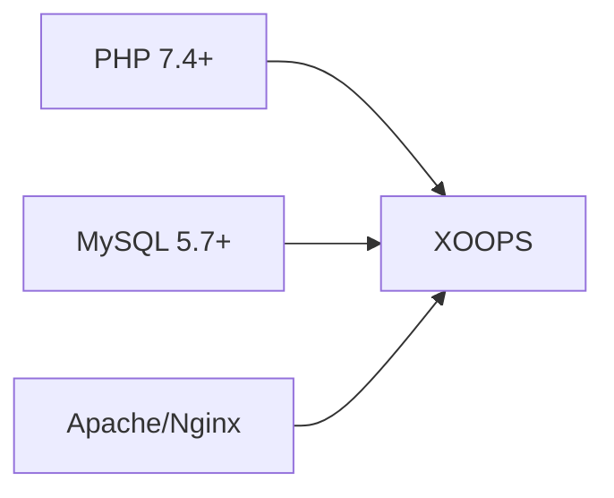
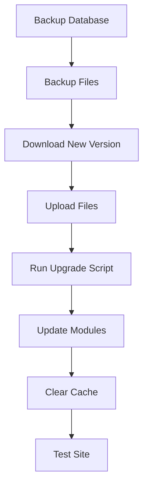

> Gyakori kérdések és válaszok a XOOPS telepítésével kapcsolatban.

---

## Előtelepítés

### K: Mik a minimális szerverkövetelmények?

**A:** XOOPS 2.5.x szükséges:
- PHP 7.4 vagy újabb (PHP 8.x ajánlott)
- MySQL 5.7+ vagy MariaDB 10.3+
- Apache mod_rewrite vagy Nginx segítségével
- Legalább 64 MB PHP memóriakorlát (128 MB+ ajánlott)



### K: Telepíthetem a XOOPS-t megosztott tárhelyre?

**V:** Igen, a XOOPS jól működik a legtöbb megosztott tárhelyen, amely megfelel a követelményeknek. Ellenőrizze, hogy a házigazda biztosítja-e:
- PHP a szükséges kiterjesztésekkel (mysqli, gd, curl, json, mbstring)
- MySQL adatbázis-hozzáférés
- Fájl feltöltési lehetőség
- .htaccess támogatás (Apache-hoz)

### K: Milyen PHP bővítményekre van szükség?

**V:** Szükséges kiterjesztések:
- `mysqli` - Adatbázis-kapcsolat
- `gd` - Képfeldolgozás
- `json` - JSON kezelés
- `mbstring` - Többbyte-os karakterlánc támogatás

Ajánlott:
- `curl` - Külső API hívások
- `zip` - modul telepítés
- `intl` - Nemzetközivé válás

---

## Telepítési folyamat

### K: A telepítővarázsló üres oldalt jelenít meg

**V:** Ez általában egy PHP hiba. Próbáld ki:

1. A hibakijelzés ideiglenes engedélyezése:
```php
// Add to htdocs/install/index.php at the top
error_reporting(E_ALL);
ini_set('display_errors', 1);
```

2. Ellenőrizze a PHP hibanaplót
3. Ellenőrizze a PHP verzió kompatibilitását
4. Győződjön meg arról, hogy az összes szükséges bővítmény be van töltve

### K: "Nem tudok írni a mainfile.php címre"

**V:** Írási engedélyek beállítása a telepítés előtt:

```bash
chmod 666 mainfile.php
# After installation, secure it:
chmod 444 mainfile.php
```

### K: Nem készülnek adatbázistáblák

**V:** Ellenőrizze:

1. A MySQL felhasználó CREATE TABLE jogosultságokkal rendelkezik:
```sql
GRANT ALL PRIVILEGES ON xoopsdb.* TO 'xoopsuser'@'localhost';
FLUSH PRIVILEGES;
```

2. Létezik adatbázis:
```sql
CREATE DATABASE xoopsdb CHARACTER SET utf8mb4 COLLATE utf8mb4_unicode_ci;
```

3. A varázsló hitelesítő adatai megegyeznek az adatbázis-beállításokkal

### K: A telepítés befejeződött, de a webhely hibákat mutat

**V:** Általános telepítés utáni javítások:

1. Távolítsa el vagy nevezze át a telepítési könyvtárat:
```bash
mv htdocs/install htdocs/install.bak
```

2. Állítsa be a megfelelő engedélyeket:
```bash
chmod -R 755 htdocs/
chmod -R 777 xoops_data/
chmod 444 mainfile.php
```

3. Gyorsítótár törlése:
```bash
rm -rf xoops_data/caches/smarty_cache/*
rm -rf xoops_data/caches/smarty_compile/*
```

---

## Konfiguráció

### K: Hol van a konfigurációs fájl?

**V:** A fő konfiguráció a `mainfile.php`-ban található a XOOPS gyökérben. Főbb beállítások:

```php
define('XOOPS_ROOT_PATH', '/path/to/htdocs');
define('XOOPS_VAR_PATH', '/path/to/xoops_data');
define('XOOPS_URL', 'https://yoursite.com');
define('XOOPS_DB_HOST', 'localhost');
define('XOOPS_DB_USER', 'username');
define('XOOPS_DB_PASS', 'password');
define('XOOPS_DB_NAME', 'database');
define('XOOPS_DB_PREFIX', 'xoops');
```

### K: Hogyan változtathatom meg a URL webhelyet?

**V:** `mainfile.php` szerkesztése:

```php
define('XOOPS_URL', 'https://newdomain.com');
```

Ezután törölje a gyorsítótárat, és frissítse az adatbázisban található hardcoded URL-eket.

### K: Hogyan helyezhetem át a XOOPS-t egy másik könyvtárba?

**A:**

1. Helyezze át a fájlokat új helyre
2. Frissítse az útvonalakat a `mainfile.php`-ban:
```php
define('XOOPS_ROOT_PATH', '/new/path/to/htdocs');
define('XOOPS_VAR_PATH', '/new/path/to/xoops_data');
```
3. Szükség esetén frissítse az adatbázist
4. Törölje az összes gyorsítótárat

---

## Frissítések

### K: Hogyan frissíthetem a XOOPS-t?

**A:**



1. **Mindenről biztonsági másolatot készítsen** (adatbázis + fájlok)
2. Töltse le az új XOOPS verziót
3. Fájlok feltöltése (ne írja felül a `mainfile.php` fájlt)
4. Futtassa a `htdocs/upgrade/` parancsot, ha van
5. Frissítse a modulokat az adminisztrációs panelen keresztül
6. Törölje az összes gyorsítótárat
7. Tesztelje alaposan

### K: Kihagyhatom a verziókat frissítéskor?

**V:** Általában nem. Frissítse egymást követően a főbb verziókon keresztül, hogy biztosítsa az adatbázis-áttelepítések megfelelő működését. A konkrét útmutatásért tekintse meg a kiadási megjegyzéseket.

### K: A moduljaim a frissítés után leálltak

**A:**

1. Ellenőrizze a modul kompatibilitását az új XOOPS verzióval
2. Frissítse a modulokat a legújabb verziókra
3. Sablonok újragenerálása: Admin → Rendszer → Karbantartás → Sablonok
4. Törölje az összes gyorsítótárat
5. Ellenőrizze a PHP hibanaplókat bizonyos hibákért

---

## Hibaelhárítás

### K: Elfelejtettem a rendszergazdai jelszót

**V:** Visszaállítás adatbázison keresztül:

```sql
-- Generate new password hash
UPDATE xoops_users
SET pass = MD5('newpassword')
WHERE uname = 'admin';
```

Vagy használja a jelszó-visszaállítási funkciót, ha az e-mail konfigurálva van.

### K: A webhely nagyon lassú a telepítés után

**A:**

1. Engedélyezze a gyorsítótárazást az Adminisztrálás → Rendszer → Beállítások menüpontban
2. Adatbázis optimalizálása:
```sql
OPTIMIZE TABLE xoops_session;
OPTIMIZE TABLE xoops_online;
```
3. Ellenőrizze a lassú lekérdezéseket hibakeresési módban
4. Engedélyezze a PHP OpCache-t

### K: Images/CSS nem töltődik be

**A:**

1. Ellenőrizze a fájlok engedélyeit (644 a fájlok, 755 a könyvtárak)
2. Ellenőrizze, hogy a `XOOPS_URL` helyes-e a `mainfile.php`-ban
3. Ellenőrizze a .htaccess fájlt, hogy nincs-e átírási ütközés
4. Vizsgálja meg a böngészőkonzolt 404-es hibákra

---

## Kapcsolódó dokumentáció- Telepítési útmutató
- Alapkonfiguráció
- A halál fehér képernyője

---

#xoops #gyak #telepítés #hibaelhárítás
