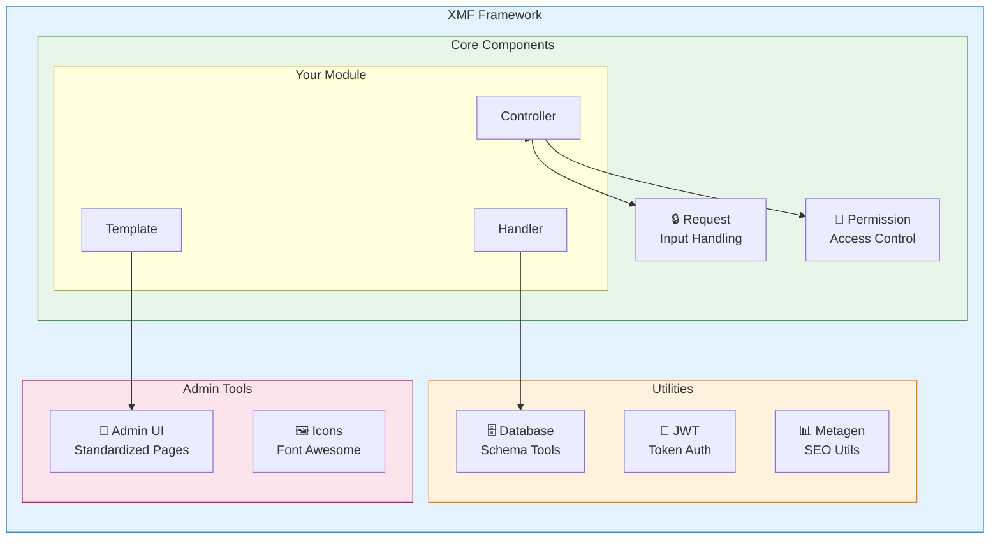
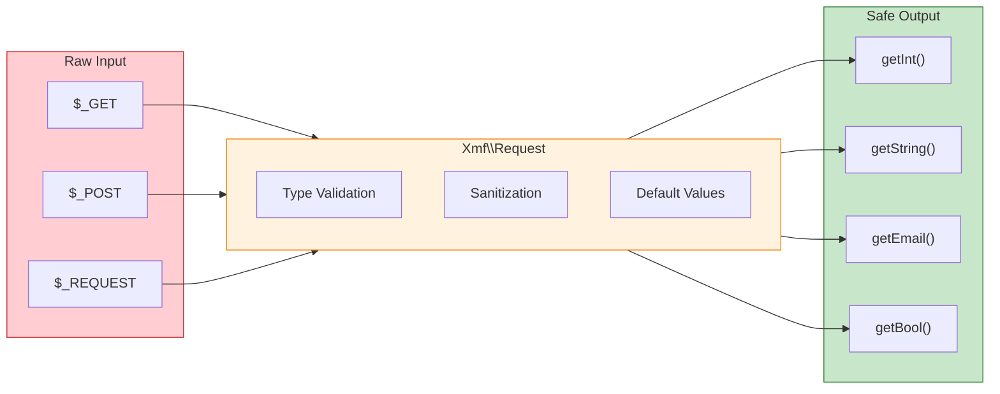

<span class="version-badge version-25x">2.5.x ✅</span> <span class="version-badge version-40x">4.0.x ✅</span>

:::tipp[A híd a modernhez XOOPS]
A XMF **mind a XOOPS 2.5.x, mind a XOOPS 4.0.x** verzióban működik. A XOOPS 4.0-ra való felkészülés során ez az ajánlott módja a modulok modernizálásának. A XMF PSR-4 automatikus betöltést, névtereket és segítőket biztosít az átmenet simítására.
:::

A **XOOPS modul Framework (XMF)** egy hatékony könyvtár, amelyet a XOOPS modulfejlesztés egyszerűsítésére és szabványosítására terveztek. A XMF modern PHP gyakorlatokat kínál, beleértve a névtereket, az automatikus betöltést és a segédosztályok átfogó készletét, amelyek csökkentik a sablonkódot és javítják a karbantarthatóságot.

## Mi az a XMF?

A XMF olyan osztályok és segédprogramok gyűjteménye, amelyek a következőket biztosítják:

- **Modern PHP támogatás** - Teljes névtér támogatás PSR-4 automatikus betöltéssel
- **Kéréskezelés** - Biztonságos beviteli ellenőrzés és fertőtlenítés
- **modulsegédek** - Egyszerűsített hozzáférés a modulkonfigurációkhoz és objektumokhoz
- ** Engedélyrendszer** - Könnyen használható engedélykezelés
- **Adatbázis-segédprogramok** - Séma-migrációs és táblakezelő eszközök
- **JWT támogatás** - JSON Web Token implementáció a biztonságos hitelesítés érdekében
- **Metaadatok generálása** - SEO és tartalomkinyerési segédprogramok
- **Adminisztrációs felület** - Szabványos moduladminisztrációs oldalak

### XMF Alkatrészek áttekintése



## Főbb jellemzők

### Névterek és automatikus betöltés

Minden XMF osztály a `XMF` névtérben található. Az osztályok automatikusan betöltődnek, amikor hivatkoznak rájuk – nincs szükség kézikönyvre.

```php
use Xmf\Request;
use Xmf\Module\Helper;

// Classes load automatically when used
$input = Request::getString('input', '');
$helper = Helper::getHelper('mymodule');
```

### Biztonságos kéréskezelés

A [Request class](../05-XMF-Framework/Basics/XMF-Request.md) típusbiztos hozzáférést biztosít a HTTP kérésadatokhoz, beépített fertőtlenítéssel:



```php
use Xmf\Request;

$id = Request::getInt('id', 0);
$name = Request::getString('name', '');
$email = Request::getEmail('email', '');
```

### modul segítő rendszer

A [modul Helper](../05-XMF-Framework/Basics/XMF-module-Helper.md) kényelmes hozzáférést biztosít a modullal kapcsolatos funkciókhoz:

```php
$helper = \Xmf\Module\Helper::getHelper('mymodule');

// Access module configuration
$configValue = $helper->getConfig('setting_name', 'default');

// Get module object
$module = $helper->getModule();

// Access handlers
$handler = $helper->getHandler('items');
```

### Engedélykezelés

Az [Permission-Helper](../05-XMF-Framework/Recipes/Permission-Helper.md) leegyszerűsíti a XOOPS engedélykezelést:

```php
$permHelper = new \Xmf\Module\Helper\Permission();

// Check user permission
if ($permHelper->checkPermission('view', $itemId)) {
    // User has permission
}
```

## Dokumentációs szerkezet

### Alapok

- [Getting-Start-with-XMF](../05-XMF-Framework/Basics/Getting-Started-with-XMF.md) - Telepítés és alapvető használat
- [XMF-Request](../05-XMF-Framework/Basics/XMF-Request.md) - Kezelési és beviteli ellenőrzés kérése
- [XMF-modul-Helper](../05-XMF-Framework/Basics/XMF-module-Helper.md) - modulsegéd osztályhasználat

### Receptek

- [Permission-Helper](../05-XMF-Framework/Recipes/Permission-Helper.md) - Engedélyekkel végzett munka
- [module-Admin-Pages](../05-XMF-Framework/Recipes/module-Admin-Pages.md) - Szabványos adminisztrátori felületek létrehozása

### Referencia

- [JWT](../05-XMF-Framework/Reference/JWT.md) - JSON Web Token implementáció
- [Adatbázis](../05-XMF-Framework/Reference/Database.md) - Adatbázis-segédprogramok és sémakezelés
- [Metagen](Reference/Metagen.md) - Metaadatok és SEO segédprogramok

## Követelmények

- XOOPS 2.5.8 vagy újabb
- PHP 7.2 vagy újabb (PHP 8.x ajánlott)

## Telepítés

A XMF a XOOPS 2.5.8 és újabb verzióihoz tartozik. Korábbi verziók vagy kézi telepítés esetén:

1. Töltse le a XMF csomagot a XOOPS tárolóból
2. Kivonat a XOOPS `/class/xmf/` könyvtárból
3. Az automatikus betöltő automatikusan kezeli az osztálybetöltést

## Gyorsindítási példa

Íme egy teljes példa, amely bemutatja a XMF általános használati mintáit:

```php
<?php
use Xmf\Request;
use Xmf\Module\Helper;
use Xmf\Module\Helper\Permission;

// Get module helper
$helper = Helper::getHelper('mymodule');

// Get configuration values
$itemsPerPage = $helper->getConfig('items_per_page', 10);

// Handle request input
$op = Request::getCmd('op', 'list');
$id = Request::getInt('id', 0);

// Check permissions
$permHelper = new Permission();
if (!$permHelper->checkPermission('view', $id)) {
    redirect_header('index.php', 3, 'Access denied');
}

// Process based on operation
switch ($op) {
    case 'view':
        $handler = $helper->getHandler('items');
        $item = $handler->get($id);
        // ... display item
        break;
    case 'list':
    default:
        // ... list items
        break;
}
```

## Források

- [XMF GitHub Repository](https://github.com/XOOPS/XMF)
- [XOOPS projekt webhelye](https://xoops.org)

---

#xmf #xoops #keretrendszer #php #modul-fejlesztés
