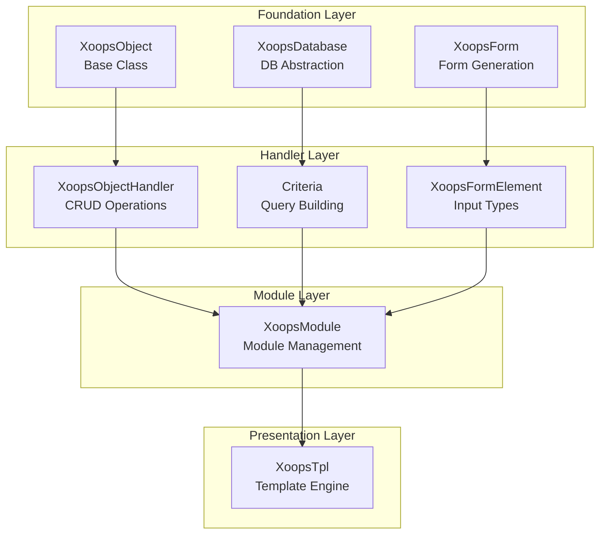
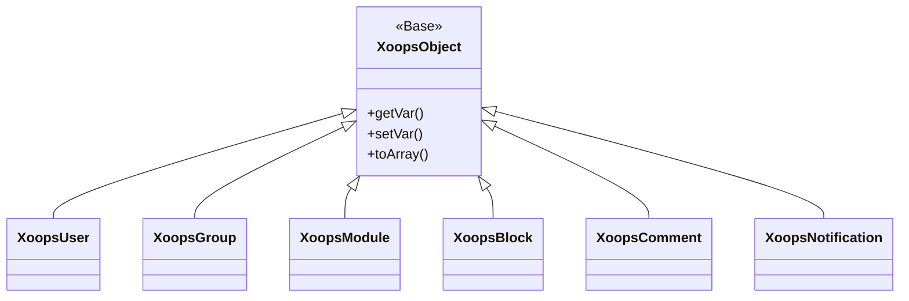
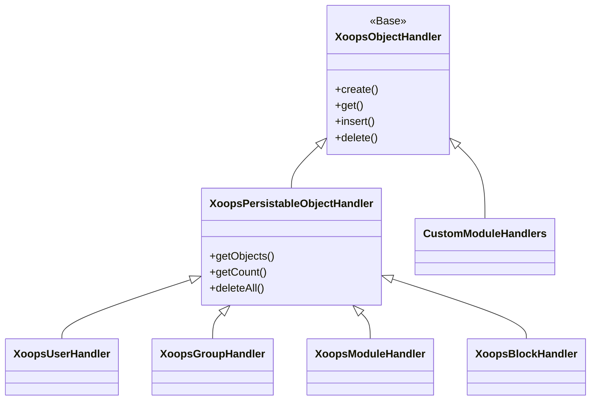
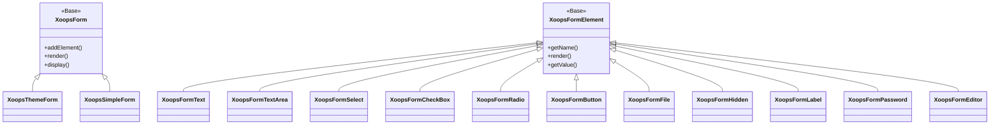

Selamat datang di dokumentasi Referensi XOOPS API yang komprehensif. Bagian ini memberikan dokumentasi terperinci untuk semua kelas core, metode, dan sistem yang membentuk Sistem Manajemen Konten XOOPS.

## Ikhtisar

XOOPS API disusun menjadi beberapa subsistem utama, masing-masing bertanggung jawab atas aspek spesifik fungsi CMS. Memahami API ini penting untuk mengembangkan module, theme, dan ekstensi untuk XOOPS.

## Bagian API

### Kelas core

Kelas dasar yang menjadi dasar pembuatan semua komponen XOOPS lainnya.

| Dokumentasi | Deskripsi |
|--------------|-------------|
| XoopsObjek | Kelas dasar untuk semua objek data di XOOPS |
| XoopsObjectHandler | Pola handler untuk operasi CRUD |

### Lapisan Basis Data

Abstraksi basis data dan utilitas pembuatan kueri.

| Dokumentasi | Deskripsi |
|--------------|-------------|
| XoopsDatabase | Lapisan abstraksi basis data |
| Sistem Kriteria | Kriteria dan ketentuan kueri |
| Pembuat Kueri | Pembuatan kueri lancar modern |

### Sistem Formulir

Pembuatan dan validasi formulir HTML.

| Dokumentasi | Deskripsi |
|--------------|-------------|
| XoopsForm | Bentuk wadah dan rendering |
| Elemen Bentuk | Semua tipe elemen formulir yang tersedia |

### Kelas Kernel

Komponen dan layanan sistem core.

| Dokumentasi | Deskripsi |
|--------------|-------------|
| Kelas Kernel | Kernel sistem dan komponen core |

### Sistem module

Manajemen module dan siklus hidup.

| Dokumentasi | Deskripsi |
|--------------|-------------|
| Sistem module | Pemuatan module, instalasi, dan manajemen |

### Sistem template

Integrasi template Smarty.

| Dokumentasi | Deskripsi |
|--------------|-------------|
| Sistem template | Integrasi Smarty dan manajemen template |

### Sistem Pengguna

Manajemen pengguna dan otentikasi.

| Dokumentasi | Deskripsi |
|--------------|-------------|
| Sistem Pengguna | Akun pengguna, grup, dan izin |

## Ikhtisar Arsitektur



## Hirarki Kelas

### Model Objek



### Model Pengendali



### Model Bentuk



## Pola Desain

XOOPS API mengimplementasikan beberapa pola desain terkenal:

### Pola Tunggal
Digunakan untuk layanan global seperti koneksi database dan instans kontainer.

```php
$db = XoopsDatabase::getInstance();
$container = XoopsContainer::getInstance();
```

### Pola Pabrik
handler objek membuat objek domain secara konsisten.

```php
$handler = xoops_getHandler('user');
$user = $handler->create();
```

### Pola Komposit
Formulir berisi beberapa elemen formulir; kriteria dapat berisi kriteria bertingkat.

```php
$criteria = new CriteriaCompo();
$criteria->add(new Criteria('status', 1));
$criteria->add(new CriteriaCompo(...)); // Nested
```

### Pola Pengamat
Sistem acara memungkinkan sambungan longgar antar module.

```php
$dispatcher->addListener('module.news.article_published', $callback);
```

## Contoh Mulai Cepat

### Membuat dan Menyimpan Objek

```php
// Get the handler
$handler = xoops_getHandler('user');

// Create a new object
$user = $handler->create();
$user->setVar('uname', 'newuser');
$user->setVar('email', 'user@example.com');

// Save to database
$handler->insert($user);
```

### Membuat Kueri dengan Kriteria

```php
// Build criteria
$criteria = new CriteriaCompo();
$criteria->add(new Criteria('level', 0, '>'));
$criteria->setSort('uname');
$criteria->setOrder('ASC');
$criteria->setLimit(10);

// Get objects
$handler = xoops_getHandler('user');
$users = $handler->getObjects($criteria);
```

### Membuat Formulir

```php
$form = new XoopsThemeForm('User Profile', 'userform', 'save.php', 'post', true);
$form->addElement(new XoopsFormText('Username', 'uname', 50, 255, $user->getVar('uname')));
$form->addElement(new XoopsFormTextArea('Bio', 'bio', $user->getVar('bio')));
$form->addElement(new XoopsFormButton('', 'submit', _SUBMIT, 'submit'));
echo $form->render();
```

## Konvensi API

### Konvensi Penamaan

| Ketik | Konvensi | Contoh |
|------|-----------|---------|
| Kelas | Kasus Pascal | `XoopsUser`, `CriteriaCompo` |
| Metode | Kasus unta | `getVar()`, `setVar()` |
| Properti | camelCase (dilindungi) | `$_vars`, `$_handler` |
| Konstanta | UPPER_SNAKE_CASE | `XOBJ_DTYPE_INT` |
| Tabel Basis Data | kasus_ular | `users`, `groups_users_link` |

### Tipe Data

XOOPS mendefinisikan tipe data standar untuk variabel objek:| Konstan | Ketik | Deskripsi |
|----------|------|-------------|
| `XOBJ_DTYPE_TXTBOX` | Tali | Input teks (disanitasi) |
| `XOBJ_DTYPE_TXTAREA` | Tali | Konten area teks |
| `XOBJ_DTYPE_INT` | bilangan bulat | Nilai numerik |
| `XOBJ_DTYPE_URL` | Tali | Validasi URL |
| `XOBJ_DTYPE_EMAIL` | Tali | Validasi email |
| `XOBJ_DTYPE_ARRAY` | Himpunan | Array berseri |
| `XOBJ_DTYPE_OTHER` | Campuran | Penanganan khusus |
| `XOBJ_DTYPE_SOURCE` | Tali | Kode sumber (sanitasi minimal) |
| `XOBJ_DTYPE_STIME` | bilangan bulat | Stempel waktu singkat |
| `XOBJ_DTYPE_MTIME` | bilangan bulat | Stempel waktu sedang |
| `XOBJ_DTYPE_LTIME` | bilangan bulat | Stempel waktu yang panjang |

## Metode Otentikasi

API mendukung beberapa metode otentikasi:

### Otentikasi Kunci API
```
X-API-Key: your-api-key
```

### Token Pembawa OAuth
```
Authorization: Bearer your-oauth-token
```

### Otentikasi Berbasis Sesi
Menggunakan sesi XOOPS yang ada saat login.

## REST Titik Akhir API

Saat REST API diaktifkan:

| Titik akhir | Metode | Deskripsi |
|----------|--------|-------------|
| `/api.php/rest/users` | DAPATKAN | Daftar pengguna |
| `/api.php/rest/users/{id}` | DAPATKAN | Dapatkan pengguna berdasarkan ID |
| `/api.php/rest/users` | POSTING | Buat pengguna |
| `/api.php/rest/users/{id}` | TETAPKAN | Perbarui pengguna |
| `/api.php/rest/users/{id}` | HAPUS | Hapus pengguna |
| `/api.php/rest/modules` | DAPATKAN | Daftar module |

## Dokumentasi Terkait

- Panduan Pengembangan module
- Panduan Pengembangan theme
- Konfigurasi Sistem
- Praktik Terbaik Keamanan

## Riwayat Versi

| Versi | Perubahan |
|---------|---------|
| 2.5.11 | Rilis stabil saat ini |
| 2.5.10 | Menambahkan dukungan GraphQL API |
| 2.5.9 | Sistem Kriteria yang Ditingkatkan |
| 2.5.8 | Dukungan pemuatan otomatis PSR-4 |

---

*Dokumentasi ini adalah bagian dari Basis Pengetahuan XOOPS. Untuk pembaruan terkini, kunjungi [repositori GitHub XOOPS](https://github.com/XOOPS).*
