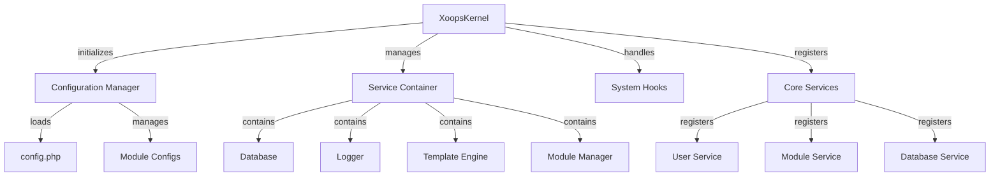

Kernel XOOPS menyediakan kerangka dasar untuk bootstrap sistem, mengelola konfigurasi, menangani kejadian sistem, dan menyediakan utilitas core. Kelas-kelas ini merupakan tulang punggung aplikasi XOOPS.

## Arsitektur Sistem



## Kelas XoopsKernel

Kelas kernel utama yang menginisialisasi dan mengelola sistem XOOPS.

### Ikhtisar Kelas

```php
namespace Xoops;

class XoopsKernel
{
    private static ?XoopsKernel $instance = null;
    protected ServiceContainer $services;
    protected ConfigurationManager $config;
    protected array $modules = [];
    protected bool $isLoaded = false;
}
```

### Konstruktor

```php
private function __construct()
```

Konstruktor pribadi menerapkan pola tunggal.

### dapatkan Instance

Mengambil contoh kernel tunggal.

```php
public static function getInstance(): XoopsKernel
```

**Pengembalian:** `XoopsKernel` - Mesin virtual kernel tunggal

**Contoh:**
```php
$kernel = XoopsKernel::getInstance();
```

### Proses Booting

Proses boot kernel mengikuti langkah-langkah berikut:

1. **Inisialisasi** - Mengatur handler kesalahan, menentukan konstanta
2. **Konfigurasi** - Memuat file konfigurasi
3. **Pendaftaran Layanan** - Daftarkan layanan core
4. **Deteksi module** - Pindai dan identifikasi module aktif
5. **Inisialisasi Basis Data** - Menyambungkan ke basis data
6. **Pembersihan** - Mempersiapkan penanganan permintaan

```php
public function boot(): void
```

**Contoh:**
```php
$kernel = XoopsKernel::getInstance();
$kernel->boot();
```

### Metode Kontainer Layanan

#### DaftarLayanan

Mendaftarkan layanan dalam wadah layanan.

```php
public function registerService(
    string $name,
    callable|object $definition
): void
```

**Parameter:**

| Parameter | Ketik | Deskripsi |
|-----------|------|-------------|
| `$name` | tali | Pengidentifikasi layanan |
| `$definition` | dapat dipanggil\|objek | Pabrik layanan atau contoh |

**Contoh:**
```php
$kernel->registerService('custom.handler', function($c) {
    return new CustomHandler();
});
```

#### dapatkan Layanan

Mengambil layanan terdaftar.

```php
public function getService(string $name): mixed
```

**Parameter:**

| Parameter | Ketik | Deskripsi |
|-----------|------|-------------|
| `$name` | tali | Pengidentifikasi layanan |

**Pengembalian:** `mixed` - Layanan yang diminta

**Contoh:**
```php
$database = $kernel->getService('database');
$logger = $kernel->getService('logger');
```

#### memilikiLayanan

Memeriksa apakah suatu layanan terdaftar.

```php
public function hasService(string $name): bool
```

**Contoh:**
```php
if ($kernel->hasService('cache')) {
    $cache = $kernel->getService('cache');
}
```

## Manajer Konfigurasi

Mengelola konfigurasi aplikasi dan pengaturan module.

### Ikhtisar Kelas

```php
namespace Xoops\Core;

class ConfigurationManager
{
    protected array $config = [];
    protected array $defaults = [];
    protected string $configPath;
}
```

### Metode

#### memuat

Memuat konfigurasi dari file atau array.

```php
public function load(string|array $source): void
```

**Parameter:**

| Parameter | Ketik | Deskripsi |
|-----------|------|-------------|
| `$source` | string\|array | Konfigurasikan jalur atau larik file |

**Contoh:**
```php
$config = $kernel->getService('config');
$config->load(XOOPS_ROOT_PATH . '/include/config.php');
$config->load(['sitename' => 'My Site', 'admin_email' => 'admin@example.com']);
```

#### dapatkan

Mengambil nilai konfigurasi.

```php
public function get(string $key, mixed $default = null): mixed
```

**Parameter:**

| Parameter | Ketik | Deskripsi |
|-----------|------|-------------|
| `$key` | tali | Kunci konfigurasi (notasi titik) |
| `$default` | campuran | Nilai default jika tidak ditemukan |

**Pengembalian:** `mixed` - Nilai konfigurasi

**Contoh:**
```php
$siteName = $config->get('sitename');
$adminEmail = $config->get('admin.email', 'admin@example.com');
```

#### siap

Menetapkan nilai konfigurasi.

```php
public function set(string $key, mixed $value): void
```

**Parameter:**

| Parameter | Ketik | Deskripsi |
|-----------|------|-------------|
| `$key` | tali | Kunci konfigurasi |
| `$value` | campuran | Nilai konfigurasi |

**Contoh:**
```php
$config->set('sitename', 'New Site Name');
$config->set('features.cache_enabled', true);
```

#### getModuleConfig

Mendapatkan konfigurasi untuk module tertentu.

```php
public function getModuleConfig(
    string $moduleName
): array
```

**Parameter:**

| Parameter | Ketik | Deskripsi |
|-----------|------|-------------|
| `$moduleName` | tali | Nama direktori module |

**Pengembalian:** `array` - Array konfigurasi module

**Contoh:**
```php
$publisherConfig = $config->getModuleConfig('publisher');
```

## Kait Sistem

Kait sistem memungkinkan module dan plugin mengeksekusi kode pada titik tertentu dalam siklus hidup aplikasi.

### Kelas HookManager

```php
namespace Xoops\Core;

class HookManager
{
    protected array $hooks = [];
    protected array $listeners = [];
}
```

### Metode

#### tambahkanHook

Mendaftarkan titik kait.

```php
public function addHook(string $name): void
```

**Parameter:**

| Parameter | Ketik | Deskripsi |
|-----------|------|-------------|
| `$name` | tali | Pengidentifikasi kait |

**Contoh:**
```php
$hooks = $kernel->getService('hooks');
$hooks->addHook('system.startup');
$hooks->addHook('user.login');
$hooks->addHook('module.install');
```

#### dengarkan

Melampirkan pendengar ke sebuah hook.

```php
public function listen(
    string $hookName,
    callable $callback,
    int $priority = 10
): void
```

**Parameter:**

| Parameter | Ketik | Deskripsi |
|-----------|------|-------------|
| `$hookName` | tali | Pengidentifikasi kait |
| `$callback` | dapat dipanggil | Fungsi untuk mengeksekusi |
| `$priority` | ke dalam | Prioritas eksekusi (yang lebih tinggi dijalankan terlebih dahulu) |

**Contoh:**
```php
$hooks->listen('user.login', function($user) {
    error_log('User ' . $user->uname . ' logged in');
}, 10);

$hooks->listen('module.install', function($module) {
    // Custom module installation logic
    echo "Installing " . $module->getName();
}, 5);
```

#### pemicu

Mengeksekusi semua pendengar untuk sebuah hook.

```php
public function trigger(
    string $hookName,
    mixed $arguments = null
): array
```

**Parameter:**| Parameter | Ketik | Deskripsi |
|-----------|------|-------------|
| `$hookName` | tali | Pengidentifikasi kait |
| `$arguments` | campuran | Data untuk diteruskan ke pendengar |

**Pengembalian:** `array` - Hasil dari semua pendengar

**Contoh:**
```php
$results = $hooks->trigger('system.startup');
$results = $hooks->trigger('user.created', $newUser);
```

## Ikhtisar Layanan core

Kernel mendaftarkan beberapa layanan core saat boot:

| Layanan | Kelas | Tujuan |
|---------|-------|---------|
| `database` | XoopsDatabase | Lapisan abstraksi basis data |
| `config` | Manajer Konfigurasi | Manajemen konfigurasi |
| `logger` | Pencatat | Pencatatan aplikasi |
| `template` | XoopsTpl | Mesin template |
| `user` | Manajer Pengguna | Layanan manajemen pengguna |
| `module` | Manajer module | Manajemen module |
| `cache` | Manajer Cache | Lapisan cache |
| `hooks` | Manajer Kait | Kait peristiwa sistem |

## Contoh Penggunaan Lengkap

```php
<?php
/**
 * Custom module boot process utilizing kernel
 */

// Get kernel instance
$kernel = XoopsKernel::getInstance();

// Boot the system
$kernel->boot();

// Get services
$config = $kernel->getService('config');
$database = $kernel->getService('database');
$logger = $kernel->getService('logger');
$hooks = $kernel->getService('hooks');

// Access configuration
$siteName = $config->get('sitename');
$adminEmail = $config->get('admin.email');

// Register module-specific hooks
$hooks->listen('user.login', function($user) {
    // Log user login
    $logger->info('User login: ' . $user->uname);

    // Track in database
    $database->query(
        'INSERT INTO ' . $database->prefix('event_log') .
        ' (type, user_id, message, timestamp) VALUES (?, ?, ?, ?)',
        ['login', $user->uid(), 'User login', time()]
    );
});

$hooks->listen('module.install', function($module) {
    $logger->info('Module installed: ' . $module->getName());
});

// Trigger hooks
$hooks->trigger('system.startup');

// Use database service
$result = $database->query(
    'SELECT * FROM ' . $database->prefix('users') .
    ' LIMIT 10'
);

while ($row = $database->fetchArray($result)) {
    echo "User: " . htmlspecialchars($row['uname']) . "\n";
}

// Register custom service
$kernel->registerService('custom.repository', function($c) {
    return new CustomRepository($c->getService('database'));
});

// Later access custom service
$repo = $kernel->getService('custom.repository');
```

## Konstanta core

Kernel mendefinisikan beberapa konstanta penting selama boot:

```php
// System paths
define('XOOPS_ROOT_PATH', '/var/www/xoops');
define('XOOPS_HTDOCS_PATH', XOOPS_ROOT_PATH . '/htdocs');
define('XOOPS_MODULES_PATH', XOOPS_ROOT_PATH . '/htdocs/modules');
define('XOOPS_THEMES_PATH', XOOPS_ROOT_PATH . '/htdocs/themes');

// Web paths
define('XOOPS_URL', 'http://example.com');
define('XOOPS_HTDOCS_URL', XOOPS_URL . '/htdocs');

// Database
define('XOOPS_DB_PREFIX', 'xoops_');
```

## Penanganan Kesalahan

Kernel menyiapkan handler kesalahan saat boot:

```php
// Set custom error handler
set_error_handler(function($errno, $errstr, $errfile, $errline) {
    $kernel->getService('logger')->error(
        "Error: $errstr in $errfile:$errline"
    );
});

// Set exception handler
set_exception_handler(function($exception) {
    $kernel->getService('logger')->critical(
        "Exception: " . $exception->getMessage()
    );
});
```

## Praktik Terbaik

1. **Boot Tunggal** - Panggil `boot()` hanya sekali saat startup aplikasi
2. **Gunakan Service Container** - Daftarkan dan ambil layanan melalui kernel
3. **Menangani Hooks Lebih Awal** - Daftarkan pendengar hook sebelum memicunya
4. **Catat Peristiwa Penting** - Gunakan layanan logger untuk debugging
5. **Konfigurasi Cache** - Muat konfigurasi sekali dan gunakan kembali
6. **Penanganan Kesalahan** - Selalu siapkan handler kesalahan sebelum memproses permintaan

## Dokumentasi Terkait

- ../Module/Module-System - Sistem module dan siklus hidup
- ../Template/Template-System - Integrasi mesin template
- ../User/User-System - Otentikasi dan manajemen pengguna
- ../Database/XoopsDatabase - Lapisan basis data

---

*Lihat juga: [Sumber Kernel XOOPS](https://github.com/XOOPS/XoopsCore27/tree/master/htdocs/class)*
