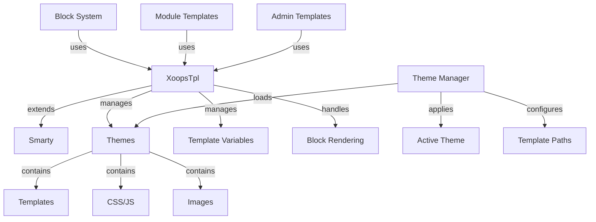

Sistem template XOOPS dibangun di atas mesin template Smarty yang kuat, menyediakan cara yang fleksibel dan dapat diperluas untuk memisahkan logika presentasi dari logika bisnis. Ia mengelola theme, rendering template, penetapan variabel, dan pembuatan konten dinamis.

## Arsitektur template



## Kelas XoopsTpl

Kelas mesin template utama yang memperluas Smarty.

### Ikhtisar Kelas

```php
namespace Xoops\Core;

class XoopsTpl extends Smarty
{
    protected array $vars = [];
    protected string $currentTheme = '';
    protected array $blocks = [];
    protected bool $isAdmin = false;
}
```

### Memperluas Smarty

```php
use Xoops\Core\XoopsTpl;

class XoopsTpl extends Smarty
{
    private static ?XoopsTpl $instance = null;

    private function __construct()
    {
        parent::__construct();
        $this->configureDirectories();
        $this->registerPlugins();
    }

    public static function getInstance(): XoopsTpl
    {
        if (!isset(self::$instance)) {
            self::$instance = new self();
        }
        return self::$instance;
    }
}
```

### Metode core

#### dapatkanInstance

Mendapatkan contoh template tunggal.

```php
public static function getInstance(): XoopsTpl
```

**Pengembalian:** `XoopsTpl` - Mesin virtual tunggal

**Contoh:**
```php
$xoopsTpl = XoopsTpl::getInstance();
```

#### tetapkan

Menetapkan variabel ke template.

```php
public function assign(
    string|array $tplVar,
    mixed $value = null
): void
```

**Parameter:**

| Parameter | Ketik | Deskripsi |
|-----------|------|-------------|
| `$tplVar` | string\|array | Nama variabel atau array asosiatif |
| `$value` | campuran | Nilai variabel |

**Contoh:**
```php
$xoopsTpl->assign('page_title', 'Welcome');
$xoopsTpl->assign('user_name', 'John Doe');

// Multiple assignments
$xoopsTpl->assign([
    'items' => $items,
    'total_count' => count($items),
    'show_pagination' => true
]);
```

#### tambahkanTugas

Menambahkan nilai ke variabel array template.

```php
public function appendAssign(
    string $tplVar,
    mixed $value
): void
```

**Parameter:**

| Parameter | Ketik | Deskripsi |
|-----------|------|-------------|
| `$tplVar` | tali | Nama variabel |
| `$value` | campuran | Nilai untuk ditambahkan |

**Contoh:**
```php
$xoopsTpl->assign('breadcrumbs', ['Home']);
$xoopsTpl->appendAssign('breadcrumbs', 'Blog');
$xoopsTpl->appendAssign('breadcrumbs', 'Posts');
// breadcrumbs = ['Home', 'Blog', 'Posts']
```

#### getAssignedVars

Mendapatkan semua variabel template yang ditetapkan.

```php
public function getAssignedVars(): array
```

**Pengembalian:** `array` - Variabel yang ditetapkan

**Contoh:**
```php
$vars = $xoopsTpl->getAssignedVars();
foreach ($vars as $name => $value) {
    echo "$name = " . var_export($value, true) . "\n";
}
```

#### tampilan

Merender template dan output ke browser.

```php
public function display(
    string $resource,
    string|array $cache_id = null,
    string $compile_id = null,
    object $parent = null
): void
```

**Parameter:**

| Parameter | Ketik | Deskripsi |
|-----------|------|-------------|
| `$resource` | tali | Jalur file template |
| `$cache_id` | string\|array | Pengidentifikasi cache |
| `$compile_id` | tali | Kompilasi pengenal |
| `$parent` | objek | Objek template induk |

**Contoh:**
```php
$xoopsTpl->assign('page_title', 'Home');
$xoopsTpl->display('user:index.tpl');

// With absolute path
$xoopsTpl->display(XOOPS_ROOT_PATH . '/templates/user/index.tpl');
```

#### ambil

Merender template dan mengembalikannya sebagai string.

```php
public function fetch(
    string $resource,
    string|array $cache_id = null,
    string $compile_id = null,
    object $parent = null
): string
```

**Pengembalian:** `string` - Konten template yang dirender

**Contoh:**
```php
$xoopsTpl->assign('message', 'Hello World');
$html = $xoopsTpl->fetch('user:message.tpl');
echo $html;

// Use for email templates
$emailContent = $xoopsTpl->fetch('mail:notification.tpl');
mail($to, $subject, $emailContent);
```

#### memuat theme

Memuat theme tertentu.

```php
public function loadTheme(string $themeName): bool
```

**Parameter:**

| Parameter | Ketik | Deskripsi |
|-----------|------|-------------|
| `$themeName` | tali | Nama direktori theme |

**Pengembalian:** `bool` - Benar dalam kesuksesan

**Contoh:**
```php
if ($xoopsTpl->loadTheme('bluemoon')) {
    echo "Theme loaded successfully";
}
```

#### dapatkan theme Saat Ini

Mendapatkan nama theme yang sedang aktif.

```php
public function getCurrentTheme(): string
```

**Pengembalian:** `string` - Nama theme

**Contoh:**
```php
$currentTheme = $xoopsTpl->getCurrentTheme();
echo "Active theme: $currentTheme";
```

#### setelFilter Keluaran

Menambahkan filter keluaran untuk memproses keluaran template.

```php
public function setOutputFilter(string $function): void
```

**Parameter:**

| Parameter | Ketik | Deskripsi |
|-----------|------|-------------|
| `$function` | tali | Nama fungsi filter |

**Contoh:**
```php
// Remove whitespace from output
$xoopsTpl->setOutputFilter('trim');

// Custom filter
function my_output_filter($output) {
    // Minify HTML
    $output = preg_replace('/\s+/', ' ', $output);
    return trim($output);
}
$xoopsTpl->setOutputFilter('my_output_filter');
```

#### daftarPlugin

Mendaftarkan plugin Smarty khusus.

```php
public function registerPlugin(
    string $type,
    string $name,
    callable $callback
): void
```

**Parameter:**

| Parameter | Ketik | Deskripsi |
|-----------|------|-------------|
| `$type` | tali | Jenis plugin (pengubah, block, fungsi) |
| `$name` | tali | Nama plugin |
| `$callback` | dapat dipanggil | Fungsi panggilan balik |

**Contoh:**
```php
// Register custom modifier
$xoopsTpl->registerPlugin('modifier', 'markdown', function($text) {
    return markdown_parse($text);
});

// Use in template: {$content|markdown}

// Register custom block tag
$xoopsTpl->registerPlugin('block', 'permission', function($params, $content, $smarty, &$repeat) {
    if ($repeat) return;

    // Check permission
    if (has_permission($params['name'])) {
        return $content;
    }
    return '';
});

// Use in template: {permission name="admin"}...{/permission}
```

## Sistem theme

### Struktur theme

Struktur direktori theme XOOPS standar:

```
bluemoon/
├── style.css              # Main stylesheet
├── admin.css              # Admin stylesheet
├── theme.html             # Main page template
├── admin.html             # Admin page template
├── blocks/                # Block templates
│   ├── block_left.tpl
│   └── block_right.tpl
├── modules/               # Module templates
│   ├── publisher/
│   │   ├── index.tpl
│   │   └── item.tpl
│   └── news/
│       └── index.tpl
├── images/                # Theme images
│   ├── logo.png
│   └── banner.png
├── js/                    # Theme JavaScript
│   └── script.js
└── readme.txt             # Theme documentation
```

### Kelas Manajer theme

```php
namespace Xoops\Core\Theme;

class ThemeManager
{
    protected array $themes = [];
    protected string $activeTheme = '';
    protected string $themeDirectory = '';

    public function getActiveTheme(): string {}
    public function setActiveTheme(string $theme): bool {}
    public function getThemeList(): array {}
    public function themeExists(string $name): bool {}
}
```

## Variabel template

### Variabel Global Standar

XOOPS secara otomatis menetapkan beberapa variabel template global:

| Variabel | Ketik | Deskripsi |
|----------|------|-------------|
| `$xoops_url` | tali | Pemasangan XOOPS URL |
| `$xoops_user` | XoopsUser\|batal | Objek pengguna saat ini |
| `$xoops_uname` | tali | Nama pengguna saat ini |
| `$xoops_isadmin` | bodoh | Pengguna adalah admin |
| `$xoops_banner` | tali | Spanduk HTML |
| `$xoops_notification` | tali | Markup notifikasi |
| `$xoops_version` | tali | Versi XOOPS |

### Variabel Khusus block

Saat merender block:| Variabel | Ketik | Deskripsi |
|----------|------|-------------|
| `$block` | susunan | Blokir informasi |
| `$block.title` | tali | Blokir judul |
| `$block.content` | tali | Blokir konten |
| `$block.id` | ke dalam | Blokir ID |
| `$block.module` | tali | Nama module |

### Variabel template module

module biasanya menetapkan:

| Variabel | Ketik | Deskripsi |
|----------|------|-------------|
| `$module_name` | tali | Nama tampilan module |
| `$module_dir` | tali | Direktori module |
| `$xoops_module_header` | tali | module CSS/JS |

## Konfigurasi Smarty

### Pengubah Smarty Umum

| Pengubah | Deskripsi | Contoh |
|----------|-------------|---------|
| `capitalize` | Gunakan huruf besar pada huruf pertama | `{$title\|capitalize}` |
| `count_characters` | Jumlah karakter | `{$text\|count_characters}` |
| `date_format` | Format stempel waktu | `{$timestamp\|date_format:'%Y-%m-%d'}` |
| `escape` | Keluar dari karakter khusus | `{$html\|escape:'html'}` |
| `nl2br` | Ubah baris baru menjadi `<br>` | `{$text\|nl2br}` |
| `strip_tags` | Hapus tag HTML | `{$content\|strip_tags}` |
| `truncate` | Batasi panjang string | `{$text\|truncate:100}` |
| `upper` | Ubah menjadi huruf besar | `{$name\|upper}` |
| `lower` | Ubah menjadi huruf kecil | `{$name\|lower}` |

### Struktur Kontrol

```smarty
{* If statement *}
{if $user->isAdmin()}
    <p>Admin content</p>
{else}
    <p>User content</p>
{/if}

{* For loop *}
{foreach $items as $item}
    <div class="item">{$item.title}</div>
{/foreach}

{* For loop with counter *}
{foreach $items as $item name=item_loop}
    {$smarty.foreach.item_loop.iteration}: {$item.title}
{/foreach}

{* While loop *}
{while $condition}
    <!-- content -->
{/while}

{* Switch statement *}
{switch $status}
    {case 'draft'}<span class="draft">Draft</span>{break}
    {case 'published'}<span class="published">Published</span>{break}
    {default}<span class="unknown">Unknown</span>
{/switch}
```

## Contoh Template Lengkap

### Kode PHP

```php
<?php
/**
 * Module Article List Page
 */

include __DIR__ . '/include/common.inc.php';

$xoopsTpl = XoopsTpl::getInstance();

// Check if module is active
$module = xoops_getModuleByDirname('articles');
if (!$module) {
    redirect_header(XOOPS_URL, 3, 'Module not found');
}

// Get item handler
$itemHandler = xoops_getModuleHandler('item', 'articles');

// Get pagination parameters
$page = !empty($_GET['page']) ? (int)$_GET['page'] : 1;
$perPage = $module->getConfig('items_per_page') ?: 10;
$offset = ($page - 1) * $perPage;

// Build criteria
$criteria = new CriteriaCompo();
$criteria->add(new Criteria('status', 1));
$criteria->setSort('published', 'DESC');
$criteria->setLimit($perPage);
$criteria->setStart($offset);

// Fetch items
$items = $itemHandler->getObjects($criteria);
$total = $itemHandler->getCount(new Criteria('status', 1));

// Calculate pagination
$pages = ceil($total / $perPage);

// Assign template variables
$xoopsTpl->assign([
    'module_name' => $module->getName(),
    'items' => $items,
    'total_items' => $total,
    'current_page' => $page,
    'total_pages' => $pages,
    'items_per_page' => $perPage,
    'show_pagination' => $pages > 1
]);

// Add breadcrumbs
$xoopsTpl->assign('xoops_breadcrumbs', [
    ['url' => XOOPS_URL, 'title' => 'Home'],
    ['url' => $module->getUrl(), 'title' => $module->getName()],
    ['title' => 'Articles']
]);

// Display template
$xoopsTpl->display($module->getPath() . '/templates/user/list.tpl');
```

### Berkas template (list.tpl)

```smarty
<div id="articles-list">
    <h1>{$module_name|escape}</h1>

    {if $items}
        <div class="articles-container">
            {foreach $items as $item}
                <article class="article-item">
                    <header>
                        <h2>
                            <a href="{$item.url|escape}">
                                {$item.title|escape}
                            </a>
                        </h2>
                        <div class="meta">
                            <span class="author">By {$item.author|escape}</span>
                            <span class="date">
                                {$item.published|date_format:'%B %d, %Y'}
                            </span>
                        </div>
                    </header>

                    <div class="content">
                        <p>{$item.summary|truncate:150}</p>
                    </div>

                    <footer>
                        <a href="{$item.url|escape}" class="read-more">
                            Read More »
                        </a>
                    </footer>
                </article>
            {/foreach}
        </div>

        {* Pagination *}
        {if $show_pagination}
            <nav class="pagination">
                {if $current_page > 1}
                    <a href="?page=1" class="first">« First</a>
                    <a href="?page={$current_page - 1}" class="prev">‹ Previous</a>
                {/if}

                {for $i=1 to $total_pages}
                    {if $i == $current_page}
                        <span class="current">{$i}</span>
                    {else}
                        <a href="?page={$i}">{$i}</a>
                    {/if}
                {/for}

                {if $current_page < $total_pages}
                    <a href="?page={$current_page + 1}" class="next">Next ›</a>
                    <a href="?page={$total_pages}" class="last">Last »</a>
                {/if}
            </nav>
        {/if}
    {else}
        <p class="no-items">No articles found.</p>
    {/if}
</div>
```

## Fungsi Smarty Kustom

### Membuat Fungsi block Kustom

```php
<?php
/**
 * Custom Smarty block function for permission checking
 */

function smarty_block_permission($params, $content, $smarty, &$repeat)
{
    if ($repeat) return;

    if (!isset($params['name'])) {
        return 'Permission name required';
    }

    $permName = $params['name'];
    $user = $GLOBALS['xoopsUser'];

    // Check if user has permission
    if ($user && $user->isAdmin()) {
        return $content;
    }

    if ($user && check_user_permission($user->uid(), $permName)) {
        return $content;
    }

    return '';
}
```

Daftar dan gunakan:

```php
$xoopsTpl->registerPlugin('block', 'permission', 'smarty_block_permission');
```

template:

```smarty
{permission name="edit_articles"}
    <button>Edit Article</button>
{/permission}
```

## Praktik Terbaik

1. **Escape User Content** - Selalu gunakan `|escape` untuk konten buatan pengguna
2. **Gunakan Jalur template** - template referensi yang berhubungan dengan theme
3. **Pisahkan Logika dari Presentasi** - Pertahankan logika kompleks di PHP
4. **template Cache** - Mengaktifkan cache template dalam produksi
5. **Gunakan Pengubah dengan Benar** - Terapkan filter yang sesuai dengan konteks
6. **Atur block** - Tempatkan template block di direktori khusus
7. **Variabel Dokumen** - Dokumentasikan semua variabel template di PHP

## Dokumentasi Terkait

- ../Module/Module-System - Sistem module dan hook
- ../Kernel/Kernel-Classes - Kernel dan konfigurasi
- ../Core/XoopsObject - Kelas objek dasar

---

*Lihat juga: [Dokumentasi Smarty](https://www.smarty.net/docs) | [XOOPS template API](https://github.com/XOOPS/XoopsCore27/tree/master/htdocs/class)*
