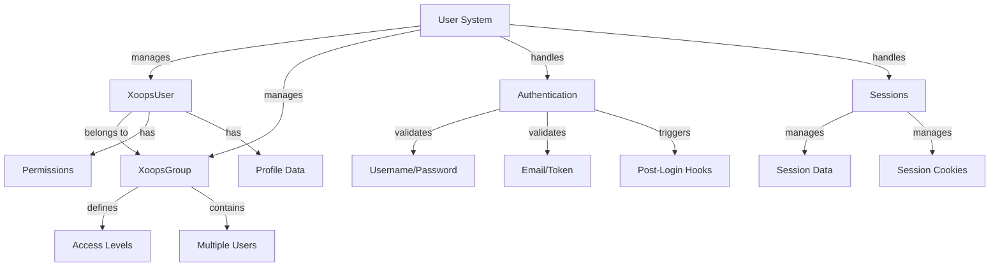

Sistem Pengguna XOOPS mengelola akun pengguna, otentikasi, otorisasi, keanggotaan grup, dan manajemen sesi. Ini memberikan kerangka kerja yang kuat untuk mengamankan aplikasi Anda dan mengendalikan akses pengguna.

## Arsitektur Sistem Pengguna



## Kelas Pengguna Xoops

Kelas objek pengguna utama yang mewakili akun pengguna.

### Ikhtisar Kelas

```php
namespace Xoops\Core\User;

class XoopsUser extends XoopsObject
{
    protected int $uid = 0;
    protected string $uname = '';
    protected string $email = '';
    protected string $pass = '';
    protected int $uregdate = 0;
    protected int $ulevel = 0;
    protected array $groups = [];
    protected array $permissions = [];
}
```

### Konstruktor

```php
public function __construct(int $uid = null)
```

Membuat objek pengguna baru, secara opsional memuat dari database berdasarkan ID.

**Parameter:**

| Parameter | Ketik | Deskripsi |
|-----------|------|-------------|
| `$uid` | ke dalam | ID Pengguna yang akan dimuat (opsional) |

**Contoh:**
```php
// Create new user
$user = new XoopsUser();

// Load existing user
$user = new XoopsUser(123);
```

### Properti core

| Properti | Ketik | Deskripsi |
|----------|------|-------------|
| `uid` | ke dalam | ID Pengguna |
| `uname` | tali | Nama pengguna |
| `email` | tali | Alamat email |
| `pass` | tali | Kata sandi hash |
| `uregdate` | ke dalam | Stempel waktu pendaftaran |
| `ulevel` | ke dalam | Tingkat pengguna (9=admin, 1=pengguna) |
| `groups` | susunan | ID Grup |
| `permissions` | susunan | Bendera izin |

### Metode core

#### getID / getUid

Mendapatkan ID pengguna.

```php
public function getID(): int
public function getUid(): int  // Alias
```

**Pengembalian:** `int` - ID Pengguna

**Contoh:**
```php
$user = new XoopsUser(1);
echo $user->getID(); // 1
echo $user->getUid(); // 1
```

#### dapatkanUnameReal

Mendapatkan nama tampilan pengguna.

```php
public function getUnameReal(): string
```

**Pengembalian:** `string` - Nama asli pengguna

**Contoh:**
```php
$realName = $user->getUnameReal();
echo "Hello, $realName";
```

#### dapatkan Email

Mendapatkan alamat email pengguna.

```php
public function getEmail(): string
```

**Pengembalian:** `string` - Alamat email

**Contoh:**
```php
$email = $user->getEmail();
mail($email, 'Welcome', 'Welcome to XOOPS');
```

#### getVar / setVar

Mendapatkan atau menetapkan variabel pengguna.

```php
public function getVar(string $key, string $format = 's'): mixed
public function setVar(string $key, mixed $value, bool $notGpc = false): bool
```

**Contoh:**
```php
// Get values
$username = $user->getVar('uname');
$email = $user->getVar('email', 's'); // Formatted for display

// Set values
$user->setVar('uname', 'newusername');
$user->setVar('email', 'user@example.com');
```

#### dapatkanGrup

Mendapatkan keanggotaan grup pengguna.

```php
public function getGroups(): array
```

**Pengembalian:** `array` - Kumpulan ID grup

**Contoh:**
```php
$groups = $user->getGroups();
echo "Member of " . count($groups) . " groups";
```

#### ada di Grup

Memeriksa apakah pengguna termasuk dalam grup.

```php
public function isInGroup(int $groupId): bool
```

**Parameter:**

| Parameter | Ketik | Deskripsi |
|-----------|------|-------------|
| `$groupId` | ke dalam | ID Grup untuk diperiksa |

**Pengembalian:** `bool` - Benar jika dalam grup

**Contoh:**
```php
if ($user->isInGroup(1)) { // 1 = Webmasters
    echo 'User is a webmaster';
}
```

#### adalahAdmin

Memeriksa apakah pengguna adalah administrator.

```php
public function isAdmin(): bool
```

**Pengembalian:** `bool` - Benar jika admin

**Contoh:**
```php
if ($user->isAdmin()) {
    // Show admin controls
    echo '<a href="admin/">Admin Panel</a>';
}
```

#### dapatkan Profil

Mendapatkan informasi profil pengguna.

```php
public function getProfile(): array
```

**Pengembalian:** `array` - Data profil

**Contoh:**
```php
$profile = $user->getProfile();
echo 'Bio: ' . $profile['bio'];
```

#### Aktif

Memeriksa apakah akun pengguna aktif.

```php
public function isActive(): bool
```

**Pengembalian:** `bool` - Benar jika aktif

**Contoh:**
```php
if ($user->isActive()) {
    // Allow user access
} else {
    // Restrict access
}
```

#### perbaruiLogin Terakhir

Memperbarui stempel waktu login terakhir pengguna.

```php
public function updateLastLogin(): bool
```

**Pengembalian:** `bool` - Benar dalam kesuksesan

**Contoh:**
```php
if ($user->updateLastLogin()) {
    echo 'Login recorded';
}
```

## Kelas XoopsGroup

Mengelola grup pengguna dan izin.

### Ikhtisar Kelas

```php
namespace Xoops\Core\User;

class XoopsGroup extends XoopsObject
{
    protected int $groupid = 0;
    protected string $name = '';
    protected string $description = '';
    protected int $group_type = 0;
    protected array $users = [];
}
```

### Konstanta

| Konstan | Nilai | Deskripsi |
|----------|-------|-------------|
| `TYPE_NORMAL` | 0 | Grup pengguna biasa |
| `TYPE_ADMIN` | 1 | Kelompok administratif |
| `TYPE_SYSTEM` | 2 | Grup sistem |

### Metode

#### dapatkan Nama

Mendapatkan nama grup.

```php
public function getName(): string
```

**Pengembalian:** `string` - Nama grup

**Contoh:**
```php
$group = new XoopsGroup(1);
echo $group->getName(); // "Webmasters"
```

#### dapatkanDeskripsi

Mendapatkan deskripsi grup.

```php
public function getDescription(): string
```

**Pengembalian:** `string` - Deskripsi

**Contoh:**
```php
echo $group->getDescription();
```

#### dapatkan Pengguna

Mendapatkan anggota grup.

```php
public function getUsers(): array
```

**Pengembalian:** `array` - Kumpulan ID pengguna

**Contoh:**
```php
$users = $group->getUsers();
echo "Group has " . count($users) . " members";
```

#### tambahkanPengguna

Menambahkan pengguna ke grup.

```php
public function addUser(int $uid): bool
```

**Parameter:**

| Parameter | Ketik | Deskripsi |
|-----------|------|-------------|
| `$uid` | ke dalam | ID Pengguna |

**Pengembalian:** `bool` - Benar dalam kesuksesan

**Contoh:**
```php
$group = new XoopsGroup(2); // Editors
$group->addUser(123);
$groupHandler->insert($group);
```

#### hapusPengguna

Menghapus pengguna dari grup.

```php
public function removeUser(int $uid): bool
```

**Contoh:**
```php
$group->removeUser(123);
```

## Otentikasi Pengguna

### Proses Masuk

```php
/**
 * User login
 */
function xoops_user_login(string $uname, string $pass, bool $rememberMe = false): ?XoopsUser
{
    global $xoopsDB;

    // Sanitize username
    $uname = trim($uname);

    // Get user from database
    $query = $xoopsDB->prepare(
        'SELECT * FROM ' . $xoopsDB->prefix('users') .
        ' WHERE uname = ? AND active = 1'
    );
    $query->bind_param('s', $uname);
    $query->execute();
    $result = $query->get_result();

    if ($result->num_rows === 0) {
        return null; // User not found
    }

    $row = $result->fetch_assoc();

    // Verify password
    if (!password_verify($pass, $row['pass'])) {
        return null; // Invalid password
    }

    // Load user object
    $user = new XoopsUser($row['uid']);

    // Update last login
    $user->updateLastLogin();

    // Handle "Remember Me"
    if ($rememberMe) {
        // Set persistent cookie
        setcookie(
            'xoops_user_remember',
            $user->uid(),
            time() + (30 * 24 * 60 * 60), // 30 days
            '/',
            $_SERVER['HTTP_HOST'] ?? ''
        );
    }

    return $user;
}
```

### Manajemen Kata Sandi

```php
/**
 * Hash password securely
 */
function xoops_hash_password(string $password): string
{
    return password_hash($password, PASSWORD_BCRYPT, [
        'cost' => 12
    ]);
}

/**
 * Verify password
 */
function xoops_verify_password(string $password, string $hash): bool
{
    return password_verify($password, $hash);
}

/**
 * Check if password needs rehashing
 */
function xoops_password_needs_rehash(string $hash): bool
{
    return password_needs_rehash($hash, PASSWORD_BCRYPT, [
        'cost' => 12
    ]);
}
```

## Manajemen Sesi

### Kelas Sesi

```php
namespace Xoops\Core;

class SessionManager
{
    protected array $data = [];
    protected string $sessionId = '';

    public function start(): void {}
    public function get(string $key): mixed {}
    public function set(string $key, mixed $value): void {}
    public function destroy(): void {}
}
```

### Metode Sesi

#### Mulai Sesi

```php
<?php
session_start();

// Regenerate session ID for security
session_regenerate_id(true);

// Set session timeout
ini_set('session.gc_maxlifetime', 3600); // 1 hour

// Store user in session
if ($user) {
    $_SESSION['xoops_user'] = $user;
    $_SESSION['xoops_uid'] = $user->getID();
    $_SESSION['xoops_uname'] = $user->getVar('uname');
}
```

#### Periksa Sesi
```php
/**
 * Get current user from session
 */
function xoops_get_current_user(): ?XoopsUser
{
    if (isset($_SESSION['xoops_user']) && $_SESSION['xoops_user'] instanceof XoopsUser) {
        return $_SESSION['xoops_user'];
    }
    return null;
}

/**
 * Check if user is logged in
 */
function xoops_is_user_logged_in(): bool
{
    return isset($_SESSION['xoops_uid']) && $_SESSION['xoops_uid'] > 0;
}
```

#### Hancurkan Sesi

```php
/**
 * User logout
 */
function xoops_user_logout()
{
    global $xoopsUser;

    // Log the logout
    if ($xoopsUser) {
        error_log('User ' . $xoopsUser->getVar('uname') . ' logged out');
    }

    // Destroy session data
    $_SESSION = [];

    // Delete session cookie
    if (ini_get('session.use_cookies')) {
        $params = session_get_cookie_params();
        setcookie(
            session_name(),
            '',
            time() - 42000,
            $params['path'],
            $params['domain'],
            $params['secure'],
            $params['httponly']
        );
    }

    // Destroy session
    session_destroy();
}
```

## Sistem Izin

### Konstanta Izin

| Konstan | Nilai | Deskripsi |
|----------|-------|-------------|
| `XOOPS_PERMISSION_NONE` | 0 | Tidak ada izin |
| `XOOPS_PERMISSION_VIEW` | 1 | Lihat konten |
| `XOOPS_PERMISSION_SUBMIT` | 2 | Kirim konten |
| `XOOPS_PERMISSION_EDIT` | 4 | Sunting konten |
| `XOOPS_PERMISSION_DELETE` | 8 | Hapus konten |
| `XOOPS_PERMISSION_ADMIN` | 16 | Akses Admin |

### Pemeriksaan Izin

```php
/**
 * Check if user has permission
 */
function xoops_check_permission($user, $resource, $permission)
{
    if (!$user) {
        return false;
    }

    // Admins have all permissions
    if ($user->isAdmin()) {
        return true;
    }

    // Check group permissions
    $groups = $user->getGroups();
    foreach ($groups as $groupId) {
        if (xoops_group_has_permission($groupId, $resource, $permission)) {
            return true;
        }
    }

    return false;
}
```

## Pengendali Pengguna

UserHandler mengelola operasi persistensi pengguna.

```php
/**
 * Get user handler
 */
$userHandler = xoops_getHandler('user');

/**
 * Create new user
 */
$user = new XoopsUser();
$user->setVar('uname', 'newuser');
$user->setVar('email', 'user@example.com');
$user->setVar('pass', xoops_hash_password('password123'));
$user->setVar('uregdate', time());
$user->setVar('uactive', 1);

if ($userHandler->insert($user)) {
    echo 'User created with ID: ' . $user->getID();
}

/**
 * Update user
 */
$user = $userHandler->get(123);
$user->setVar('email', 'newemail@example.com');
$userHandler->insert($user);

/**
 * Get user by name
 */
$user = $userHandler->findByUsername('john');

/**
 * Delete user
 */
$userHandler->delete($user);

/**
 * Search users
 */
$criteria = new CriteriaCompo();
$criteria->add(new Criteria('uname', '%admin%', 'LIKE'));
$users = $userHandler->getObjects($criteria);
```

## Contoh Manajemen Pengguna Lengkap

```php
<?php
/**
 * Complete user authentication and profile example
 */

require_once XOOPS_ROOT_PATH . '/include/common.inc.php';

$xoopsUser = $GLOBALS['xoopsUser'];

// Check if user is logged in
if (!$xoopsUser || !$xoopsUser->isActive()) {
    redirect_header(XOOPS_URL, 3, 'Please login');
}

// Get user handler
$userHandler = xoops_getHandler('user');

// Get current user with fresh data
$currentUser = $userHandler->get($xoopsUser->getID());

// User profile page
echo '<h1>Profile: ' . htmlspecialchars($currentUser->getVar('uname')) . '</h1>';

echo '<div class="user-profile">';
echo '<p><strong>Username:</strong> ' . htmlspecialchars($currentUser->getVar('uname')) . '</p>';
echo '<p><strong>Email:</strong> ' . htmlspecialchars($currentUser->getVar('email')) . '</p>';
echo '<p><strong>Registered:</strong> ' . date('Y-m-d H:i:s', $currentUser->getVar('uregdate')) . '</p>';
echo '<p><strong>Groups:</strong> ';

$groupHandler = xoops_getHandler('group');
$groups = $currentUser->getGroups();
$groupNames = [];
foreach ($groups as $groupId) {
    $group = $groupHandler->get($groupId);
    if ($group) {
        $groupNames[] = htmlspecialchars($group->getName());
    }
}
echo implode(', ', $groupNames);
echo '</p>';

// Admin status
if ($currentUser->isAdmin()) {
    echo '<p><strong>Status:</strong> Administrator</p>';
}

echo '</div>';

// Change password form
if ($_SERVER['REQUEST_METHOD'] === 'POST' && !empty($_POST['change_password'])) {
    $oldPassword = $_POST['old_password'] ?? '';
    $newPassword = $_POST['new_password'] ?? '';
    $confirmPassword = $_POST['confirm_password'] ?? '';

    // Verify old password
    if (!password_verify($oldPassword, $currentUser->getVar('pass'))) {
        echo '<div class="error">Current password is incorrect</div>';
    } elseif ($newPassword !== $confirmPassword) {
        echo '<div class="error">New passwords do not match</div>';
    } elseif (strlen($newPassword) < 6) {
        echo '<div class="error">Password must be at least 6 characters</div>';
    } else {
        // Update password
        $currentUser->setVar('pass', xoops_hash_password($newPassword));
        if ($userHandler->insert($currentUser)) {
            echo '<div class="success">Password changed successfully</div>';
        } else {
            echo '<div class="error">Failed to update password</div>';
        }
    }
}

// Password change form
echo '<form method="post">';
echo '<h3>Change Password</h3>';
echo '<div class="form-group">';
echo '<label>Current Password:</label>';
echo '<input type="password" name="old_password" required>';
echo '</div>';
echo '<div class="form-group">';
echo '<label>New Password:</label>';
echo '<input type="password" name="new_password" required>';
echo '</div>';
echo '<div class="form-group">';
echo '<label>Confirm Password:</label>';
echo '<input type="password" name="confirm_password" required>';
echo '</div>';
echo '<button type="submit" name="change_password">Change Password</button>';
echo '</form>';
```

## Praktik Terbaik

1. **Hash Kata Sandi** - Selalu gunakan bcrypt atau argon2 untuk hashing kata sandi
2. **Validasi Input** - Validasi dan sanitasi semua input pengguna
3. **Periksa Izin** - Selalu verifikasi izin pengguna sebelum mengambil tindakan
4. **Gunakan Sesi dengan Aman** - Buat ulang ID sesi saat login
5. **Log Aktivitas** - Log login, logout, dan tindakan penting
6. **Pembatasan Kecepatan** - Menerapkan pembatasan kecepatan upaya login
7. **Hanya HTTPS** - Selalu gunakan HTTPS untuk autentikasi
8. **Manajemen Grup** - Gunakan grup untuk organisasi izin

## Dokumentasi Terkait

- ../Kernel/Kernel-Classes - Layanan kernel dan bootstrapping
- ../Database/QueryBuilder - Kueri basis data untuk data pengguna
- ../Core/XoopsObject - Kelas objek dasar

---

*Lihat juga: [Pengguna XOOPS API](https://github.com/XOOPS/XoopsCore27/tree/master/htdocs/class) | [Keamanan PHP](https://www.php.net/manual/en/book.password.php)*
