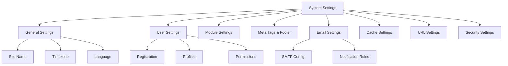

# XOOPS Pengaturan Sistem

Panduan ini mencakup pengaturan sistem lengkap yang tersedia di panel admin XOOPS, disusun berdasarkan kategori.

## Arsitektur Pengaturan Sistem



## Mengakses Pengaturan Sistem

### Lokasi

**Panel Admin > Sistem > Preferensi**

Atau navigasikan langsung:

```
http://your-domain.com/xoops/admin/index.php?fct=preferences
```

### Persyaratan Izin

- Hanya administrator (webmaster) yang dapat mengakses pengaturan sistem
- Perubahan mempengaruhi keseluruhan situs
- Sebagian besar perubahan akan langsung berlaku

## Pengaturan Umum

Konfigurasi dasar untuk instalasi XOOPS Anda.

### Informasi Dasar

```
Site Name: [Your Site Name]
Default Description: [Brief description of your site]
Site Slogan: [Catchy slogan]
Admin Email: admin@your-domain.com
Webmaster Name: Administrator Name
Webmaster Email: admin@your-domain.com
```

### Pengaturan Penampilan

```
Default Theme: [Select theme]
Default Language: English (or preferred language)
Items Per Page: 15 (typically 10-25)
Words in Snippet: 25 (for search results)
Theme Upload Permission: Disabled (security)
```

### Pengaturan Wilayah

```
Default Timezone: [Your timezone]
Date Format: %Y-%m-%d (YYYY-MM-DD format)
Time Format: %H:%M:%S (HH:MM:SS format)
Daylight Saving Time: [Auto/Manual/None]
```

**Tabel Format Zona Waktu:**

| Wilayah | Zona Waktu | Perimbangan UTC |
|---|---|---|
| AS Timur | America/New_York | -5 / -4 |
| AS Tengah | America/Chicago | -6 / -5 |
| Gunung AS | America/Denver | -7 / -6 |
| Pasifik AS | America/Los_Angeles | -8 / -7 |
| UK/London | Europe/London | 0 / +1 |
| France/Germany | Europe/Paris | +1 / +2 |
| Jepang | Asia/Tokyo | +9 |
| Cina | Asia/Shanghai | +8 |
| Australia/Sydney | Australia/Sydney | +10 / +11 |

### Konfigurasi Pencarian

```
Enable Search: Yes
Search Admin Pages: Yes/No
Search Archives: Yes
Default Search Type: All / Pages only
Words Excluded from Search: [Comma-separated list]
```

**Kata-kata umum yang dikecualikan:** the, a, an, dan, atau, but, in, on, at, by, to, from

## Pengaturan Pengguna

Kontrol perilaku akun pengguna dan proses pendaftaran.

### Pendaftaran Pengguna

```
Allow User Registration: Yes/No
Registration Type:
  ☐ Auto-activate (Instant access)
  ☐ Admin approval (Admin must approve)
  ☐ Email verification (User must verify email)

Notification to Users: Yes/No
User Email Verification: Required/Optional
```

### Konfigurasi Pengguna Baru

```
Auto-login New Users: Yes/No
Assign Default User Group: Yes
Default User Group: [Select group]
Create User Avatar: Yes/No
Initial User Avatar: [Select default]
```

### Pengaturan Profil Pengguna

```
Allow User Profiles: Yes
Show Member List: Yes
Show User Statistics: Yes
Show Last Online Time: Yes
Allow User Avatar: Yes
Avatar Max File Size: 100KB
Avatar Dimensions: 100x100 pixels
```

### Pengaturan Email Pengguna

```
Allow Users to Hide Email: Yes
Show Email on Profile: Yes
Notification Email Interval: Immediately/Daily/Weekly/Never
```

### Pelacakan Aktivitas Pengguna

```
Track User Activity: Yes
Log User Logins: Yes
Log Failed Logins: Yes
Track IP Address: Yes
Clear Activity Logs Older Than: 90 days
```

### Batas Akun

```
Allow Duplicate Email: No
Minimum Username Length: 3 characters
Maximum Username Length: 15 characters
Minimum Password Length: 6 characters
Require Special Characters: Yes
Require Numbers: Yes
Password Expiration: 90 days (or Never)
Accounts Inactive Days to Delete: 365 days
```

## Pengaturan module

Konfigurasikan perilaku module individual.

### Opsi module Umum

Untuk setiap module yang diinstal, Anda dapat mengatur:

```
Module Status: Active/Inactive
Display in Menu: Yes/No
Module Weight: [1-999] (higher = lower in display)
Homepage Default: This module shows when visiting /
Admin Access: [Allowed user groups]
User Access: [Allowed user groups]
```

### Pengaturan module Sistem

```
Show Homepage as: Portal / Module / Static Page
Default Homepage Module: [Select module]
Show Footer Menu: Yes
Footer Color: [Color selector]
Show System Stats: Yes
Show Memory Usage: Yes
```

### Konfigurasi per module

Setiap module dapat memiliki pengaturan khusus module:

**Contoh - module Halaman:**
```
Enable Comments: Yes/No
Moderate Comments: Yes/No
Comments Per Page: 10
Enable Ratings: Yes
Allow Anonymous Ratings: Yes
```

**Contoh - module Pengguna:**
```
Avatar Upload Folder: ./uploads/
Maximum Upload Size: 100KB
Allow File Upload: Yes
Allowed File Types: jpg, gif, png
```

Akses pengaturan khusus module:
- **Admin > module > [Nama module] > Preferensi**

## Tag Meta & Pengaturan SEO

Konfigurasikan tag meta untuk optimasi mesin pencari.

### Tag Meta Global

```
Meta Keywords: xoops, cms, content management system
Meta Description: A powerful content management system for building dynamic websites
Meta Author: Your Name
Meta Copyright: Copyright 2025, Your Company
Meta Robots: index, follow
Meta Revisit: 30 days
```

### Praktik Terbaik Meta Tag

| Tandai | Tujuan | Rekomendasi |
|---|---|---|
| Kata Kunci | Istilah pencarian | 5-10 kata kunci yang relevan, dipisahkan koma |
| Deskripsi | Daftar pencarian | 150-160 karakter |
| Penulis | Pembuat halaman | Nama atau perusahaan Anda |
| Hak Cipta | Hukum | Pemberitahuan hak cipta Anda |
| Robot | Instruksi perayap | indeks, ikuti (izinkan pengindeksan) |

### Pengaturan Catatan Kaki

```
Show Footer: Yes
Footer Color: Dark/Light
Footer Background: [Color code]
Footer Text: [HTML allowed]
Additional Footer Links: [URL and text pairs]
```

**Contoh Catatan Kaki HTML:**
```html
<p>Copyright &copy; 2025 Your Company. All rights reserved.</p>
<p><a href="/privacy">Privacy Policy</a> | <a href="/terms">Terms of Use</a></p>
```

### Tag Meta Sosial (Grafik Terbuka)

```
Enable Open Graph: Yes
Facebook App ID: [App ID]
Twitter Card Type: summary / summary_large_image / player
Default Share Image: [Image URL]
```

## Pengaturan Surel

Konfigurasikan pengiriman email dan sistem notifikasi.

### Metode Pengiriman Email

```
Use SMTP: Yes/No

If SMTP:
  SMTP Host: smtp.gmail.com
  SMTP Port: 587 (TLS) or 465 (SSL)
  SMTP Security: TLS / SSL / None
  SMTP Username: [email@example.com]
  SMTP Password: [password]
  SMTP Authentication: Yes/No
  SMTP Timeout: 10 seconds

If PHP mail():
  Sendmail Path: /usr/sbin/sendmail -t -i
```

### Konfigurasi Surel

```
From Address: noreply@your-domain.com
From Name: Your Site Name
Reply-To Address: support@your-domain.com
BCC Admin Emails: Yes/No
```

### Pengaturan Pemberitahuan

```
Send Welcome Email: Yes/No
Welcome Email Subject: Welcome to [Site Name]
Welcome Email Body: [Custom message]

Send Password Reset Email: Yes/No
Include Random Password: Yes/No
Token Expiration: 24 hours
```

### Pemberitahuan Admin

```
Notify Admin on Registration: Yes
Notify Admin on Comments: Yes
Notify Admin on Submissions: Yes
Notify Admin on Errors: Yes
```

### Pemberitahuan Pengguna

```
Notify User on Registration: Yes
Notify User on Comments: Yes
Notify User on Private Messages: Yes
Allow Users to Disable Notifications: Yes
Default Notification Frequency: Immediately
```

### template Email

Sesuaikan email notifikasi di panel admin:

**Jalur:** Sistem > template Email

template yang tersedia:
- Pendaftaran Pengguna
- Atur Ulang Kata Sandi
- Pemberitahuan Komentar
- Pesan Pribadi
- Peringatan Sistem
- Email khusus module

## Pengaturan Tembolok

Optimalkan kinerja melalui caching.

### Konfigurasi Tembolok

```
Enable Caching: Yes/No
Cache Type:
  ☐ File Cache
  ☐ APCu (Alternative PHP Cache)
  ☐ Memcache (Distributed caching)
  ☐ Redis (Advanced caching)

Cache Lifetime: 3600 seconds (1 hour)
```

### Opsi Cache berdasarkan Jenis

**Tembolok Berkas:**
```
Cache Directory: /var/www/html/xoops/cache/
Clear Interval: Daily
Maximum Cache Files: 1000
```

**Cache APCu:**
```
Memory Allocation: 128MB
Fragmentation Level: Low
```

**Memcache/Redis:**
```
Server Host: localhost
Server Port: 11211 (Memcache) / 6379 (Redis)
Persistent Connection: Yes
```

### Apa yang Di-cache

```
Cache Module Lists: Yes
Cache Configuration Data: Yes
Cache Template Data: Yes
Cache User Session Data: Yes
Cache Search Results: Yes
Cache Database Queries: Yes
Cache RSS Feeds: Yes
Cache Images: Yes
```

## Pengaturan URL

Konfigurasikan penulisan ulang dan pemformatan URL.

### Pengaturan URL yang Ramah

```
Enable Friendly URLs: Yes/No
Friendly URL Type:
  ☐ Path Info: /page/about
  ☐ Query String: /index.php?p=about

Trailing Slash: Include / Omit
URL Case: Lower case / Case sensitive
```

### URL Aturan Penulisan Ulang

```
.htaccess Rules: [Display current]
Nginx Rules: [Display current if Nginx]
IIS Rules: [Display current if IIS]
```

## Pengaturan Keamanan

Kontrol konfigurasi terkait keamanan.

### Keamanan Kata Sandi

```
Password Policy:
  ☐ Require uppercase letters
  ☐ Require lowercase letters
  ☐ Require numbers
  ☐ Require special characters

Minimum Password Length: 8 characters
Password Expiration: 90 days
Password History: Remember last 5 passwords
Force Password Change: On next login
```

### Keamanan Masuk

```
Lock Account After Failed Attempts: 5 attempts
Lock Duration: 15 minutes
Log All Login Attempts: Yes
Log Failed Logins: Yes
Admin Login Alert: Send email on admin login
Two-Factor Authentication: Disabled/Enabled
```

### Keamanan Pengunggahan File

```
Allow File Uploads: Yes/No
Maximum File Size: 128MB
Allowed File Types: jpg, gif, png, pdf, zip, doc, docx
Scan Uploads for Malware: Yes (if available)
Quarantine Suspicious Files: Yes
```

### Keamanan Sesi

```
Session Management: Database/Files
Session Timeout: 1800 seconds (30 min)
Session Cookie Lifetime: 0 (until browser closes)
Secure Cookie: Yes (HTTPS only)
HTTP Only Cookie: Yes (prevent JavaScript access)
```

### Pengaturan CORS

```
Allow Cross-Origin Requests: No
Allowed Origins: [List domains]
Allow Credentials: No
Allowed Methods: GET, POST
```

## Pengaturan LanjutanOpsi konfigurasi tambahan untuk pengguna tingkat lanjut.

### Modus Debug

```
Debug Mode: Disabled/Enabled
Log Level: Error / Warning / Info / Debug
Debug Log File: /var/log/xoops_debug.log
Display Errors: Disabled (production)
```

### Penyetelan Performa

```
Optimize Database Queries: Yes
Use Query Cache: Yes
Compress Output: Yes
Minify CSS/JavaScript: Yes
Lazy Load Images: Yes
```

### Pengaturan Konten

```
Allow HTML in Posts: Yes/No
Allowed HTML Tags: [Configure]
Strip Harmful Code: Yes
Allow Embed: Yes/No
Content Moderation: Automatic/Manual
Spam Detection: Yes
```

## Pengaturan Export/Import

### Pengaturan Cadangan

Ekspor pengaturan saat ini:

**Panel Admin > Sistem > Alat > Pengaturan Ekspor**

```bash
# Settings exported as JSON file
# Download and store securely
```

### Kembalikan Pengaturan

Impor pengaturan yang diekspor sebelumnya:

**Panel Admin > Sistem > Alat > Pengaturan Impor**

```bash
# Upload JSON file
# Verify changes before confirming
```

## Hierarki Konfigurasi

Hierarki pengaturan XOOPS (atas ke bawah - kemenangan pertandingan pertama):

```
1. mainfile.php (Constants)
2. Module-specific config
3. Admin System Settings
4. Theme configuration
5. User preferences (for user-specific settings)
```

## Pengaturan Skrip Cadangan

Buat cadangan pengaturan saat ini:

```php
<?php
// Backup script: /var/www/html/xoops/backup-settings.php
require_once __DIR__ . '/mainfile.php';

$config_handler = xoops_getHandler('config');
$configs = $config_handler->getConfigs();

$backup = [
    'exported_date' => date('Y-m-d H:i:s'),
    'xoops_version' => XOOPS_VERSION,
    'php_version' => PHP_VERSION,
    'settings' => []
];

foreach ($configs as $config) {
    $backup['settings'][$config->getVar('conf_name')] = [
        'value' => $config->getVar('conf_value'),
        'description' => $config->getVar('conf_desc'),
        'type' => $config->getVar('conf_type'),
    ];
}

// Save to JSON file
file_put_contents(
    '/backups/xoops_settings_' . date('YmdHis') . '.json',
    json_encode($backup, JSON_PRETTY_PRINT)
);

echo "Settings backed up successfully!";
?>
```

## Perubahan Pengaturan Umum

### Ubah Nama Situs

1. Admin > Sistem > Preferensi > Pengaturan Umum
2. Ubah "Nama Situs"
3. Klik "Simpan"

### Pendaftaran Enable/Disable

1. Admin > Sistem > Preferensi > Pengaturan Pengguna
2. Alihkan "Izinkan Pendaftaran Pengguna"
3. Pilih jenis pendaftaran
4. Klik "Simpan"

### Ubah theme Default

1. Admin > Sistem > Preferensi > Pengaturan Umum
2. Pilih "theme Bawaan"
3. Klik "Simpan"
4. Hapus cache agar perubahan diterapkan

### Perbarui Email Kontak

1. Admin > Sistem > Preferensi > Pengaturan Umum
2. Ubah "Email Admin"
3. Ubah "Email Webmaster"
4. Klik "Simpan"

## Daftar Periksa Verifikasi

Setelah mengonfigurasi pengaturan sistem, verifikasi:

- [ ] Nama situs ditampilkan dengan benar
- [ ] Zona waktu menunjukkan waktu yang tepat
- [ ] Notifikasi email terkirim dengan benar
- [ ] Registrasi pengguna berfungsi sesuai konfigurasi
- [ ] Beranda menampilkan default yang dipilih
- [ ] Fungsi pencarian berfungsi
- [ ] Cache meningkatkan waktu buka halaman
- [ ] URL Ramah berfungsi (jika diaktifkan)
- [ ] Tag meta muncul di sumber halaman
- [ ] Notifikasi Admin diterima
- [ ] Pengaturan keamanan diterapkan

## Pengaturan Pemecahan Masalah

### Pengaturan Tidak Menyimpan

**Solusi:**
```bash
# Check file permissions on config directory
chmod 755 /var/www/html/xoops/var/

# Verify database writable
# Try saving again in admin panel
```

### Perubahan Tidak Berlaku

**Solusi:**
```bash
# Clear cache
rm -rf /var/www/html/xoops/cache/*
rm -rf /var/www/html/xoops/templates_c/*

# If still not working, restart web server
systemctl restart apache2
```

### Email Tidak Terkirim

**Solusi:**
1. Verifikasi kredensial SMTP di pengaturan email
2. Uji dengan tombol "Kirim Email Uji".
3. Periksa log kesalahan
4. Coba gunakan PHP mail() alih-alih SMTP

## Langkah Selanjutnya

Setelah konfigurasi pengaturan sistem:

1. Konfigurasikan pengaturan keamanan
2. Optimalkan kinerja
3. Jelajahi fitur panel admin
4. Siapkan manajemen pengguna

---

**Tag:** #pengaturan sistem #konfigurasi #preferensi #panel admin

**Artikel Terkait:**
- ../../06-Publisher-Module/User-Guide/Basic-Configuration
- Konfigurasi Keamanan
- Optimasi Kinerja
- ../First-Steps/Admin-Panel-Overview
