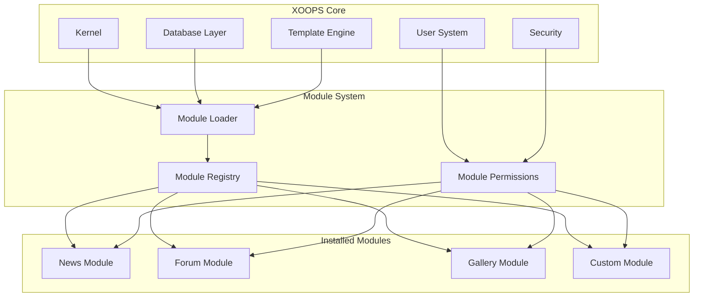
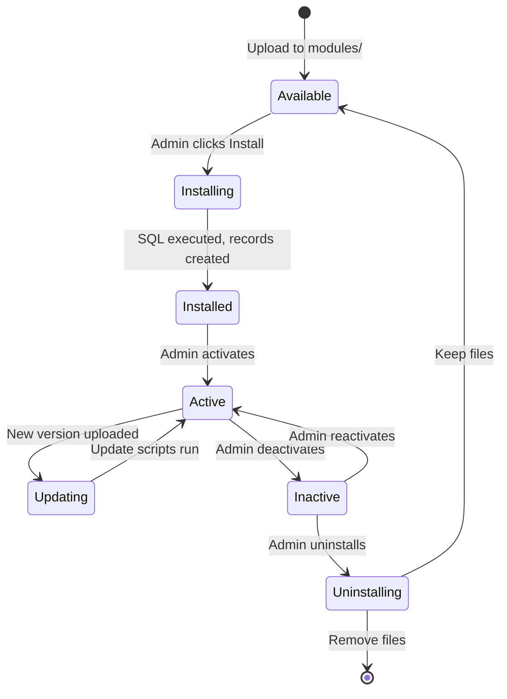

# ADR-001: Arsitektur Modular

> Catatan Keputusan Arsitektur untuk filosofi desain modular core XOOPS.

---

## Status

**Diterima** - Keputusan mendasar sejak awal XOOPS

---

## Konteks

XOOPS (Sistem Portal Berorientasi Objek eXtensible) memerlukan arsitektur yang akan:

1. Izinkan pengembang pihak ketiga untuk memperluas fungsionalitas
2. Memungkinkan administrator situs untuk menyesuaikan tanpa coding
3. Mendukung pengembangan dan pembaruan independen
4. Berikan isolasi antar fitur yang berbeda
5. Skala dari blog sederhana hingga portal kompleks

Lanskap CMS awal tahun 2000-an menawarkan sistem monolitik yang sulit untuk disesuaikan dan diperluas.

---

## Diagram Keputusan



---

## Keputusan

Kami akan menerapkan **arsitektur modular** di mana:

### 1. core Menyediakan Infrastruktur
- Abstraksi basis data
- Otentikasi dan izin pengguna
- Render template (Smarty)
- Utilitas keamanan
- Pembuatan formulir
- Utilitas umum

### 2. module Bersifat Mandiri
Setiap module:
- Memiliki struktur direktori sendiri
- Berisi kelasnya sendiri, template, SQL
- Mendefinisikan konfigurasinya sendiri
- Dapat menjadi installed/uninstalled secara mandiri
- Memiliki pelacakan versi

### 3. Struktur module Standar
```
modules/modulename/
├── admin/                  # Admin interface
│   ├── index.php
│   └── menu.php
├── class/                  # PHP classes
├── include/                # Include files
├── language/               # Translations
├── sql/                    # Database schema
├── templates/              # Smarty templates
├── blocks/                 # Block definitions
├── xoops_version.php       # Module manifest
├── index.php               # Entry point
└── header.php              # Module bootstrap
```

### 4. Manifes module (xoops_version.php)
```php
<?php
$modversion['name']        = 'Module Name';
$modversion['version']     = '1.0.0';
$modversion['description'] = 'Module description';
$modversion['dirname']     = basename(__DIR__);
$modversion['hasMain']     = 1;
$modversion['hasAdmin']    = 1;
$modversion['sqlfile']['mysql'] = 'sql/mysql.sql';
$modversion['tables']      = ['modulename_table1'];
$modversion['templates']   = [...];
$modversion['config']      = [...];
$modversion['blocks']      = [...];
```

### 5. module Komunikasi
- Melalui API core (penanganan, acara)
- Hubungan basis data
- Kait pramuat
- Layanan bersama

---

## Siklus Hidup module



---

## Konsekuensi

### Positif

1. **Ekstensibilitas**: Ribuan module dibuat oleh komunitas
2. **Kemandirian**: module dapat dikembangkan secara terpisah
3. **Fleksibilitas**: Situs dapat memadupadankan fitur
4. **Kemampuan Pemeliharaan**: Pembaruan tidak memengaruhi module lain
5. **Marketplace**: Ekosistem module muncul
6. **Kurva pembelajaran**: Pengembang mempelajari satu pola

### Negatif

1. **Overhead**: Setiap module memiliki biaya bootstrap
2. **Duplikasi**: Kode umum dapat diulang
3. **Integrasi**: Fitur lintas module memerlukan desain yang cermat
4. **Pembuatan versi**: Diperlukan manajemen kompatibilitas module
5. **Varian kualitas**: Kualitas module pihak ketiga bervariasi

### Netral

1. **Database**: Setiap module mengelola tabelnya sendiri
2. **Template**: theme harus mengakomodasi berbagai module
3. **Pembaruan**: Pembaruan core dan module secara independen

---

## Alternatif Dipertimbangkan

### 1. Arsitektur Monolitik
**Ditolak** - Terlalu kaku, sulit disesuaikan

### 2. Arsitektur Plugin (gaya WordPress)
**Diadopsi sebagian** - block dan pramuat menyediakan kait seperti plugin di dalam module

### 3. Arsitektur Komponen (gaya Joomla)
**Ditolak** - Lebih kompleks, kurang ramah pengembang

### 4. Layanan Mikro
**Tidak berlaku** - Terlalu rumit untuk era shared hosting

---

## Keputusan Terkait

- ADR-002: Akses Database Berorientasi Objek
- ADR-003: Mesin template Smarty
- ADR-005: Sistem Izin

---

## Referensi

- Sejarah Proyek XOOPS
- Pola Arsitektur Aplikasi PHP
- Studi Perbandingan CMS (2001-2005)

---

#xoops #architecture #adr #modules #design-decision
