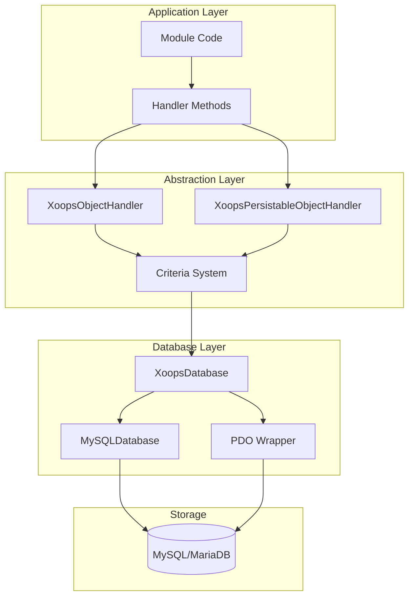
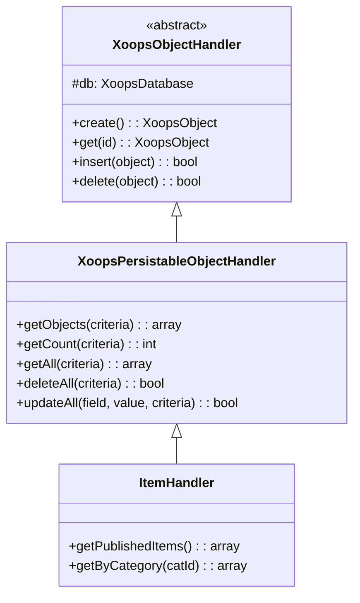
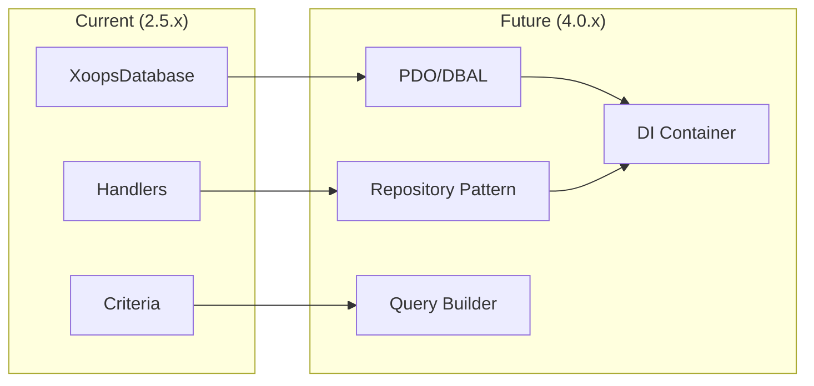

# ADR-002: Abstraksi Basis Data

> Catatan Keputusan Arsitektur untuk pola akses database berorientasi objek XOOPS.

---

## Status

**Diterima** - Pola core sejak XOOPS 2.0

---

## Konteks

XOOPS memerlukan strategi interaksi database yang akan:

1. Abstrak sintaks SQL khusus database
2. Menyediakan operasi CRUD yang konsisten di semua module
3. Aktifkan sanitasi dan pelolosan data otomatis
4. Mendukung perubahan mesin database di masa depan
5. Menyederhanakan operasi umum bagi pengembang

Alternatifnya adalah:
- SQL mentah di seluruh basis kode
- ORM Lengkap (Doktrin, Fasih)
- Abstraksi ringan khusus

---

## Diagram Keputusan



---

## Keputusan

Kami akan menerapkan **Pola handler** dengan:

### 1. XoopsObject - Wadah Data

Setiap entitas data memperluas XoopsObject:

```php
class Item extends XoopsObject
{
    public function __construct()
    {
        $this->initVar('id', XOBJ_DTYPE_INT, null, false);
        $this->initVar('title', XOBJ_DTYPE_TXTBOX, '', true, 255);
        $this->initVar('content', XOBJ_DTYPE_TXTAREA, '', false);
        $this->initVar('status', XOBJ_DTYPE_INT, 0, false);
    }
}
```

### 2. handler - Manajer Operasi

Setiap objek memiliki pengendali yang sesuai:

```php
class ItemHandler extends XoopsPersistableObjectHandler
{
    public function __construct($db)
    {
        parent::__construct($db, 'mymodule_items', Item::class, 'id', 'title');
    }

    // CRUD methods inherited:
    // - create(), get(), insert(), delete()
    // - getObjects(), getCount(), getAll()
}
```

### 3. Kriteria - Pembuat Kueri

Kondisi kueri berorientasi objek:

```php
$criteria = new CriteriaCompo();
$criteria->add(new Criteria('status', 1));
$criteria->add(new Criteria('created', time() - 86400, '>='));
$criteria->setSort('created');
$criteria->setOrder('DESC');
$criteria->setLimit(10);

$items = $handler->getObjects($criteria);
```

---

## Konstanta Tipe Data

```php
// Variable types with automatic sanitization
XOBJ_DTYPE_INT       // Integer
XOBJ_DTYPE_TXTBOX    // Single-line text (escaped)
XOBJ_DTYPE_TXTAREA   // Multi-line text (escaped)
XOBJ_DTYPE_EMAIL     // Email validation
XOBJ_DTYPE_URL       // URL validation
XOBJ_DTYPE_ARRAY     // Serialized array
XOBJ_DTYPE_OTHER     // No processing
XOBJ_DTYPE_FLOAT     // Floating point
```

---

## Warisan Pengendali



---

## Konsekuensi

### Positif

1. **Konsistensi**: Semua module menggunakan pola yang sama
2. **Keamanan**: Escape otomatis mencegah injeksi SQL
3. **Kesederhanaan**: Operasi umum memerlukan kode minimal
4. **Kemampuan Pemeliharaan**: Perubahan pada lapisan database tidak memengaruhi module
5. **Testabilitas**: handler dapat diejek untuk pengujian

### Negatif

1. **Kinerja**: Overhead abstraksi ekstra
2. **Kompleksitas**: Kurva pembelajaran untuk pengembang baru
3. **Keterbatasan**: Kueri kompleks mungkin memerlukan SQL mentah
4. **Masalah N+1**: Tidak ada pemuatan bersemangat bawaan

### Mitigasi

- **Kinerja**: Menyimpan objek yang sering diakses dalam cache
- **Kueri kompleks**: Izinkan SQL mentah bila diperlukan
- **N+1**: Gunakan getAll() dengan kriteria yang sesuai

---

## Evolusi ke XOOPS 4.0



Paket XOOPS 4.0:
- Doktrin DBAL untuk abstraksi database
- Pola repositori menggantikan handler
- Pembuat kueri untuk kueri kompleks
- Integrasi kontainer PSR-11 penuh

---

## Contoh Kode

### Dasar CRUD

```php
$helper = Helper::getInstance();
$handler = $helper->getHandler('Item');

// Create
$item = $handler->create();
$item->setVar('title', 'New Item');
$handler->insert($item);

// Read
$item = $handler->get($id);
$title = $item->getVar('title');

// Update
$item->setVar('title', 'Updated Title');
$handler->insert($item);

// Delete
$handler->delete($item);
```

### Kueri Kompleks

```php
$criteria = new CriteriaCompo();
$criteria->add(new Criteria('status', 'published'));
$criteria->add(new Criteria('category_id', '(1,2,3)', 'IN'));
$criteria->add(new Criteria('created', strtotime('-30 days'), '>='));
$criteria->setSort('views');
$criteria->setOrder('DESC');
$criteria->setLimit(10);
$criteria->setStart(0);

$items = $handler->getObjects($criteria);
$total = $handler->getCount($criteria);
```

---

## Keputusan Terkait

- ADR-001: Arsitektur Modular
- ADR-003: Mesin template Smarty

---

## Referensi

- Martin Fowler - Pola Arsitektur Aplikasi Perusahaan
- Konsep Desain Berbasis Domain
- Pola Catatan Aktif vs Pemeta Data

---

#xoops #architecture #adr #database #handler #design-decision
